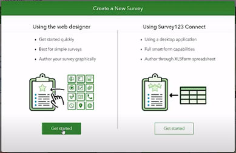
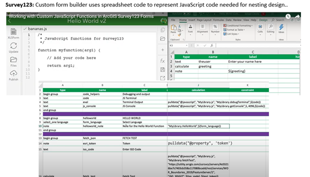
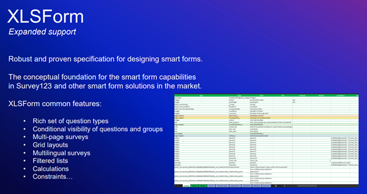

# ESRI Survey123

## Survey123 Overview

From ESRI documentation: ArcGIS Survey123 is a complete, form-centric solution for creating, sharing, and analyzing surveys. Use it to create forms with skip logic, defaults, and support for multiple languages. Collect data using web or mobile devices, even when disconnected from the internet. Upload data securely, and analyze results on the web or in an ArcGIS app. 
https://doc.arcgis.com/en/survey123/reference/whatissurvey123.htm

From G2 Business Software Review: Survey123 is included with ArcGIS, and provides powerful features to help you leverage the power of location to boost your productivity while capturing data and analyzing the results of your surveys. https://www.g2.com/products/arcgis-survey123/reviews

## Survey123 Forms Options

Surveys123 Survey Forms are created and stored through the ESRI web interface (see Figure 1); access requires a current ESRI license. Survey123 forms can be downloaded to tablets, iPhones or iPads, and data collection can be made while the device is offline. Survey results are uploaded to cloud storage next time the device is on-line. 

(\#fig:ESRIweb)Screen capture of the ESRI web interface for Survey123 and the option to Create New Survey.

There are two main options for designing a Survey123 survey form: the Web Designer or Survey123 Connect tool. The Web Designer is a web-based menu-driven GUI that does not require learning any specific coding to set up a basic survey form.  Survey questions and response types can be specified using a drag and drop tool.

(\#fig:ESRIweb2)Screen capture of the ESRI web interface for Survey123 highlighting the two main options for designing a Survey123 form: the web designer or the Survey123 Connect tool.

Survey123 Connect is an option for more advanced survey form design, such as a nested structure or calculated responses using user inputs.  The Survey123 Connect approach requires defining the more advanced form properties within an ‘XLSForm spreadsheet’ using the XLSForm coding language.  ESRI documentation for both Web designer and Connect can be found at: https://doc.arcgis.com/en/survey123/browser/create-surveys/createsurveys.htm
XLSForm formatting language is described at: https://xlsform.org/en/.

(\#fig:xlsform)Screen capture of ESRI Survey123 Connect software demonstrating the use of the XLSForm spreadsheet-based coding language and the ability to directly edit the JavaScript code that is linked to XLSForm parameters.

(\#fig:xlsform2)Screen capture of ArcGIS website description of the XLSForm features: https://gis.idaho.gov/wp-content/uploads/2021/03/ArcGIS-Apps-for-the-Field-State-of-ID.pdf.

## Survey123: Forms Options

<table class=" lightable-paper table table-striped table-hover" style='font-family: "Arial Narrow", arial, helvetica, sans-serif; margin-left: auto; margin-right: auto; font-size: 20px; width: auto !important; margin-left: auto; margin-right: auto;'>
 <thead>
  <tr>
   <th style="text-align:left;position: sticky; top:0; background-color: #FFFFFF;position: sticky; top:0; background-color: #FFFFFF;"> Feature </th>
   <th style="text-align:left;position: sticky; top:0; background-color: #FFFFFF;position: sticky; top:0; background-color: #FFFFFF;"> Available </th>
   <th style="text-align:left;position: sticky; top:0; background-color: #FFFFFF;position: sticky; top:0; background-color: #FFFFFF;"> Description </th>
   <th style="text-align:left;position: sticky; top:0; background-color: #FFFFFF;position: sticky; top:0; background-color: #FFFFFF;"> Group Notes/Reviews/ Questions </th>
   <th style="text-align:left;position: sticky; top:0; background-color: #FFFFFF;position: sticky; top:0; background-color: #FFFFFF;"> External Reviews </th>
   <th style="text-align:left;position: sticky; top:0; background-color: #FFFFFF;position: sticky; top:0; background-color: #FFFFFF;"> Score (0-3) </th>
   <th style="text-align:left;position: sticky; top:0; background-color: #FFFFFF;position: sticky; top:0; background-color: #FFFFFF;"> QC </th>
  </tr>
 </thead>
<tbody>
  <tr>
   <td style="text-align:left;min-width: 1.5cm; font-weight: bold;max-width: 2cm; font-weight: bold;"> Geo-referencing </td>
   <td style="text-align:left;max-width: 1cm; font-weight: bold;font-style: italic;"> Yes </td>
   <td style="text-align:left;min-width: 2.5cm; font-weight: bold;font-style: italic;max-width: 3cm; font-weight: bold;font-style: italic;"> Every Survey123 entry (object?) has an associated lat/long data </td>
   <td style="text-align:left;min-width: 3.5cm; font-weight: bold;font-style: italic;max-width: 4cm; font-weight: bold;font-style: italic;"> Uses device navigation: phone app or GPS device; Data can open in data in ArcGIS maps directly; Can change base map; Default is current location; Can tap the map to change location [test](https://doc.arcgis.com/en/survey123/browser/analyze-results/viewresults.htm#:~:text=Under%20the%20title%20for%20your,geodatabase%20and%20download%20your%20data) </td>
   <td style="text-align:left;min-width: 3.5cm; font-weight: bold;font-style: italic;max-width: 4cm; font-weight: bold;font-style: italic;">  </td>
   <td style="text-align:left;"> 3 </td>
   <td style="text-align:left;">  </td>
  </tr>
  <tr>
   <td style="text-align:left;min-width: 1.5cm; font-weight: bold;max-width: 2cm; font-weight: bold;"> Off-line capacity </td>
   <td style="text-align:left;max-width: 1cm; font-weight: bold;font-style: italic;"> Yes </td>
   <td style="text-align:left;min-width: 2.5cm; font-weight: bold;font-style: italic;max-width: 3cm; font-weight: bold;font-style: italic;"> Field App works offline and online </td>
   <td style="text-align:left;min-width: 3.5cm; font-weight: bold;font-style: italic;max-width: 4cm; font-weight: bold;font-style: italic;"> Does the data uploads automatically when back on-line?? </td>
   <td style="text-align:left;min-width: 3.5cm; font-weight: bold;font-style: italic;max-width: 4cm; font-weight: bold;font-style: italic;">  </td>
   <td style="text-align:left;">  </td>
   <td style="text-align:left;">  </td>
  </tr>
  <tr>
   <td style="text-align:left;min-width: 1.5cm; font-weight: bold;max-width: 2cm; font-weight: bold;"> Ease of Form Development </td>
   <td style="text-align:left;max-width: 1cm; font-weight: bold;font-style: italic;">  </td>
   <td style="text-align:left;min-width: 2.5cm; font-weight: bold;font-style: italic;max-width: 3cm; font-weight: bold;font-style: italic;">  </td>
   <td style="text-align:left;min-width: 3.5cm; font-weight: bold;font-style: italic;max-width: 4cm; font-weight: bold;font-style: italic;">  </td>
   <td style="text-align:left;min-width: 3.5cm; font-weight: bold;font-style: italic;max-width: 4cm; font-weight: bold;font-style: italic;">  </td>
   <td style="text-align:left;">  </td>
   <td style="text-align:left;">  </td>
  </tr>
  <tr>
   <td style="text-align:left;min-width: 1.5cm; font-weight: bold;max-width: 2cm; font-weight: bold;"> Intuitive form design tool </td>
   <td style="text-align:left;max-width: 1cm; font-weight: bold;font-style: italic;"> Yes </td>
   <td style="text-align:left;min-width: 2.5cm; font-weight: bold;font-style: italic;max-width: 3cm; font-weight: bold;font-style: italic;"> Web designer </td>
   <td style="text-align:left;min-width: 3.5cm; font-weight: bold;font-style: italic;max-width: 4cm; font-weight: bold;font-style: italic;"> Web designer intuitive </td>
   <td style="text-align:left;min-width: 3.5cm; font-weight: bold;font-style: italic;max-width: 4cm; font-weight: bold;font-style: italic;">  </td>
   <td style="text-align:left;">  </td>
   <td style="text-align:left;">  </td>
  </tr>
  <tr>
   <td style="text-align:left;min-width: 1.5cm; font-weight: bold;max-width: 2cm; font-weight: bold;">  </td>
   <td style="text-align:left;max-width: 1cm; font-weight: bold;font-style: italic;"> No </td>
   <td style="text-align:left;min-width: 2.5cm; font-weight: bold;font-style: italic;max-width: 3cm; font-weight: bold;font-style: italic;"> Survey123 Connect: XLSForm spreadsheet </td>
   <td style="text-align:left;min-width: 3.5cm; font-weight: bold;font-style: italic;max-width: 4cm; font-weight: bold;font-style: italic;"> XLSForm formatting language required some effort to pick up. </td>
   <td style="text-align:left;min-width: 3.5cm; font-weight: bold;font-style: italic;max-width: 4cm; font-weight: bold;font-style: italic;">  </td>
   <td style="text-align:left;"> 1 </td>
   <td style="text-align:left;">  </td>
  </tr>
  <tr>
   <td style="text-align:left;min-width: 1.5cm; font-weight: bold;max-width: 2cm; font-weight: bold;"> Coding language required? </td>
   <td style="text-align:left;max-width: 1cm; font-weight: bold;font-style: italic;"> No </td>
   <td style="text-align:left;min-width: 2.5cm; font-weight: bold;font-style: italic;max-width: 3cm; font-weight: bold;font-style: italic;"> Web designer </td>
   <td style="text-align:left;min-width: 3.5cm; font-weight: bold;font-style: italic;max-width: 4cm; font-weight: bold;font-style: italic;"> Web designer is a GUI tool that is menu driven and does not require learning any coding </td>
   <td style="text-align:left;min-width: 3.5cm; font-weight: bold;font-style: italic;max-width: 4cm; font-weight: bold;font-style: italic;">  </td>
   <td style="text-align:left;">  </td>
   <td style="text-align:left;">  </td>
  </tr>
  <tr>
   <td style="text-align:left;min-width: 1.5cm; font-weight: bold;max-width: 2cm; font-weight: bold;">  </td>
   <td style="text-align:left;max-width: 1cm; font-weight: bold;font-style: italic;"> Yes </td>
   <td style="text-align:left;min-width: 2.5cm; font-weight: bold;font-style: italic;max-width: 3cm; font-weight: bold;font-style: italic;"> XLSForm spreadsheet </td>
   <td style="text-align:left;min-width: 3.5cm; font-weight: bold;font-style: italic;max-width: 4cm; font-weight: bold;font-style: italic;"> Survey123 Connect is an option for more advanced survey designs which requires configuration of an ‘XLSForm spreadsheet’.  XLSForm is an ESRII coding language specific to forms configuration. </td>
   <td style="text-align:left;min-width: 3.5cm; font-weight: bold;font-style: italic;max-width: 4cm; font-weight: bold;font-style: italic;"> Can be hard to edit XLSForm code: 
“Per my experience, if I delete some of the questions and add other [using] filters for the answers through the [XLSForm spread sheet], the answers will be totally. So, every time I have to make a new form for every survey in order to avoid messy information.”     
[tst2](https://www.g2.com/products/arcgis-survey123/reviews?page=2#survey-response-2154622) </td>
   <td style="text-align:left;">  </td>
   <td style="text-align:left;">  </td>
  </tr>
  <tr>
   <td style="text-align:left;min-width: 1.5cm; font-weight: bold;max-width: 2cm; font-weight: bold;">  </td>
   <td style="text-align:left;max-width: 1cm; font-weight: bold;font-style: italic;">  </td>
   <td style="text-align:left;min-width: 2.5cm; font-weight: bold;font-style: italic;max-width: 3cm; font-weight: bold;font-style: italic;">  </td>
   <td style="text-align:left;min-width: 3.5cm; font-weight: bold;font-style: italic;max-width: 4cm; font-weight: bold;font-style: italic;">  </td>
   <td style="text-align:left;min-width: 3.5cm; font-weight: bold;font-style: italic;max-width: 4cm; font-weight: bold;font-style: italic;"> “If you make a change to the form after is has been published it is hard to get the new changes without deleting any previously gathered data.”  
 [tst3](https://www.g2.com/products/arcgis-survey123/reviews#survey-response-2728634) </td>
   <td style="text-align:left;">  </td>
   <td style="text-align:left;">  </td>
  </tr>
  <tr>
   <td style="text-align:left;min-width: 1.5cm; font-weight: bold;max-width: 2cm; font-weight: bold;"> Form Logic and Validation </td>
   <td style="text-align:left;max-width: 1cm; font-weight: bold;font-style: italic;">  </td>
   <td style="text-align:left;min-width: 2.5cm; font-weight: bold;font-style: italic;max-width: 3cm; font-weight: bold;font-style: italic;">  </td>
   <td style="text-align:left;min-width: 3.5cm; font-weight: bold;font-style: italic;max-width: 4cm; font-weight: bold;font-style: italic;">  </td>
   <td style="text-align:left;min-width: 3.5cm; font-weight: bold;font-style: italic;max-width: 4cm; font-weight: bold;font-style: italic;">  </td>
   <td style="text-align:left;">  </td>
   <td style="text-align:left;">  </td>
  </tr>
  <tr>
   <td style="text-align:left;min-width: 1.5cm; font-weight: bold;max-width: 2cm; font-weight: bold;"> Constrained choices </td>
   <td style="text-align:left;max-width: 1cm; font-weight: bold;font-style: italic;"> Yes </td>
   <td style="text-align:left;min-width: 2.5cm; font-weight: bold;font-style: italic;max-width: 3cm; font-weight: bold;font-style: italic;"> Web Designer </td>
   <td style="text-align:left;min-width: 3.5cm; font-weight: bold;font-style: italic;max-width: 4cm; font-weight: bold;font-style: italic;"> -Restricted lengths, Default values (e.g., Date, Time from device) </td>
   <td style="text-align:left;min-width: 3.5cm; font-weight: bold;font-style: italic;max-width: 4cm; font-weight: bold;font-style: italic;">  </td>
   <td style="text-align:left;">  </td>
   <td style="text-align:left;">  </td>
  </tr>
  <tr>
   <td style="text-align:left;min-width: 1.5cm; font-weight: bold;max-width: 2cm; font-weight: bold;">  </td>
   <td style="text-align:left;max-width: 1cm; font-weight: bold;font-style: italic;"> Yes </td>
   <td style="text-align:left;min-width: 2.5cm; font-weight: bold;font-style: italic;max-width: 3cm; font-weight: bold;font-style: italic;"> Survey123 Connect: XLSForm spreadsheet </td>
   <td style="text-align:left;min-width: 3.5cm; font-weight: bold;font-style: italic;max-width: 4cm; font-weight: bold;font-style: italic;"> Above functionality, plus more advanced options such as: - select multiple responses from a list;smart fields: expressions and formulas to control the allowable input (e.g., total percentage &lt;= 100%)
- Auto limit by partial input
- Auto-completed suggestion </td>
   <td style="text-align:left;min-width: 3.5cm; font-weight: bold;font-style: italic;max-width: 4cm; font-weight: bold;font-style: italic;">  </td>
   <td style="text-align:left;">  </td>
   <td style="text-align:left;">  </td>
  </tr>
  <tr>
   <td style="text-align:left;min-width: 1.5cm; font-weight: bold;max-width: 2cm; font-weight: bold;"> Rules guiding answer series (e.g., “Conditional Questions” and “Skips”) </td>
   <td style="text-align:left;max-width: 1cm; font-weight: bold;font-style: italic;"> Yes </td>
   <td style="text-align:left;min-width: 2.5cm; font-weight: bold;font-style: italic;max-width: 3cm; font-weight: bold;font-style: italic;"> Web Designer  </td>
   <td style="text-align:left;min-width: 3.5cm; font-weight: bold;font-style: italic;max-width: 4cm; font-weight: bold;font-style: italic;"> This can be done with Web Designer using the ‘Set rule function’; However, in Web Designer, this function is limited to Single choice, Dropdown, Likert scale, and Rating questions </td>
   <td style="text-align:left;min-width: 3.5cm; font-weight: bold;font-style: italic;max-width: 4cm; font-weight: bold;font-style: italic;"> [tst4](https://support.esri.com/en/technical-article/000022942) </td>
   <td style="text-align:left;">  </td>
   <td style="text-align:left;">  </td>
  </tr>
  <tr>
   <td style="text-align:left;min-width: 1.5cm; font-weight: bold;max-width: 2cm; font-weight: bold;">  </td>
   <td style="text-align:left;max-width: 1cm; font-weight: bold;font-style: italic;"> Yes </td>
   <td style="text-align:left;min-width: 2.5cm; font-weight: bold;font-style: italic;max-width: 3cm; font-weight: bold;font-style: italic;"> Survey123 Connect: XLSForm spreadsheet </td>
   <td style="text-align:left;min-width: 3.5cm; font-weight: bold;font-style: italic;max-width: 4cm; font-weight: bold;font-style: italic;">  </td>
   <td style="text-align:left;min-width: 3.5cm; font-weight: bold;font-style: italic;max-width: 4cm; font-weight: bold;font-style: italic;">  </td>
   <td style="text-align:left;">  </td>
   <td style="text-align:left;">  </td>
  </tr>
  <tr>
   <td style="text-align:left;min-width: 1.5cm; font-weight: bold;max-width: 2cm; font-weight: bold;"> Form Look and Feel </td>
   <td style="text-align:left;max-width: 1cm; font-weight: bold;font-style: italic;">  </td>
   <td style="text-align:left;min-width: 2.5cm; font-weight: bold;font-style: italic;max-width: 3cm; font-weight: bold;font-style: italic;">  </td>
   <td style="text-align:left;min-width: 3.5cm; font-weight: bold;font-style: italic;max-width: 4cm; font-weight: bold;font-style: italic;">  </td>
   <td style="text-align:left;min-width: 3.5cm; font-weight: bold;font-style: italic;max-width: 4cm; font-weight: bold;font-style: italic;">  </td>
   <td style="text-align:left;">  </td>
   <td style="text-align:left;">  </td>
  </tr>
  <tr>
   <td style="text-align:left;min-width: 1.5cm; font-weight: bold;max-width: 2cm; font-weight: bold;"> Flexibility to configure in a logical order for field entry </td>
   <td style="text-align:left;max-width: 1cm; font-weight: bold;font-style: italic;"> No </td>
   <td style="text-align:left;min-width: 2.5cm; font-weight: bold;font-style: italic;max-width: 3cm; font-weight: bold;font-style: italic;"> Web Designer  </td>
   <td style="text-align:left;min-width: 3.5cm; font-weight: bold;font-style: italic;max-width: 4cm; font-weight: bold;font-style: italic;">  </td>
   <td style="text-align:left;min-width: 3.5cm; font-weight: bold;font-style: italic;max-width: 4cm; font-weight: bold;font-style: italic;">  </td>
   <td style="text-align:left;">  </td>
   <td style="text-align:left;">  </td>
  </tr>
  <tr>
   <td style="text-align:left;min-width: 1.5cm; font-weight: bold;max-width: 2cm; font-weight: bold;">  </td>
   <td style="text-align:left;max-width: 1cm; font-weight: bold;font-style: italic;"> Yes </td>
   <td style="text-align:left;min-width: 2.5cm; font-weight: bold;font-style: italic;max-width: 3cm; font-weight: bold;font-style: italic;"> Survey123 Connect: XLSForm spreadsheet </td>
   <td style="text-align:left;min-width: 3.5cm; font-weight: bold;font-style: italic;max-width: 4cm; font-weight: bold;font-style: italic;"> In trial demo (Appendix 3): The XLSForm coding was required to represent a nested sampling design; this effort was time consuming to optimize </td>
   <td style="text-align:left;min-width: 3.5cm; font-weight: bold;font-style: italic;max-width: 4cm; font-weight: bold;font-style: italic;">  </td>
   <td style="text-align:left;">  </td>
   <td style="text-align:left;">  </td>
  </tr>
  <tr>
   <td style="text-align:left;min-width: 1.5cm; font-weight: bold;max-width: 2cm; font-weight: bold;"> Different styles of question types </td>
   <td style="text-align:left;max-width: 1cm; font-weight: bold;font-style: italic;"> Yes </td>
   <td style="text-align:left;min-width: 2.5cm; font-weight: bold;font-style: italic;max-width: 3cm; font-weight: bold;font-style: italic;"> Web Designer  </td>
   <td style="text-align:left;min-width: 3.5cm; font-weight: bold;font-style: italic;max-width: 4cm; font-weight: bold;font-style: italic;"> Yes, both Web designer and Connect provide a range of question types: </td>
   <td style="text-align:left;min-width: 3.5cm; font-weight: bold;font-style: italic;max-width: 4cm; font-weight: bold;font-style: italic;"> https://doc.arcgis.com/en/survey123/browser/create-surveys/webdesigneressentials.htm </td>
   <td style="text-align:left;">  </td>
   <td style="text-align:left;">  </td>
  </tr>
  <tr>
   <td style="text-align:left;min-width: 1.5cm; font-weight: bold;max-width: 2cm; font-weight: bold;">  </td>
   <td style="text-align:left;max-width: 1cm; font-weight: bold;font-style: italic;"> Yes </td>
   <td style="text-align:left;min-width: 2.5cm; font-weight: bold;font-style: italic;max-width: 3cm; font-weight: bold;font-style: italic;"> Survey123 Connect: XLSForm spreadsheet </td>
   <td style="text-align:left;min-width: 3.5cm; font-weight: bold;font-style: italic;max-width: 4cm; font-weight: bold;font-style: italic;">  </td>
   <td style="text-align:left;min-width: 3.5cm; font-weight: bold;font-style: italic;max-width: 4cm; font-weight: bold;font-style: italic;">  </td>
   <td style="text-align:left;">  </td>
   <td style="text-align:left;">  </td>
  </tr>
  <tr>
   <td style="text-align:left;min-width: 1.5cm; font-weight: bold;max-width: 2cm; font-weight: bold;"> Form Storage and Permissions Management </td>
   <td style="text-align:left;max-width: 1cm; font-weight: bold;font-style: italic;"> Yes </td>
   <td style="text-align:left;min-width: 2.5cm; font-weight: bold;font-style: italic;max-width: 3cm; font-weight: bold;font-style: italic;">  </td>
   <td style="text-align:left;min-width: 3.5cm; font-weight: bold;font-style: italic;max-width: 4cm; font-weight: bold;font-style: italic;">  </td>
   <td style="text-align:left;min-width: 3.5cm; font-weight: bold;font-style: italic;max-width: 4cm; font-weight: bold;font-style: italic;">  </td>
   <td style="text-align:left;">  </td>
   <td style="text-align:left;">  </td>
  </tr>
  <tr>
   <td style="text-align:left;min-width: 1.5cm; font-weight: bold;max-width: 2cm; font-weight: bold;"> Muti-users of an app </td>
   <td style="text-align:left;max-width: 1cm; font-weight: bold;font-style: italic;"> Yes </td>
   <td style="text-align:left;min-width: 2.5cm; font-weight: bold;font-style: italic;max-width: 3cm; font-weight: bold;font-style: italic;"> More than one user can submit data to an app at a time (same database); Survey123 HUB: can review responses by user </td>
   <td style="text-align:left;min-width: 3.5cm; font-weight: bold;font-style: italic;max-width: 4cm; font-weight: bold;font-style: italic;">  </td>
   <td style="text-align:left;min-width: 3.5cm; font-weight: bold;font-style: italic;max-width: 4cm; font-weight: bold;font-style: italic;">  </td>
   <td style="text-align:left;">  </td>
   <td style="text-align:left;">  </td>
  </tr>
  <tr>
   <td style="text-align:left;min-width: 1.5cm; font-weight: bold;max-width: 2cm; font-weight: bold;"> Real-time Data Review </td>
   <td style="text-align:left;max-width: 1cm; font-weight: bold;font-style: italic;"> Yes </td>
   <td style="text-align:left;min-width: 2.5cm; font-weight: bold;font-style: italic;max-width: 3cm; font-weight: bold;font-style: italic;"> Survey123 HUB </td>
   <td style="text-align:left;min-width: 3.5cm; font-weight: bold;font-style: italic;max-width: 4cm; font-weight: bold;font-style: italic;"> The HUB webbased tool allows one to review raw data and summarize data submitted to each survey in the ‘Data’ and ‘Analyze’ tabs; Other summaries: word clouds, frequency plots </td>
   <td style="text-align:left;min-width: 3.5cm; font-weight: bold;font-style: italic;max-width: 4cm; font-weight: bold;font-style: italic;">  </td>
   <td style="text-align:left;">  </td>
   <td style="text-align:left;">  </td>
  </tr>
  <tr>
   <td style="text-align:left;min-width: 1.5cm; font-weight: bold;max-width: 2cm; font-weight: bold;">  </td>
   <td style="text-align:left;max-width: 1cm; font-weight: bold;font-style: italic;"> No </td>
   <td style="text-align:left;min-width: 2.5cm; font-weight: bold;font-style: italic;max-width: 3cm; font-weight: bold;font-style: italic;"> Survey123 Connect </td>
   <td style="text-align:left;min-width: 3.5cm; font-weight: bold;font-style: italic;max-width: 4cm; font-weight: bold;font-style: italic;"> In trial demo, it was difficult to produce a listing of the lengths which was needed for field QC </td>
   <td style="text-align:left;min-width: 3.5cm; font-weight: bold;font-style: italic;max-width: 4cm; font-weight: bold;font-style: italic;">  </td>
   <td style="text-align:left;">  </td>
   <td style="text-align:left;">  </td>
  </tr>
  <tr>
   <td style="text-align:left;min-width: 1.5cm; font-weight: bold;max-width: 2cm; font-weight: bold;"> Real-time Edit (“on the fly”) </td>
   <td style="text-align:left;max-width: 1cm; font-weight: bold;font-style: italic;"> Yes </td>
   <td style="text-align:left;min-width: 2.5cm; font-weight: bold;font-style: italic;max-width: 3cm; font-weight: bold;font-style: italic;"> User needs to open a separate tab to edit the responses </td>
   <td style="text-align:left;min-width: 3.5cm; font-weight: bold;font-style: italic;max-width: 4cm; font-weight: bold;font-style: italic;">  </td>
   <td style="text-align:left;min-width: 3.5cm; font-weight: bold;font-style: italic;max-width: 4cm; font-weight: bold;font-style: italic;">  </td>
   <td style="text-align:left;">  </td>
   <td style="text-align:left;">  </td>
  </tr>
  <tr>
   <td style="text-align:left;min-width: 1.5cm; font-weight: bold;max-width: 2cm; font-weight: bold;"> Multiple-language options </td>
   <td style="text-align:left;max-width: 1cm; font-weight: bold;font-style: italic;"> Yes </td>
   <td style="text-align:left;min-width: 2.5cm; font-weight: bold;font-style: italic;max-width: 3cm; font-weight: bold;font-style: italic;"> Form can be transposed to other languages; language of stored responses can be specified. </td>
   <td style="text-align:left;min-width: 3.5cm; font-weight: bold;font-style: italic;max-width: 4cm; font-weight: bold;font-style: italic;">  </td>
   <td style="text-align:left;min-width: 3.5cm; font-weight: bold;font-style: italic;max-width: 4cm; font-weight: bold;font-style: italic;">  </td>
   <td style="text-align:left;">  </td>
   <td style="text-align:left;">  </td>
  </tr>
</tbody>
</table>

