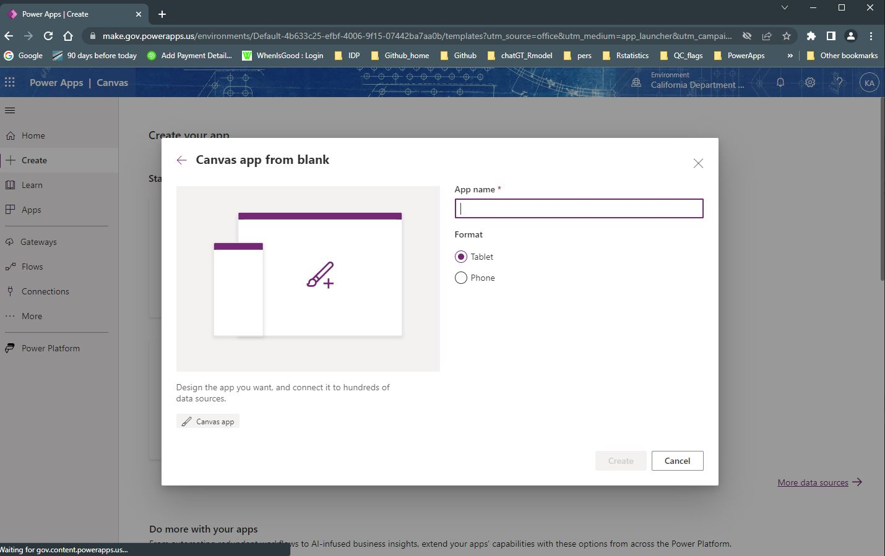

# MS Power Apps {-}

## Power Apps Overview {-}  {#pApptop} 

## Power Apps Forms Options 

(\#fig:ESRIweb)Screen capture of the ESRI web interface for Survey123 and the option to Create New Survey.

(\#fig:ESRIweb2)Screen capture of the ESRI web interface for Survey123 highlighting the two main options for designing a Survey123 form: the web designer or the Survey123 Connect tool.

(\#fig:xlsform)Screen capture of ESRI Survey123 Connect software demonstrating the use of the XLSForm spreadsheet-based coding language and the ability to directly edit the JavaScript code that is linked to XLSForm parameters.

(\#fig:xlsform2)Screen capture of ArcGIS website description of the XLSForm features: https://gis.idaho.gov/wp-content/uploads/2021/03/ArcGIS-Apps-for-the-Field-State-of-ID.pdf.

## Power Apps: Forms Options

<table class=" lightable-paper table" style='font-family: "Arial Narrow", arial, helvetica, sans-serif; margin-left: auto; margin-right: auto; font-size: 18px; width: auto !important; margin-left: auto; margin-right: auto;'>
<caption style="font-size: initial !important;">(\#tab:pAppform)Forms Options</caption>
 <thead>
  <tr>
   <th style="text-align:left;position: sticky; top:0; background-color: #FFFFFF;position: sticky; top:0; background-color: #FFFFFF;"> Category </th>
   <th style="text-align:left;position: sticky; top:0; background-color: #FFFFFF;position: sticky; top:0; background-color: #FFFFFF;"> Feature </th>
   <th style="text-align:left;position: sticky; top:0; background-color: #FFFFFF;position: sticky; top:0; background-color: #FFFFFF;"> Available </th>
   <th style="text-align:left;position: sticky; top:0; background-color: #FFFFFF;position: sticky; top:0; background-color: #FFFFFF;"> Description </th>
   <th style="text-align:left;position: sticky; top:0; background-color: #FFFFFF;position: sticky; top:0; background-color: #FFFFFF;"> Group Notes </th>
   <th style="text-align:left;position: sticky; top:0; background-color: #FFFFFF;position: sticky; top:0; background-color: #FFFFFF;"> External  Reviews </th>
   <th style="text-align:left;position: sticky; top:0; background-color: #FFFFFF;position: sticky; top:0; background-color: #FFFFFF;"> Score(0-3) </th>
  </tr>
 </thead>
<tbody>
  <tr>
   <td style="text-align:left;min-width: 2cm; font-weight: bold;max-width: 3cm; font-weight: bold;"> Data entry validation/QC </td>
   <td style="text-align:left;min-width: 2cm; max-width: 3cm; "> Geo-referencing </td>
   <td style="text-align:left;min-width: 2cm; max-width: 2.5cm; "> Yes/No </td>
   <td style="text-align:left;min-width: 4.5cm; max-width: 5cm; "> Power Apps is able to collect the GPS coordinates from the GPS of the e-device with a button within the form; Power Apps does not provide mapping of all elements like Survey 123. </td>
   <td style="text-align:left;min-width: 4.5cm; max-width: 5cm; ">  </td>
   <td style="text-align:left;min-width: 2cm; ">  </td>
   <td style="text-align:left;min-width: 3cm; ">  </td>
  </tr>
  <tr>
   <td style="text-align:left;min-width: 2cm; font-weight: bold;max-width: 3cm; font-weight: bold;">  </td>
   <td style="text-align:left;min-width: 2cm; max-width: 3cm; "> Constrained choices from a list </td>
   <td style="text-align:left;min-width: 2cm; max-width: 2.5cm; "> Yes </td>
   <td style="text-align:left;min-width: 4.5cm; max-width: 5cm; "> Choice lists can entered manually or can be read in from an external file located on the OneDrive or can be a table in an SQL db </td>
   <td style="text-align:left;min-width: 4.5cm; max-width: 5cm; ">  </td>
   <td style="text-align:left;min-width: 2cm; ">  </td>
   <td style="text-align:left;min-width: 3cm; ">  </td>
  </tr>
  <tr>
   <td style="text-align:left;min-width: 2cm; font-weight: bold;max-width: 3cm; font-weight: bold;">  </td>
   <td style="text-align:left;min-width: 2cm; max-width: 3cm; "> Rules guiding answer series (e.g., “Conditional Questions” and “Skips”) </td>
   <td style="text-align:left;min-width: 2cm; max-width: 2.5cm; "> Yes </td>
   <td style="text-align:left;min-width: 4.5cm; max-width: 5cm; "> Power Apps makes use of the FX coding language which uses Excel type functions, including an "if" function which provides conditional logic for guiding answer series based on responses entered. </td>
   <td style="text-align:left;min-width: 4.5cm; max-width: 5cm; ">  </td>
   <td style="text-align:left;min-width: 2cm; ">  </td>
   <td style="text-align:left;min-width: 3cm; ">  </td>
  </tr>
  <tr>
   <td style="text-align:left;min-width: 2cm; font-weight: bold;max-width: 3cm; font-weight: bold;">  </td>
   <td style="text-align:left;min-width: 2cm; max-width: 3cm; "> Constrained choices from an external table or set of rules </td>
   <td style="text-align:left;min-width: 2cm; max-width: 2.5cm; "> Yes </td>
   <td style="text-align:left;min-width: 4.5cm; max-width: 5cm; "> See above. The "If" function can be combined with range checks, minimum field submission checks, check for the format of responses.  Error messages can be linked to these conditional field checks.  The validity of a series of fields on a form can be checked using Form1.Valid command which could be linked to the submit button preventing users from submitting if data validataion fails. </td>
   <td style="text-align:left;min-width: 4.5cm; max-width: 5cm; ">  </td>
   <td style="text-align:left;min-width: 2cm; ">  </td>
   <td style="text-align:left;min-width: 3cm; ">  </td>
  </tr>
  <tr>
   <td style="text-align:left;min-width: 2cm; font-weight: bold;max-width: 3cm; font-weight: bold;">  </td>
   <td style="text-align:left;min-width: 2cm; max-width: 3cm; "> Form Version Control </td>
   <td style="text-align:left;min-width: 2cm; max-width: 2.5cm; "> Yes </td>
   <td style="text-align:left;min-width: 4.5cm; max-width: 5cm; "> Power Apps includes Versions within the Details of an app.  Each Power Apps app has a release number; each version update can be annotated with comments; Each version of an app must be 'Published' for users to access and use and to generate a unique release number; Note: can only restore apps that have been created within the last 6-months  - so maintaining older versions requires re-saving. </td>
   <td style="text-align:left;min-width: 4.5cm; max-width: 5cm; ">  </td>
   <td style="text-align:left;min-width: 2cm; ">  </td>
   <td style="text-align:left;min-width: 3cm; ">  </td>
  </tr>
  <tr>
   <td style="text-align:left;min-width: 2cm; font-weight: bold;max-width: 3cm; font-weight: bold;">  </td>
   <td style="text-align:left;min-width: 2cm; max-width: 3cm; "> Real-time Data Review </td>
   <td style="text-align:left;min-width: 2cm; max-width: 2.5cm; "> Yes </td>
   <td style="text-align:left;min-width: 4.5cm; max-width: 5cm; "> Power Apps provides different tools for viewing data that is collected: A "gallery" is a control that contains other controls and shows a set of data.  The gallery view is customizable and allows for conditional formating (colors for specific values..etc); galleries allow for images and non-text controls (e.g., buttons) to be included in the listing.  

A data table shows a set of data in a tabular format. "Data tables" are a quick data viewing tool that shows records without any configuration; column order and column subsets can be easilly changed and filtered. </td>
   <td style="text-align:left;min-width: 4.5cm; max-width: 5cm; ">  </td>
   <td style="text-align:left;min-width: 2cm; ">  </td>
   <td style="text-align:left;min-width: 3cm; ">  </td>
  </tr>
  <tr>
   <td style="text-align:left;min-width: 2cm; font-weight: bold;max-width: 3cm; font-weight: bold;">  </td>
   <td style="text-align:left;min-width: 2cm; max-width: 3cm; "> Real-time Edit (“on the fly”) </td>
   <td style="text-align:left;min-width: 2cm; max-width: 2.5cm; "> Yes </td>
   <td style="text-align:left;min-width: 4.5cm; max-width: 5cm; "> Using the gallery tool in Power Apps, a user can creat an editible (Excel-like) data grid that can allow a new record to be added or changes or deletions made to existing records.  Function called "Patch" can be build into each field of the editable grid in order to push edits to save dataset.  Alternatively (and more efficiently), all changes can be pushed at once with a Patch query that lists all of the columns that may be changed. </td>
   <td style="text-align:left;min-width: 4.5cm; max-width: 5cm; ">  </td>
   <td style="text-align:left;min-width: 2cm; ">  </td>
   <td style="text-align:left;min-width: 3cm; ">  </td>
  </tr>
  <tr>
   <td style="text-align:left;min-width: 2cm; font-weight: bold;max-width: 3cm; font-weight: bold;"> Ease of Form Development </td>
   <td style="text-align:left;min-width: 2cm; max-width: 3cm; "> Intuitive form design tool </td>
   <td style="text-align:left;min-width: 2cm; max-width: 2.5cm; "> Yes </td>
   <td style="text-align:left;min-width: 4.5cm; max-width: 5cm; "> Forms build in Canas Power Apps are built using an intuitive drag-and-drop editor where components such as forms can be arranged.  The Canvas editor behaves like a combination of Power Point and Excel where one can configure an app with formulas that not only calculate values and perform other tasks (as they do in Excel) but also respond to user input (as an app requires). </td>
   <td style="text-align:left;min-width: 4.5cm; max-width: 5cm; ">  </td>
   <td style="text-align:left;min-width: 2cm; ">  </td>
   <td style="text-align:left;min-width: 3cm; ">  </td>
  </tr>
  <tr>
   <td style="text-align:left;min-width: 2cm; font-weight: bold;max-width: 3cm; font-weight: bold;">  </td>
   <td style="text-align:left;min-width: 2cm; max-width: 3cm; "> Coding language required? </td>
   <td style="text-align:left;min-width: 2cm; max-width: 2.5cm; "> No </td>
   <td style="text-align:left;min-width: 4.5cm; max-width: 5cm; "> Power Apps is intended to be a Low-code/No-code programming approach.  This means that it uses commands that have built in functioning (Low-code), and several tools for menu-based Form development, and autmated AI assisted natural language convertersn "Co-pilot" (No-code). </td>
   <td style="text-align:left;min-width: 4.5cm; max-width: 5cm; ">  </td>
   <td style="text-align:left;min-width: 2cm; ">  </td>
   <td style="text-align:left;min-width: 3cm; ">  </td>
  </tr>
  <tr>
   <td style="text-align:left;min-width: 2cm; font-weight: bold;max-width: 3cm; font-weight: bold;">  </td>
   <td style="text-align:left;min-width: 2cm; max-width: 3cm; "> Different styles of question types </td>
   <td style="text-align:left;min-width: 2cm; max-width: 2.5cm; "> Yes </td>
   <td style="text-align:left;min-width: 4.5cm; max-width: 5cm; "> Radio control, toggle, date entry, rating, calculations, text entry, </td>
   <td style="text-align:left;min-width: 4.5cm; max-width: 5cm; ">  </td>
   <td style="text-align:left;min-width: 2cm; ">  </td>
   <td style="text-align:left;min-width: 3cm; ">  </td>
  </tr>
  <tr>
   <td style="text-align:left;min-width: 2cm; font-weight: bold;max-width: 3cm; font-weight: bold;">  </td>
   <td style="text-align:left;min-width: 2cm; max-width: 3cm; "> Flexibility to configure in a logical order for field entry (e.g., nested desgin) </td>
   <td style="text-align:left;min-width: 2cm; max-width: 2.5cm; "> Yes </td>
   <td style="text-align:left;min-width: 4.5cm; max-width: 5cm; "> The gallery tool allows for a single data table to be split across tabs base on logical nested structure of the data collection.  
Alternatively, separate galleries can be created based separate tables within a connected SQL database; each  gallery-table can be arranged in a logical order (within or across tabs) based on the nested study  design. </td>
   <td style="text-align:left;min-width: 4.5cm; max-width: 5cm; ">  </td>
   <td style="text-align:left;min-width: 2cm; ">  </td>
   <td style="text-align:left;min-width: 3cm; ">  </td>
  </tr>
  <tr>
   <td style="text-align:left;min-width: 2cm; font-weight: bold;max-width: 3cm; font-weight: bold;"> Other IEP Survey needs </td>
   <td style="text-align:left;min-width: 2cm; max-width: 3cm; "> Permissions Management </td>
   <td style="text-align:left;min-width: 2cm; max-width: 2.5cm; "> Yes </td>
   <td style="text-align:left;min-width: 4.5cm; max-width: 5cm; "> The 365 license Power Apps user is able to share an app through the Apps tab on the PowerApps home screen (click on 3 ellipses and a share menu opens; share using the email of intended user).  
Often Power Apps applications are built using Sharepoint as the data source, and Sharepoint based Power Apps are managed when a new form is initated (users are assigned and user status is set). </td>
   <td style="text-align:left;min-width: 4.5cm; max-width: 5cm; ">  </td>
   <td style="text-align:left;min-width: 2cm; ">  </td>
   <td style="text-align:left;min-width: 3cm; ">  </td>
  </tr>
  <tr>
   <td style="text-align:left;min-width: 2cm; font-weight: bold;max-width: 3cm; font-weight: bold;">  </td>
   <td style="text-align:left;min-width: 2cm; max-width: 3cm; "> Muti-users of an app </td>
   <td style="text-align:left;min-width: 2cm; max-width: 2.5cm; "> Yes </td>
   <td style="text-align:left;min-width: 4.5cm; max-width: 5cm; "> The apps made in PowerApps are multiuser. They each are their own instances so it does not matter how many users use it at the same time. </td>
   <td style="text-align:left;min-width: 4.5cm; max-width: 5cm; ">  </td>
   <td style="text-align:left;min-width: 2cm; ">  </td>
   <td style="text-align:left;min-width: 3cm; ">  </td>
  </tr>
  <tr>
   <td style="text-align:left;min-width: 2cm; font-weight: bold;max-width: 3cm; font-weight: bold;">  </td>
   <td style="text-align:left;min-width: 2cm; max-width: 3cm; "> Off-line capacity </td>
   <td style="text-align:left;min-width: 2cm; max-width: 2.5cm; "> Yes </td>
   <td style="text-align:left;min-width: 4.5cm; max-width: 5cm; "> Power Apps is able to operate when off-line and a 'power effect formula' can check the on-line/off-line status can be used to direct data storage based on the on-line/off-line conditions. 

https://learn.microsoft.com/en-us/power-apps/maker/canvas-apps/offline-apps </td>
   <td style="text-align:left;min-width: 4.5cm; max-width: 5cm; ">  </td>
   <td style="text-align:left;min-width: 2cm; ">  </td>
   <td style="text-align:left;min-width: 3cm; ">  </td>
  </tr>
  <tr>
   <td style="text-align:left;min-width: 2cm; font-weight: bold;max-width: 3cm; font-weight: bold;"> User Accessability </td>
   <td style="text-align:left;min-width: 2cm; max-width: 3cm; "> Multiple-language options </td>
   <td style="text-align:left;min-width: 2cm; max-width: 2.5cm; "> Yes </td>
   <td style="text-align:left;min-width: 4.5cm; max-width: 5cm; "> A couple of options are available for multple language apps in Power Apps: The app can be connected to the microsoft translator "connector" to translate the app into "any language"; Alternatively, app can be built in one language and can be translated locally using Power Automate flows.

https://devoworx.net/multilingual-apps-in-powerapps/ </td>
   <td style="text-align:left;min-width: 4.5cm; max-width: 5cm; "> This feature not tested by the DUWG subgroup trial of Power Apps </td>
   <td style="text-align:left;min-width: 2cm; ">  </td>
   <td style="text-align:left;min-width: 3cm; ">  </td>
  </tr>
  <tr>
   <td style="text-align:left;min-width: 2cm; font-weight: bold;max-width: 3cm; font-weight: bold;">  </td>
   <td style="text-align:left;min-width: 2cm; max-width: 3cm; "> Font adjustment/Speak-to-text </td>
   <td style="text-align:left;min-width: 2cm; max-width: 2.5cm; "> Yes </td>
   <td style="text-align:left;min-width: 4.5cm; max-width: 5cm; "> Font adjustment is available.  

Speak to text has been demonstrated within Power Apps using the Premium licenses which can use AI services through Azure.  Demonstration collects sound recordings and uploads to a cloud based converter.  This sound data transfer can be controlled by a Power Flow routine.  The routine includes conversion of audio file type from webm to wav format. </td>
   <td style="text-align:left;min-width: 4.5cm; max-width: 5cm; "> This feature was not tested by the DUWG subgroup trail of Power Apps which was using the Power App license through the CDFW 365 subscription </td>
   <td style="text-align:left;min-width: 2cm; ">  </td>
   <td style="text-align:left;min-width: 3cm; ">  </td>
  </tr>
</tbody>
</table>

## Power Apps: Data Interface {#pAppdat}

<table class=" lightable-paper table" style='font-family: "Arial Narrow", arial, helvetica, sans-serif; margin-left: auto; margin-right: auto; font-size: 18px; width: auto !important; margin-left: auto; margin-right: auto;'>
<caption style="font-size: initial !important;">(\#tab:pAppdat)Data Interface Options</caption>
 <thead>
  <tr>
   <th style="text-align:left;position: sticky; top:0; background-color: #FFFFFF;position: sticky; top:0; background-color: #FFFFFF;"> Category </th>
   <th style="text-align:left;position: sticky; top:0; background-color: #FFFFFF;position: sticky; top:0; background-color: #FFFFFF;"> Feature </th>
   <th style="text-align:left;position: sticky; top:0; background-color: #FFFFFF;position: sticky; top:0; background-color: #FFFFFF;"> Available </th>
   <th style="text-align:left;position: sticky; top:0; background-color: #FFFFFF;position: sticky; top:0; background-color: #FFFFFF;"> Description </th>
   <th style="text-align:left;position: sticky; top:0; background-color: #FFFFFF;position: sticky; top:0; background-color: #FFFFFF;"> Group Notes </th>
   <th style="text-align:left;position: sticky; top:0; background-color: #FFFFFF;position: sticky; top:0; background-color: #FFFFFF;"> External  Reviews </th>
   <th style="text-align:left;position: sticky; top:0; background-color: #FFFFFF;position: sticky; top:0; background-color: #FFFFFF;"> Score(0-3) </th>
  </tr>
 </thead>
<tbody>
  <tr>
   <td style="text-align:left;min-width: 2cm; font-weight: bold;max-width: 3cm; font-weight: bold;"> Database interface </td>
   <td style="text-align:left;min-width: 2cm; max-width: 3cm; "> Cloud-storage </td>
   <td style="text-align:left;min-width: 2cm; max-width: 2.5cm; "> Yes </td>
   <td style="text-align:left;min-width: 4.5cm; max-width: 5cm; "> Different types of 'cloud-storage' services can be accessed within the "Power Platform"; OneDrive storage and Power Flows are availabel with the 365 license; Many other cloud based services/connectors are available with the previum license using Azure-based databases. </td>
   <td style="text-align:left;min-width: 4.5cm; max-width: 5cm; ">  </td>
   <td style="text-align:left;min-width: 2cm; ">  </td>
   <td style="text-align:left;min-width: 3cm; ">  </td>
  </tr>
  <tr>
   <td style="text-align:left;min-width: 2cm; font-weight: bold;max-width: 3cm; font-weight: bold;">  </td>
   <td style="text-align:left;min-width: 2cm; max-width: 3cm; "> Direct integration with database </td>
   <td style="text-align:left;min-width: 2cm; max-width: 2.5cm; "> Yes </td>
   <td style="text-align:left;min-width: 4.5cm; max-width: 5cm; "> Power Apps Canvas apps use 'Connections' to to a variety of data sources including Onedrive, Sharepoint, SQL Server; </td>
   <td style="text-align:left;min-width: 4.5cm; max-width: 5cm; "> In the demonstration Power App for the Bay Study, an SQL Server Authentication and connection was made using "on-premises data gateway";  The SQL Server is connected to an Access front end using SQL Server Authentication and user name and password;  Power Automate is the tool that is used to connect from PowerApps to OneDrive. </td>
   <td style="text-align:left;min-width: 2cm; ">  </td>
   <td style="text-align:left;min-width: 3cm; ">  </td>
  </tr>
  <tr>
   <td style="text-align:left;min-width: 2cm; font-weight: bold;max-width: 3cm; font-weight: bold;">  </td>
   <td style="text-align:left;min-width: 2cm; max-width: 3cm; "> Integrate data from local tables </td>
   <td style="text-align:left;min-width: 2cm; max-width: 2.5cm; "> Yes/No </td>
   <td style="text-align:left;min-width: 4.5cm; max-width: 5cm; "> Power Automate is a tool within the Power Platform that can be integrated into a Power App; Power Automate Desktop does have the capacity to read files from the local drive. </td>
   <td style="text-align:left;min-width: 4.5cm; max-width: 5cm; "> Power Automate requires web access so is not a reliable routine if building an app to function while intermittently off-line. </td>
   <td style="text-align:left;min-width: 2cm; "> This is a discussion about the lack of ability for Power Apps to read a file directly from the local drive:  https://powerusers.microsoft.com/t5/Power-Automate-Desktop/Able-to-configure-Power-Automate-Desktop-to-be-used-offline/m-p/1210321#M5552 </td>
   <td style="text-align:left;min-width: 3cm; ">  </td>
  </tr>
  <tr>
   <td style="text-align:left;min-width: 2cm; font-weight: bold;max-width: 3cm; font-weight: bold;"> Edit after transfer </td>
   <td style="text-align:left;min-width: 2cm; max-width: 3cm; "> Editing data ‘on-the-fly’ (data already submitted) </td>
   <td style="text-align:left;min-width: 2cm; max-width: 2.5cm; "> Yes </td>
   <td style="text-align:left;min-width: 4.5cm; max-width: 5cm; "> Power Apps provides several directly connection tools including connections to databases on an SQL server and lists Sharepoint.  If a direct connection is set up, queries can be built in the Power App form to view and edit data that has already been pushed to the remote database. </td>
   <td style="text-align:left;min-width: 4.5cm; max-width: 5cm; "> In the demonstration Power App for the Bay Study, the SQL connection works very well and a reporting query and graphical display can poll data from the local collection on the e-device or from the remote SQL database.  The same tool allows for edits to the local collection or the remote db. </td>
   <td style="text-align:left;min-width: 2cm; ">  </td>
   <td style="text-align:left;min-width: 3cm; ">  </td>
  </tr>
  <tr>
   <td style="text-align:left;min-width: 2cm; font-weight: bold;max-width: 3cm; font-weight: bold;"> Data format </td>
   <td style="text-align:left;min-width: 2cm; max-width: 3cm; "> Open (standard) format output </td>
   <td style="text-align:left;min-width: 2cm; max-width: 2.5cm; "> Yes </td>
   <td style="text-align:left;min-width: 4.5cm; max-width: 5cm; "> Power Apps can export data to multiple format types using the Power Automate (Flow) tool;  Automate can generate .csv, pdf, html, excel and other types of files (also able to email data).  Power Apps is also able to Export the Collections data on the e-device to a .json type of file which can be transferred to a back-up drive. </td>
   <td style="text-align:left;min-width: 4.5cm; max-width: 5cm; "> In the demonstration Power App for the Bay Study, Power Automate routine is used to export data as .csv files to the users OneDrive through a connection.  Default export is the separate relational data tables based on the nested sampling design.  A query can be added to the Automate export routine to format the data to meet the user requirements. </td>
   <td style="text-align:left;min-width: 2cm; ">  </td>
   <td style="text-align:left;min-width: 3cm; ">  </td>
  </tr>
  <tr>
   <td style="text-align:left;min-width: 2cm; font-weight: bold;max-width: 3cm; font-weight: bold;">  </td>
   <td style="text-align:left;min-width: 2cm; max-width: 3cm; "> Data format logical / useable </td>
   <td style="text-align:left;min-width: 2cm; max-width: 2.5cm; "> Yes </td>
   <td style="text-align:left;min-width: 4.5cm; max-width: 5cm; "> The exported data formats are customizable for the users requirements. </td>
   <td style="text-align:left;min-width: 4.5cm; max-width: 5cm; ">  </td>
   <td style="text-align:left;min-width: 2cm; ">  </td>
   <td style="text-align:left;min-width: 3cm; ">  </td>
  </tr>
  <tr>
   <td style="text-align:left;min-width: 2cm; font-weight: bold;max-width: 3cm; font-weight: bold;"> Data transfer </td>
   <td style="text-align:left;min-width: 2cm; max-width: 3cm; "> Real-time data transfer </td>
   <td style="text-align:left;min-width: 2cm; max-width: 2.5cm; "> Yes </td>
   <td style="text-align:left;min-width: 4.5cm; max-width: 5cm; "> Power Apps can be programmed to transfer data to a connected database automatically or mannually with a send button.  Power Apps autmatically stores data in local 'Collections' on the e-device; these Collections are cleared after data is pushed to the remote database. </td>
   <td style="text-align:left;min-width: 4.5cm; max-width: 5cm; ">  </td>
   <td style="text-align:left;min-width: 2cm; ">  </td>
   <td style="text-align:left;min-width: 3cm; ">  </td>
  </tr>
  <tr>
   <td style="text-align:left;min-width: 2cm; font-weight: bold;max-width: 3cm; font-weight: bold;">  </td>
   <td style="text-align:left;min-width: 2cm; max-width: 3cm; "> Cloud connectivity &amp; back up </td>
   <td style="text-align:left;min-width: 2cm; max-width: 2.5cm; "> Yes </td>
   <td style="text-align:left;min-width: 4.5cm; max-width: 5cm; "> Type of cloud connectivity and back up depend on thelevel of Power Automate license; The basic 365 license provide for easy connectivity to OneDrive using web-based tools; The Premium license provides many other Azure-base storage and processing tools. </td>
   <td style="text-align:left;min-width: 4.5cm; max-width: 5cm; ">  </td>
   <td style="text-align:left;min-width: 2cm; ">  </td>
   <td style="text-align:left;min-width: 3cm; ">  </td>
  </tr>
  <tr>
   <td style="text-align:left;min-width: 2cm; font-weight: bold;max-width: 3cm; font-weight: bold;"> Data change logs </td>
   <td style="text-align:left;min-width: 2cm; max-width: 3cm; "> Audit trails (data version control) </td>
   <td style="text-align:left;min-width: 2cm; max-width: 2.5cm; "> No/Yes </td>
   <td style="text-align:left;min-width: 4.5cm; max-width: 5cm; "> Power Apps 365 does not have data audit trails as a built in feature; Audit trails are available in the "Managed Environments"  included with the standalone Power Apps, Power Automate, Power Virtual Agents, Power Pages, and Dynamics 365 licenses. </td>
   <td style="text-align:left;min-width: 4.5cm; max-width: 5cm; "> Van had suggested a way to program logging of data changes as she does for another survey (what software; what approach?) </td>
   <td style="text-align:left;min-width: 2cm; "> "Managed Environments is a suite of capabilities that allows admins to manage Power Platform at scale with more control, less effort, and more insights." https://learn.microsoft.com/en-us/power-platform/admin/managed-environment-overview </td>
   <td style="text-align:left;min-width: 3cm; ">  </td>
  </tr>
</tbody>
</table>

##  Power Apps: Photo Integration and External Sensors {#pAppphot}

<table class=" lightable-paper table" style='font-family: "Arial Narrow", arial, helvetica, sans-serif; margin-left: auto; margin-right: auto; font-size: 18px; width: auto !important; margin-left: auto; margin-right: auto;'>
<caption style="font-size: initial !important;">(\#tab:pAppphot)Photo Integration and External Sensors</caption>
 <thead>
  <tr>
   <th style="text-align:left;position: sticky; top:0; background-color: #FFFFFF;position: sticky; top:0; background-color: #FFFFFF;"> Category </th>
   <th style="text-align:left;position: sticky; top:0; background-color: #FFFFFF;position: sticky; top:0; background-color: #FFFFFF;"> Feature </th>
   <th style="text-align:left;position: sticky; top:0; background-color: #FFFFFF;position: sticky; top:0; background-color: #FFFFFF;"> Available </th>
   <th style="text-align:left;position: sticky; top:0; background-color: #FFFFFF;position: sticky; top:0; background-color: #FFFFFF;"> Description </th>
   <th style="text-align:left;position: sticky; top:0; background-color: #FFFFFF;position: sticky; top:0; background-color: #FFFFFF;"> Group Notes </th>
   <th style="text-align:left;position: sticky; top:0; background-color: #FFFFFF;position: sticky; top:0; background-color: #FFFFFF;"> External  Reviews </th>
   <th style="text-align:left;position: sticky; top:0; background-color: #FFFFFF;position: sticky; top:0; background-color: #FFFFFF;"> Score(0-3) </th>
  </tr>
 </thead>
<tbody>
  <tr>
   <td style="text-align:left;min-width: 2cm; font-weight: bold;max-width: 3cm; font-weight: bold;"> Photo Integration </td>
   <td style="text-align:left;min-width: 2cm; max-width: 3cm; "> Collect photo &amp; assoc. with element </td>
   <td style="text-align:left;min-width: 2cm; max-width: 2.5cm; "> Yes </td>
   <td style="text-align:left;min-width: 4.5cm; max-width: 5cm; "> ;Power Apps has a Camera control function; for a Power App form in Canvas, multiple photos can be linked to a record without the use of a Power Automate routine. https://learn.microsoft.com/en-us/power-apps/maker/canvas-apps/controls/control-add-picture </td>
   <td style="text-align:left;min-width: 4.5cm; max-width: 5cm; "> In the Bay Study Power Apps demo, a photo button provides the option to upload a photo or document or take a photo using the camera on the device. </td>
   <td style="text-align:left;min-width: 2cm; "> Other demos show attachments uploaded to a Power Apps form and added to a Sharepoint list without the use of Power Automate. </td>
   <td style="text-align:left;min-width: 3cm; ">  </td>
  </tr>
  <tr>
   <td style="text-align:left;min-width: 2cm; font-weight: bold;max-width: 3cm; font-weight: bold;">  </td>
   <td style="text-align:left;min-width: 2cm; max-width: 3cm; "> Ease of interface </td>
   <td style="text-align:left;min-width: 2cm; max-width: 2.5cm; "> Yes </td>
   <td style="text-align:left;min-width: 4.5cm; max-width: 5cm; ">  </td>
   <td style="text-align:left;min-width: 4.5cm; max-width: 5cm; ">  </td>
   <td style="text-align:left;min-width: 2cm; ">  </td>
   <td style="text-align:left;min-width: 3cm; ">  </td>
  </tr>
  <tr>
   <td style="text-align:left;min-width: 2cm; font-weight: bold;max-width: 3cm; font-weight: bold;">  </td>
   <td style="text-align:left;min-width: 2cm; max-width: 3cm; "> Multi-photo per element (and # limit) </td>
   <td style="text-align:left;min-width: 2cm; max-width: 2.5cm; "> Yes </td>
   <td style="text-align:left;min-width: 4.5cm; max-width: 5cm; ">  </td>
   <td style="text-align:left;min-width: 4.5cm; max-width: 5cm; ">  </td>
   <td style="text-align:left;min-width: 2cm; ">  </td>
   <td style="text-align:left;min-width: 3cm; ">  </td>
  </tr>
  <tr>
   <td style="text-align:left;min-width: 2cm; font-weight: bold;max-width: 3cm; font-weight: bold;">  </td>
   <td style="text-align:left;min-width: 2cm; max-width: 3cm; "> Drawing-on/ Annotating photo </td>
   <td style="text-align:left;min-width: 2cm; max-width: 2.5cm; "> No </td>
   <td style="text-align:left;min-width: 4.5cm; max-width: 5cm; "> Power Apps has a Pen Input control that supports drawing a sketch which can be added as an attachment; but does not have the ability to annotate a picture (to our best knowledge) </td>
   <td style="text-align:left;min-width: 4.5cm; max-width: 5cm; ">  </td>
   <td style="text-align:left;min-width: 2cm; ">  </td>
   <td style="text-align:left;min-width: 3cm; ">  </td>
  </tr>
  <tr>
   <td style="text-align:left;min-width: 2cm; font-weight: bold;max-width: 3cm; font-weight: bold;"> X-tern sensors </td>
   <td style="text-align:left;min-width: 2cm; max-width: 3cm; "> GPS from device </td>
   <td style="text-align:left;min-width: 2cm; max-width: 2.5cm; "> Yes </td>
   <td style="text-align:left;min-width: 4.5cm; max-width: 5cm; ">  </td>
   <td style="text-align:left;min-width: 4.5cm; max-width: 5cm; ">  </td>
   <td style="text-align:left;min-width: 2cm; ">  </td>
   <td style="text-align:left;min-width: 3cm; ">  </td>
  </tr>
  <tr>
   <td style="text-align:left;min-width: 2cm; font-weight: bold;max-width: 3cm; font-weight: bold;">  </td>
   <td style="text-align:left;min-width: 2cm; max-width: 3cm; "> Integrate data from bar codes </td>
   <td style="text-align:left;min-width: 2cm; max-width: 2.5cm; "> Yes </td>
   <td style="text-align:left;min-width: 4.5cm; max-width: 5cm; ">  </td>
   <td style="text-align:left;min-width: 4.5cm; max-width: 5cm; ">  </td>
   <td style="text-align:left;min-width: 2cm; ">  </td>
   <td style="text-align:left;min-width: 3cm; ">  </td>
  </tr>
  <tr>
   <td style="text-align:left;min-width: 2cm; font-weight: bold;max-width: 3cm; font-weight: bold;">  </td>
   <td style="text-align:left;min-width: 2cm; max-width: 3cm; "> Integrate data from external sensors </td>
   <td style="text-align:left;min-width: 2cm; max-width: 2.5cm; "> In-progress </td>
   <td style="text-align:left;min-width: 4.5cm; max-width: 5cm; ">  </td>
   <td style="text-align:left;min-width: 4.5cm; max-width: 5cm; ">  </td>
   <td style="text-align:left;min-width: 2cm; ">  </td>
   <td style="text-align:left;min-width: 3cm; ">  </td>
  </tr>
</tbody>
</table>

##  Power Apps:  Hardware Platforms  {#pApphard}

[Top of section](#pApptop)

<table class=" lightable-paper table" style='font-family: "Arial Narrow", arial, helvetica, sans-serif; margin-left: auto; margin-right: auto; font-size: 18px; width: auto !important; margin-left: auto; margin-right: auto;'>
<caption style="font-size: initial !important;">(\#tab:pApphard)Hardware Platform Options</caption>
 <thead>
  <tr>
   <th style="text-align:left;position: sticky; top:0; background-color: #FFFFFF;position: sticky; top:0; background-color: #FFFFFF;"> Feature </th>
   <th style="text-align:left;position: sticky; top:0; background-color: #FFFFFF;position: sticky; top:0; background-color: #FFFFFF;"> Available </th>
   <th style="text-align:left;position: sticky; top:0; background-color: #FFFFFF;position: sticky; top:0; background-color: #FFFFFF;"> Group Notes </th>
   <th style="text-align:left;position: sticky; top:0; background-color: #FFFFFF;position: sticky; top:0; background-color: #FFFFFF;"> External  Reviews </th>
   <th style="text-align:left;position: sticky; top:0; background-color: #FFFFFF;position: sticky; top:0; background-color: #FFFFFF;"> Score(0-3) </th>
  </tr>
 </thead>
<tbody>
  <tr>
   <td style="text-align:left;min-width: 6cm; font-weight: bold;max-width: 7cm; font-weight: bold;"> Smart Phones and Tablets </td>
   <td style="text-align:left;min-width: 2cm; max-width: 3cm; ">  </td>
   <td style="text-align:left;min-width: 2cm; max-width: 2.5cm; ">  </td>
   <td style="text-align:left;min-width: 4.5cm; max-width: 5cm; ">  </td>
   <td style="text-align:left;min-width: 2.5cm; max-width: 3cm; ">  </td>
  </tr>
  <tr>
   <td style="text-align:left;min-width: 6cm; font-weight: bold;max-width: 7cm; font-weight: bold;"> -      iOS (phone and tablet) </td>
   <td style="text-align:left;min-width: 2cm; max-width: 3cm; "> Yes </td>
   <td style="text-align:left;min-width: 2cm; max-width: 2.5cm; "> The Bay Study demonstration app was run/tested on an iphone. </td>
   <td style="text-align:left;min-width: 4.5cm; max-width: 5cm; ">  </td>
   <td style="text-align:left;min-width: 2.5cm; max-width: 3cm; ">  </td>
  </tr>
  <tr>
   <td style="text-align:left;min-width: 6cm; font-weight: bold;max-width: 7cm; font-weight: bold;"> -      Android(phone and tablet) </td>
   <td style="text-align:left;min-width: 2cm; max-width: 3cm; "> Yes </td>
   <td style="text-align:left;min-width: 2cm; max-width: 2.5cm; ">  </td>
   <td style="text-align:left;min-width: 4.5cm; max-width: 5cm; ">  </td>
   <td style="text-align:left;min-width: 2.5cm; max-width: 3cm; ">  </td>
  </tr>
  <tr>
   <td style="text-align:left;min-width: 6cm; font-weight: bold;max-width: 7cm; font-weight: bold;"> Desktop/laptop </td>
   <td style="text-align:left;min-width: 2cm; max-width: 3cm; ">  </td>
   <td style="text-align:left;min-width: 2cm; max-width: 2.5cm; ">  </td>
   <td style="text-align:left;min-width: 4.5cm; max-width: 5cm; ">  </td>
   <td style="text-align:left;min-width: 2.5cm; max-width: 3cm; ">  </td>
  </tr>
  <tr>
   <td style="text-align:left;min-width: 6cm; font-weight: bold;max-width: 7cm; font-weight: bold;"> -      Windows 7,8,10, 11 </td>
   <td style="text-align:left;min-width: 2cm; max-width: 3cm; "> Yes </td>
   <td style="text-align:left;min-width: 2cm; max-width: 2.5cm; "> The Bay Study demonstration app was run/tested on an Windows 10 system. </td>
   <td style="text-align:left;min-width: 4.5cm; max-width: 5cm; ">  </td>
   <td style="text-align:left;min-width: 2.5cm; max-width: 3cm; ">  </td>
  </tr>
  <tr>
   <td style="text-align:left;min-width: 6cm; font-weight: bold;max-width: 7cm; font-weight: bold;"> -      MacOS (computer) </td>
   <td style="text-align:left;min-width: 2cm; max-width: 3cm; "> Yes </td>
   <td style="text-align:left;min-width: 2cm; max-width: 2.5cm; ">  </td>
   <td style="text-align:left;min-width: 4.5cm; max-width: 5cm; ">  </td>
   <td style="text-align:left;min-width: 2.5cm; max-width: 3cm; ">  </td>
  </tr>
  <tr>
   <td style="text-align:left;min-width: 6cm; font-weight: bold;max-width: 7cm; font-weight: bold;"> -      Ubuntu Linux </td>
   <td style="text-align:left;min-width: 2cm; max-width: 3cm; "> Yes, but some features ("Components") of form building will not work. </td>
   <td style="text-align:left;min-width: 2cm; max-width: 2.5cm; ">  </td>
   <td style="text-align:left;min-width: 4.5cm; max-width: 5cm; "> The PowerApps Component Framework can only be used on Windows. https://learn.microsoft.com/en-us/power-platform/admin/managed-environment-overview </td>
   <td style="text-align:left;min-width: 2.5cm; max-width: 3cm; ">  </td>
  </tr>
</tbody>
</table>

## Power Apps: Security Factors {#pAppsec}

<table class=" lightable-paper table" style='font-family: "Arial Narrow", arial, helvetica, sans-serif; margin-left: auto; margin-right: auto; font-size: 18px; width: auto !important; margin-left: auto; margin-right: auto;'>
<caption style="font-size: initial !important;">(\#tab:pAppsec)Security Factors</caption>
 <thead>
  <tr>
   <th style="text-align:left;position: sticky; top:0; background-color: #FFFFFF;position: sticky; top:0; background-color: #FFFFFF;"> Feature </th>
   <th style="text-align:left;position: sticky; top:0; background-color: #FFFFFF;position: sticky; top:0; background-color: #FFFFFF;"> Available </th>
   <th style="text-align:left;position: sticky; top:0; background-color: #FFFFFF;position: sticky; top:0; background-color: #FFFFFF;"> Description </th>
   <th style="text-align:left;position: sticky; top:0; background-color: #FFFFFF;position: sticky; top:0; background-color: #FFFFFF;"> Group Notes </th>
   <th style="text-align:left;position: sticky; top:0; background-color: #FFFFFF;position: sticky; top:0; background-color: #FFFFFF;"> External  Reviews </th>
   <th style="text-align:left;position: sticky; top:0; background-color: #FFFFFF;position: sticky; top:0; background-color: #FFFFFF;"> Score(0-3) </th>
  </tr>
 </thead>
<tbody>
  <tr>
   <td style="text-align:left;min-width: 3cm; font-weight: bold;max-width: 4cm; font-weight: bold;"> Where’s the application/product origins from? </td>
   <td style="text-align:left;min-width: 2cm; max-width: 3cm; "> International Company </td>
   <td style="text-align:left;min-width: 3cm; max-width: 4cm; ">  </td>
   <td style="text-align:left;min-width: 4.5cm; max-width: 5cm; ">  </td>
   <td style="text-align:left;min-width: 4.5cm; max-width: 5cm; ">  </td>
   <td style="text-align:left;min-width: 3cm; ">  </td>
  </tr>
  <tr>
   <td style="text-align:left;min-width: 3cm; font-weight: bold;max-width: 4cm; font-weight: bold;"> Is the application Cloud based, and if so, where? </td>
   <td style="text-align:left;min-width: 2cm; max-width: 3cm; "> The Power Platform service is governed by the Microsoft Online Services Terms and the Microsoft Enterprise Privacy Statement </td>
   <td style="text-align:left;min-width: 3cm; max-width: 4cm; "> https://www.microsoft.com/licensing/docs; https://privacy.microsoft.com/en-us/privacystatement </td>
   <td style="text-align:left;min-width: 4.5cm; max-width: 5cm; ">  </td>
   <td style="text-align:left;min-width: 4.5cm; max-width: 5cm; "> https://www.youtube.com/watch?v=80aK2_iwMOs </td>
   <td style="text-align:left;min-width: 3cm; ">  </td>
  </tr>
  <tr>
   <td style="text-align:left;min-width: 3cm; font-weight: bold;max-width: 4cm; font-weight: bold;"> Where is the data being stored for the application? </td>
   <td style="text-align:left;min-width: 2cm; max-width: 3cm; "> Data collected by Power Apps is initially stored in "Collections" on the device; transfer to an external database on  OneDrive or ShareDrive can be automated or link to manual button; These are Azure storage services </td>
   <td style="text-align:left;min-width: 3cm; max-width: 4cm; ">  </td>
   <td style="text-align:left;min-width: 4.5cm; max-width: 5cm; ">  </td>
   <td style="text-align:left;min-width: 4.5cm; max-width: 5cm; ">  </td>
   <td style="text-align:left;min-width: 3cm; ">  </td>
  </tr>
  <tr>
   <td style="text-align:left;min-width: 3cm; font-weight: bold;max-width: 4cm; font-weight: bold;"> Is the data center FedRAMP certified? </td>
   <td style="text-align:left;min-width: 2cm; max-width: 3cm; "> Yes; https://learn.microsoft.com/en-us/azure/compliance/offerings/offering-fedramp </td>
   <td style="text-align:left;min-width: 3cm; max-width: 4cm; ">  </td>
   <td style="text-align:left;min-width: 4.5cm; max-width: 5cm; ">  </td>
   <td style="text-align:left;min-width: 4.5cm; max-width: 5cm; ">  </td>
   <td style="text-align:left;min-width: 3cm; ">  </td>
  </tr>
  <tr>
   <td style="text-align:left;min-width: 3cm; font-weight: bold;max-width: 4cm; font-weight: bold;"> Online Security measures </td>
   <td style="text-align:left;min-width: 2cm; max-width: 3cm; "> See above link </td>
   <td style="text-align:left;min-width: 3cm; max-width: 4cm; ">  </td>
   <td style="text-align:left;min-width: 4.5cm; max-width: 5cm; ">  </td>
   <td style="text-align:left;min-width: 4.5cm; max-width: 5cm; ">  </td>
   <td style="text-align:left;min-width: 3cm; ">  </td>
  </tr>
</tbody>
</table>

## Power Apps: Business Model and Customer Support {#pAppbus}

[Top of section](#pApptop)

<table class=" lightable-paper table" style='font-family: "Arial Narrow", arial, helvetica, sans-serif; margin-left: auto; margin-right: auto; font-size: 18px; margin-left: auto; margin-right: auto;'>
<caption style="font-size: initial !important;">(\#tab:pAppbus)Business Model and Pricing</caption>
 <thead>
  <tr>
   <th style="text-align:left;position: sticky; top:0; background-color: #FFFFFF;position: sticky; top:0; background-color: #FFFFFF;"> Feature </th>
   <th style="text-align:left;position: sticky; top:0; background-color: #FFFFFF;position: sticky; top:0; background-color: #FFFFFF;"> Description </th>
   <th style="text-align:left;position: sticky; top:0; background-color: #FFFFFF;position: sticky; top:0; background-color: #FFFFFF;"> Price </th>
   <th style="text-align:left;position: sticky; top:0; background-color: #FFFFFF;position: sticky; top:0; background-color: #FFFFFF;"> Group Notes </th>
   <th style="text-align:left;position: sticky; top:0; background-color: #FFFFFF;position: sticky; top:0; background-color: #FFFFFF;"> External Reviews </th>
   <th style="text-align:left;position: sticky; top:0; background-color: #FFFFFF;position: sticky; top:0; background-color: #FFFFFF;"> Score(0-3) </th>
  </tr>
 </thead>
<tbody>
  <tr>
   <td style="text-align:left;min-width: 4cm; font-weight: bold;max-width: 5cm; font-weight: bold;"> Price (Option 1) </td>
   <td style="text-align:left;min-width: 4cm; max-width: 5cm; "> Power Apps for Government Plans </td>
   <td style="text-align:left;min-width: 2cm; max-width: 2.5cm; "> The 'Power Apps per User Premium Plan for Government' is an app developer license which is ~ $17/month; 

The 'Power Apps per App Plan for Government' is the end-user license which is initiated when an app is shared with a new user; this license is ~$10/month for each user </td>
   <td style="text-align:left;min-width: 4.5cm; max-width: 5cm; ">  </td>
   <td style="text-align:left;min-width: 4.5cm; max-width: 5cm; "> https://learn.microsoft.com/en-us/power-platform/admin/signup-for-powerapps-admin#power-apps-per-app-plan </td>
   <td style="text-align:left;min-width: 3cm; ">  </td>
  </tr>
  <tr>
   <td style="text-align:left;min-width: 4cm; font-weight: bold;max-width: 5cm; font-weight: bold;"> Price (Option 3) </td>
   <td style="text-align:left;min-width: 4cm; max-width: 5cm; "> Pay-as-you-go Premium License (non- Gov't) </td>
   <td style="text-align:left;min-width: 2cm; max-width: 2.5cm; "> $10/Active User/month </td>
   <td style="text-align:left;min-width: 4.5cm; max-width: 5cm; "> Good when use is unpredictable, just starting, not used often.  Connect through Azure account. </td>
   <td style="text-align:left;min-width: 4.5cm; max-width: 5cm; ">  </td>
   <td style="text-align:left;min-width: 3cm; ">  </td>
  </tr>
  <tr>
   <td style="text-align:left;min-width: 4cm; font-weight: bold;max-width: 5cm; font-weight: bold;"> Price (Option 4) </td>
   <td style="text-align:left;min-width: 4cm; max-width: 5cm; "> Per User Premium License (non-Gov't) </td>
   <td style="text-align:left;min-width: 2cm; max-width: 2.5cm; "> $20/User/month </td>
   <td style="text-align:left;min-width: 4.5cm; max-width: 5cm; "> As many apps as needed </td>
   <td style="text-align:left;min-width: 4.5cm; max-width: 5cm; ">  </td>
   <td style="text-align:left;min-width: 3cm; ">  </td>
  </tr>
  <tr>
   <td style="text-align:left;min-width: 4cm; font-weight: bold;max-width: 5cm; font-weight: bold;"> Business model </td>
   <td style="text-align:left;min-width: 4cm; max-width: 5cm; "> Huge Company </td>
   <td style="text-align:left;min-width: 2cm; max-width: 2.5cm; ">  </td>
   <td style="text-align:left;min-width: 4.5cm; max-width: 5cm; ">  </td>
   <td style="text-align:left;min-width: 4.5cm; max-width: 5cm; ">  </td>
   <td style="text-align:left;min-width: 3cm; ">  </td>
  </tr>
  <tr>
   <td style="text-align:left;min-width: 4cm; font-weight: bold;max-width: 5cm; font-weight: bold;"> Technical Support </td>
   <td style="text-align:left;min-width: 4cm; max-width: 5cm; "> Not easy to get direct technical support; However, lots of resources on the web. </td>
   <td style="text-align:left;min-width: 2cm; max-width: 2.5cm; ">  </td>
   <td style="text-align:left;min-width: 4.5cm; max-width: 5cm; ">  </td>
   <td style="text-align:left;min-width: 4.5cm; max-width: 5cm; ">  </td>
   <td style="text-align:left;min-width: 3cm; ">  </td>
  </tr>
</tbody>
</table>

