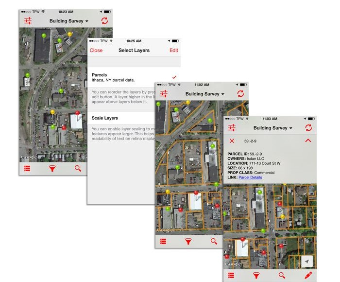

--- 
title: "Electronic Data Entry Options for IEP Surveys"
author: "IEP DUWG 'e-Device' Sub-group led by Karrin Alstad"
date: "2023-06-14"
site: bookdown::bookdown_site
url: "https://github.com/GitKarIn/e-device2.git"
documentclass: book
description: "This bookdown document is intended to summarize the research collected
  by IEP DUWG members regarding the use of electronic data entry tools in IEP Surveys.
  This project is in-progress and has not been fully reviewed by the IEP DUWG e-device
  team."
bibliography:
- book.bib
- packages.bib
biblio-style: apalike
csl: "chicago-fullnote-bibliography.csl"
always_allow_html: yes
---

# Electronic Data Entry Options for IEP Surveys  {-}

## Preamble

This bookdown document is intended as a repository of technical information related to the use of electronic field data entry tools, including reviews of different software options, hardware, and factors regarding interfacing with external sensors and downstream databases.  

The initial information was gleaned from interviews and presentations organized during a DUWG Electronic Data Entry Device ("e-device") focus group (6/2022-6/2023), but these reports are far from exhaustive of the many software/hardware options that are available for field data entry.  Meanwhile communication and cloud processing technology is advancing rapidly.  

This initiative generally asks that all IEP survey teams that have e-device experience, or those that are adding digital data-entry tools to their program, please share these experiences and help to develop this resource for other IEP surveys seeking to update data entry protocols.


## Bookdown File Organization


This document is configured using the bookdown::bs4_book format for HTML output and the file organization is as follows:

  * The main project folder ("edevice2/") contains all files included in this bookdown document, including the data tables and scripts used to populate the document tables. The main folder of the project contains all of the .Rmd files that compose one (and only one) chapter. 
 
  * 01-intro.Rmd, 02-survey.Rmd, etc.: These are the chapter files of the e-device book, which are numbered in the order that they appear in the table of contents.  A chapter *must* start with a first-level heading: `# A good chapter`, and can contain one (and only one) first-level heading.

  * _bookdown.yml: This file contains the configuration options f the e-device book, including the output format, the location of the chapters, and the order of the chapters [if numbers are not used].
  
  * _output.yml: This file contains the configuration options for the output format, such as the theme, the CSS, and the JavaScript.
  
  * index.Rmd: This file contains the content for this current page providing this orientation material. It also contains the front matter for the book, such as the title, the author, and the date, as well as the table of contents.  
  
  * _book/: This is the directory where the compiled book is stored. It contains all of the HTML, CSS, and JavaScript files that make up the book.  Files in the _book directory should NOT be edited.
  
  * images/: This is the directory that contains all static images (images not derived by R code chunk) that are included in the e-device book.  The static images (e.g., screen clips) are organized in folders by chapter.
  
  * data_scripts/: This is the directory that contains all data handing scripts used in the e-device book.  Currently, one data read script is run prior to rendering the book. This script output .rds data tables to the main edevice2 folder for access by the Rmd files.
  
  * tables/: Excel files associated with the tables generated in this bookdown document are located in the tables/ folder.
  
  * style.css: contains css formatting instructions.  Beyond default settings, a couple of css codes for table formatting have been added.
  


## How to Contribute: Two Ways


###  **Submit changes to the e-device package using Github:** 

1. Create a fork off of the primary package: https://github.com/GitKarIn/e-device2.git

2. Clone this fork to your own local repository

3. Render the book:

-  Click on the **Build** pane in the RStudio IDE and Click on **Build Book** tool

-  Or, build the book from the R console:

```r
bookdown::render_book()
```

4. Compose changes or updates to the book contents

5. Check for merge conflicts and submit a pull request


###  **Email proposed changes/edits to the document manager:** 

1. Print to pdf each page of the document that needs to be changed using the web browser print options 

(*Note: The current version of the document is not configured to be exported to a pdf file because there seems to be a bookdown conflict between the Kable() table configurations and the pdf rendering.   If anyone has suggestions as to how to adjust the Bookdown::bs4_book settings by making changes to the output.yaml or to the .css file to allow it to rendo to pdf, this input would be very welcome.*)

2. Use a pdf editor to insert comments or changes.

3. E-mail these edited pdf pages to: karrin.alstad@wildlife.ca.gov


<!--chapter:end:index.Rmd-->

# Executive Summary {-}

## **Take Home Message:** {-}

**IEP should transition to electronic data entry in order to improve efficiency and data quality.**

Digital data entry methods significantly increase the turn-around time of data from survey to publication by reducing field entry errors, eliminating manual entry QC checks, and improving overall processing efficiency. 


## **Problem:** {-}

**IEP still uses paper data sheets for most surveys.**  

Several surveys have tried out different e-devices for collecting field data, but they haven't been broadly adopted and people are not sure which ones are best.  


## **Method:** {-}

The DUWG formed a sub-team and carried out the following steps:

1. **Polled IEP survey teams** to learn what digital data entry tools are currently used within the IEP network; 
2. **Evaluated the top software tools** with interviews/presentations from experienced users and product vendors; 
3. **Conducted software trials** using apps specifically configured for IEP survey data collections;
4. **Developed and Open-document forum** for exchange of technical information on e-devices across IEP;
5. **Summarized Pros and Cons** of the top e-device software options.


## **Solutions:** {-}

### 1. The Top Data Entry Software Apps Are Listed (Pros and Cons)  {-}

**The top software tools used for field data entry are listed and the Pros and Cons of each tool are briefly described.**

<div style="border: 1px solid #ddd; padding: 5px; overflow-x: scroll; width:800px; "><table class=" lightable-paper table" style='font-family: "Arial Narrow", arial, helvetica, sans-serif; margin-left: auto; margin-right: auto; font-size: 18px; width: auto !important; margin-left: auto; margin-right: auto;'>
<caption style="font-size: initial !important;">(\#tab:proscons)Summary Pros and Cons of the Top Field Data Entry Apps Reviewed.</caption>
 <thead>
  <tr>
   <th style="text-align:left;position: sticky; top:0; background-color: #FFFFFF;"> Software </th>
   <th style="text-align:left;position: sticky; top:0; background-color: #FFFFFF;"> Pros </th>
   <th style="text-align:left;position: sticky; top:0; background-color: #FFFFFF;"> Cons </th>
  </tr>
 </thead>
<tbody>
  <tr>
   <td style="text-align:left;max-width: 4.5cm; font-weight: bold;"> Survey123 </td>
   <td style="text-align:left;max-width: 7cm; "> Exceptional Geo-referencing tools </td>
   <td style="text-align:left;max-width: 10cm; "> Form building tool requires significant learning time; Trial study could not easilly configure a listing of lengths for review in the field </td>
  </tr>
  <tr>
   <td style="text-align:left;max-width: 4.5cm; font-weight: bold;"> Power Apps </td>
   <td style="text-align:left;max-width: 7cm; "> *Connectors to databases including SQL &amp; OneDrive is No-Code (easy to set up) and functions smoothly;   Able to set up on-the-fly editing, listings and frequency plots to review lengths in the field </td>
   <td style="text-align:left;max-width: 10cm; "> API connectors to external devices requires the Azure license </td>
  </tr>
  <tr>
   <td style="text-align:left;max-width: 4.5cm; font-weight: bold;"> Fulcrum </td>
   <td style="text-align:left;max-width: 7cm; ">  </td>
   <td style="text-align:left;max-width: 10cm; ">  </td>
  </tr>
  <tr>
   <td style="text-align:left;max-width: 4.5cm; font-weight: bold;"> Pendragon </td>
   <td style="text-align:left;max-width: 7cm; ">  </td>
   <td style="text-align:left;max-width: 10cm; ">  </td>
  </tr>
  <tr>
   <td style="text-align:left;max-width: 4.5cm; font-weight: bold;"> FEED </td>
   <td style="text-align:left;max-width: 7cm; ">  </td>
   <td style="text-align:left;max-width: 10cm; ">  </td>
  </tr>
  <tr>
   <td style="text-align:left;max-width: 4.5cm; font-weight: bold;"> Big Fin </td>
   <td style="text-align:left;max-width: 7cm; ">  </td>
   <td style="text-align:left;max-width: 10cm; ">  </td>
  </tr>
  <tr>
   <td style="text-align:left;max-width: 4.5cm; font-weight: bold;"> PDF with R-scraping code </td>
   <td style="text-align:left;max-width: 7cm; "> Inexpensive, </td>
   <td style="text-align:left;max-width: 10cm; ">  </td>
  </tr>
</tbody>
</table></div>

### 2. An Open-access E-device Information Repository Is Available {-}

**An open-access repository for information related to electronic field data entry software/hardware for IEP Survey application has been developed**.  This document is intended as resource for IEP survey leads in selecting and deploying digital data-entry procedures. A Github-based bookdown framework has been established to support open sharing and on-going community updates as survey teams add new digital data-entry tools to their program.  


## Impact: {-}

Adopting digital data entry protocols will require time to develop the platforms and software and to train the staff. In addition, IEP surveys will have to budget for the purchase and maintenance of mobile field devices, data loggers and/or electronic fish measurement boards. **In the longer term,the time and staff-power savings in reduced data entry and post-collection processing will significantly out-weigh equipment and training time expenditures.**


<!--chapter:end:summary.Rmd-->

# (PART\*) Intro and IEP Questionnaire {-}

# Introduction 

This bookdown document is intended to be a 'living document' which develops as more IEP surveys adopt the use of electronic data entry tools.  Optimally, new e-device experiences and information can be shared with the IEP community through on-going presentations to the DUWG working group and updates to this document. 

## E-device Working Group Overview

### Goals

In general, the goal of the electronic data entry sub-group of the DUWG is to research field data entry software and hardware devices (“e-devices”), and to generate resources that support IEP survey leads in selecting and deploying digital data-entry procedures.  This sub-group does not intend to suggest a single solution or software choice for all IEP surveys; rather, the sub-group aims to provide specific application reviews and research, and group members may report on direct hands-on software trials or testing of new methods. Potentially, these activities will initiate an IEP e-device users network as a resource for IEP survey members who are newer to these methods and technologies.

### Approach

A general approach to the exploration of e-device applications was outlined and agreed on at the initial e-device meetings.  

First, an e-device information gathering questionnaire (survey) was distributed within IEP which specifically collects response data from: 1. Experienced e-device users, 2. Those who are currently researching e-device solutions for their survey applications; and 3. Those who have determined e-devices will not work for them. 

Second, from the responses to the questionnaire, the distribution was expanded to include external associates (ICF, NEON, CDFW Marine).  Follow-up interviews of the experienced e-device users and vendors were conducted, and demonstrations were arranged for the most promising e-device options.

Third, group members potentially test specific e-devices apps by making use of free trial licenses, and these trials reported back to the group (SFBS & Yolo By-pass were early volunteers for trial forms development exercises). Potentially other e-device methods will be researched and developed for demonstration purposes going forward (e.g., collection and integration of external sensor data and fish board data into e-device applications).


### Scope of group activities and intended products 

The initial e-device questionnaire was used to identify the most common e-device apps used within IEP (\@ref(fig:survey)) the key questions/concerns about using e-devices [key questions](#keyqest) as well as the key criteria that will be used to evaluate each software options explored by the working group [criteria](#crittop). These criteria served as the outline for software reviews.   

Seven different field data entry software applications were evaluated over eight meetings (\@ref(tab:spkr)); Each month, an expert user was invited to present the particular app, and efforts were made to find a local IEP representative to also trial the software and present their first hand impressions.

The intended product from this DUWG subgroup research is a central repository document that summarizes the range of data entry software apps used by IEP and associated surveys, as well as reviews of the various methods used to transfer field data to published databases.  Eventually, this compilation may include information on field hardware devices/weatherizing kits, and methods used for integrating external sensors such as fish boards. The summary document intends to include a list of reference persons who have experience with one or more of the electronic data software or methods.  It is anticipated that this document can be used by survey leads to aid in decision making on electronic field data entry options.


<div style="border: 1px solid #ddd; padding: 5px; overflow-x: scroll; width:800px; "><table class=" lightable-paper table" style='font-family: "Arial Narrow", arial, helvetica, sans-serif; margin-left: auto; margin-right: auto; font-size: 18px; width: auto !important; margin-left: auto; margin-right: auto;'>
<caption style="font-size: initial !important;">(\#tab:spkr)Guest speakers and local trials.</caption>
 <thead>
  <tr>
   <th style="text-align:left;position: sticky; top:0; background-color: #FFFFFF;"> Software </th>
   <th style="text-align:left;position: sticky; top:0; background-color: #FFFFFF;"> Guest Presenter (Expert) </th>
   <th style="text-align:left;position: sticky; top:0; background-color: #FFFFFF;"> Local Expert or Newby </th>
  </tr>
 </thead>
<tbody>
  <tr>
   <td style="text-align:left;max-width: 4.5cm; font-weight: bold;"> Survey123 (ESRI) </td>
   <td style="text-align:left;max-width: 7cm; "> -- </td>
   <td style="text-align:left;max-width: 10cm; "> JT Robinson, DWR </td>
  </tr>
  <tr>
   <td style="text-align:left;max-width: 4.5cm; font-weight: bold;"> Pendragon </td>
   <td style="text-align:left;max-width: 7cm; "> Daniel Phillips, Rep. </td>
   <td style="text-align:left;max-width: 10cm; "> Doug Burch, CDFW </td>
  </tr>
  <tr>
   <td style="text-align:left;max-width: 4.5cm; font-weight: bold;"> Fulcrum </td>
   <td style="text-align:left;max-width: 7cm; "> Kaelin Cawley, NEON </td>
   <td style="text-align:left;max-width: 10cm; "> -- </td>
  </tr>
  <tr>
   <td style="text-align:left;max-width: 4.5cm; font-weight: bold;">  </td>
   <td style="text-align:left;max-width: 7cm; "> Jessica Morten, NOAA </td>
   <td style="text-align:left;max-width: 10cm; "> Jillian Burns, CDFW </td>
  </tr>
  <tr>
   <td style="text-align:left;max-width: 4.5cm; font-weight: bold;"> FEED/VIMS </td>
   <td style="text-align:left;max-width: 7cm; "> Chris Bonzek, Rep. </td>
   <td style="text-align:left;max-width: 10cm; "> Initiated by SFBS </td>
  </tr>
  <tr>
   <td style="text-align:left;max-width: 4.5cm; font-weight: bold;"> PowerApps/Canvas </td>
   <td style="text-align:left;max-width: 7cm; "> Tuongvan Nguyen, IEP/CDFW (new to P. App) </td>
   <td style="text-align:left;max-width: 10cm; "> Karrin Alstad &amp; Jillian Burns, CDFW </td>
  </tr>
  <tr>
   <td style="text-align:left;max-width: 4.5cm; font-weight: bold;"> BigFin Scientific </td>
   <td style="text-align:left;max-width: 7cm; "> Chris Carol, Rep. </td>
   <td style="text-align:left;max-width: 10cm; "> Initiated by SFBS </td>
  </tr>
  <tr>
   <td style="text-align:left;max-width: 4.5cm; font-weight: bold;"> R scrape of PDF Forms </td>
   <td style="text-align:left;max-width: 7cm; "> Trinh Nguyen </td>
   <td style="text-align:left;max-width: 10cm; "> Currently have a SFBS template </td>
  </tr>
</tbody>
</table></div>


<!--chapter:end:01-intro.Rmd-->

# E-device Questionnaire 

## E-device Questionnaire Outline

An Electronic Field Data-Entry Device ("e-Device") Questionnaire was distributed to IEP survey leads in July of 2022. The goals of this questionnaire were: 1. To get an understanding of the current level of use of electronic field data entry devices among IEP survey staff; 2. To seek information from expert e-device users about both hardware and software considerations, and 3. To the learn specific roadblocks for those who are hesitant to consider shifting to electronic data entry methods.  

Three groups were targeted for this questionnaire:

1. Experienced e-device users (internal IEP and external agencies),                            
2. IEP Survey Staff who are researching e-devices for field application,                            
3. IEP Survey Staff who don't believe electronic field data collection will work for their application.

## Questionnaire Respondents 

The IEP e-device questionnaire was run for approximately a month and received 24 responses (Figure \@ref(fig:survey). A link to the original questionnaire and to the compiled questionnaire responses is included in the Appendix [See IEP E-device Survey](#appx_1).


<div class="figure" style="text-align: center">

<p class="caption">(\#fig:survey)The distribution of responses to the e-device questionnaire by agency association. Most of these respondents were CDFW staff, but USFWS and DWR responses were also represented.  Two external agencies (NEON and ICF) were specifically asked to participate after the questionnaire responses pointed to these expert resources.</p>
</div>

Among the 24 respondents, half of these were IEP associates and external contacts that are already using e-device applications for their survey data collections.  Five (20%) of the respondents were IEP associates who were currently seeking e-device solutions for their survey data collections. Two of the respondents indicated that they have already determined that electronic data entry would not work for their IEP survey application, and 5 respondents did not answer the question about their e-device use experience/status. An experienced e-device user resource list has been initiated, including contact names, software type, and type of survey application; this list will be expanded as possible (Appendix  D) [Expert Network](#expnet).


## Most Common Software Applications Used


<table class=" lightable-paper table" style='font-family: "Arial Narrow", arial, helvetica, sans-serif; margin-left: auto; margin-right: auto; font-size: 18px; width: auto !important; margin-left: auto; margin-right: auto;'>
<caption style="font-size: initial !important;">(\#tab:surv2)Most common e-device software applications used by the IEP members who responded to the e-device questionnaire.</caption>
 <thead>
  <tr>
   <th style="text-align:left;position: sticky; top:0; background-color: #FFFFFF;"> Application </th>
   <th style="text-align:left;position: sticky; top:0; background-color: #FFFFFF;"> Agency </th>
   <th style="text-align:left;position: sticky; top:0; background-color: #FFFFFF;"> Type of Application/Data Collected </th>
  </tr>
 </thead>
<tbody>
  <tr>
   <td style="text-align:left;max-width: 4.5cm; font-weight: bold;"> ESRI Survey123 </td>
   <td style="text-align:left;max-width: 7cm; "> ICF, NEON </td>
   <td style="text-align:left;max-width: 10cm; "> fish &amp; zooplankton surveys, water quality </td>
  </tr>
  <tr>
   <td style="text-align:left;max-width: 4.5cm; font-weight: bold;"> Pendragon </td>
   <td style="text-align:left;max-width: 7cm; "> DWR, CDFW </td>
   <td style="text-align:left;max-width: 10cm; "> fish &amp; zooplankton surveys, water quality </td>
  </tr>
  <tr>
   <td style="text-align:left;max-width: 4.5cm; font-weight: bold;"> Fulcrum </td>
   <td style="text-align:left;max-width: 7cm; "> ICF, NEON </td>
   <td style="text-align:left;max-width: 10cm; "> field data collection, botanical &amp; wildlife surveys </td>
  </tr>
  <tr>
   <td style="text-align:left;max-width: 4.5cm; font-weight: bold;"> Adobe PDF Forms </td>
   <td style="text-align:left;max-width: 7cm; "> ICF, DWR </td>
   <td style="text-align:left;max-width: 10cm; "> field data collection </td>
  </tr>
  <tr>
   <td style="text-align:left;max-width: 4.5cm; font-weight: bold;"> .NET customized </td>
   <td style="text-align:left;max-width: 7cm; "> DWR, USGS, CDFW </td>
   <td style="text-align:left;max-width: 10cm; "> MOPED water quality, SVMAQ water quality &amp; discharge </td>
  </tr>
  <tr>
   <td style="text-align:left;max-width: 4.5cm; font-weight: bold;"> iFormbuilder </td>
   <td style="text-align:left;max-width: 7cm; "> ICF </td>
   <td style="text-align:left;max-width: 10cm; ">  </td>
  </tr>
  <tr>
   <td style="text-align:left;max-width: 4.5cm; font-weight: bold;"> Zoho </td>
   <td style="text-align:left;max-width: 7cm; "> ICF </td>
   <td style="text-align:left;max-width: 10cm; ">  </td>
  </tr>
  <tr>
   <td style="text-align:left;max-width: 4.5cm; font-weight: bold;"> Access, Excel </td>
   <td style="text-align:left;max-width: 7cm; "> ICF, USFWS </td>
   <td style="text-align:left;max-width: 10cm; "> tributary monitoring </td>
  </tr>
  <tr>
   <td style="text-align:left;max-width: 4.5cm; font-weight: bold;"> ESRI Collector, ESRI Field Maps </td>
   <td style="text-align:left;max-width: 7cm; "> USFWS, CDFW, UC </td>
   <td style="text-align:left;max-width: 10cm; "> geolocation of FAV, positional accuracy, spawning ground surveys </td>
  </tr>
</tbody>
</table>


## Key questions/concerns about using e-devices (derived from the e-device questionnaire) {#keyqest}


A series of key questions were extracted from the questionnaire responses, and were further developed in the first several working group meetings. These questions outline most difficult hurdles that questionnaire leads address when adopting electronic data entry technology for shipboard surveys.

- Forms: 	
   Do I need to know a programming language to develop a data entry form?  
   Can the forms builder be used to represent a highly nested sampling design?  
   Can I review fish length data as a list? Can I edit my data ‘on-the-fly’?  
   Can I take photos and link to the record at various levels of a nested sampling design?  
   
- Data Export Formats and Transfers:  
   What is the format of the exported data?  
   Can the exported data be integrated with an existing Access or SQL database?  
   What procedures are needed for uploading to the database (for each output type)?  
   Can I make a back-up of the data locally when an internet connection is not available? 

- Reading external data inputs:  
Can I incorporate data from an external sensor into the app? GPS, Fish boards, Bar Codes?

- IT Security and Version Control:  
   Does the app have network security certificates; has the security been vetted?  
   Are there version control options for data pushed to cloud repositories from the field?

- Hardware:  
   Can a handheld device truly be weatherproof?  
   How can we keep these devices from dropping overboard during fishing and processing activities?

- QA/QC:  
   What features of the data entry software are critical for supporting quality assurance and quality control routines.


<!--chapter:end:02-survey.Rmd-->

# (PART\*) Software Reviews {-}


# Software Comparison Criteria

## Criteria for Comparison of E-device Apps {#crittop} 

The e-device subgroup identified 6 different groupings of criteria for comparing different data entry apps: Forms Options \@ref(forms), Data Interface Options \@ref(datint), Photo Integration and External Sensor Options \@ref(photsens), Hardware Platform Options \@ref(hardware), Security Factors \@ref(securt), and Vendor Business Model \@ref(business). 
The main categories considering include options within the forms building tools, including QC related factors such as constrained choices and rules that guide subsequent fields.  Other categories include IT security protocols, photo integration, cost of different product options, and factors related to the business model of each vendor, including the longevity of the company and the level/cost of customer/technical support. 


### Forms Options Criteria {#forms}

<!-- [Top of section](#crittop) -->

<div style="border: 1px solid #ddd; padding: 5px; overflow-x: scroll; width:800px; "><table class=" lightable-paper table" style='font-family: "Arial Narrow", arial, helvetica, sans-serif; margin-left: auto; margin-right: auto; font-size: 18px; width: auto !important; margin-left: auto; margin-right: auto;'>
<caption style="font-size: initial !important;">(\#tab:forms)Forms Options.</caption>
 <thead>
  <tr>
   <th style="text-align:left;position: sticky; top:0; background-color: #FFFFFF;"> Category </th>
   <th style="text-align:left;position: sticky; top:0; background-color: #FFFFFF;"> Feature </th>
   <th style="text-align:left;position: sticky; top:0; background-color: #FFFFFF;"> Description </th>
  </tr>
 </thead>
<tbody>
  <tr>
   <td style="text-align:left;max-width: 4cm; font-weight: bold;"> Data entry validation/QC </td>
   <td style="text-align:left;max-width: 7cm; "> Geo-referencing </td>
   <td style="text-align:left;max-width: 8cm; "> Are the coordinates for each data observation logged; is this a automatic (extracted from the device GPS ) or manual (entering GPS on keyboard)? </td>
  </tr>
  <tr>
   <td style="text-align:left;max-width: 4cm; font-weight: bold;">  </td>
   <td style="text-align:left;max-width: 7cm; "> Constrained choices from a list </td>
   <td style="text-align:left;max-width: 8cm; "> Can the app reference data tables to provide a contrained response? </td>
  </tr>
  <tr>
   <td style="text-align:left;max-width: 4cm; font-weight: bold;">  </td>
   <td style="text-align:left;max-width: 7cm; "> Rules guiding answer series (e.g., “Conditional Questions” and “Skips”) </td>
   <td style="text-align:left;max-width: 8cm; "> Can the form be customized to adjust subsequent questions based on the responses entered? </td>
  </tr>
  <tr>
   <td style="text-align:left;max-width: 4cm; font-weight: bold;">  </td>
   <td style="text-align:left;max-width: 7cm; "> Constrained choices from an external table </td>
   <td style="text-align:left;max-width: 8cm; "> Can the app reference access data tables from cloud or local hard drive to provide a contrained response? </td>
  </tr>
  <tr>
   <td style="text-align:left;max-width: 4cm; font-weight: bold;">  </td>
   <td style="text-align:left;max-width: 7cm; "> Form Version Control </td>
   <td style="text-align:left;max-width: 8cm; "> Is there a record of the changes to a form and which version was used to collect the data? </td>
  </tr>
  <tr>
   <td style="text-align:left;max-width: 4cm; font-weight: bold;">  </td>
   <td style="text-align:left;max-width: 7cm; "> Real-time Data Review </td>
   <td style="text-align:left;max-width: 8cm; "> Can the data records be reviewed during data entry; can the lengths be reviewed as a list of lengths per species? </td>
  </tr>
  <tr>
   <td style="text-align:left;max-width: 4cm; font-weight: bold;">  </td>
   <td style="text-align:left;max-width: 7cm; "> Real-time Edit (“on the fly”) </td>
   <td style="text-align:left;max-width: 8cm; "> Can the data entered be edited easilly? </td>
  </tr>
  <tr>
   <td style="text-align:left;max-width: 4cm; font-weight: bold;"> Ease of Form Development </td>
   <td style="text-align:left;max-width: 7cm; "> Intuitive form design tool </td>
   <td style="text-align:left;max-width: 8cm; "> Is it difficult to build a form? Does it take a long time to get up to speed? </td>
  </tr>
  <tr>
   <td style="text-align:left;max-width: 4cm; font-weight: bold;">  </td>
   <td style="text-align:left;max-width: 7cm; "> Coding language required? </td>
   <td style="text-align:left;max-width: 8cm; "> Does one need to know an advances programming language to build a form? </td>
  </tr>
  <tr>
   <td style="text-align:left;max-width: 4cm; font-weight: bold;">  </td>
   <td style="text-align:left;max-width: 7cm; "> Different styles of question types </td>
   <td style="text-align:left;max-width: 8cm; "> How much flexibility does the app provide in types of questions available? (e.g., drop down list; multiple choice; searchable tables) </td>
  </tr>
  <tr>
   <td style="text-align:left;max-width: 4cm; font-weight: bold;">  </td>
   <td style="text-align:left;max-width: 7cm; "> Flexibility to configure in a logical order for field entry (e.g., nested desgin) </td>
   <td style="text-align:left;max-width: 8cm; "> Can the form be divided into separate sections to accommodate a nested sampling design? </td>
  </tr>
  <tr>
   <td style="text-align:left;max-width: 4cm; font-weight: bold;"> Other IEP Survey needs </td>
   <td style="text-align:left;max-width: 7cm; "> Permissions Management </td>
   <td style="text-align:left;max-width: 8cm; "> Are there different permissions levels to control edits to the form? (e.g., user level versus form manager level) </td>
  </tr>
  <tr>
   <td style="text-align:left;max-width: 4cm; font-weight: bold;">  </td>
   <td style="text-align:left;max-width: 7cm; "> Muti-users of an app </td>
   <td style="text-align:left;max-width: 8cm; "> Can multiple users access the same account? Or does each user have to have (and pay for) a separate user account? </td>
  </tr>
  <tr>
   <td style="text-align:left;max-width: 4cm; font-weight: bold;">  </td>
   <td style="text-align:left;max-width: 7cm; "> Off-line capacity </td>
   <td style="text-align:left;max-width: 8cm; "> Does the app function off-line?; are there any gaps in function if switch off and on-line? </td>
  </tr>
  <tr>
   <td style="text-align:left;max-width: 4cm; font-weight: bold;"> User Accessability </td>
   <td style="text-align:left;max-width: 7cm; "> Multiple-language options </td>
   <td style="text-align:left;max-width: 8cm; ">  </td>
  </tr>
  <tr>
   <td style="text-align:left;max-width: 4cm; font-weight: bold;">  </td>
   <td style="text-align:left;max-width: 7cm; "> Font adjustment/Speak-to-text </td>
   <td style="text-align:left;max-width: 8cm; ">  </td>
  </tr>
</tbody>
</table></div>


### Data Interface Criteria {#datint}

[Top of section](#crittop)


<div style="border: 1px solid #ddd; padding: 5px; overflow-x: scroll; width:800px; "><table class=" lightable-paper table" style='font-family: "Arial Narrow", arial, helvetica, sans-serif; margin-left: auto; margin-right: auto; font-size: 18px; width: auto !important; margin-left: auto; margin-right: auto;'>
<caption style="font-size: initial !important;">(\#tab:data)Data Interface Options.</caption>
 <thead>
  <tr>
   <th style="text-align:left;position: sticky; top:0; background-color: #FFFFFF;"> Category </th>
   <th style="text-align:left;position: sticky; top:0; background-color: #FFFFFF;"> Feature </th>
   <th style="text-align:left;position: sticky; top:0; background-color: #FFFFFF;"> Description </th>
  </tr>
 </thead>
<tbody>
  <tr>
   <td style="text-align:left;max-width: 4cm; font-weight: bold;"> Database interface </td>
   <td style="text-align:left;max-width: 7cm; "> Data storage location </td>
   <td style="text-align:left;min-width: 8cm; max-width: 9cm; "> Where does the data get stored? </td>
  </tr>
  <tr>
   <td style="text-align:left;max-width: 4cm; font-weight: bold;"> Edit after transfer </td>
   <td style="text-align:left;max-width: 7cm; "> Editing data ‘on-the-fly’ (data already submitted) </td>
   <td style="text-align:left;min-width: 8cm; max-width: 9cm; "> Can the data be edited in the local data storage?

Can data be edited after having been pushed to a remote location? </td>
  </tr>
  <tr>
   <td style="text-align:left;max-width: 4cm; font-weight: bold;"> Data format </td>
   <td style="text-align:left;max-width: 7cm; "> Open (standard) format output </td>
   <td style="text-align:left;min-width: 8cm; max-width: 9cm; "> What is the file type of exported data? Are there multiple file type options? </td>
  </tr>
  <tr>
   <td style="text-align:left;max-width: 4cm; font-weight: bold;">  </td>
   <td style="text-align:left;max-width: 7cm; "> Data format logical / useable </td>
   <td style="text-align:left;min-width: 8cm; max-width: 9cm; "> What is the format of the exported data? (e.g., single table or relational tables associated with nested forms design? Does one need to post-process to associate across levels?) </td>
  </tr>
  <tr>
   <td style="text-align:left;max-width: 4cm; font-weight: bold;"> Data transfer </td>
   <td style="text-align:left;max-width: 7cm; "> Real-time data transfer </td>
   <td style="text-align:left;min-width: 8cm; max-width: 9cm; "> Is the data transferred to a on-line or off-site database in 'real-time'; or does it have to be manually transferred after the data collection period? </td>
  </tr>
  <tr>
   <td style="text-align:left;max-width: 4cm; font-weight: bold;">  </td>
   <td style="text-align:left;max-width: 7cm; "> Cloud connectivity &amp; back up </td>
   <td style="text-align:left;min-width: 8cm; max-width: 9cm; "> Is there a cloud storage location? Can the data be transferred to a remotely located database? </td>
  </tr>
  <tr>
   <td style="text-align:left;max-width: 4cm; font-weight: bold;"> Data change logs </td>
   <td style="text-align:left;max-width: 7cm; "> Audit trails (data version control) </td>
   <td style="text-align:left;min-width: 8cm; max-width: 9cm; "> Is there a mechanism to log changes in data made </td>
  </tr>
  <tr>
   <td style="text-align:left;max-width: 4cm; font-weight: bold;">  </td>
   <td style="text-align:left;max-width: 7cm; "> Direct integration with database </td>
   <td style="text-align:left;min-width: 8cm; max-width: 9cm; "> Can the form be directly configured to an SQL or Access database? If do, how difficult is this configuration? </td>
  </tr>
</tbody>
</table></div>


### Photo Integration and External Sensors {#photsens}

[Top of section](#crittop)


<div style="border: 1px solid #ddd; padding: 5px; overflow-x: scroll; width:800px; "><table class=" lightable-paper table" style='font-family: "Arial Narrow", arial, helvetica, sans-serif; margin-left: auto; margin-right: auto; font-size: 18px; margin-left: auto; margin-right: auto;'>
<caption style="font-size: initial !important;">(\#tab:photo)Photo Integration and External Sensors.</caption>
 <thead>
  <tr>
   <th style="text-align:left;position: sticky; top:0; background-color: #FFFFFF;"> Category </th>
   <th style="text-align:left;position: sticky; top:0; background-color: #FFFFFF;"> Feature </th>
   <th style="text-align:left;position: sticky; top:0; background-color: #FFFFFF;"> Description </th>
  </tr>
 </thead>
<tbody>
  <tr>
   <td style="text-align:left;min-width: 3.5cm; font-weight: bold;max-width: 4cm; font-weight: bold;"> Photo Integration </td>
   <td style="text-align:left;min-width: 6cm; "> Collect photo &amp; assoc. with element </td>
   <td style="text-align:left;min-width: 10cm; "> Can multiple photos can be linked to a single record? </td>
  </tr>
  <tr>
   <td style="text-align:left;min-width: 3.5cm; font-weight: bold;max-width: 4cm; font-weight: bold;">  </td>
   <td style="text-align:left;min-width: 6cm; "> Ease of interface </td>
   <td style="text-align:left;min-width: 10cm; ">  </td>
  </tr>
  <tr>
   <td style="text-align:left;min-width: 3.5cm; font-weight: bold;max-width: 4cm; font-weight: bold;">  </td>
   <td style="text-align:left;min-width: 6cm; "> Multi-photo per element (and # limit) </td>
   <td style="text-align:left;min-width: 10cm; "> What is the size limit for photos? </td>
  </tr>
  <tr>
   <td style="text-align:left;min-width: 3.5cm; font-weight: bold;max-width: 4cm; font-weight: bold;">  </td>
   <td style="text-align:left;min-width: 6cm; "> Drawing/Annotating on photo </td>
   <td style="text-align:left;min-width: 10cm; "> Can the user draw and annotate photos </td>
  </tr>
  <tr>
   <td style="text-align:left;min-width: 3.5cm; font-weight: bold;max-width: 4cm; font-weight: bold;"> X-tern sensors </td>
   <td style="text-align:left;min-width: 6cm; "> GPS from device </td>
   <td style="text-align:left;min-width: 10cm; "> Can the app integrate the GPS from device; how difficult? </td>
  </tr>
  <tr>
   <td style="text-align:left;min-width: 3.5cm; font-weight: bold;max-width: 4cm; font-weight: bold;">  </td>
   <td style="text-align:left;min-width: 6cm; "> Integrate data from bar codes </td>
   <td style="text-align:left;min-width: 10cm; "> Can the app interpret barcodes though device’s camera without external barcode hardware ? </td>
  </tr>
  <tr>
   <td style="text-align:left;min-width: 3.5cm; font-weight: bold;max-width: 4cm; font-weight: bold;">  </td>
   <td style="text-align:left;min-width: 6cm; "> Integrate data from external sensors </td>
   <td style="text-align:left;min-width: 10cm; "> Can the app integrate a datastream from an external sensor (Navigation data or fish board data?) </td>
  </tr>
</tbody>
</table></div>


### Hardware Platforms {#hardware}

[Top of section](#crittop)


<div style="border: 1px solid #ddd; padding: 5px; overflow-x: scroll; width:800px; "><table style='width:90%; font-family: "Arial Narrow", arial, helvetica, sans-serif; margin-left: auto; margin-right: auto; font-size: 18px; margin-left: auto; margin-right: auto;' class=" lightable-paper table">
<caption style="font-size: initial !important;">(\#tab:HWplat)Hardware Platforms Supported.</caption>
 <thead>
  <tr>
   <th style="text-align:left;position: sticky; top:0; background-color: #FFFFFF;"> Hardware/Operating System </th>
   <th style="text-align:left;position: sticky; top:0; background-color: #FFFFFF;"> Yes/No:  app can be used / HW type </th>
  </tr>
 </thead>
<tbody>
  <tr>
   <td style="text-align:left;min-width: 6.0cm; font-weight: bold;max-width: 6.5cm; font-weight: bold;"> Smart Phones and Tablets </td>
   <td style="text-align:left;min-width: 8cm; ">  </td>
  </tr>
  <tr>
   <td style="text-align:left;min-width: 6.0cm; font-weight: bold;max-width: 6.5cm; font-weight: bold;"> -      iOS (phone and tablet) </td>
   <td style="text-align:left;min-width: 8cm; ">  </td>
  </tr>
  <tr>
   <td style="text-align:left;min-width: 6.0cm; font-weight: bold;max-width: 6.5cm; font-weight: bold;"> -      Android(phone and tablet) </td>
   <td style="text-align:left;min-width: 8cm; ">  </td>
  </tr>
  <tr>
   <td style="text-align:left;min-width: 6.0cm; font-weight: bold;max-width: 6.5cm; font-weight: bold;"> Desktop/laptop </td>
   <td style="text-align:left;min-width: 8cm; ">  </td>
  </tr>
  <tr>
   <td style="text-align:left;min-width: 6.0cm; font-weight: bold;max-width: 6.5cm; font-weight: bold;"> -      Windows 7,8,10, 11 </td>
   <td style="text-align:left;min-width: 8cm; ">  </td>
  </tr>
  <tr>
   <td style="text-align:left;min-width: 6.0cm; font-weight: bold;max-width: 6.5cm; font-weight: bold;"> -      MacOS (computer) </td>
   <td style="text-align:left;min-width: 8cm; ">  </td>
  </tr>
  <tr>
   <td style="text-align:left;min-width: 6.0cm; font-weight: bold;max-width: 6.5cm; font-weight: bold;"> -      Ubuntu Linux </td>
   <td style="text-align:left;min-width: 8cm; ">  </td>
  </tr>
</tbody>
</table></div>


### Security Factors {#securt}

[Top of section](#crittop)


<div style="border: 1px solid #ddd; padding: 5px; overflow-x: scroll; width:800px; "><table class=" lightable-paper table" style='font-family: "Arial Narrow", arial, helvetica, sans-serif; margin-left: auto; margin-right: auto; font-size: 18px; margin-left: auto; margin-right: auto;'>
<caption style="font-size: initial !important;">(\#tab:security)Software Security Factors.</caption>
 <thead>
  <tr>
   <th style="text-align:left;position: sticky; top:0; background-color: #FFFFFF;"> Feature </th>
   <th style="text-align:left;position: sticky; top:0; background-color: #FFFFFF;"> Description </th>
  </tr>
 </thead>
<tbody>
  <tr>
   <td style="text-align:left;min-width: 5.0cm; font-weight: bold;max-width: 5.5cm; font-weight: bold;"> Where’s the application/product origins from? </td>
   <td style="text-align:left;min-width: 6cm; "> IT have concerns about apps from countries that tend to distribute malware </td>
  </tr>
  <tr>
   <td style="text-align:left;min-width: 5.0cm; font-weight: bold;max-width: 5.5cm; font-weight: bold;"> Is the application Cloud based, and if so, where? </td>
   <td style="text-align:left;min-width: 6cm; "> IT wants to know the location of a cloud storage service </td>
  </tr>
  <tr>
   <td style="text-align:left;min-width: 5.0cm; font-weight: bold;max-width: 5.5cm; font-weight: bold;"> Where is the data being stored for the application? </td>
   <td style="text-align:left;min-width: 6cm; ">  </td>
  </tr>
  <tr>
   <td style="text-align:left;min-width: 5.0cm; font-weight: bold;max-width: 5.5cm; font-weight: bold;"> Is the data center FedRAMP certified? </td>
   <td style="text-align:left;min-width: 6cm; "> Larger cloud services have all gone thru FedRAMP certification; but smaller services do not have this standard </td>
  </tr>
  <tr>
   <td style="text-align:left;min-width: 5.0cm; font-weight: bold;max-width: 5.5cm; font-weight: bold;"> Online Security measures </td>
   <td style="text-align:left;min-width: 6cm; ">  </td>
  </tr>
</tbody>
</table></div>


### Business Model and Customer Support {#business}

[Top of section](#crittop)


<div style="border: 1px solid #ddd; padding: 5px; overflow-x: scroll; width:800px; "><table style='width:100%; font-family: "Arial Narrow", arial, helvetica, sans-serif; margin-left: auto; margin-right: auto; font-size: 18px; margin-left: auto; margin-right: auto;' class=" lightable-paper table">
<caption style="font-size: initial !important;">(\#tab:busmod)Business Model.</caption>
 <thead>
  <tr>
   <th style="text-align:left;position: sticky; top:0; background-color: #FFFFFF;"> Feature </th>
   <th style="text-align:left;position: sticky; top:0; background-color: #FFFFFF;"> Description </th>
  </tr>
 </thead>
<tbody>
  <tr>
   <td style="text-align:left;min-width: 5.0cm; font-weight: bold;max-width: 5.5cm; font-weight: bold;"> Price (Option 1) </td>
   <td style="text-align:left;min-width: 6cm; ">  </td>
  </tr>
  <tr>
   <td style="text-align:left;min-width: 5.0cm; font-weight: bold;max-width: 5.5cm; font-weight: bold;"> Price (Option 2) </td>
   <td style="text-align:left;min-width: 6cm; ">  </td>
  </tr>
  <tr>
   <td style="text-align:left;min-width: 5.0cm; font-weight: bold;max-width: 5.5cm; font-weight: bold;"> Business model </td>
   <td style="text-align:left;min-width: 6cm; "> Size of company, Number of year in business, potential to stay in business </td>
  </tr>
  <tr>
   <td style="text-align:left;min-width: 5.0cm; font-weight: bold;max-width: 5.5cm; font-weight: bold;"> Technical Support </td>
   <td style="text-align:left;min-width: 6cm; "> Cost for technical support, Quality of technical support </td>
  </tr>
</tbody>
</table></div>

<!--chapter:end:03-criteria.Rmd-->


# ESRI Survey123 

## Survey123 Overview  {#s12top} 

From ESRI documentation: ArcGIS Survey123 is a complete, form-centric solution for creating, sharing, and analyzing surveys. Use it to create forms with skip logic, defaults, and support for multiple languages. Collect data using web or mobile devices, even when disconnected from the internet. Upload data securely, and analyze results on the web or in an ArcGIS app. 
https://doc.arcgis.com/en/survey123/reference/whatissurvey123.htm

From G2 Business Software Review: Survey123 is included with ArcGIS, and provides powerful features to help you leverage the power of location to boost your productivity while capturing data and analyzing the results of your surveys. https://www.g2.com/products/arcgis-survey123/reviews


## Survey123: Key Features 

### Survey123 Form Developing Interface

Surveys123 Survey Forms are created and stored through the ESRI web interface (see \@ref(fig:ESRIweb)); access requires a current ESRI license. Survey123 forms can be downloaded to tablets, iPhones or iPads, and data collection can be made while the device is offline. Survey results are uploaded to cloud storage next time the device is on-line. 


```r
library(here)
```


<div class="figure">

<p class="caption">(\#fig:ESRIweb)Screen capture of the ESRI web interface for Survey123 and the option to Create New Survey.</p>
</div>

There are two main options for designing a Survey123 survey form (\@ref(fig:ESRIweb2)): the Web Designer or Survey123 Connect tool. The Web Designer is a web-based menu-driven GUI that does not require learning any specific coding to set up a basic survey form.  Survey questions and response types can be specified using a drag and drop tool.


<div class="figure">

<p class="caption">(\#fig:ESRIweb2)Screen capture of the ESRI web interface for Survey123 highlighting the two main options for designing a Survey123 form: the web designer or the Survey123 Connect tool.</p>
</div>


Survey123 Connect is an option for more advanced survey form design, such as a nested structure or calculated responses from user inputs.  The Survey123 Connect approach requires defining the more advanced form properties within an ‘XLSForm spreadsheet’ using the XLSForm coding language (XLSForm spreadsheets: \@ref(fig:xlsform) and \@ref(fig:xlsform2)).  ESRI documentation for both Web designer and Connect can be found at: https://doc.arcgis.com/en/survey123/browser/create-surveys/createsurveys.htm
XLSForm formatting language is described at: https://xlsform.org/en/.


<div class="figure">

<p class="caption">(\#fig:xlsform)Screen capture of ESRI Survey123 Connect software demonstrating the use of the XLSForm spreadsheet-based coding language and the ability to directly edit the JavaScript code that is linked to XLSForm parameters.</p>
</div>


<div class="figure">

<p class="caption">(\#fig:xlsform2)Screen capture of ArcGIS website description of the XLSForm features: https://gis.idaho.gov/wp-content/uploads/2021/03/ArcGIS-Apps-for-the-Field-State-of-ID.pdf.</p>
</div>


## Survey123: Criteria Tables

### Survey123: Forms Options


<div style="border: 1px solid #ddd; padding: 0px; overflow-y: scroll; height:600px; overflow-x: scroll; width:800px; "><table class=" lightable-paper table" style='font-family: "Arial Narrow", arial, helvetica, sans-serif; margin-left: auto; margin-right: auto; font-size: 18px; width: auto !important; margin-left: auto; margin-right: auto;'>
<caption style="font-size: initial !important;">(\#tab:s123form)Forms Options</caption>
 <thead>
  <tr>
   <th style="text-align:left;position: sticky; top:0; background-color: #FFFFFF;position: sticky; top:0; background-color: #FFFFFF;"> Category </th>
   <th style="text-align:left;position: sticky; top:0; background-color: #FFFFFF;position: sticky; top:0; background-color: #FFFFFF;"> Feature </th>
   <th style="text-align:left;position: sticky; top:0; background-color: #FFFFFF;position: sticky; top:0; background-color: #FFFFFF;"> Available </th>
   <th style="text-align:left;position: sticky; top:0; background-color: #FFFFFF;position: sticky; top:0; background-color: #FFFFFF;"> Description </th>
   <th style="text-align:left;position: sticky; top:0; background-color: #FFFFFF;position: sticky; top:0; background-color: #FFFFFF;"> Group Notes </th>
   <th style="text-align:left;position: sticky; top:0; background-color: #FFFFFF;position: sticky; top:0; background-color: #FFFFFF;"> External  Reviews </th>
   <th style="text-align:left;position: sticky; top:0; background-color: #FFFFFF;position: sticky; top:0; background-color: #FFFFFF;"> Score(0-3) </th>
  </tr>
 </thead>
<tbody>
  <tr>
   <td style="text-align:left;min-width: 2cm; font-weight: bold;max-width: 3cm; font-weight: bold;"> Data entry validation/QC </td>
   <td style="text-align:left;min-width: 2cm; max-width: 3cm; "> Geo-referencing </td>
   <td style="text-align:left;min-width: 2cm; max-width: 2.5cm; "> Yes </td>
   <td style="text-align:left;min-width: 4.5cm; max-width: 5cm; "> Every Survey123 entry (object?) has an associated lat/long data </td>
   <td style="text-align:left;min-width: 4.5cm; max-width: 5cm; "> Uses device navigation: phone app or GPS device; Data can open in data in ArcGIS maps directly; Can change base map; Default is current location; Can tap the map to change location [test](https://doc.arcgis.com/en/survey123/browser/analyze-results/viewresults.htm#:~:text=Under%20the%20title%20for%20your,geodatabase%20and%20download%20your%20data) </td>
   <td style="text-align:left;min-width: 2cm; ">  </td>
   <td style="text-align:left;min-width: 3cm; "> 3 </td>
  </tr>
  <tr>
   <td style="text-align:left;min-width: 2cm; font-weight: bold;max-width: 3cm; font-weight: bold;">  </td>
   <td style="text-align:left;min-width: 2cm; max-width: 3cm; "> Constrained choices from a list </td>
   <td style="text-align:left;min-width: 2cm; max-width: 2.5cm; "> Yes </td>
   <td style="text-align:left;min-width: 4.5cm; max-width: 5cm; "> Web Designer </td>
   <td style="text-align:left;min-width: 4.5cm; max-width: 5cm; "> -Restricted lengths, Default values (e.g., Date, Time from device) </td>
   <td style="text-align:left;min-width: 2cm; ">  </td>
   <td style="text-align:left;min-width: 3cm; "> 2 </td>
  </tr>
  <tr>
   <td style="text-align:left;min-width: 2cm; font-weight: bold;max-width: 3cm; font-weight: bold;">  </td>
   <td style="text-align:left;min-width: 2cm; max-width: 3cm; ">  </td>
   <td style="text-align:left;min-width: 2cm; max-width: 2.5cm; "> Yes </td>
   <td style="text-align:left;min-width: 4.5cm; max-width: 5cm; "> Survey123 Connect: XLSForm spreadsheet </td>
   <td style="text-align:left;min-width: 4.5cm; max-width: 5cm; "> Above functionality, plus more advanced options such as: - select multiple responses from a list;smart fields: expressions and formulas to control the allowable input (e.g., total percentage &lt;= 100%)
- Auto limit by partial input
- Auto-completed suggestion </td>
   <td style="text-align:left;min-width: 2cm; ">  </td>
   <td style="text-align:left;min-width: 3cm; "> 1 </td>
  </tr>
  <tr>
   <td style="text-align:left;min-width: 2cm; font-weight: bold;max-width: 3cm; font-weight: bold;">  </td>
   <td style="text-align:left;min-width: 2cm; max-width: 3cm; "> Rules guiding answer series (e.g., “Conditional Questions” and “Skips”) </td>
   <td style="text-align:left;min-width: 2cm; max-width: 2.5cm; "> Yes </td>
   <td style="text-align:left;min-width: 4.5cm; max-width: 5cm; "> Web Designer  </td>
   <td style="text-align:left;min-width: 4.5cm; max-width: 5cm; "> This can be done with Web Designer using the ‘Set rule function’; However, in Web Designer, this function is limited to Single choice, Dropdown, Likert scale, and Rating questions </td>
   <td style="text-align:left;min-width: 2cm; "> [tst4](https://support.esri.com/en/technical-article/000022942) </td>
   <td style="text-align:left;min-width: 3cm; ">  </td>
  </tr>
  <tr>
   <td style="text-align:left;min-width: 2cm; font-weight: bold;max-width: 3cm; font-weight: bold;">  </td>
   <td style="text-align:left;min-width: 2cm; max-width: 3cm; ">  </td>
   <td style="text-align:left;min-width: 2cm; max-width: 2.5cm; "> Yes </td>
   <td style="text-align:left;min-width: 4.5cm; max-width: 5cm; "> Survey123 Connect: XLSForm spreadsheet </td>
   <td style="text-align:left;min-width: 4.5cm; max-width: 5cm; ">  </td>
   <td style="text-align:left;min-width: 2cm; ">  </td>
   <td style="text-align:left;min-width: 3cm; ">  </td>
  </tr>
  <tr>
   <td style="text-align:left;min-width: 2cm; font-weight: bold;max-width: 3cm; font-weight: bold;">  </td>
   <td style="text-align:left;min-width: 2cm; max-width: 3cm; "> Constrained choices from an external table </td>
   <td style="text-align:left;min-width: 2cm; max-width: 2.5cm; ">  </td>
   <td style="text-align:left;min-width: 4.5cm; max-width: 5cm; ">  </td>
   <td style="text-align:left;min-width: 4.5cm; max-width: 5cm; ">  </td>
   <td style="text-align:left;min-width: 2cm; ">  </td>
   <td style="text-align:left;min-width: 3cm; ">  </td>
  </tr>
  <tr>
   <td style="text-align:left;min-width: 2cm; font-weight: bold;max-width: 3cm; font-weight: bold;">  </td>
   <td style="text-align:left;min-width: 2cm; max-width: 3cm; "> Form Version Control </td>
   <td style="text-align:left;min-width: 2cm; max-width: 2.5cm; ">  </td>
   <td style="text-align:left;min-width: 4.5cm; max-width: 5cm; ">  </td>
   <td style="text-align:left;min-width: 4.5cm; max-width: 5cm; ">  </td>
   <td style="text-align:left;min-width: 2cm; ">  </td>
   <td style="text-align:left;min-width: 3cm; ">  </td>
  </tr>
  <tr>
   <td style="text-align:left;min-width: 2cm; font-weight: bold;max-width: 3cm; font-weight: bold;">  </td>
   <td style="text-align:left;min-width: 2cm; max-width: 3cm; "> Real-time Data Review </td>
   <td style="text-align:left;min-width: 2cm; max-width: 2.5cm; "> Yes </td>
   <td style="text-align:left;min-width: 4.5cm; max-width: 5cm; "> Survey123 HUB </td>
   <td style="text-align:left;min-width: 4.5cm; max-width: 5cm; "> The HUB webbased tool allows one to review raw data and summarize data submitted to each survey in the ‘Data’ and ‘Analyze’ tabs; Other summaries: word clouds, frequency plots </td>
   <td style="text-align:left;min-width: 2cm; ">  </td>
   <td style="text-align:left;min-width: 3cm; ">  </td>
  </tr>
  <tr>
   <td style="text-align:left;min-width: 2cm; font-weight: bold;max-width: 3cm; font-weight: bold;">  </td>
   <td style="text-align:left;min-width: 2cm; max-width: 3cm; ">  </td>
   <td style="text-align:left;min-width: 2cm; max-width: 2.5cm; "> No </td>
   <td style="text-align:left;min-width: 4.5cm; max-width: 5cm; "> Survey123 Connect </td>
   <td style="text-align:left;min-width: 4.5cm; max-width: 5cm; "> In trial demo, it was difficult to produce a listing of the lengths which was needed for field QC </td>
   <td style="text-align:left;min-width: 2cm; ">  </td>
   <td style="text-align:left;min-width: 3cm; ">  </td>
  </tr>
  <tr>
   <td style="text-align:left;min-width: 2cm; font-weight: bold;max-width: 3cm; font-weight: bold;">  </td>
   <td style="text-align:left;min-width: 2cm; max-width: 3cm; "> Real-time Edit (“on the fly”) </td>
   <td style="text-align:left;min-width: 2cm; max-width: 2.5cm; "> Yes </td>
   <td style="text-align:left;min-width: 4.5cm; max-width: 5cm; "> User needs to open a separate tab to edit the responses </td>
   <td style="text-align:left;min-width: 4.5cm; max-width: 5cm; ">  </td>
   <td style="text-align:left;min-width: 2cm; ">  </td>
   <td style="text-align:left;min-width: 3cm; ">  </td>
  </tr>
  <tr>
   <td style="text-align:left;min-width: 2cm; font-weight: bold;max-width: 3cm; font-weight: bold;"> Ease of Form Development </td>
   <td style="text-align:left;min-width: 2cm; max-width: 3cm; "> Intuitive form design tool </td>
   <td style="text-align:left;min-width: 2cm; max-width: 2.5cm; "> Yes </td>
   <td style="text-align:left;min-width: 4.5cm; max-width: 5cm; "> Web designer </td>
   <td style="text-align:left;min-width: 4.5cm; max-width: 5cm; "> Web designer intuitive </td>
   <td style="text-align:left;min-width: 2cm; ">  </td>
   <td style="text-align:left;min-width: 3cm; ">  </td>
  </tr>
  <tr>
   <td style="text-align:left;min-width: 2cm; font-weight: bold;max-width: 3cm; font-weight: bold;">  </td>
   <td style="text-align:left;min-width: 2cm; max-width: 3cm; ">  </td>
   <td style="text-align:left;min-width: 2cm; max-width: 2.5cm; "> No </td>
   <td style="text-align:left;min-width: 4.5cm; max-width: 5cm; "> Survey123 Connect: XLSForm spreadsheet </td>
   <td style="text-align:left;min-width: 4.5cm; max-width: 5cm; "> XLSForm formatting language required some effort to pick up. </td>
   <td style="text-align:left;min-width: 2cm; ">  </td>
   <td style="text-align:left;min-width: 3cm; ">  </td>
  </tr>
  <tr>
   <td style="text-align:left;min-width: 2cm; font-weight: bold;max-width: 3cm; font-weight: bold;">  </td>
   <td style="text-align:left;min-width: 2cm; max-width: 3cm; "> Coding language required? </td>
   <td style="text-align:left;min-width: 2cm; max-width: 2.5cm; "> No </td>
   <td style="text-align:left;min-width: 4.5cm; max-width: 5cm; "> Web designer </td>
   <td style="text-align:left;min-width: 4.5cm; max-width: 5cm; "> Web designer is a GUI tool that is menu driven and does not require learning any coding </td>
   <td style="text-align:left;min-width: 2cm; ">  </td>
   <td style="text-align:left;min-width: 3cm; ">  </td>
  </tr>
  <tr>
   <td style="text-align:left;min-width: 2cm; font-weight: bold;max-width: 3cm; font-weight: bold;">  </td>
   <td style="text-align:left;min-width: 2cm; max-width: 3cm; ">  </td>
   <td style="text-align:left;min-width: 2cm; max-width: 2.5cm; "> Yes </td>
   <td style="text-align:left;min-width: 4.5cm; max-width: 5cm; "> XLSForm spreadsheet </td>
   <td style="text-align:left;min-width: 4.5cm; max-width: 5cm; "> Survey123 Connect is an option for more advanced survey designs which requires configuration of an ‘XLSForm spreadsheet’.  XLSForm is an ESRII coding language specific to forms configuration. </td>
   <td style="text-align:left;min-width: 2cm; "> Can be hard to edit XLSForm code: 
“Per my experience, if I delete some of the questions and add other [using] filters for the answers through the [XLSForm spread sheet], the answers will be totally. So, every time I have to make a new form for every survey in order to avoid messy information.”     
[tst2](https://www.g2.com/products/arcgis-survey123/reviews?page=2#survey-response-2154622) </td>
   <td style="text-align:left;min-width: 3cm; ">  </td>
  </tr>
  <tr>
   <td style="text-align:left;min-width: 2cm; font-weight: bold;max-width: 3cm; font-weight: bold;">  </td>
   <td style="text-align:left;min-width: 2cm; max-width: 3cm; "> Different styles of question types </td>
   <td style="text-align:left;min-width: 2cm; max-width: 2.5cm; "> Yes </td>
   <td style="text-align:left;min-width: 4.5cm; max-width: 5cm; "> Web Designer  </td>
   <td style="text-align:left;min-width: 4.5cm; max-width: 5cm; "> Yes, both Web designer and Connect provide a range of question types: </td>
   <td style="text-align:left;min-width: 2cm; "> https://doc.arcgis.com/en/survey123/browser/create-surveys/webdesigneressentials.htm </td>
   <td style="text-align:left;min-width: 3cm; ">  </td>
  </tr>
  <tr>
   <td style="text-align:left;min-width: 2cm; font-weight: bold;max-width: 3cm; font-weight: bold;">  </td>
   <td style="text-align:left;min-width: 2cm; max-width: 3cm; ">  </td>
   <td style="text-align:left;min-width: 2cm; max-width: 2.5cm; "> Yes </td>
   <td style="text-align:left;min-width: 4.5cm; max-width: 5cm; "> Survey123 Connect: XLSForm spreadsheet </td>
   <td style="text-align:left;min-width: 4.5cm; max-width: 5cm; ">  </td>
   <td style="text-align:left;min-width: 2cm; ">  </td>
   <td style="text-align:left;min-width: 3cm; ">  </td>
  </tr>
  <tr>
   <td style="text-align:left;min-width: 2cm; font-weight: bold;max-width: 3cm; font-weight: bold;">  </td>
   <td style="text-align:left;min-width: 2cm; max-width: 3cm; "> Flexibility to configure in a logical order for field entry (e.g., nested desgin) </td>
   <td style="text-align:left;min-width: 2cm; max-width: 2.5cm; "> No </td>
   <td style="text-align:left;min-width: 4.5cm; max-width: 5cm; "> Web Designer  </td>
   <td style="text-align:left;min-width: 4.5cm; max-width: 5cm; ">  </td>
   <td style="text-align:left;min-width: 2cm; ">  </td>
   <td style="text-align:left;min-width: 3cm; ">  </td>
  </tr>
  <tr>
   <td style="text-align:left;min-width: 2cm; font-weight: bold;max-width: 3cm; font-weight: bold;">  </td>
   <td style="text-align:left;min-width: 2cm; max-width: 3cm; ">  </td>
   <td style="text-align:left;min-width: 2cm; max-width: 2.5cm; "> Yes </td>
   <td style="text-align:left;min-width: 4.5cm; max-width: 5cm; "> Survey123 Connect: XLSForm spreadsheet </td>
   <td style="text-align:left;min-width: 4.5cm; max-width: 5cm; "> In trial demo (Appendix 3): The XLSForm coding was required to represent a nested sampling design; this effort was time consuming to optimize </td>
   <td style="text-align:left;min-width: 2cm; ">  </td>
   <td style="text-align:left;min-width: 3cm; ">  </td>
  </tr>
  <tr>
   <td style="text-align:left;min-width: 2cm; font-weight: bold;max-width: 3cm; font-weight: bold;"> Other IEP Survey needs </td>
   <td style="text-align:left;min-width: 2cm; max-width: 3cm; "> Permissions Management </td>
   <td style="text-align:left;min-width: 2cm; max-width: 2.5cm; "> Yes </td>
   <td style="text-align:left;min-width: 4.5cm; max-width: 5cm; ">  </td>
   <td style="text-align:left;min-width: 4.5cm; max-width: 5cm; ">  </td>
   <td style="text-align:left;min-width: 2cm; ">  </td>
   <td style="text-align:left;min-width: 3cm; ">  </td>
  </tr>
  <tr>
   <td style="text-align:left;min-width: 2cm; font-weight: bold;max-width: 3cm; font-weight: bold;">  </td>
   <td style="text-align:left;min-width: 2cm; max-width: 3cm; "> Muti-users of an app </td>
   <td style="text-align:left;min-width: 2cm; max-width: 2.5cm; "> Yes </td>
   <td style="text-align:left;min-width: 4.5cm; max-width: 5cm; "> More than one user can submit data to an app at a time (same database); Survey123 HUB: can review responses by user </td>
   <td style="text-align:left;min-width: 4.5cm; max-width: 5cm; ">  </td>
   <td style="text-align:left;min-width: 2cm; ">  </td>
   <td style="text-align:left;min-width: 3cm; ">  </td>
  </tr>
  <tr>
   <td style="text-align:left;min-width: 2cm; font-weight: bold;max-width: 3cm; font-weight: bold;">  </td>
   <td style="text-align:left;min-width: 2cm; max-width: 3cm; "> Off-line capacity </td>
   <td style="text-align:left;min-width: 2cm; max-width: 2.5cm; "> Yes </td>
   <td style="text-align:left;min-width: 4.5cm; max-width: 5cm; "> Field App works offline and online </td>
   <td style="text-align:left;min-width: 4.5cm; max-width: 5cm; "> Does the data uploads automatically when back on-line?? </td>
   <td style="text-align:left;min-width: 2cm; ">  </td>
   <td style="text-align:left;min-width: 3cm; ">  </td>
  </tr>
  <tr>
   <td style="text-align:left;min-width: 2cm; font-weight: bold;max-width: 3cm; font-weight: bold;"> User Accessability </td>
   <td style="text-align:left;min-width: 2cm; max-width: 3cm; "> Multiple-language options </td>
   <td style="text-align:left;min-width: 2cm; max-width: 2.5cm; "> Yes </td>
   <td style="text-align:left;min-width: 4.5cm; max-width: 5cm; "> Form can be transposed to other languages; language of stored responses can be specified. </td>
   <td style="text-align:left;min-width: 4.5cm; max-width: 5cm; ">  </td>
   <td style="text-align:left;min-width: 2cm; ">  </td>
   <td style="text-align:left;min-width: 3cm; ">  </td>
  </tr>
  <tr>
   <td style="text-align:left;min-width: 2cm; font-weight: bold;max-width: 3cm; font-weight: bold;">  </td>
   <td style="text-align:left;min-width: 2cm; max-width: 3cm; "> Font adjustment/Speak-to-text </td>
   <td style="text-align:left;min-width: 2cm; max-width: 2.5cm; ">  </td>
   <td style="text-align:left;min-width: 4.5cm; max-width: 5cm; ">  </td>
   <td style="text-align:left;min-width: 4.5cm; max-width: 5cm; ">  </td>
   <td style="text-align:left;min-width: 2cm; ">  </td>
   <td style="text-align:left;min-width: 3cm; ">  </td>
  </tr>
</tbody>
</table></div>


### Survey123: Data Interface {#S12dat}


<div style="border: 1px solid #ddd; padding: 0px; overflow-y: scroll; height:600px; overflow-x: scroll; width:800px; "><table class=" lightable-paper table" style='font-family: "Arial Narrow", arial, helvetica, sans-serif; margin-left: auto; margin-right: auto; font-size: 18px; width: auto !important; margin-left: auto; margin-right: auto;'>
<caption style="font-size: initial !important;">(\#tab:s123dat)Data Interface Options</caption>
 <thead>
  <tr>
   <th style="text-align:left;position: sticky; top:0; background-color: #FFFFFF;position: sticky; top:0; background-color: #FFFFFF;"> Category </th>
   <th style="text-align:left;position: sticky; top:0; background-color: #FFFFFF;position: sticky; top:0; background-color: #FFFFFF;"> Feature </th>
   <th style="text-align:left;position: sticky; top:0; background-color: #FFFFFF;position: sticky; top:0; background-color: #FFFFFF;"> Available </th>
   <th style="text-align:left;position: sticky; top:0; background-color: #FFFFFF;position: sticky; top:0; background-color: #FFFFFF;"> Description </th>
   <th style="text-align:left;position: sticky; top:0; background-color: #FFFFFF;position: sticky; top:0; background-color: #FFFFFF;"> Group Notes </th>
   <th style="text-align:left;position: sticky; top:0; background-color: #FFFFFF;position: sticky; top:0; background-color: #FFFFFF;"> External  Reviews </th>
   <th style="text-align:left;position: sticky; top:0; background-color: #FFFFFF;position: sticky; top:0; background-color: #FFFFFF;"> Score(0-3) </th>
  </tr>
 </thead>
<tbody>
  <tr>
   <td style="text-align:left;min-width: 2cm; font-weight: bold;max-width: 3cm; font-weight: bold;"> Database interface </td>
   <td style="text-align:left;min-width: 2cm; max-width: 3cm; "> Cloud-storage </td>
   <td style="text-align:left;min-width: 2cm; max-width: 2.5cm; "> Yes </td>
   <td style="text-align:left;min-width: 4.5cm; max-width: 5cm; "> All Survey123 items (forms, web maps, tabular reference data, survey records) are stored in the respective ArcGIS Survey Hub online account https://survey123.arcgis.com/

ArcGIS Hub is a cloud-based engagement platform.  ArcGIS Hub is automatically available with a subscription to ArcGIS Online. </td>
   <td style="text-align:left;min-width: 4.5cm; max-width: 5cm; ">  </td>
   <td style="text-align:left;min-width: 2cm; "> ArcGIS Survey123 consumes ArcGIS Online credits for storage, geocoding, and when printing reports (how does this relate to a State account?) </td>
   <td style="text-align:left;min-width: 3cm; ">  </td>
  </tr>
  <tr>
   <td style="text-align:left;min-width: 2cm; font-weight: bold;max-width: 3cm; font-weight: bold;">  </td>
   <td style="text-align:left;min-width: 2cm; max-width: 3cm; "> Direct integration with database </td>
   <td style="text-align:left;min-width: 2cm; max-width: 2.5cm; "> No </td>
   <td style="text-align:left;min-width: 4.5cm; max-width: 5cm; "> Not a feature of Survey123 per se; would need to be configured by a database manager </td>
   <td style="text-align:left;min-width: 4.5cm; max-width: 5cm; "> As far as I can tell, Survey123 does not have a tool for integrating data into editing SQL or Access databases; need to verify </td>
   <td style="text-align:left;min-width: 2cm; ">  </td>
   <td style="text-align:left;min-width: 3cm; ">  </td>
  </tr>
  <tr>
   <td style="text-align:left;min-width: 2cm; font-weight: bold;max-width: 3cm; font-weight: bold;">  </td>
   <td style="text-align:left;min-width: 2cm; max-width: 3cm; "> Integrate data from local tables </td>
   <td style="text-align:left;min-width: 2cm; max-width: 2.5cm; "> Yes </td>
   <td style="text-align:left;min-width: 4.5cm; max-width: 5cm; "> Reference lists can reside in additional tabs in the XLSForm spreadsheet </td>
   <td style="text-align:left;min-width: 4.5cm; max-width: 5cm; "> Are these tables actually on the local hard drive or web based?  Need to verify </td>
   <td style="text-align:left;min-width: 2cm; ">  </td>
   <td style="text-align:left;min-width: 3cm; ">  </td>
  </tr>
  <tr>
   <td style="text-align:left;min-width: 2cm; font-weight: bold;max-width: 3cm; font-weight: bold;"> Edit after transfer </td>
   <td style="text-align:left;min-width: 2cm; max-width: 3cm; "> Editing data ‘on-the-fly’ (data already submitted) </td>
   <td style="text-align:left;min-width: 2cm; max-width: 2.5cm; "> Not easily done </td>
   <td style="text-align:left;min-width: 4.5cm; max-width: 5cm; "> Survey responses submitted to the web-based database from a user's device can be edited from the Sent folder in the Survey123 field app

The owner of a survey can also edit any responses sent for their survey on the survey's Data page on the Survey123 website, or in the web app using URL parameters.   https://doc.arcgis.com/en/survey123/browser/get-answers/editexistingdata.htm </td>
   <td style="text-align:left;min-width: 4.5cm; max-width: 5cm; "> In trial demo: User noted that it was not possible to view the full list of fish lengths, and it was not easy to edit responses ‘on-the-fly’) [See Yolo BiPass Survey123 Demo](#yoldem)) </td>
   <td style="text-align:left;min-width: 2cm; ">  </td>
   <td style="text-align:left;min-width: 3cm; ">  </td>
  </tr>
  <tr>
   <td style="text-align:left;min-width: 2cm; font-weight: bold;max-width: 3cm; font-weight: bold;"> Data format </td>
   <td style="text-align:left;min-width: 2cm; max-width: 3cm; "> Open (standard) format output </td>
   <td style="text-align:left;min-width: 2cm; max-width: 2.5cm; "> Yes </td>
   <td style="text-align:left;min-width: 4.5cm; max-width: 5cm; "> Can be downloaded as .CSV; User selects output format (CSV, Excel, KML, shapefile, or file geodatabase)  </td>
   <td style="text-align:left;min-width: 4.5cm; max-width: 5cm; ">  </td>
   <td style="text-align:left;min-width: 2cm; "> Data can open in data in ArcGIS maps directly </td>
   <td style="text-align:left;min-width: 3cm; ">  </td>
  </tr>
  <tr>
   <td style="text-align:left;min-width: 2cm; font-weight: bold;max-width: 3cm; font-weight: bold;">  </td>
   <td style="text-align:left;min-width: 2cm; max-width: 3cm; "> Data format logical / useable </td>
   <td style="text-align:left;min-width: 2cm; max-width: 2.5cm; "> Somewhat difficult </td>
   <td style="text-align:left;min-width: 4.5cm; max-width: 5cm; "> Exported in relational tables associated with nested forms design; used key ID to associate across levels; direct database update options not available </td>
   <td style="text-align:left;min-width: 4.5cm; max-width: 5cm; "> In trial demo (Appendix 3): The format of the .csv exported data was difficult to work with and required significant post-processing </td>
   <td style="text-align:left;min-width: 2cm; "> “Cannot export in a clean way. Changes to the feature service do not translate to the online page, so you can't export from there in a way that leaves all the disabled fields off.”
https://www.g2.com/products/arcgis-survey123/reviews#survey-response-2743872

“There should be better tools to manage the resulting database when the schema needs to change.”
https://www.g2.com/products/arcgis-survey123/reviews#survey-response-2743872 </td>
   <td style="text-align:left;min-width: 3cm; ">  </td>
  </tr>
  <tr>
   <td style="text-align:left;min-width: 2cm; font-weight: bold;max-width: 3cm; font-weight: bold;"> Data transfer </td>
   <td style="text-align:left;min-width: 2cm; max-width: 3cm; "> Real-time data transfer </td>
   <td style="text-align:left;min-width: 2cm; max-width: 2.5cm; "> Yes </td>
   <td style="text-align:left;min-width: 4.5cm; max-width: 5cm; "> Data can open in data in ArcGIS maps directly </td>
   <td style="text-align:left;min-width: 4.5cm; max-width: 5cm; ">  </td>
   <td style="text-align:left;min-width: 2cm; ">  </td>
   <td style="text-align:left;min-width: 3cm; ">  </td>
  </tr>
  <tr>
   <td style="text-align:left;min-width: 2cm; font-weight: bold;max-width: 3cm; font-weight: bold;">  </td>
   <td style="text-align:left;min-width: 2cm; max-width: 3cm; "> Cloud connectivity &amp; back up </td>
   <td style="text-align:left;min-width: 2cm; max-width: 2.5cm; "> Yes </td>
   <td style="text-align:left;min-width: 4.5cm; max-width: 5cm; "> Cloud connectivity &amp; back up </td>
   <td style="text-align:left;min-width: 4.5cm; max-width: 5cm; ">  </td>
   <td style="text-align:left;min-width: 2cm; ">  </td>
   <td style="text-align:left;min-width: 3cm; ">  </td>
  </tr>
  <tr>
   <td style="text-align:left;min-width: 2cm; font-weight: bold;max-width: 3cm; font-weight: bold;"> Data change logs </td>
   <td style="text-align:left;min-width: 2cm; max-width: 3cm; "> Audit trails (data version control) </td>
   <td style="text-align:left;min-width: 2cm; max-width: 2.5cm; "> No </td>
   <td style="text-align:left;min-width: 4.5cm; max-width: 5cm; ">  </td>
   <td style="text-align:left;min-width: 4.5cm; max-width: 5cm; "> As far as I can tell, Survey123 does not have mechanism for logging data edits; need to verify </td>
   <td style="text-align:left;min-width: 2cm; ">  </td>
   <td style="text-align:left;min-width: 3cm; ">  </td>
  </tr>
</tbody>
</table></div>


###  Survey123: Photo Integration and External Sensors {#s12pho}


<div style="border: 1px solid #ddd; padding: 0px; overflow-y: scroll; height:600px; overflow-x: scroll; width:800px; "><table class=" lightable-paper table" style='font-family: "Arial Narrow", arial, helvetica, sans-serif; margin-left: auto; margin-right: auto; font-size: 18px; width: auto !important; margin-left: auto; margin-right: auto;'>
<caption style="font-size: initial !important;">(\#tab:s123phot)Photo Integration and External Sensors</caption>
 <thead>
  <tr>
   <th style="text-align:left;position: sticky; top:0; background-color: #FFFFFF;position: sticky; top:0; background-color: #FFFFFF;"> Category </th>
   <th style="text-align:left;position: sticky; top:0; background-color: #FFFFFF;position: sticky; top:0; background-color: #FFFFFF;"> Feature </th>
   <th style="text-align:left;position: sticky; top:0; background-color: #FFFFFF;position: sticky; top:0; background-color: #FFFFFF;"> Available </th>
   <th style="text-align:left;position: sticky; top:0; background-color: #FFFFFF;position: sticky; top:0; background-color: #FFFFFF;"> Group Notes </th>
   <th style="text-align:left;position: sticky; top:0; background-color: #FFFFFF;position: sticky; top:0; background-color: #FFFFFF;"> External  Reviews </th>
   <th style="text-align:left;position: sticky; top:0; background-color: #FFFFFF;position: sticky; top:0; background-color: #FFFFFF;"> Score(0-3) </th>
  </tr>
 </thead>
<tbody>
  <tr>
   <td style="text-align:left;min-width: 2cm; font-weight: bold;max-width: 3cm; font-weight: bold;"> Photo Integration </td>
   <td style="text-align:left;min-width: 2cm; max-width: 3cm; "> Collect photo &amp; assoc. with element </td>
   <td style="text-align:left;min-width: 2cm; max-width: 2.5cm; "> Yes </td>
   <td style="text-align:left;min-width: 4.5cm; max-width: 5cm; "> multiple photos can be linked to a question field with comments and associated question to a record </td>
   <td style="text-align:left;min-width: 4.5cm; max-width: 5cm; ">  </td>
   <td style="text-align:left;min-width: 2cm; ">  </td>
  </tr>
  <tr>
   <td style="text-align:left;min-width: 2cm; font-weight: bold;max-width: 3cm; font-weight: bold;">  </td>
   <td style="text-align:left;min-width: 2cm; max-width: 3cm; "> Ease of interface </td>
   <td style="text-align:left;min-width: 2cm; max-width: 2.5cm; "> Yes </td>
   <td style="text-align:left;min-width: 4.5cm; max-width: 5cm; ">  </td>
   <td style="text-align:left;min-width: 4.5cm; max-width: 5cm; "> "We have problems however, when it comes to photos. If a previous user has submitted photos, a later user can not. Also, it seems there are issues period in submitting photos on any record that is not the initial creating. Users editing a record within survey 123 cannot see photos submitted be previous users.”

https://www.g2.com/products/arcgis-survey123/reviews#survey-response-2743872 </td>
   <td style="text-align:left;min-width: 2cm; ">  </td>
  </tr>
  <tr>
   <td style="text-align:left;min-width: 2cm; font-weight: bold;max-width: 3cm; font-weight: bold;">  </td>
   <td style="text-align:left;min-width: 2cm; max-width: 3cm; "> Multi-photo per element (and # limit) </td>
   <td style="text-align:left;min-width: 2cm; max-width: 2.5cm; "> Yes </td>
   <td style="text-align:left;min-width: 4.5cm; max-width: 5cm; "> You can allow the user to submit multiple files in the one question response, up to a maximum of 99. 
The maximum file size for an individual attachment submitted from the Survey123 field app is 10 MB. </td>
   <td style="text-align:left;min-width: 4.5cm; max-width: 5cm; ">  </td>
   <td style="text-align:left;min-width: 2cm; ">  </td>
  </tr>
  <tr>
   <td style="text-align:left;min-width: 2cm; font-weight: bold;max-width: 3cm; font-weight: bold;">  </td>
   <td style="text-align:left;min-width: 2cm; max-width: 3cm; "> Drawing/Annotating on photo </td>
   <td style="text-align:left;min-width: 2cm; max-width: 2.5cm; "> Yes </td>
   <td style="text-align:left;min-width: 4.5cm; max-width: 5cm; "> The September 2021 release of ArcGIS Survey123 (version 3.13) includes ability to draw and annotate questions in the Survey123 field app. </td>
   <td style="text-align:left;min-width: 4.5cm; max-width: 5cm; "> https://community.esri.com/t5/arcgis-survey123-blog/updates-to-draw-and-annotate-in-arcgis-survey123/ba-p/1100656#:~:text=Draw%20and%20annotate%20are%20staple,a%20snapshot%20of%20a%20map. </td>
   <td style="text-align:left;min-width: 2cm; ">  </td>
  </tr>
  <tr>
   <td style="text-align:left;min-width: 2cm; font-weight: bold;max-width: 3cm; font-weight: bold;"> X-tern sensors </td>
   <td style="text-align:left;min-width: 2cm; max-width: 3cm; "> GPS from device </td>
   <td style="text-align:left;min-width: 2cm; max-width: 2.5cm; "> Yes </td>
   <td style="text-align:left;min-width: 4.5cm; max-width: 5cm; "> GPS precision only as good as app on device </td>
   <td style="text-align:left;min-width: 4.5cm; max-width: 5cm; "> “The tool needs to have better integration capabilities with GPS and Bluetooth devices in order to capture location at a better scale than the tablet of phone can offer.” https://www.g2.com/products/arcgis-survey123/reviews?page=2#survey-response-766508 </td>
   <td style="text-align:left;min-width: 2cm; ">  </td>
  </tr>
  <tr>
   <td style="text-align:left;min-width: 2cm; font-weight: bold;max-width: 3cm; font-weight: bold;">  </td>
   <td style="text-align:left;min-width: 2cm; max-width: 3cm; "> Integrate data from bar codes </td>
   <td style="text-align:left;min-width: 2cm; max-width: 2.5cm; "> Yes </td>
   <td style="text-align:left;min-width: 4.5cm; max-width: 5cm; "> the Survey123 field app can interpret barcodes though your device’s camera, so you do not need external barcode hardware

https://www.esri.com/arcgis-blog/products/survey123/announcements/barcode-scanning-in-survey123-for-arcgis/ </td>
   <td style="text-align:left;min-width: 4.5cm; max-width: 5cm; ">  </td>
   <td style="text-align:left;min-width: 2cm; ">  </td>
  </tr>
  <tr>
   <td style="text-align:left;min-width: 2cm; font-weight: bold;max-width: 3cm; font-weight: bold;">  </td>
   <td style="text-align:left;min-width: 2cm; max-width: 3cm; "> Integrate data from external sensors </td>
   <td style="text-align:left;min-width: 2cm; max-width: 2.5cm; "> No </td>
   <td style="text-align:left;min-width: 4.5cm; max-width: 5cm; ">  </td>
   <td style="text-align:left;min-width: 4.5cm; max-width: 5cm; ">  </td>
   <td style="text-align:left;min-width: 2cm; ">  </td>
  </tr>
</tbody>
</table></div>


###  Survey123:  Hardware Platforms  {#s12hrd}

[Top of section](#s12top)


<div style="border: 1px solid #ddd; padding: 0px; overflow-y: scroll; height:600px; overflow-x: scroll; width:800px; "><table class=" lightable-paper table" style='font-family: "Arial Narrow", arial, helvetica, sans-serif; margin-left: auto; margin-right: auto; font-size: 18px; width: auto !important; margin-left: auto; margin-right: auto;'>
<caption style="font-size: initial !important;">(\#tab:s123hard)Hardware Platform Options</caption>
 <thead>
  <tr>
   <th style="text-align:left;position: sticky; top:0; background-color: #FFFFFF;position: sticky; top:0; background-color: #FFFFFF;"> Feature </th>
   <th style="text-align:left;position: sticky; top:0; background-color: #FFFFFF;position: sticky; top:0; background-color: #FFFFFF;"> Available </th>
   <th style="text-align:left;position: sticky; top:0; background-color: #FFFFFF;position: sticky; top:0; background-color: #FFFFFF;"> Group Notes </th>
   <th style="text-align:left;position: sticky; top:0; background-color: #FFFFFF;position: sticky; top:0; background-color: #FFFFFF;"> External  Reviews </th>
   <th style="text-align:left;position: sticky; top:0; background-color: #FFFFFF;position: sticky; top:0; background-color: #FFFFFF;"> Score(0-3) </th>
  </tr>
 </thead>
<tbody>
  <tr>
   <td style="text-align:left;min-width: 6cm; font-weight: bold;max-width: 7cm; font-weight: bold;"> Smart Phones and Tablets </td>
   <td style="text-align:left;min-width: 2cm; max-width: 3cm; ">  </td>
   <td style="text-align:left;min-width: 2cm; max-width: 2.5cm; ">  </td>
   <td style="text-align:left;min-width: 4.5cm; max-width: 5cm; ">  </td>
   <td style="text-align:left;min-width: 2.5cm; max-width: 3cm; ">  </td>
  </tr>
  <tr>
   <td style="text-align:left;min-width: 6cm; font-weight: bold;max-width: 7cm; font-weight: bold;"> -      iOS (phone and tablet) </td>
   <td style="text-align:left;min-width: 2cm; max-width: 3cm; "> Yes </td>
   <td style="text-align:left;min-width: 2cm; max-width: 2.5cm; ">  </td>
   <td style="text-align:left;min-width: 4.5cm; max-width: 5cm; ">  </td>
   <td style="text-align:left;min-width: 2.5cm; max-width: 3cm; ">  </td>
  </tr>
  <tr>
   <td style="text-align:left;min-width: 6cm; font-weight: bold;max-width: 7cm; font-weight: bold;"> -      Android(phone and tablet) </td>
   <td style="text-align:left;min-width: 2cm; max-width: 3cm; "> Yes </td>
   <td style="text-align:left;min-width: 2cm; max-width: 2.5cm; ">  </td>
   <td style="text-align:left;min-width: 4.5cm; max-width: 5cm; ">  </td>
   <td style="text-align:left;min-width: 2.5cm; max-width: 3cm; ">  </td>
  </tr>
  <tr>
   <td style="text-align:left;min-width: 6cm; font-weight: bold;max-width: 7cm; font-weight: bold;"> Desktop/laptop </td>
   <td style="text-align:left;min-width: 2cm; max-width: 3cm; ">  </td>
   <td style="text-align:left;min-width: 2cm; max-width: 2.5cm; ">  </td>
   <td style="text-align:left;min-width: 4.5cm; max-width: 5cm; ">  </td>
   <td style="text-align:left;min-width: 2.5cm; max-width: 3cm; ">  </td>
  </tr>
  <tr>
   <td style="text-align:left;min-width: 6cm; font-weight: bold;max-width: 7cm; font-weight: bold;"> -      Windows 7,8,10, 11 </td>
   <td style="text-align:left;min-width: 2cm; max-width: 3cm; "> Yes </td>
   <td style="text-align:left;min-width: 2cm; max-width: 2.5cm; "> Need to verify Windows 11 </td>
   <td style="text-align:left;min-width: 4.5cm; max-width: 5cm; ">  </td>
   <td style="text-align:left;min-width: 2.5cm; max-width: 3cm; ">  </td>
  </tr>
  <tr>
   <td style="text-align:left;min-width: 6cm; font-weight: bold;max-width: 7cm; font-weight: bold;"> -      MacOS (computer) </td>
   <td style="text-align:left;min-width: 2cm; max-width: 3cm; "> Yes </td>
   <td style="text-align:left;min-width: 2cm; max-width: 2.5cm; ">  </td>
   <td style="text-align:left;min-width: 4.5cm; max-width: 5cm; ">  </td>
   <td style="text-align:left;min-width: 2.5cm; max-width: 3cm; ">  </td>
  </tr>
  <tr>
   <td style="text-align:left;min-width: 6cm; font-weight: bold;max-width: 7cm; font-weight: bold;"> -      Ubuntu Linux </td>
   <td style="text-align:left;min-width: 2cm; max-width: 3cm; "> ? </td>
   <td style="text-align:left;min-width: 2cm; max-width: 2.5cm; ">  </td>
   <td style="text-align:left;min-width: 4.5cm; max-width: 5cm; ">  </td>
   <td style="text-align:left;min-width: 2.5cm; max-width: 3cm; ">  </td>
  </tr>
</tbody>
</table></div>


### Survey123: Security Factors {#s12sec}


<div style="border: 1px solid #ddd; padding: 0px; overflow-y: scroll; height:600px; overflow-x: scroll; width:800px; "><table class=" lightable-paper table" style='font-family: "Arial Narrow", arial, helvetica, sans-serif; margin-left: auto; margin-right: auto; font-size: 18px; width: auto !important; margin-left: auto; margin-right: auto;'>
<caption style="font-size: initial !important;">(\#tab:s123sec)Security Factors</caption>
 <thead>
  <tr>
   <th style="text-align:left;position: sticky; top:0; background-color: #FFFFFF;position: sticky; top:0; background-color: #FFFFFF;"> Feature </th>
   <th style="text-align:left;position: sticky; top:0; background-color: #FFFFFF;position: sticky; top:0; background-color: #FFFFFF;"> Available </th>
   <th style="text-align:left;position: sticky; top:0; background-color: #FFFFFF;position: sticky; top:0; background-color: #FFFFFF;"> Description </th>
   <th style="text-align:left;position: sticky; top:0; background-color: #FFFFFF;position: sticky; top:0; background-color: #FFFFFF;"> Group Notes </th>
   <th style="text-align:left;position: sticky; top:0; background-color: #FFFFFF;position: sticky; top:0; background-color: #FFFFFF;"> External  Reviews </th>
   <th style="text-align:left;position: sticky; top:0; background-color: #FFFFFF;position: sticky; top:0; background-color: #FFFFFF;"> Score(0-3) </th>
  </tr>
 </thead>
<tbody>
  <tr>
   <td style="text-align:left;min-width: 3cm; font-weight: bold;max-width: 4cm; font-weight: bold;"> Where’s the application/product origins from? </td>
   <td style="text-align:left;min-width: 2cm; max-width: 3cm; ">  </td>
   <td style="text-align:left;min-width: 3cm; max-width: 4cm; "> Headquartered in Redlands, California </td>
   <td style="text-align:left;min-width: 4.5cm; max-width: 5cm; "> Product thoroughly vetted in state agencies. </td>
   <td style="text-align:left;min-width: 4.5cm; max-width: 5cm; ">  </td>
   <td style="text-align:left;min-width: 3cm; ">  </td>
  </tr>
  <tr>
   <td style="text-align:left;min-width: 3cm; font-weight: bold;max-width: 4cm; font-weight: bold;"> Is the application Cloud based, and if so, where? </td>
   <td style="text-align:left;min-width: 2cm; max-width: 3cm; "> Yes </td>
   <td style="text-align:left;min-width: 3cm; max-width: 4cm; "> Esri Managed AWS Cloud Services:
Esri's flagship software, ArcGIS, runs on Azure. Esri provides deployment tooling and prebuilt virtual machine images on two cloud platforms: Amazon Web Services (AWS) and Microsoft Azure: </td>
   <td style="text-align:left;min-width: 4.5cm; max-width: 5cm; "> You can deploy ArcGIS Enterprise on any cloud platform that provides virtual machines meeting the basic system requirements </td>
   <td style="text-align:left;min-width: 4.5cm; max-width: 5cm; ">  </td>
   <td style="text-align:left;min-width: 3cm; ">  </td>
  </tr>
  <tr>
   <td style="text-align:left;min-width: 3cm; font-weight: bold;max-width: 4cm; font-weight: bold;"> Where is the data being stored for the application? </td>
   <td style="text-align:left;min-width: 2cm; max-width: 3cm; ">  </td>
   <td style="text-align:left;min-width: 3cm; max-width: 4cm; "> Everything stored in Azure. Storage exists in triplicate in specified data centers located around the world  </td>
   <td style="text-align:left;min-width: 4.5cm; max-width: 5cm; ">  </td>
   <td style="text-align:left;min-width: 4.5cm; max-width: 5cm; ">  </td>
   <td style="text-align:left;min-width: 3cm; ">  </td>
  </tr>
  <tr>
   <td style="text-align:left;min-width: 3cm; font-weight: bold;max-width: 4cm; font-weight: bold;"> Is the data center FedRAMP certified? </td>
   <td style="text-align:left;min-width: 2cm; max-width: 3cm; "> Yes </td>
   <td style="text-align:left;min-width: 3cm; max-width: 4cm; "> Azure maintains the following authorizations: FedRAMP High Provisional Authorization to Operate (P-ATO) issued by the FedRAMP Joint Authorization Board (JAB) </td>
   <td style="text-align:left;min-width: 4.5cm; max-width: 5cm; ">  </td>
   <td style="text-align:left;min-width: 4.5cm; max-width: 5cm; ">  </td>
   <td style="text-align:left;min-width: 3cm; ">  </td>
  </tr>
  <tr>
   <td style="text-align:left;min-width: 3cm; font-weight: bold;max-width: 4cm; font-weight: bold;"> Online Security measures </td>
   <td style="text-align:left;min-width: 2cm; max-width: 3cm; ">  </td>
   <td style="text-align:left;min-width: 3cm; max-width: 4cm; "> ArcGIS Online secures all access to your information. User identity is established when the user signs in, which always takes place over an encrypted connection (HTTPS). </td>
   <td style="text-align:left;min-width: 4.5cm; max-width: 5cm; "> Subsequent transactions require the token acquired at sign in and can take place over encrypted or unencrypted connections. </td>
   <td style="text-align:left;min-width: 4.5cm; max-width: 5cm; ">  </td>
   <td style="text-align:left;min-width: 3cm; ">  </td>
  </tr>
</tbody>
</table></div>


### Survey123: Business Model and Customer Support {#s123bus}

[Top of section](#s12top)


<div style="border: 1px solid #ddd; padding: 0px; overflow-y: scroll; height:600px; overflow-x: scroll; width:800px; "><table class=" lightable-paper table" style='font-family: "Arial Narrow", arial, helvetica, sans-serif; margin-left: auto; margin-right: auto; font-size: 18px; margin-left: auto; margin-right: auto;'>
<caption style="font-size: initial !important;">(\#tab:s123bus)Business Model and Pricing</caption>
 <thead>
  <tr>
   <th style="text-align:left;position: sticky; top:0; background-color: #FFFFFF;position: sticky; top:0; background-color: #FFFFFF;"> Feature </th>
   <th style="text-align:left;position: sticky; top:0; background-color: #FFFFFF;position: sticky; top:0; background-color: #FFFFFF;"> Description </th>
   <th style="text-align:left;position: sticky; top:0; background-color: #FFFFFF;position: sticky; top:0; background-color: #FFFFFF;"> Price </th>
   <th style="text-align:left;position: sticky; top:0; background-color: #FFFFFF;position: sticky; top:0; background-color: #FFFFFF;"> Group Notes </th>
   <th style="text-align:left;position: sticky; top:0; background-color: #FFFFFF;position: sticky; top:0; background-color: #FFFFFF;"> External Reviews </th>
   <th style="text-align:left;position: sticky; top:0; background-color: #FFFFFF;position: sticky; top:0; background-color: #FFFFFF;"> Score(0-3) </th>
  </tr>
 </thead>
<tbody>
  <tr>
   <td style="text-align:left;min-width: 4cm; font-weight: bold;max-width: 5cm; font-weight: bold;"> Price (Option 1) </td>
   <td style="text-align:left;min-width: 4cm; max-width: 5cm; "> “Mobile Worker” includes Survey123 </td>
   <td style="text-align:left;min-width: 2cm; max-width: 2.5cm; "> $350/yr </td>
   <td style="text-align:left;min-width: 4.5cm; max-width: 5cm; ">  </td>
   <td style="text-align:left;min-width: 4.5cm; max-width: 5cm; ">  </td>
   <td style="text-align:left;min-width: 3cm; ">  </td>
  </tr>
  <tr>
   <td style="text-align:left;min-width: 4cm; font-weight: bold;max-width: 5cm; font-weight: bold;">  </td>
   <td style="text-align:left;min-width: 4cm; max-width: 5cm; "> Requires 'foundational user' license; either Creator </td>
   <td style="text-align:left;min-width: 2cm; max-width: 2.5cm; "> $500/yr </td>
   <td style="text-align:left;min-width: 4.5cm; max-width: 5cm; ">  </td>
   <td style="text-align:left;min-width: 4.5cm; max-width: 5cm; ">  </td>
   <td style="text-align:left;min-width: 3cm; ">  </td>
  </tr>
  <tr>
   <td style="text-align:left;min-width: 4cm; font-weight: bold;max-width: 5cm; font-weight: bold;">  </td>
   <td style="text-align:left;min-width: 4cm; max-width: 5cm; "> or GIS Professional </td>
   <td style="text-align:left;min-width: 2cm; max-width: 2.5cm; "> $700/yr </td>
   <td style="text-align:left;min-width: 4.5cm; max-width: 5cm; ">  </td>
   <td style="text-align:left;min-width: 4.5cm; max-width: 5cm; ">  </td>
   <td style="text-align:left;min-width: 3cm; ">  </td>
  </tr>
  <tr>
   <td style="text-align:left;min-width: 4cm; font-weight: bold;max-width: 5cm; font-weight: bold;"> Price (Option 2) </td>
   <td style="text-align:left;min-width: 4cm; max-width: 5cm; "> ArcGIS Survey123 within the Online Acct </td>
   <td style="text-align:left;min-width: 2cm; max-width: 2.5cm; ">  </td>
   <td style="text-align:left;min-width: 4.5cm; max-width: 5cm; ">  </td>
   <td style="text-align:left;min-width: 4.5cm; max-width: 5cm; ">  </td>
   <td style="text-align:left;min-width: 3cm; ">  </td>
  </tr>
  <tr>
   <td style="text-align:left;min-width: 4cm; font-weight: bold;max-width: 5cm; font-weight: bold;">  </td>
   <td style="text-align:left;min-width: 4cm; max-width: 5cm; "> CA State Licenses with ESRI </td>
   <td style="text-align:left;min-width: 2cm; max-width: 2.5cm; ">  </td>
   <td style="text-align:left;min-width: 4.5cm; max-width: 5cm; ">  </td>
   <td style="text-align:left;min-width: 4.5cm; max-width: 5cm; ">  </td>
   <td style="text-align:left;min-width: 3cm; ">  </td>
  </tr>
  <tr>
   <td style="text-align:left;min-width: 4cm; font-weight: bold;max-width: 5cm; font-weight: bold;"> Business model </td>
   <td style="text-align:left;min-width: 4cm; max-width: 5cm; "> ESRII a very large company:
- difficult to get individual support
- significant web resources 
- huge user network within CA agencies. </td>
   <td style="text-align:left;min-width: 2cm; max-width: 2.5cm; ">  </td>
   <td style="text-align:left;min-width: 4.5cm; max-width: 5cm; ">  </td>
   <td style="text-align:left;min-width: 4.5cm; max-width: 5cm; "> “Company does not take feedback from customers”https://www.g2.com/products/arcgis-survey123/reviews#survey-response-2728634

“..there are several bugs that have been addressed by the user community but not yet addressed by the developers”
https://www.g2.com/products/arcgis-survey123/reviews#survey-response-2743872

“..every field user needs an account to input data. It constricts our usage.”
https://www.g2.com/products/arcgis-survey123/reviews?page=2#survey-response-766508

https://www.g2.com/products/arcgis-survey123/reviews#survey-response-2743872 </td>
   <td style="text-align:left;min-width: 3cm; ">  </td>
  </tr>
  <tr>
   <td style="text-align:left;min-width: 4cm; font-weight: bold;max-width: 5cm; font-weight: bold;"> Technical Support </td>
   <td style="text-align:left;min-width: 4cm; max-width: 5cm; ">  </td>
   <td style="text-align:left;min-width: 2cm; max-width: 2.5cm; ">  </td>
   <td style="text-align:left;min-width: 4.5cm; max-width: 5cm; ">  </td>
   <td style="text-align:left;min-width: 4.5cm; max-width: 5cm; ">  </td>
   <td style="text-align:left;min-width: 3cm; ">  </td>
  </tr>
</tbody>
</table></div>


<!--chapter:end:04-survey123.Rmd-->

# MS Power Apps 

## Power Apps Overview    {#powtop}

The Power Apps 'Suite' is a collection of apps, services, connectors and (with an Azure subscription) a database platform. Power Apps provides two different form building methods: 1. A Canvas App starts with a blank canvas and provides Power Point-like drag-and-drop form building tools and Excel-like functions to control behavior and interaction of the entry fields; 2. A Model-driven App is an app that is integrated into a Common Data Service (CDS) which is a secure, cloud-based storage space that can use to store business application data (CDS requires the Azure subscription).  Canvas apps are ideal for building task-based forms (such as collecting Survey data).  Model-driven apps are better for creating end-to-end solutions such as a customer service support ticket that that must be created, routed, addressed, updated, marked as complete automatically based on conditions.  The Bay Study app demonstration uses a Canvas derived Power App approach [Bay Study P-App](#powdem).


## Power Apps: Key Features 


### Intuitive Form Developing Interface

The Power Apps form-building interface is intended to be a "LOW-code/NO-code" experience.  The use of the PowerFX commands provide familiar structure to Excel function commands and contain significant built-in functionality. As well, Power Apps has incorporated a high functioning AI interface that helps to convert natural language to FX code and provides the inverse interpretation of FX code. The Power Apps marketing statements indicates that this combination prevents the developer from "hitting a cliff” when progressing from a simple form design to more complex requirements such as a nested sampling design. The Bay Study Power App development team has substantiated this claim to a degree, finding it relatively easy to get up to speed when configuring the Power Apps form. [See Bay Study Power Apps demo](#powdem)


<div class="figure">

<p class="caption">(\#fig:padem1)Screen capture of a basic Power Apps data collection form demonstrating the FX code used to control the collection and display of variables.</p>
</div>


<div class="figure">

<p class="caption">(\#fig:padem2)Screen capture Power Apps during the initation of the connection with an existing database where specific table can be selected and the automated tool that populated data variables avaliable in the app builder.</p>
</div>


### Data Interface and Exporting

The seamless connections to either on-premise or online data sources is a notable feature of Power Apps. Users may initiate a Power App form by connecting to an existing database or starting a blank app.  Another Power Apps feature that stands out is the The on-premises data gateway acts as a bridge to provide quick and secure data transfer between on-premises data (data that isn't in the cloud) and several Microsoft cloud services. https://learn.microsoft.com/en-us/data-integration/gateway/service-gateway-onprem


<div class="figure">

<p class="caption">(\#fig:paconn)Graphical representation of the multiple types of Power Apps data connections established in Power Apps.</p>
</div>


<div class="figure">

<p class="caption">(\#fig:pastart)Screen capture of the Canvas interface when initating a new Power Apps Form.</p>
</div>

A Power App form may be developed for a tablet or phone formatting, and the tablet format also works on computer screens (Apple or PC).  Note that changing format between phone and tablet is not a build tool, but work around methods to transpose between formats have been developed. (find source)


<div class="figure">

<p class="caption">(\#fig:paform)Screen capture of the Canvas form building tool demonstrating options to selection from tablet or phone format.</p>
</div>


## Power Apps: Criteria Tables

### Power Apps: Forms Options 


<div style="border: 1px solid #ddd; padding: 0px; overflow-y: scroll; height:600px; overflow-x: scroll; width:800px; "><table class=" lightable-paper table" style='font-family: "Arial Narrow", arial, helvetica, sans-serif; margin-left: auto; margin-right: auto; font-size: 18px; width: auto !important; margin-left: auto; margin-right: auto;'>
<caption style="font-size: initial !important;">(\#tab:paform2)Forms Options</caption>
 <thead>
  <tr>
   <th style="text-align:left;position: sticky; top:0; background-color: #FFFFFF;position: sticky; top:0; background-color: #FFFFFF;"> Category </th>
   <th style="text-align:left;position: sticky; top:0; background-color: #FFFFFF;position: sticky; top:0; background-color: #FFFFFF;"> Feature </th>
   <th style="text-align:left;position: sticky; top:0; background-color: #FFFFFF;position: sticky; top:0; background-color: #FFFFFF;"> Available </th>
   <th style="text-align:left;position: sticky; top:0; background-color: #FFFFFF;position: sticky; top:0; background-color: #FFFFFF;"> Description </th>
   <th style="text-align:left;position: sticky; top:0; background-color: #FFFFFF;position: sticky; top:0; background-color: #FFFFFF;"> Group Notes </th>
   <th style="text-align:left;position: sticky; top:0; background-color: #FFFFFF;position: sticky; top:0; background-color: #FFFFFF;"> External  Reviews </th>
   <th style="text-align:left;position: sticky; top:0; background-color: #FFFFFF;position: sticky; top:0; background-color: #FFFFFF;"> Score(0-3) </th>
  </tr>
 </thead>
<tbody>
  <tr>
   <td style="text-align:left;min-width: 2cm; font-weight: bold;max-width: 3cm; font-weight: bold;"> Data entry validation/QC </td>
   <td style="text-align:left;min-width: 2cm; max-width: 3cm; "> Geo-referencing </td>
   <td style="text-align:left;min-width: 2cm; max-width: 2.5cm; "> Yes/No </td>
   <td style="text-align:left;min-width: 4.5cm; max-width: 5cm; "> Power Apps is able to collect the GPS coordinates from the GPS of the e-device with a button within the form; Power Apps does not provide mapping of all elements like Survey 123. </td>
   <td style="text-align:left;min-width: 4.5cm; max-width: 5cm; ">  </td>
   <td style="text-align:left;min-width: 2cm; ">  </td>
   <td style="text-align:left;min-width: 3cm; ">  </td>
  </tr>
  <tr>
   <td style="text-align:left;min-width: 2cm; font-weight: bold;max-width: 3cm; font-weight: bold;">  </td>
   <td style="text-align:left;min-width: 2cm; max-width: 3cm; "> Constrained choices from a list </td>
   <td style="text-align:left;min-width: 2cm; max-width: 2.5cm; "> Yes </td>
   <td style="text-align:left;min-width: 4.5cm; max-width: 5cm; "> Choice lists can entered manually or can be read in from an external file located on the OneDrive or can be a table in an SQL db </td>
   <td style="text-align:left;min-width: 4.5cm; max-width: 5cm; ">  </td>
   <td style="text-align:left;min-width: 2cm; ">  </td>
   <td style="text-align:left;min-width: 3cm; ">  </td>
  </tr>
  <tr>
   <td style="text-align:left;min-width: 2cm; font-weight: bold;max-width: 3cm; font-weight: bold;">  </td>
   <td style="text-align:left;min-width: 2cm; max-width: 3cm; "> Rules guiding answer series (e.g., “Conditional Questions” and “Skips”) </td>
   <td style="text-align:left;min-width: 2cm; max-width: 2.5cm; "> Yes </td>
   <td style="text-align:left;min-width: 4.5cm; max-width: 5cm; "> Power Apps makes use of the FX coding language which uses Excel type functions, including an "if" function which provides conditional logic for guiding answer series based on responses entered. </td>
   <td style="text-align:left;min-width: 4.5cm; max-width: 5cm; ">  </td>
   <td style="text-align:left;min-width: 2cm; ">  </td>
   <td style="text-align:left;min-width: 3cm; ">  </td>
  </tr>
  <tr>
   <td style="text-align:left;min-width: 2cm; font-weight: bold;max-width: 3cm; font-weight: bold;">  </td>
   <td style="text-align:left;min-width: 2cm; max-width: 3cm; "> Constrained choices from an external table or set of rules </td>
   <td style="text-align:left;min-width: 2cm; max-width: 2.5cm; "> Yes </td>
   <td style="text-align:left;min-width: 4.5cm; max-width: 5cm; "> See above. The "If" function can be combined with range checks, minimum field submission checks, check for the format of responses.  Error messages can be linked to these conditional field checks.  The validity of a series of fields on a form can be checked using Form1.Valid command which could be linked to the submit button preventing users from submitting if data validataion fails. </td>
   <td style="text-align:left;min-width: 4.5cm; max-width: 5cm; ">  </td>
   <td style="text-align:left;min-width: 2cm; ">  </td>
   <td style="text-align:left;min-width: 3cm; ">  </td>
  </tr>
  <tr>
   <td style="text-align:left;min-width: 2cm; font-weight: bold;max-width: 3cm; font-weight: bold;">  </td>
   <td style="text-align:left;min-width: 2cm; max-width: 3cm; "> Form Version Control </td>
   <td style="text-align:left;min-width: 2cm; max-width: 2.5cm; "> Yes </td>
   <td style="text-align:left;min-width: 4.5cm; max-width: 5cm; "> Power Apps includes Versions within the Details of an app.  Each Power Apps app has a release number; each version update can be annotated with comments; Each version of an app must be 'Published' for users to access and use and to generate a unique release number; Note: can only restore apps that have been created within the last 6-months  - so maintaining older versions requires re-saving. </td>
   <td style="text-align:left;min-width: 4.5cm; max-width: 5cm; ">  </td>
   <td style="text-align:left;min-width: 2cm; ">  </td>
   <td style="text-align:left;min-width: 3cm; ">  </td>
  </tr>
  <tr>
   <td style="text-align:left;min-width: 2cm; font-weight: bold;max-width: 3cm; font-weight: bold;">  </td>
   <td style="text-align:left;min-width: 2cm; max-width: 3cm; "> Real-time Data Review </td>
   <td style="text-align:left;min-width: 2cm; max-width: 2.5cm; "> Yes </td>
   <td style="text-align:left;min-width: 4.5cm; max-width: 5cm; "> Power Apps provides different tools for viewing data that is collected: A "gallery" is a control that contains other controls and shows a set of data.  The gallery view is customizable and allows for conditional formating (colors for specific values..etc); galleries allow for images and non-text controls (e.g., buttons) to be included in the listing.  

A data table shows a set of data in a tabular format. "Data tables" are a quick data viewing tool that shows records without any configuration; column order and column subsets can be easilly changed and filtered. </td>
   <td style="text-align:left;min-width: 4.5cm; max-width: 5cm; ">  </td>
   <td style="text-align:left;min-width: 2cm; ">  </td>
   <td style="text-align:left;min-width: 3cm; ">  </td>
  </tr>
  <tr>
   <td style="text-align:left;min-width: 2cm; font-weight: bold;max-width: 3cm; font-weight: bold;">  </td>
   <td style="text-align:left;min-width: 2cm; max-width: 3cm; "> Real-time Edit (“on the fly”) </td>
   <td style="text-align:left;min-width: 2cm; max-width: 2.5cm; "> Yes </td>
   <td style="text-align:left;min-width: 4.5cm; max-width: 5cm; "> Using the gallery tool in Power Apps, a user can creat an editible (Excel-like) data grid that can allow a new record to be added or changes or deletions made to existing records.  Function called "Patch" can be build into each field of the editable grid in order to push edits to save dataset.  Alternatively (and more efficiently), all changes can be pushed at once with a Patch query that lists all of the columns that may be changed. </td>
   <td style="text-align:left;min-width: 4.5cm; max-width: 5cm; ">  </td>
   <td style="text-align:left;min-width: 2cm; ">  </td>
   <td style="text-align:left;min-width: 3cm; ">  </td>
  </tr>
  <tr>
   <td style="text-align:left;min-width: 2cm; font-weight: bold;max-width: 3cm; font-weight: bold;"> Ease of Form Development </td>
   <td style="text-align:left;min-width: 2cm; max-width: 3cm; "> Intuitive form design tool </td>
   <td style="text-align:left;min-width: 2cm; max-width: 2.5cm; "> Yes </td>
   <td style="text-align:left;min-width: 4.5cm; max-width: 5cm; "> Forms build in Canas Power Apps are built using an intuitive drag-and-drop editor where components such as forms can be arranged.  The Canvas editor behaves like a combination of Power Point and Excel where one can configure an app with formulas that not only calculate values and perform other tasks (as they do in Excel) but also respond to user input (as an app requires). </td>
   <td style="text-align:left;min-width: 4.5cm; max-width: 5cm; ">  </td>
   <td style="text-align:left;min-width: 2cm; ">  </td>
   <td style="text-align:left;min-width: 3cm; ">  </td>
  </tr>
  <tr>
   <td style="text-align:left;min-width: 2cm; font-weight: bold;max-width: 3cm; font-weight: bold;">  </td>
   <td style="text-align:left;min-width: 2cm; max-width: 3cm; "> Coding language required? </td>
   <td style="text-align:left;min-width: 2cm; max-width: 2.5cm; "> No </td>
   <td style="text-align:left;min-width: 4.5cm; max-width: 5cm; "> Power Apps is intended to be a Low-code/No-code programming approach.  This means that it uses commands that have built in functioning (Low-code), and several tools for menu-based Form development, and autmated AI assisted natural language convertersn "Co-pilot" (No-code). </td>
   <td style="text-align:left;min-width: 4.5cm; max-width: 5cm; ">  </td>
   <td style="text-align:left;min-width: 2cm; ">  </td>
   <td style="text-align:left;min-width: 3cm; ">  </td>
  </tr>
  <tr>
   <td style="text-align:left;min-width: 2cm; font-weight: bold;max-width: 3cm; font-weight: bold;">  </td>
   <td style="text-align:left;min-width: 2cm; max-width: 3cm; "> Different styles of question types </td>
   <td style="text-align:left;min-width: 2cm; max-width: 2.5cm; "> Yes </td>
   <td style="text-align:left;min-width: 4.5cm; max-width: 5cm; "> Radio control, toggle, date entry, rating, calculations, text entry, </td>
   <td style="text-align:left;min-width: 4.5cm; max-width: 5cm; ">  </td>
   <td style="text-align:left;min-width: 2cm; ">  </td>
   <td style="text-align:left;min-width: 3cm; ">  </td>
  </tr>
  <tr>
   <td style="text-align:left;min-width: 2cm; font-weight: bold;max-width: 3cm; font-weight: bold;">  </td>
   <td style="text-align:left;min-width: 2cm; max-width: 3cm; "> Flexibility to configure in a logical order for field entry (e.g., nested desgin) </td>
   <td style="text-align:left;min-width: 2cm; max-width: 2.5cm; "> Yes </td>
   <td style="text-align:left;min-width: 4.5cm; max-width: 5cm; "> The gallery tool allows for a single data table to be split across tabs base on logical nested structure of the data collection.  
Alternatively, separate galleries can be created based separate tables within a connected SQL database; each  gallery-table can be arranged in a logical order (within or across tabs) based on the nested study  design. </td>
   <td style="text-align:left;min-width: 4.5cm; max-width: 5cm; ">  </td>
   <td style="text-align:left;min-width: 2cm; ">  </td>
   <td style="text-align:left;min-width: 3cm; ">  </td>
  </tr>
  <tr>
   <td style="text-align:left;min-width: 2cm; font-weight: bold;max-width: 3cm; font-weight: bold;"> Other IEP Survey needs </td>
   <td style="text-align:left;min-width: 2cm; max-width: 3cm; "> Permissions Management </td>
   <td style="text-align:left;min-width: 2cm; max-width: 2.5cm; "> Yes </td>
   <td style="text-align:left;min-width: 4.5cm; max-width: 5cm; "> The 365 license Power Apps user is able to share an app through the Apps tab on the PowerApps home screen (click on 3 ellipses and a share menu opens; share using the email of intended user).  
Often Power Apps applications are built using Sharepoint as the data source, and Sharepoint based Power Apps are managed when a new form is initated (users are assigned and user status is set). </td>
   <td style="text-align:left;min-width: 4.5cm; max-width: 5cm; ">  </td>
   <td style="text-align:left;min-width: 2cm; ">  </td>
   <td style="text-align:left;min-width: 3cm; ">  </td>
  </tr>
  <tr>
   <td style="text-align:left;min-width: 2cm; font-weight: bold;max-width: 3cm; font-weight: bold;">  </td>
   <td style="text-align:left;min-width: 2cm; max-width: 3cm; "> Muti-users of an app </td>
   <td style="text-align:left;min-width: 2cm; max-width: 2.5cm; "> Yes </td>
   <td style="text-align:left;min-width: 4.5cm; max-width: 5cm; "> The apps made in PowerApps are multiuser. They each are their own instances so it does not matter how many users use it at the same time. </td>
   <td style="text-align:left;min-width: 4.5cm; max-width: 5cm; ">  </td>
   <td style="text-align:left;min-width: 2cm; ">  </td>
   <td style="text-align:left;min-width: 3cm; ">  </td>
  </tr>
  <tr>
   <td style="text-align:left;min-width: 2cm; font-weight: bold;max-width: 3cm; font-weight: bold;">  </td>
   <td style="text-align:left;min-width: 2cm; max-width: 3cm; "> Off-line capacity </td>
   <td style="text-align:left;min-width: 2cm; max-width: 2.5cm; "> Yes </td>
   <td style="text-align:left;min-width: 4.5cm; max-width: 5cm; "> Power Apps is able to operate when off-line and a 'power effect formula' can check the on-line/off-line status can be used to direct data storage based on the on-line/off-line conditions. 

https://learn.microsoft.com/en-us/power-apps/maker/canvas-apps/offline-apps </td>
   <td style="text-align:left;min-width: 4.5cm; max-width: 5cm; ">  </td>
   <td style="text-align:left;min-width: 2cm; ">  </td>
   <td style="text-align:left;min-width: 3cm; ">  </td>
  </tr>
  <tr>
   <td style="text-align:left;min-width: 2cm; font-weight: bold;max-width: 3cm; font-weight: bold;"> User Accessability </td>
   <td style="text-align:left;min-width: 2cm; max-width: 3cm; "> Multiple-language options </td>
   <td style="text-align:left;min-width: 2cm; max-width: 2.5cm; "> Yes </td>
   <td style="text-align:left;min-width: 4.5cm; max-width: 5cm; "> A couple of options are available for multple language apps in Power Apps: The app can be connected to the microsoft translator "connector" to translate the app into "any language"; Alternatively, app can be built in one language and can be translated locally using Power Automate flows.

https://devoworx.net/multilingual-apps-in-powerapps/ </td>
   <td style="text-align:left;min-width: 4.5cm; max-width: 5cm; "> This feature not tested by the DUWG subgroup trial of Power Apps </td>
   <td style="text-align:left;min-width: 2cm; ">  </td>
   <td style="text-align:left;min-width: 3cm; ">  </td>
  </tr>
  <tr>
   <td style="text-align:left;min-width: 2cm; font-weight: bold;max-width: 3cm; font-weight: bold;">  </td>
   <td style="text-align:left;min-width: 2cm; max-width: 3cm; "> Font adjustment/Speak-to-text </td>
   <td style="text-align:left;min-width: 2cm; max-width: 2.5cm; "> Yes </td>
   <td style="text-align:left;min-width: 4.5cm; max-width: 5cm; "> Font adjustment is available.  

Speak to text has been demonstrated within Power Apps using the Premium licenses which can use AI services through Azure.  Demonstration collects sound recordings and uploads to a cloud based converter.  This sound data transfer can be controlled by a Power Flow routine.  The routine includes conversion of audio file type from webm to wav format. </td>
   <td style="text-align:left;min-width: 4.5cm; max-width: 5cm; "> This feature was not tested by the DUWG subgroup trail of Power Apps which was using the Power App license through the CDFW 365 subscription </td>
   <td style="text-align:left;min-width: 2cm; ">  </td>
   <td style="text-align:left;min-width: 3cm; ">  </td>
  </tr>
</tbody>
</table></div>


### Power Apps: Data Interface {#powdat}


<div style="border: 1px solid #ddd; padding: 0px; overflow-y: scroll; height:600px; overflow-x: scroll; width:800px; "><table class=" lightable-paper table" style='font-family: "Arial Narrow", arial, helvetica, sans-serif; margin-left: auto; margin-right: auto; font-size: 18px; width: auto !important; margin-left: auto; margin-right: auto;'>
<caption style="font-size: initial !important;">(\#tab:padat)Data Interface Options</caption>
 <thead>
  <tr>
   <th style="text-align:left;position: sticky; top:0; background-color: #FFFFFF;position: sticky; top:0; background-color: #FFFFFF;"> Category </th>
   <th style="text-align:left;position: sticky; top:0; background-color: #FFFFFF;position: sticky; top:0; background-color: #FFFFFF;"> Feature </th>
   <th style="text-align:left;position: sticky; top:0; background-color: #FFFFFF;position: sticky; top:0; background-color: #FFFFFF;"> Available </th>
   <th style="text-align:left;position: sticky; top:0; background-color: #FFFFFF;position: sticky; top:0; background-color: #FFFFFF;"> Description </th>
   <th style="text-align:left;position: sticky; top:0; background-color: #FFFFFF;position: sticky; top:0; background-color: #FFFFFF;"> Group Notes </th>
   <th style="text-align:left;position: sticky; top:0; background-color: #FFFFFF;position: sticky; top:0; background-color: #FFFFFF;"> External  Reviews </th>
   <th style="text-align:left;position: sticky; top:0; background-color: #FFFFFF;position: sticky; top:0; background-color: #FFFFFF;"> Score(0-3) </th>
  </tr>
 </thead>
<tbody>
  <tr>
   <td style="text-align:left;min-width: 2cm; font-weight: bold;max-width: 3cm; font-weight: bold;"> Database interface </td>
   <td style="text-align:left;min-width: 2cm; max-width: 3cm; "> Cloud-storage </td>
   <td style="text-align:left;min-width: 2cm; max-width: 2.5cm; "> Yes </td>
   <td style="text-align:left;min-width: 4.5cm; max-width: 5cm; "> Different types of 'cloud-storage' services can be accessed within the "Power Platform"; OneDrive storage and Power Flows are availabel with the 365 license; Many other cloud based services/connectors are available with the previum license using Azure-based databases. </td>
   <td style="text-align:left;min-width: 4.5cm; max-width: 5cm; ">  </td>
   <td style="text-align:left;min-width: 2cm; ">  </td>
   <td style="text-align:left;min-width: 3cm; ">  </td>
  </tr>
  <tr>
   <td style="text-align:left;min-width: 2cm; font-weight: bold;max-width: 3cm; font-weight: bold;">  </td>
   <td style="text-align:left;min-width: 2cm; max-width: 3cm; "> Direct integration with database </td>
   <td style="text-align:left;min-width: 2cm; max-width: 2.5cm; "> Yes </td>
   <td style="text-align:left;min-width: 4.5cm; max-width: 5cm; "> Power Apps Canvas apps use 'Connections' to to a variety of data sources including Onedrive, Sharepoint, SQL Server; </td>
   <td style="text-align:left;min-width: 4.5cm; max-width: 5cm; "> In the demonstration Power App for the Bay Study, an SQL Server Authentication and connection was made using "on-premises data gateway";  The SQL Server is connected to an Access front end using SQL Server Authentication and user name and password;  Power Automate is the tool that is used to connect from PowerApps to OneDrive. </td>
   <td style="text-align:left;min-width: 2cm; ">  </td>
   <td style="text-align:left;min-width: 3cm; ">  </td>
  </tr>
  <tr>
   <td style="text-align:left;min-width: 2cm; font-weight: bold;max-width: 3cm; font-weight: bold;">  </td>
   <td style="text-align:left;min-width: 2cm; max-width: 3cm; "> Integrate data from local tables </td>
   <td style="text-align:left;min-width: 2cm; max-width: 2.5cm; "> Yes/No </td>
   <td style="text-align:left;min-width: 4.5cm; max-width: 5cm; "> Power Automate is a tool within the Power Platform that can be integrated into a Power App; Power Automate Desktop does have the capacity to read files from the local drive. </td>
   <td style="text-align:left;min-width: 4.5cm; max-width: 5cm; "> Power Automate requires web access so is not a reliable routine if building an app to function while intermittently off-line. </td>
   <td style="text-align:left;min-width: 2cm; "> This is a discussion about the lack of ability for Power Apps to read a file directly from the local drive:  https://powerusers.microsoft.com/t5/Power-Automate-Desktop/Able-to-configure-Power-Automate-Desktop-to-be-used-offline/m-p/1210321#M5552 </td>
   <td style="text-align:left;min-width: 3cm; ">  </td>
  </tr>
  <tr>
   <td style="text-align:left;min-width: 2cm; font-weight: bold;max-width: 3cm; font-weight: bold;"> Edit after transfer </td>
   <td style="text-align:left;min-width: 2cm; max-width: 3cm; "> Editing data ‘on-the-fly’ (data already submitted) </td>
   <td style="text-align:left;min-width: 2cm; max-width: 2.5cm; "> Yes </td>
   <td style="text-align:left;min-width: 4.5cm; max-width: 5cm; "> Power Apps provides several directly connection tools including connections to databases on an SQL server and lists Sharepoint.  If a direct connection is set up, queries can be built in the Power App form to view and edit data that has already been pushed to the remote database. </td>
   <td style="text-align:left;min-width: 4.5cm; max-width: 5cm; "> In the demonstration Power App for the Bay Study, the SQL connection works very well and a reporting query and graphical display can poll data from the local collection on the e-device or from the remote SQL database.  The same tool allows for edits to the local collection or the remote db. </td>
   <td style="text-align:left;min-width: 2cm; ">  </td>
   <td style="text-align:left;min-width: 3cm; ">  </td>
  </tr>
  <tr>
   <td style="text-align:left;min-width: 2cm; font-weight: bold;max-width: 3cm; font-weight: bold;"> Data format </td>
   <td style="text-align:left;min-width: 2cm; max-width: 3cm; "> Open (standard) format output </td>
   <td style="text-align:left;min-width: 2cm; max-width: 2.5cm; "> Yes </td>
   <td style="text-align:left;min-width: 4.5cm; max-width: 5cm; "> Power Apps can export data to multiple format types using the Power Automate (Flow) tool;  Automate can generate .csv, pdf, html, excel and other types of files (also able to email data).  Power Apps is also able to Export the Collections data on the e-device to a .json type of file which can be transferred to a back-up drive. </td>
   <td style="text-align:left;min-width: 4.5cm; max-width: 5cm; "> In the demonstration Power App for the Bay Study, Power Automate routine is used to export data as .csv files to the users OneDrive through a connection.  Default export is the separate relational data tables based on the nested sampling design.  A query can be added to the Automate export routine to format the data to meet the user requirements. </td>
   <td style="text-align:left;min-width: 2cm; ">  </td>
   <td style="text-align:left;min-width: 3cm; ">  </td>
  </tr>
  <tr>
   <td style="text-align:left;min-width: 2cm; font-weight: bold;max-width: 3cm; font-weight: bold;">  </td>
   <td style="text-align:left;min-width: 2cm; max-width: 3cm; "> Data format logical / useable </td>
   <td style="text-align:left;min-width: 2cm; max-width: 2.5cm; "> Yes </td>
   <td style="text-align:left;min-width: 4.5cm; max-width: 5cm; "> The exported data formats are customizable for the users requirements. </td>
   <td style="text-align:left;min-width: 4.5cm; max-width: 5cm; ">  </td>
   <td style="text-align:left;min-width: 2cm; ">  </td>
   <td style="text-align:left;min-width: 3cm; ">  </td>
  </tr>
  <tr>
   <td style="text-align:left;min-width: 2cm; font-weight: bold;max-width: 3cm; font-weight: bold;"> Data transfer </td>
   <td style="text-align:left;min-width: 2cm; max-width: 3cm; "> Real-time data transfer </td>
   <td style="text-align:left;min-width: 2cm; max-width: 2.5cm; "> Yes </td>
   <td style="text-align:left;min-width: 4.5cm; max-width: 5cm; "> Power Apps can be programmed to transfer data to a connected database automatically or mannually with a send button.  Power Apps autmatically stores data in local 'Collections' on the e-device; these Collections are cleared after data is pushed to the remote database. </td>
   <td style="text-align:left;min-width: 4.5cm; max-width: 5cm; ">  </td>
   <td style="text-align:left;min-width: 2cm; ">  </td>
   <td style="text-align:left;min-width: 3cm; ">  </td>
  </tr>
  <tr>
   <td style="text-align:left;min-width: 2cm; font-weight: bold;max-width: 3cm; font-weight: bold;">  </td>
   <td style="text-align:left;min-width: 2cm; max-width: 3cm; "> Cloud connectivity &amp; back up </td>
   <td style="text-align:left;min-width: 2cm; max-width: 2.5cm; "> Yes </td>
   <td style="text-align:left;min-width: 4.5cm; max-width: 5cm; "> Type of cloud connectivity and back up depend on thelevel of Power Automate license; The basic 365 license provide for easy connectivity to OneDrive using web-based tools; The Premium license provides many other Azure-base storage and processing tools. </td>
   <td style="text-align:left;min-width: 4.5cm; max-width: 5cm; ">  </td>
   <td style="text-align:left;min-width: 2cm; ">  </td>
   <td style="text-align:left;min-width: 3cm; ">  </td>
  </tr>
  <tr>
   <td style="text-align:left;min-width: 2cm; font-weight: bold;max-width: 3cm; font-weight: bold;"> Data change logs </td>
   <td style="text-align:left;min-width: 2cm; max-width: 3cm; "> Audit trails (data version control) </td>
   <td style="text-align:left;min-width: 2cm; max-width: 2.5cm; "> No/Yes </td>
   <td style="text-align:left;min-width: 4.5cm; max-width: 5cm; "> Power Apps 365 does not have data audit trails as a built in feature; Audit trails are available in the "Managed Environments"  included with the standalone Power Apps, Power Automate, Power Virtual Agents, Power Pages, and Dynamics 365 licenses. </td>
   <td style="text-align:left;min-width: 4.5cm; max-width: 5cm; "> Van had suggested a way to program logging of data changes as she does for another survey (what software; what approach?) </td>
   <td style="text-align:left;min-width: 2cm; "> "Managed Environments is a suite of capabilities that allows admins to manage Power Platform at scale with more control, less effort, and more insights." https://learn.microsoft.com/en-us/power-platform/admin/managed-environment-overview </td>
   <td style="text-align:left;min-width: 3cm; ">  </td>
  </tr>
</tbody>
</table></div>


###  Power Apps: Photo Integration and External Sensors {#powpho}


<div style="border: 1px solid #ddd; padding: 0px; overflow-y: scroll; height:600px; overflow-x: scroll; width:800px; "><table class=" lightable-paper table" style='font-family: "Arial Narrow", arial, helvetica, sans-serif; margin-left: auto; margin-right: auto; font-size: 18px; width: auto !important; margin-left: auto; margin-right: auto;'>
<caption style="font-size: initial !important;">(\#tab:paphot)Photo Integration and External Sensors</caption>
 <thead>
  <tr>
   <th style="text-align:left;position: sticky; top:0; background-color: #FFFFFF;position: sticky; top:0; background-color: #FFFFFF;"> Category </th>
   <th style="text-align:left;position: sticky; top:0; background-color: #FFFFFF;position: sticky; top:0; background-color: #FFFFFF;"> Feature </th>
   <th style="text-align:left;position: sticky; top:0; background-color: #FFFFFF;position: sticky; top:0; background-color: #FFFFFF;"> Available </th>
   <th style="text-align:left;position: sticky; top:0; background-color: #FFFFFF;position: sticky; top:0; background-color: #FFFFFF;"> Description </th>
   <th style="text-align:left;position: sticky; top:0; background-color: #FFFFFF;position: sticky; top:0; background-color: #FFFFFF;"> Group Notes </th>
   <th style="text-align:left;position: sticky; top:0; background-color: #FFFFFF;position: sticky; top:0; background-color: #FFFFFF;"> External  Reviews </th>
   <th style="text-align:left;position: sticky; top:0; background-color: #FFFFFF;position: sticky; top:0; background-color: #FFFFFF;"> Score(0-3) </th>
  </tr>
 </thead>
<tbody>
  <tr>
   <td style="text-align:left;min-width: 2cm; font-weight: bold;max-width: 3cm; font-weight: bold;"> Photo Integration </td>
   <td style="text-align:left;min-width: 2cm; max-width: 3cm; "> Collect photo &amp; assoc. with element </td>
   <td style="text-align:left;min-width: 2cm; max-width: 2.5cm; "> Yes </td>
   <td style="text-align:left;min-width: 4.5cm; max-width: 5cm; "> ;Power Apps has a Camera control function; for a Power App form in Canvas, multiple photos can be linked to a record without the use of a Power Automate routine. https://learn.microsoft.com/en-us/power-apps/maker/canvas-apps/controls/control-add-picture </td>
   <td style="text-align:left;min-width: 4.5cm; max-width: 5cm; "> In the Bay Study Power Apps demo, a photo button provides the option to upload a photo or document or take a photo using the camera on the device. </td>
   <td style="text-align:left;min-width: 2cm; "> Other demos show attachments uploaded to a Power Apps form and added to a Sharepoint list without the use of Power Automate. </td>
   <td style="text-align:left;min-width: 3cm; ">  </td>
  </tr>
  <tr>
   <td style="text-align:left;min-width: 2cm; font-weight: bold;max-width: 3cm; font-weight: bold;">  </td>
   <td style="text-align:left;min-width: 2cm; max-width: 3cm; "> Ease of interface </td>
   <td style="text-align:left;min-width: 2cm; max-width: 2.5cm; "> Yes </td>
   <td style="text-align:left;min-width: 4.5cm; max-width: 5cm; ">  </td>
   <td style="text-align:left;min-width: 4.5cm; max-width: 5cm; ">  </td>
   <td style="text-align:left;min-width: 2cm; ">  </td>
   <td style="text-align:left;min-width: 3cm; ">  </td>
  </tr>
  <tr>
   <td style="text-align:left;min-width: 2cm; font-weight: bold;max-width: 3cm; font-weight: bold;">  </td>
   <td style="text-align:left;min-width: 2cm; max-width: 3cm; "> Multi-photo per element (and # limit) </td>
   <td style="text-align:left;min-width: 2cm; max-width: 2.5cm; "> Yes </td>
   <td style="text-align:left;min-width: 4.5cm; max-width: 5cm; ">  </td>
   <td style="text-align:left;min-width: 4.5cm; max-width: 5cm; ">  </td>
   <td style="text-align:left;min-width: 2cm; ">  </td>
   <td style="text-align:left;min-width: 3cm; ">  </td>
  </tr>
  <tr>
   <td style="text-align:left;min-width: 2cm; font-weight: bold;max-width: 3cm; font-weight: bold;">  </td>
   <td style="text-align:left;min-width: 2cm; max-width: 3cm; "> Drawing-on/ Annotating photo </td>
   <td style="text-align:left;min-width: 2cm; max-width: 2.5cm; "> No </td>
   <td style="text-align:left;min-width: 4.5cm; max-width: 5cm; "> Power Apps has a Pen Input control that supports drawing a sketch which can be added as an attachment; but does not have the ability to annotate a picture (to our best knowledge) </td>
   <td style="text-align:left;min-width: 4.5cm; max-width: 5cm; ">  </td>
   <td style="text-align:left;min-width: 2cm; ">  </td>
   <td style="text-align:left;min-width: 3cm; ">  </td>
  </tr>
  <tr>
   <td style="text-align:left;min-width: 2cm; font-weight: bold;max-width: 3cm; font-weight: bold;"> X-tern sensors </td>
   <td style="text-align:left;min-width: 2cm; max-width: 3cm; "> GPS from device </td>
   <td style="text-align:left;min-width: 2cm; max-width: 2.5cm; "> Yes </td>
   <td style="text-align:left;min-width: 4.5cm; max-width: 5cm; ">  </td>
   <td style="text-align:left;min-width: 4.5cm; max-width: 5cm; ">  </td>
   <td style="text-align:left;min-width: 2cm; ">  </td>
   <td style="text-align:left;min-width: 3cm; ">  </td>
  </tr>
  <tr>
   <td style="text-align:left;min-width: 2cm; font-weight: bold;max-width: 3cm; font-weight: bold;">  </td>
   <td style="text-align:left;min-width: 2cm; max-width: 3cm; "> Integrate data from bar codes </td>
   <td style="text-align:left;min-width: 2cm; max-width: 2.5cm; "> Yes </td>
   <td style="text-align:left;min-width: 4.5cm; max-width: 5cm; ">  </td>
   <td style="text-align:left;min-width: 4.5cm; max-width: 5cm; ">  </td>
   <td style="text-align:left;min-width: 2cm; ">  </td>
   <td style="text-align:left;min-width: 3cm; ">  </td>
  </tr>
  <tr>
   <td style="text-align:left;min-width: 2cm; font-weight: bold;max-width: 3cm; font-weight: bold;">  </td>
   <td style="text-align:left;min-width: 2cm; max-width: 3cm; "> Integrate data from external sensors </td>
   <td style="text-align:left;min-width: 2cm; max-width: 2.5cm; "> In-progress </td>
   <td style="text-align:left;min-width: 4.5cm; max-width: 5cm; ">  </td>
   <td style="text-align:left;min-width: 4.5cm; max-width: 5cm; ">  </td>
   <td style="text-align:left;min-width: 2cm; ">  </td>
   <td style="text-align:left;min-width: 3cm; ">  </td>
  </tr>
</tbody>
</table></div>


###  Power Apps:  Hardware Platforms  {#powhrd}

[Top of section](#powtop)


<div style="border: 1px solid #ddd; padding: 0px; overflow-y: scroll; height:600px; overflow-x: scroll; width:800px; "><table class=" lightable-paper table" style='font-family: "Arial Narrow", arial, helvetica, sans-serif; margin-left: auto; margin-right: auto; font-size: 18px; width: auto !important; margin-left: auto; margin-right: auto;'>
<caption style="font-size: initial !important;">(\#tab:paard)Hardware Platform Options</caption>
 <thead>
  <tr>
   <th style="text-align:left;position: sticky; top:0; background-color: #FFFFFF;position: sticky; top:0; background-color: #FFFFFF;"> Feature </th>
   <th style="text-align:left;position: sticky; top:0; background-color: #FFFFFF;position: sticky; top:0; background-color: #FFFFFF;"> Available </th>
   <th style="text-align:left;position: sticky; top:0; background-color: #FFFFFF;position: sticky; top:0; background-color: #FFFFFF;"> Group Notes </th>
   <th style="text-align:left;position: sticky; top:0; background-color: #FFFFFF;position: sticky; top:0; background-color: #FFFFFF;"> External  Reviews </th>
   <th style="text-align:left;position: sticky; top:0; background-color: #FFFFFF;position: sticky; top:0; background-color: #FFFFFF;"> Score(0-3) </th>
  </tr>
 </thead>
<tbody>
  <tr>
   <td style="text-align:left;min-width: 6cm; font-weight: bold;max-width: 7cm; font-weight: bold;"> Smart Phones and Tablets </td>
   <td style="text-align:left;min-width: 2cm; max-width: 3cm; ">  </td>
   <td style="text-align:left;min-width: 2cm; max-width: 2.5cm; ">  </td>
   <td style="text-align:left;min-width: 4.5cm; max-width: 5cm; ">  </td>
   <td style="text-align:left;min-width: 2.5cm; max-width: 3cm; ">  </td>
  </tr>
  <tr>
   <td style="text-align:left;min-width: 6cm; font-weight: bold;max-width: 7cm; font-weight: bold;"> -      iOS (phone and tablet) </td>
   <td style="text-align:left;min-width: 2cm; max-width: 3cm; "> Yes </td>
   <td style="text-align:left;min-width: 2cm; max-width: 2.5cm; "> The Bay Study demonstration app was run/tested on an iphone. </td>
   <td style="text-align:left;min-width: 4.5cm; max-width: 5cm; ">  </td>
   <td style="text-align:left;min-width: 2.5cm; max-width: 3cm; ">  </td>
  </tr>
  <tr>
   <td style="text-align:left;min-width: 6cm; font-weight: bold;max-width: 7cm; font-weight: bold;"> -      Android(phone and tablet) </td>
   <td style="text-align:left;min-width: 2cm; max-width: 3cm; "> Yes </td>
   <td style="text-align:left;min-width: 2cm; max-width: 2.5cm; ">  </td>
   <td style="text-align:left;min-width: 4.5cm; max-width: 5cm; ">  </td>
   <td style="text-align:left;min-width: 2.5cm; max-width: 3cm; ">  </td>
  </tr>
  <tr>
   <td style="text-align:left;min-width: 6cm; font-weight: bold;max-width: 7cm; font-weight: bold;"> Desktop/laptop </td>
   <td style="text-align:left;min-width: 2cm; max-width: 3cm; ">  </td>
   <td style="text-align:left;min-width: 2cm; max-width: 2.5cm; ">  </td>
   <td style="text-align:left;min-width: 4.5cm; max-width: 5cm; ">  </td>
   <td style="text-align:left;min-width: 2.5cm; max-width: 3cm; ">  </td>
  </tr>
  <tr>
   <td style="text-align:left;min-width: 6cm; font-weight: bold;max-width: 7cm; font-weight: bold;"> -      Windows 7,8,10, 11 </td>
   <td style="text-align:left;min-width: 2cm; max-width: 3cm; "> Yes </td>
   <td style="text-align:left;min-width: 2cm; max-width: 2.5cm; "> The Bay Study demonstration app was run/tested on an Windows 10 system. </td>
   <td style="text-align:left;min-width: 4.5cm; max-width: 5cm; ">  </td>
   <td style="text-align:left;min-width: 2.5cm; max-width: 3cm; ">  </td>
  </tr>
  <tr>
   <td style="text-align:left;min-width: 6cm; font-weight: bold;max-width: 7cm; font-weight: bold;"> -      MacOS (computer) </td>
   <td style="text-align:left;min-width: 2cm; max-width: 3cm; "> Yes </td>
   <td style="text-align:left;min-width: 2cm; max-width: 2.5cm; ">  </td>
   <td style="text-align:left;min-width: 4.5cm; max-width: 5cm; ">  </td>
   <td style="text-align:left;min-width: 2.5cm; max-width: 3cm; ">  </td>
  </tr>
  <tr>
   <td style="text-align:left;min-width: 6cm; font-weight: bold;max-width: 7cm; font-weight: bold;"> -      Ubuntu Linux </td>
   <td style="text-align:left;min-width: 2cm; max-width: 3cm; "> Yes, but some features ("Components") of form building will not work. </td>
   <td style="text-align:left;min-width: 2cm; max-width: 2.5cm; ">  </td>
   <td style="text-align:left;min-width: 4.5cm; max-width: 5cm; "> The PowerApps Component Framework can only be used on Windows. https://learn.microsoft.com/en-us/power-platform/admin/managed-environment-overview </td>
   <td style="text-align:left;min-width: 2.5cm; max-width: 3cm; ">  </td>
  </tr>
</tbody>
</table></div>


### Power Apps: Security Factors {#powsec}


<div style="border: 1px solid #ddd; padding: 0px; overflow-y: scroll; height:600px; overflow-x: scroll; width:800px; "><table class=" lightable-paper table" style='font-family: "Arial Narrow", arial, helvetica, sans-serif; margin-left: auto; margin-right: auto; font-size: 18px; width: auto !important; margin-left: auto; margin-right: auto;'>
<caption style="font-size: initial !important;">(\#tab:pasec)Security Factors</caption>
 <thead>
  <tr>
   <th style="text-align:left;position: sticky; top:0; background-color: #FFFFFF;position: sticky; top:0; background-color: #FFFFFF;"> Feature </th>
   <th style="text-align:left;position: sticky; top:0; background-color: #FFFFFF;position: sticky; top:0; background-color: #FFFFFF;"> Available </th>
   <th style="text-align:left;position: sticky; top:0; background-color: #FFFFFF;position: sticky; top:0; background-color: #FFFFFF;"> Description </th>
   <th style="text-align:left;position: sticky; top:0; background-color: #FFFFFF;position: sticky; top:0; background-color: #FFFFFF;"> Group Notes </th>
   <th style="text-align:left;position: sticky; top:0; background-color: #FFFFFF;position: sticky; top:0; background-color: #FFFFFF;"> External  Reviews </th>
   <th style="text-align:left;position: sticky; top:0; background-color: #FFFFFF;position: sticky; top:0; background-color: #FFFFFF;"> Score(0-3) </th>
  </tr>
 </thead>
<tbody>
  <tr>
   <td style="text-align:left;min-width: 3cm; font-weight: bold;max-width: 4cm; font-weight: bold;"> Where’s the application/product origins from? </td>
   <td style="text-align:left;min-width: 2cm; max-width: 3cm; "> International Company </td>
   <td style="text-align:left;min-width: 3cm; max-width: 4cm; ">  </td>
   <td style="text-align:left;min-width: 4.5cm; max-width: 5cm; ">  </td>
   <td style="text-align:left;min-width: 4.5cm; max-width: 5cm; ">  </td>
   <td style="text-align:left;min-width: 3cm; ">  </td>
  </tr>
  <tr>
   <td style="text-align:left;min-width: 3cm; font-weight: bold;max-width: 4cm; font-weight: bold;"> Is the application Cloud based, and if so, where? </td>
   <td style="text-align:left;min-width: 2cm; max-width: 3cm; "> The Power Platform service is governed by the Microsoft Online Services Terms and the Microsoft Enterprise Privacy Statement </td>
   <td style="text-align:left;min-width: 3cm; max-width: 4cm; "> https://www.microsoft.com/licensing/docs; https://privacy.microsoft.com/en-us/privacystatement </td>
   <td style="text-align:left;min-width: 4.5cm; max-width: 5cm; ">  </td>
   <td style="text-align:left;min-width: 4.5cm; max-width: 5cm; "> https://www.youtube.com/watch?v=80aK2_iwMOs </td>
   <td style="text-align:left;min-width: 3cm; ">  </td>
  </tr>
  <tr>
   <td style="text-align:left;min-width: 3cm; font-weight: bold;max-width: 4cm; font-weight: bold;"> Where is the data being stored for the application? </td>
   <td style="text-align:left;min-width: 2cm; max-width: 3cm; "> Data collected by Power Apps is initially stored in "Collections" on the device; transfer to an external database on  OneDrive or ShareDrive can be automated or link to manual button; These are Azure storage services </td>
   <td style="text-align:left;min-width: 3cm; max-width: 4cm; ">  </td>
   <td style="text-align:left;min-width: 4.5cm; max-width: 5cm; ">  </td>
   <td style="text-align:left;min-width: 4.5cm; max-width: 5cm; ">  </td>
   <td style="text-align:left;min-width: 3cm; ">  </td>
  </tr>
  <tr>
   <td style="text-align:left;min-width: 3cm; font-weight: bold;max-width: 4cm; font-weight: bold;"> Is the data center FedRAMP certified? </td>
   <td style="text-align:left;min-width: 2cm; max-width: 3cm; "> Yes; https://learn.microsoft.com/en-us/azure/compliance/offerings/offering-fedramp </td>
   <td style="text-align:left;min-width: 3cm; max-width: 4cm; ">  </td>
   <td style="text-align:left;min-width: 4.5cm; max-width: 5cm; ">  </td>
   <td style="text-align:left;min-width: 4.5cm; max-width: 5cm; ">  </td>
   <td style="text-align:left;min-width: 3cm; ">  </td>
  </tr>
  <tr>
   <td style="text-align:left;min-width: 3cm; font-weight: bold;max-width: 4cm; font-weight: bold;"> Online Security measures </td>
   <td style="text-align:left;min-width: 2cm; max-width: 3cm; "> See above link </td>
   <td style="text-align:left;min-width: 3cm; max-width: 4cm; ">  </td>
   <td style="text-align:left;min-width: 4.5cm; max-width: 5cm; ">  </td>
   <td style="text-align:left;min-width: 4.5cm; max-width: 5cm; ">  </td>
   <td style="text-align:left;min-width: 3cm; ">  </td>
  </tr>
</tbody>
</table></div>


### Power Apps: Business Model and Customer Support {#powbus}

[Top of section](#powtop)

Microsoft Power Apps pricing plans include subscription plans and Pay-as-you-go plans (see https://powerapps.microsoft.com/en-us/pricing/).  Government plans seem to have the same pricing structure as the public plans.  

<div style="border: 1px solid #ddd; padding: 0px; overflow-y: scroll; height:600px; overflow-x: scroll; width:800px; "><table class=" lightable-paper table" style='font-family: "Arial Narrow", arial, helvetica, sans-serif; margin-left: auto; margin-right: auto; font-size: 18px; margin-left: auto; margin-right: auto;'>
<caption style="font-size: initial !important;">(\#tab:pabus)Business Model and Pricing</caption>
 <thead>
  <tr>
   <th style="text-align:left;position: sticky; top:0; background-color: #FFFFFF;position: sticky; top:0; background-color: #FFFFFF;"> Feature </th>
   <th style="text-align:left;position: sticky; top:0; background-color: #FFFFFF;position: sticky; top:0; background-color: #FFFFFF;"> Description </th>
   <th style="text-align:left;position: sticky; top:0; background-color: #FFFFFF;position: sticky; top:0; background-color: #FFFFFF;"> Price </th>
   <th style="text-align:left;position: sticky; top:0; background-color: #FFFFFF;position: sticky; top:0; background-color: #FFFFFF;"> Group Notes </th>
   <th style="text-align:left;position: sticky; top:0; background-color: #FFFFFF;position: sticky; top:0; background-color: #FFFFFF;"> External Reviews </th>
   <th style="text-align:left;position: sticky; top:0; background-color: #FFFFFF;position: sticky; top:0; background-color: #FFFFFF;"> Score(0-3) </th>
  </tr>
 </thead>
<tbody>
  <tr>
   <td style="text-align:left;min-width: 4cm; font-weight: bold;max-width: 5cm; font-weight: bold;"> Price (Option 1) </td>
   <td style="text-align:left;min-width: 4cm; max-width: 5cm; "> Power Apps for Government Plans </td>
   <td style="text-align:left;min-width: 2cm; max-width: 2.5cm; "> The 'Power Apps per User Premium Plan for Government' is an app developer license which is ~ $17/month; 

The 'Power Apps per App Plan for Government' is the end-user license which is initiated when an app is shared with a new user; this license is ~$10/month for each user </td>
   <td style="text-align:left;min-width: 4.5cm; max-width: 5cm; ">  </td>
   <td style="text-align:left;min-width: 4.5cm; max-width: 5cm; "> https://learn.microsoft.com/en-us/power-platform/admin/signup-for-powerapps-admin#power-apps-per-app-plan </td>
   <td style="text-align:left;min-width: 3cm; ">  </td>
  </tr>
  <tr>
   <td style="text-align:left;min-width: 4cm; font-weight: bold;max-width: 5cm; font-weight: bold;"> Price (Option 3) </td>
   <td style="text-align:left;min-width: 4cm; max-width: 5cm; "> Pay-as-you-go Premium License (non- Gov't) </td>
   <td style="text-align:left;min-width: 2cm; max-width: 2.5cm; "> $10/Active User/month </td>
   <td style="text-align:left;min-width: 4.5cm; max-width: 5cm; "> Good when use is unpredictable, just starting, not used often.  Connect through Azure account. </td>
   <td style="text-align:left;min-width: 4.5cm; max-width: 5cm; ">  </td>
   <td style="text-align:left;min-width: 3cm; ">  </td>
  </tr>
  <tr>
   <td style="text-align:left;min-width: 4cm; font-weight: bold;max-width: 5cm; font-weight: bold;"> Price (Option 4) </td>
   <td style="text-align:left;min-width: 4cm; max-width: 5cm; "> Per User Premium License (non-Gov't) </td>
   <td style="text-align:left;min-width: 2cm; max-width: 2.5cm; "> $20/User/month </td>
   <td style="text-align:left;min-width: 4.5cm; max-width: 5cm; "> As many apps as needed </td>
   <td style="text-align:left;min-width: 4.5cm; max-width: 5cm; ">  </td>
   <td style="text-align:left;min-width: 3cm; ">  </td>
  </tr>
  <tr>
   <td style="text-align:left;min-width: 4cm; font-weight: bold;max-width: 5cm; font-weight: bold;"> Business model </td>
   <td style="text-align:left;min-width: 4cm; max-width: 5cm; "> Huge Company </td>
   <td style="text-align:left;min-width: 2cm; max-width: 2.5cm; ">  </td>
   <td style="text-align:left;min-width: 4.5cm; max-width: 5cm; ">  </td>
   <td style="text-align:left;min-width: 4.5cm; max-width: 5cm; ">  </td>
   <td style="text-align:left;min-width: 3cm; ">  </td>
  </tr>
  <tr>
   <td style="text-align:left;min-width: 4cm; font-weight: bold;max-width: 5cm; font-weight: bold;"> Technical Support </td>
   <td style="text-align:left;min-width: 4cm; max-width: 5cm; "> Not easy to get direct technical support; However, lots of resources on the web. </td>
   <td style="text-align:left;min-width: 2cm; max-width: 2.5cm; ">  </td>
   <td style="text-align:left;min-width: 4.5cm; max-width: 5cm; ">  </td>
   <td style="text-align:left;min-width: 4.5cm; max-width: 5cm; ">  </td>
   <td style="text-align:left;min-width: 3cm; ">  </td>
  </tr>
</tbody>
</table></div>


<!--chapter:end:05-PowerApps.Rmd-->

# Fulcrum App

## Fulcrum App Overview    {#fultop}

The Fulcrum App is a mobile data collection platform that provides tools to collect and analyze data in field surveys. There are two key components to the Fulcrum platform: the mobile app is for data collectors in the field and a web-based dashboard that provides an at-a-glance view of all field data collections in real time and summaries to date which can be accessible to anyone working on the project. 

Users can design forms using the intuitive, web-based drag-and-drop designer and deploy to their mobile workforce for gathering information like Text, Photos, SpatialVideo, SpatialAudio, Signatures, Barcodes, GPS Location, and more.

Fulcrum is currently being used by at least two major ecosystem monitoring field surveys: NOAA Ship Strikes Survey and National Ecological Observatory Network (hundreds of Fulcrum applications are currently deployed). Fulcrum can be use with both iOS and Android mobile devices. 
 


## Fulcrum App: Key Features 

### Professional Look

The Fulcrum App provides a clean and professional look in both the mobile and the web interface which is a stand-out feature as compared to Survey123 and Power Apps.  


<div class="figure">

<p class="caption">(\#fig:fulook)Screen capture of the web-based Fulcrum app devopement tool demonstrating the the general look of the app for a mobile device (three different screens are shown)</p>
</div>


### Intuitive Form Developing Interface

The app development tools in Fulcrum are straight forward to use and has a fairly easy learning curve. Significant resources are available to beginning form developers and Fulcrum support staff are willing to assist new users to set up a functioning app using the trial license. However, for more detailed apps with complex nested design, there is potential of "hitting the cliff" in form development, at which point one must be able to program in the Fulcrum-JSON code to configure the form. The interface with the json code behind the app features is fairly straight forward and the Fulcrum documentation providing code syntax for field control is extensive. https://docs.fulcrumapp.com/docs/data-events-setminlength


<div class="figure">

<p class="caption">(\#fig:fumenu)Screen capture of the web-based Fulcrum app devopement tool demonstrating the the clear menu used to speicify unique titles.</p>
</div>


<div class="figure">

<p class="caption">(\#fig:fujson)Screen capture of the json form schema for a Fulcrum app form demonstrating the direct access to json editing in form development.</p>
</div>


### Cloud Storage and Data Interface and Exporting

The Fulcrum App is build on the Google Cloud Platform and Google Drive.  Google Drive is a storage platform that includes a generous free storage quota, secure sharing mechanisms, mobile apps for both Android & iOS, and desktop apps for integrated backup and sync.  

Because Fulcrum data is stored on the Google Cloud Platform, it is replicated in real time to multiple data centers in separate geographic regions, which increases redundancy and loss prevention. The Fulcrum back-end is powered by PostgreSQL and PostGIS, the open source industry-standard database platform for working with spatial data. 

A Fulcrum REST API is available to programmatically link the Fulcrum database with a project database. The Fulcrum-Google Cloud interface also provides for a wide range of API links possible [Fulcrum API hooks](#fuhook).  Note that this listing does not include direct links to a non-cloud-service-based database, in contrast to the MS Power Apps options which provide an established link to connect to an 'on-premises' MS database).  The Fulcrum 'web hooks' are written in the internal JSON format and creating a customized link requires some coding: https://www.fulcrumapp.com/blog/syncing-fulcrum-with-your-own-database/. Significant Fulcrum documentation is available to support customizing links to project databases : https://docs.fulcrumapp.com/reference/records-update


<div class="figure">

<p class="caption">(\#fig:fuhook)Depiction of the range of Fulcrum App-Google Cloud API hooks possible.</p>
</div>


### Mapping Layers

Fulcrum has been rated as one of the best apps for geolocation with custom maps. Fulcrum is built on the Google Maps Platform, which leverages Google Maps and can provide a variety of map layers for field reference, including streets, terrain, and aerial imagery, as well as points of interest wn both the web and mobile interfaces. Fulcrum also supports custom map layers, which can be combined with the standard base-maps or used completely independently. Fulcrum has recently partnered with ESRI to provide more advanced GIS features and mapping. https://help.fulcrumapp.com/en/articles/4352017-what-are-layers  https://www.fulcrumapp.com/blog/chart-new-territory-using-advanced-geospatial-capabilities-with-esri-integration/


<div class="figure">

<p class="caption">(\#fig:fulmap2)Screen capture of the Fulcrum mobile app demonstrating the mapping layers options.</p>
</div>


<div class="figure">

<p class="caption">(\#fig:fulmap3)Screen capture of the Fulcrum web management interface demonstrating the ability to review data while continuing to use the mapping layers.</p>
</div>


## Fulcrum App: Criteria Tables


### Fulcrum App: Forms Options 


<div style="border: 1px solid #ddd; padding: 0px; overflow-y: scroll; height:600px; overflow-x: scroll; width:800px; "><table class=" lightable-paper table" style='font-family: "Arial Narrow", arial, helvetica, sans-serif; margin-left: auto; margin-right: auto; font-size: 18px; width: auto !important; margin-left: auto; margin-right: auto;'>
<caption style="font-size: initial !important;">(\#tab:fulcform)Forms Options</caption>
 <thead>
  <tr>
   <th style="text-align:left;position: sticky; top:0; background-color: #FFFFFF;position: sticky; top:0; background-color: #FFFFFF;"> Category </th>
   <th style="text-align:left;position: sticky; top:0; background-color: #FFFFFF;position: sticky; top:0; background-color: #FFFFFF;"> Feature </th>
   <th style="text-align:left;position: sticky; top:0; background-color: #FFFFFF;position: sticky; top:0; background-color: #FFFFFF;"> Available </th>
   <th style="text-align:left;position: sticky; top:0; background-color: #FFFFFF;position: sticky; top:0; background-color: #FFFFFF;"> Description </th>
   <th style="text-align:left;position: sticky; top:0; background-color: #FFFFFF;position: sticky; top:0; background-color: #FFFFFF;"> Group Notes </th>
   <th style="text-align:left;position: sticky; top:0; background-color: #FFFFFF;position: sticky; top:0; background-color: #FFFFFF;"> External  Reviews </th>
   <th style="text-align:left;position: sticky; top:0; background-color: #FFFFFF;position: sticky; top:0; background-color: #FFFFFF;"> Score(0-3) </th>
  </tr>
 </thead>
<tbody>
  <tr>
   <td style="text-align:left;min-width: 2cm; font-weight: bold;max-width: 3cm; font-weight: bold;"> Data entry validation/QC </td>
   <td style="text-align:left;min-width: 2cm; max-width: 3cm; "> Geo-referencing </td>
   <td style="text-align:left;min-width: 2cm; max-width: 2.5cm; "> Yes </td>
   <td style="text-align:left;min-width: 4.5cm; max-width: 5cm; "> Fulcrum is able to collect the GPS coordinates from the GPS of the e-device with a button within the form; Fulcrum does not provide mapping of all elements like Survey 123.  Fulcrum has recently developed integration with ESRI to provide advanced mapping features: https://help.fulcrumapp.com/en/articles/4813276-how-does-our-esri-integration-work; Location collection can be automatically collected with each record. </td>
   <td style="text-align:left;min-width: 4.5cm; max-width: 5cm; ">  </td>
   <td style="text-align:left;min-width: 2cm; ">  </td>
   <td style="text-align:left;min-width: 3cm; ">  </td>
  </tr>
  <tr>
   <td style="text-align:left;min-width: 2cm; font-weight: bold;max-width: 3cm; font-weight: bold;">  </td>
   <td style="text-align:left;min-width: 2cm; max-width: 3cm; "> Constrained choices from a list </td>
   <td style="text-align:left;min-width: 2cm; max-width: 2.5cm; "> Yes </td>
   <td style="text-align:left;min-width: 4.5cm; max-width: 5cm; "> Choice lists are natively supported or can be populated with record links </td>
   <td style="text-align:left;min-width: 4.5cm; max-width: 5cm; ">  </td>
   <td style="text-align:left;min-width: 2cm; ">  </td>
   <td style="text-align:left;min-width: 3cm; ">  </td>
  </tr>
  <tr>
   <td style="text-align:left;min-width: 2cm; font-weight: bold;max-width: 3cm; font-weight: bold;">  </td>
   <td style="text-align:left;min-width: 2cm; max-width: 3cm; "> Rules guiding answer series (e.g., “Conditional Questions” and “Skips”) </td>
   <td style="text-align:left;min-width: 2cm; max-width: 2.5cm; "> Yes </td>
   <td style="text-align:left;min-width: 4.5cm; max-width: 5cm; "> It is possible to configure conditional visibility of notes, sections and entry fields based on responses provided. </td>
   <td style="text-align:left;min-width: 4.5cm; max-width: 5cm; ">  </td>
   <td style="text-align:left;min-width: 2cm; ">  </td>
   <td style="text-align:left;min-width: 3cm; ">  </td>
  </tr>
  <tr>
   <td style="text-align:left;min-width: 2cm; font-weight: bold;max-width: 3cm; font-weight: bold;">  </td>
   <td style="text-align:left;min-width: 2cm; max-width: 3cm; "> Constrained choices from an external table </td>
   <td style="text-align:left;min-width: 2cm; max-width: 2.5cm; "> Yes </td>
   <td style="text-align:left;min-width: 4.5cm; max-width: 5cm; "> Choice lists are natively supported or can be populated with record links </td>
   <td style="text-align:left;min-width: 4.5cm; max-width: 5cm; ">  </td>
   <td style="text-align:left;min-width: 2cm; ">  </td>
   <td style="text-align:left;min-width: 3cm; ">  </td>
  </tr>
  <tr>
   <td style="text-align:left;min-width: 2cm; font-weight: bold;max-width: 3cm; font-weight: bold;">  </td>
   <td style="text-align:left;min-width: 2cm; max-width: 3cm; "> Form Version Control </td>
   <td style="text-align:left;min-width: 2cm; max-width: 2.5cm; "> Yes </td>
   <td style="text-align:left;min-width: 4.5cm; max-width: 5cm; "> Asked Pat for a link to a screen shot </td>
   <td style="text-align:left;min-width: 4.5cm; max-width: 5cm; ">  </td>
   <td style="text-align:left;min-width: 2cm; ">  </td>
   <td style="text-align:left;min-width: 3cm; ">  </td>
  </tr>
  <tr>
   <td style="text-align:left;min-width: 2cm; font-weight: bold;max-width: 3cm; font-weight: bold;">  </td>
   <td style="text-align:left;min-width: 2cm; max-width: 3cm; "> Real-time Data Review </td>
   <td style="text-align:left;min-width: 2cm; max-width: 2.5cm; "> Not simple </td>
   <td style="text-align:left;min-width: 4.5cm; max-width: 5cm; "> The web tool provides tools for data review and summaries.  Configuring the mobile app for real-time review may require customization. </td>
   <td style="text-align:left;min-width: 4.5cm; max-width: 5cm; "> In a Fulcrum trial, it was not easy to configure a listing of the lengths for review.  There did not appear to be a simple function for listing and reviewing the data in the collection form. </td>
   <td style="text-align:left;min-width: 2cm; ">  </td>
   <td style="text-align:left;min-width: 3cm; ">  </td>
  </tr>
  <tr>
   <td style="text-align:left;min-width: 2cm; font-weight: bold;max-width: 3cm; font-weight: bold;">  </td>
   <td style="text-align:left;min-width: 2cm; max-width: 3cm; "> Real-time Edit (“on the fly”) </td>
   <td style="text-align:left;min-width: 2cm; max-width: 2.5cm; "> Yes, but </td>
   <td style="text-align:left;min-width: 4.5cm; max-width: 5cm; "> Fields were editable until saved; </td>
   <td style="text-align:left;min-width: 4.5cm; max-width: 5cm; "> In a Fulcrum Trial for Bay Study, found it easily to make record changes before and after records were saved in the mobile app. </td>
   <td style="text-align:left;min-width: 2cm; ">  </td>
   <td style="text-align:left;min-width: 3cm; ">  </td>
  </tr>
  <tr>
   <td style="text-align:left;min-width: 2cm; font-weight: bold;max-width: 3cm; font-weight: bold;"> Ease of Form Development </td>
   <td style="text-align:left;min-width: 2cm; max-width: 3cm; "> Intuitive form design tool </td>
   <td style="text-align:left;min-width: 2cm; max-width: 2.5cm; "> Yes </td>
   <td style="text-align:left;min-width: 4.5cm; max-width: 5cm; "> Web tool for form design is intuitive and provides flexibilty for field position and type.  Form itself is easy to navigate between tabs and across/down fields. </td>
   <td style="text-align:left;min-width: 4.5cm; max-width: 5cm; ">  </td>
   <td style="text-align:left;min-width: 2cm; ">  </td>
   <td style="text-align:left;min-width: 3cm; ">  </td>
  </tr>
  <tr>
   <td style="text-align:left;min-width: 2cm; font-weight: bold;max-width: 3cm; font-weight: bold;">  </td>
   <td style="text-align:left;min-width: 2cm; max-width: 3cm; "> Coding language required? </td>
   <td style="text-align:left;min-width: 2cm; max-width: 2.5cm; "> No / Yes </td>
   <td style="text-align:left;min-width: 4.5cm; max-width: 5cm; "> Fulcrum is designed to be a NO-CODE app building interface. </td>
   <td style="text-align:left;min-width: 4.5cm; max-width: 5cm; "> In a Fulcrum Trial for Bay Study survey, the web drag-n-drop interface provided 80% of the form requirements needed, but technical support was requested to configure the real-time listings that are needed.  Form optimization would have likely required json coding. </td>
   <td style="text-align:left;min-width: 2cm; ">  </td>
   <td style="text-align:left;min-width: 3cm; ">  </td>
  </tr>
  <tr>
   <td style="text-align:left;min-width: 2cm; font-weight: bold;max-width: 3cm; font-weight: bold;">  </td>
   <td style="text-align:left;min-width: 2cm; max-width: 3cm; "> Different styles of question types </td>
   <td style="text-align:left;min-width: 2cm; max-width: 2.5cm; "> Yes </td>
   <td style="text-align:left;min-width: 4.5cm; max-width: 5cm; "> Multiple field types: basic, multiple choice, required fields; defaut values; requirement rules; visibility (conditional) rules, https://help.fulcrumapp.com/en/articles/75014-what-field-types-does-fulcrum-support </td>
   <td style="text-align:left;min-width: 4.5cm; max-width: 5cm; ">  </td>
   <td style="text-align:left;min-width: 2cm; ">  </td>
   <td style="text-align:left;min-width: 3cm; ">  </td>
  </tr>
  <tr>
   <td style="text-align:left;min-width: 2cm; font-weight: bold;max-width: 3cm; font-weight: bold;">  </td>
   <td style="text-align:left;min-width: 2cm; max-width: 3cm; "> Flexibility to configure in a logical order for field entry (e.g., nested desgin) </td>
   <td style="text-align:left;min-width: 2cm; max-width: 2.5cm; "> Yes </td>
   <td style="text-align:left;min-width: 4.5cm; max-width: 5cm; "> Can easilly group questions into sections; Can add "repeatables" to be used for repeating collections where number is unknown/expandable; </td>
   <td style="text-align:left;min-width: 4.5cm; max-width: 5cm; ">  </td>
   <td style="text-align:left;min-width: 2cm; ">  </td>
   <td style="text-align:left;min-width: 3cm; ">  </td>
  </tr>
  <tr>
   <td style="text-align:left;min-width: 2cm; font-weight: bold;max-width: 3cm; font-weight: bold;"> Other IEP Survey needs </td>
   <td style="text-align:left;min-width: 2cm; max-width: 3cm; "> Permissions Management </td>
   <td style="text-align:left;min-width: 2cm; max-width: 2.5cm; ">  </td>
   <td style="text-align:left;min-width: 4.5cm; max-width: 5cm; ">  </td>
   <td style="text-align:left;min-width: 4.5cm; max-width: 5cm; ">  </td>
   <td style="text-align:left;min-width: 2cm; ">  </td>
   <td style="text-align:left;min-width: 3cm; ">  </td>
  </tr>
  <tr>
   <td style="text-align:left;min-width: 2cm; font-weight: bold;max-width: 3cm; font-weight: bold;">  </td>
   <td style="text-align:left;min-width: 2cm; max-width: 3cm; "> Muti-users of an app </td>
   <td style="text-align:left;min-width: 2cm; max-width: 2.5cm; ">  </td>
   <td style="text-align:left;min-width: 4.5cm; max-width: 5cm; ">  </td>
   <td style="text-align:left;min-width: 4.5cm; max-width: 5cm; ">  </td>
   <td style="text-align:left;min-width: 2cm; ">  </td>
   <td style="text-align:left;min-width: 3cm; ">  </td>
  </tr>
  <tr>
   <td style="text-align:left;min-width: 2cm; font-weight: bold;max-width: 3cm; font-weight: bold;">  </td>
   <td style="text-align:left;min-width: 2cm; max-width: 3cm; "> Off-line capacity </td>
   <td style="text-align:left;min-width: 2cm; max-width: 2.5cm; ">  </td>
   <td style="text-align:left;min-width: 4.5cm; max-width: 5cm; ">  </td>
   <td style="text-align:left;min-width: 4.5cm; max-width: 5cm; ">  </td>
   <td style="text-align:left;min-width: 2cm; ">  </td>
   <td style="text-align:left;min-width: 3cm; ">  </td>
  </tr>
  <tr>
   <td style="text-align:left;min-width: 2cm; font-weight: bold;max-width: 3cm; font-weight: bold;"> User Accessability </td>
   <td style="text-align:left;min-width: 2cm; max-width: 3cm; "> Multiple-language options </td>
   <td style="text-align:left;min-width: 2cm; max-width: 2.5cm; ">  </td>
   <td style="text-align:left;min-width: 4.5cm; max-width: 5cm; ">  </td>
   <td style="text-align:left;min-width: 4.5cm; max-width: 5cm; ">  </td>
   <td style="text-align:left;min-width: 2cm; ">  </td>
   <td style="text-align:left;min-width: 3cm; ">  </td>
  </tr>
  <tr>
   <td style="text-align:left;min-width: 2cm; font-weight: bold;max-width: 3cm; font-weight: bold;">  </td>
   <td style="text-align:left;min-width: 2cm; max-width: 3cm; "> Font adjustment/Speak-to-text </td>
   <td style="text-align:left;min-width: 2cm; max-width: 2.5cm; ">  </td>
   <td style="text-align:left;min-width: 4.5cm; max-width: 5cm; ">  </td>
   <td style="text-align:left;min-width: 4.5cm; max-width: 5cm; ">  </td>
   <td style="text-align:left;min-width: 2cm; ">  </td>
   <td style="text-align:left;min-width: 3cm; ">  </td>
  </tr>
</tbody>
</table></div>


### Fulcrum App: Data Interface {#fuldat}

The data connectivity options in Fulcrum App are significant, as noted above and outlined in the Data Interface table. An important note is the ability of the Fulcrum App Mobile components that supports exporting the 'Collections' on a mobile device to a standard .json file.  This is a stand-out feature compared to Survey123 and Fulcrum, and can be critical when building in a back-up protocol for cases when internet data transfer is not available.  The Bay Study Power App project included this option to export to .json because there are some survey stations in which internet access is low or not available [See Bay Study Fulcrum App demo](#powdem).

<div style="border: 1px solid #ddd; padding: 0px; overflow-y: scroll; height:600px; overflow-x: scroll; width:800px; "><table class=" lightable-paper table" style='font-family: "Arial Narrow", arial, helvetica, sans-serif; margin-left: auto; margin-right: auto; font-size: 18px; width: auto !important; margin-left: auto; margin-right: auto;'>
<caption style="font-size: initial !important;">(\#tab:fulcdat)Data Interface Options</caption>
 <thead>
  <tr>
   <th style="text-align:left;position: sticky; top:0; background-color: #FFFFFF;position: sticky; top:0; background-color: #FFFFFF;"> Category </th>
   <th style="text-align:left;position: sticky; top:0; background-color: #FFFFFF;position: sticky; top:0; background-color: #FFFFFF;"> Feature </th>
   <th style="text-align:left;position: sticky; top:0; background-color: #FFFFFF;position: sticky; top:0; background-color: #FFFFFF;"> Available </th>
   <th style="text-align:left;position: sticky; top:0; background-color: #FFFFFF;position: sticky; top:0; background-color: #FFFFFF;"> Description </th>
   <th style="text-align:left;position: sticky; top:0; background-color: #FFFFFF;position: sticky; top:0; background-color: #FFFFFF;"> Group Notes </th>
   <th style="text-align:left;position: sticky; top:0; background-color: #FFFFFF;position: sticky; top:0; background-color: #FFFFFF;"> External  Reviews </th>
   <th style="text-align:left;position: sticky; top:0; background-color: #FFFFFF;position: sticky; top:0; background-color: #FFFFFF;"> Score(0-3) </th>
  </tr>
 </thead>
<tbody>
  <tr>
   <td style="text-align:left;min-width: 2cm; font-weight: bold;max-width: 3cm; font-weight: bold;"> Database interface </td>
   <td style="text-align:left;min-width: 2cm; max-width: 3cm; "> Cloud-storage </td>
   <td style="text-align:left;min-width: 2cm; max-width: 2.5cm; ">  </td>
   <td style="text-align:left;min-width: 4.5cm; max-width: 5cm; ">  </td>
   <td style="text-align:left;min-width: 4.5cm; max-width: 5cm; ">  </td>
   <td style="text-align:left;min-width: 2cm; ">  </td>
   <td style="text-align:left;min-width: 3cm; ">  </td>
  </tr>
  <tr>
   <td style="text-align:left;min-width: 2cm; font-weight: bold;max-width: 3cm; font-weight: bold;">  </td>
   <td style="text-align:left;min-width: 2cm; max-width: 3cm; "> Direct integration with database </td>
   <td style="text-align:left;min-width: 2cm; max-width: 2.5cm; ">  </td>
   <td style="text-align:left;min-width: 4.5cm; max-width: 5cm; ">  </td>
   <td style="text-align:left;min-width: 4.5cm; max-width: 5cm; ">  </td>
   <td style="text-align:left;min-width: 2cm; ">  </td>
   <td style="text-align:left;min-width: 3cm; ">  </td>
  </tr>
  <tr>
   <td style="text-align:left;min-width: 2cm; font-weight: bold;max-width: 3cm; font-weight: bold;">  </td>
   <td style="text-align:left;min-width: 2cm; max-width: 3cm; "> Integrate data from local tables </td>
   <td style="text-align:left;min-width: 2cm; max-width: 2.5cm; ">  </td>
   <td style="text-align:left;min-width: 4.5cm; max-width: 5cm; ">  </td>
   <td style="text-align:left;min-width: 4.5cm; max-width: 5cm; ">  </td>
   <td style="text-align:left;min-width: 2cm; ">  </td>
   <td style="text-align:left;min-width: 3cm; ">  </td>
  </tr>
  <tr>
   <td style="text-align:left;min-width: 2cm; font-weight: bold;max-width: 3cm; font-weight: bold;"> Edit after transfer </td>
   <td style="text-align:left;min-width: 2cm; max-width: 3cm; "> Editing data ‘on-the-fly’ (data already submitted) </td>
   <td style="text-align:left;min-width: 2cm; max-width: 2.5cm; ">  </td>
   <td style="text-align:left;min-width: 4.5cm; max-width: 5cm; ">  </td>
   <td style="text-align:left;min-width: 4.5cm; max-width: 5cm; ">  </td>
   <td style="text-align:left;min-width: 2cm; ">  </td>
   <td style="text-align:left;min-width: 3cm; ">  </td>
  </tr>
  <tr>
   <td style="text-align:left;min-width: 2cm; font-weight: bold;max-width: 3cm; font-weight: bold;"> Data format </td>
   <td style="text-align:left;min-width: 2cm; max-width: 3cm; "> Open (standard) format output </td>
   <td style="text-align:left;min-width: 2cm; max-width: 2.5cm; ">  </td>
   <td style="text-align:left;min-width: 4.5cm; max-width: 5cm; "> PDF report generation is really developed in Fulcrum; can develop workflow to send report automatically: email and/or text </td>
   <td style="text-align:left;min-width: 4.5cm; max-width: 5cm; ">  </td>
   <td style="text-align:left;min-width: 2cm; ">  </td>
   <td style="text-align:left;min-width: 3cm; ">  </td>
  </tr>
  <tr>
   <td style="text-align:left;min-width: 2cm; font-weight: bold;max-width: 3cm; font-weight: bold;">  </td>
   <td style="text-align:left;min-width: 2cm; max-width: 3cm; "> Data format logical / useable </td>
   <td style="text-align:left;min-width: 2cm; max-width: 2.5cm; ">  </td>
   <td style="text-align:left;min-width: 4.5cm; max-width: 5cm; ">  </td>
   <td style="text-align:left;min-width: 4.5cm; max-width: 5cm; ">  </td>
   <td style="text-align:left;min-width: 2cm; ">  </td>
   <td style="text-align:left;min-width: 3cm; ">  </td>
  </tr>
  <tr>
   <td style="text-align:left;min-width: 2cm; font-weight: bold;max-width: 3cm; font-weight: bold;"> Data transfer </td>
   <td style="text-align:left;min-width: 2cm; max-width: 3cm; "> Real-time data transfer </td>
   <td style="text-align:left;min-width: 2cm; max-width: 2.5cm; ">  </td>
   <td style="text-align:left;min-width: 4.5cm; max-width: 5cm; ">  </td>
   <td style="text-align:left;min-width: 4.5cm; max-width: 5cm; ">  </td>
   <td style="text-align:left;min-width: 2cm; ">  </td>
   <td style="text-align:left;min-width: 3cm; ">  </td>
  </tr>
  <tr>
   <td style="text-align:left;min-width: 2cm; font-weight: bold;max-width: 3cm; font-weight: bold;">  </td>
   <td style="text-align:left;min-width: 2cm; max-width: 3cm; "> Cloud connectivity &amp; back up </td>
   <td style="text-align:left;min-width: 2cm; max-width: 2.5cm; ">  </td>
   <td style="text-align:left;min-width: 4.5cm; max-width: 5cm; ">  </td>
   <td style="text-align:left;min-width: 4.5cm; max-width: 5cm; ">  </td>
   <td style="text-align:left;min-width: 2cm; ">  </td>
   <td style="text-align:left;min-width: 3cm; ">  </td>
  </tr>
  <tr>
   <td style="text-align:left;min-width: 2cm; font-weight: bold;max-width: 3cm; font-weight: bold;"> Data change logs </td>
   <td style="text-align:left;min-width: 2cm; max-width: 3cm; "> Audit trails (data version control) </td>
   <td style="text-align:left;min-width: 2cm; max-width: 2.5cm; "> Yes </td>
   <td style="text-align:left;min-width: 4.5cm; max-width: 5cm; "> https://help.fulcrumapp.com/en/articles/76663-how-does-version-history-work </td>
   <td style="text-align:left;min-width: 4.5cm; max-width: 5cm; ">  </td>
   <td style="text-align:left;min-width: 2cm; ">  </td>
   <td style="text-align:left;min-width: 3cm; ">  </td>
  </tr>
</tbody>
</table></div>


###  Fulcrum App: Photo Integration and External Sensors {#fulpho}


<div style="border: 1px solid #ddd; padding: 0px; overflow-y: scroll; height:600px; overflow-x: scroll; width:800px; "><table class=" lightable-paper table" style='font-family: "Arial Narrow", arial, helvetica, sans-serif; margin-left: auto; margin-right: auto; font-size: 18px; width: auto !important; margin-left: auto; margin-right: auto;'>
<caption style="font-size: initial !important;">(\#tab:fulcphot)Photo Integration and External Sensors</caption>
 <thead>
  <tr>
   <th style="text-align:left;position: sticky; top:0; background-color: #FFFFFF;position: sticky; top:0; background-color: #FFFFFF;"> Category </th>
   <th style="text-align:left;position: sticky; top:0; background-color: #FFFFFF;position: sticky; top:0; background-color: #FFFFFF;"> Feature </th>
   <th style="text-align:left;position: sticky; top:0; background-color: #FFFFFF;position: sticky; top:0; background-color: #FFFFFF;"> Available </th>
   <th style="text-align:left;position: sticky; top:0; background-color: #FFFFFF;position: sticky; top:0; background-color: #FFFFFF;"> Description </th>
   <th style="text-align:left;position: sticky; top:0; background-color: #FFFFFF;position: sticky; top:0; background-color: #FFFFFF;"> Group Notes </th>
   <th style="text-align:left;position: sticky; top:0; background-color: #FFFFFF;position: sticky; top:0; background-color: #FFFFFF;"> External  Reviews </th>
   <th style="text-align:left;position: sticky; top:0; background-color: #FFFFFF;position: sticky; top:0; background-color: #FFFFFF;"> Score(0-3) </th>
  </tr>
 </thead>
<tbody>
  <tr>
   <td style="text-align:left;min-width: 2cm; font-weight: bold;max-width: 3cm; font-weight: bold;"> Photo Integration </td>
   <td style="text-align:left;min-width: 2cm; max-width: 3cm; "> Collect photo &amp; assoc. with element </td>
   <td style="text-align:left;min-width: 2cm; max-width: 2.5cm; "> Yes </td>
   <td style="text-align:left;min-width: 4.5cm; max-width: 5cm; ">  </td>
   <td style="text-align:left;min-width: 4.5cm; max-width: 5cm; ">  </td>
   <td style="text-align:left;min-width: 2cm; ">  </td>
   <td style="text-align:left;min-width: 3cm; ">  </td>
  </tr>
  <tr>
   <td style="text-align:left;min-width: 2cm; font-weight: bold;max-width: 3cm; font-weight: bold;">  </td>
   <td style="text-align:left;min-width: 2cm; max-width: 3cm; "> Ease of interface </td>
   <td style="text-align:left;min-width: 2cm; max-width: 2.5cm; "> Yes </td>
   <td style="text-align:left;min-width: 4.5cm; max-width: 5cm; ">  </td>
   <td style="text-align:left;min-width: 4.5cm; max-width: 5cm; ">  </td>
   <td style="text-align:left;min-width: 2cm; ">  </td>
   <td style="text-align:left;min-width: 3cm; ">  </td>
  </tr>
  <tr>
   <td style="text-align:left;min-width: 2cm; font-weight: bold;max-width: 3cm; font-weight: bold;">  </td>
   <td style="text-align:left;min-width: 2cm; max-width: 3cm; "> Multi-photo per element (and # limit) </td>
   <td style="text-align:left;min-width: 2cm; max-width: 2.5cm; "> Yes </td>
   <td style="text-align:left;min-width: 4.5cm; max-width: 5cm; ">  </td>
   <td style="text-align:left;min-width: 4.5cm; max-width: 5cm; ">  </td>
   <td style="text-align:left;min-width: 2cm; ">  </td>
   <td style="text-align:left;min-width: 3cm; ">  </td>
  </tr>
  <tr>
   <td style="text-align:left;min-width: 2cm; font-weight: bold;max-width: 3cm; font-weight: bold;">  </td>
   <td style="text-align:left;min-width: 2cm; max-width: 3cm; "> Drawing/Annotating on photo </td>
   <td style="text-align:left;min-width: 2cm; max-width: 2.5cm; "> Annotating Yes; Drawing No </td>
   <td style="text-align:left;min-width: 4.5cm; max-width: 5cm; ">  </td>
   <td style="text-align:left;min-width: 4.5cm; max-width: 5cm; "> https://help.fulcrumapp.com/en/articles/3130731-what-are-photo-fields </td>
   <td style="text-align:left;min-width: 2cm; ">  </td>
   <td style="text-align:left;min-width: 3cm; ">  </td>
  </tr>
  <tr>
   <td style="text-align:left;min-width: 2cm; font-weight: bold;max-width: 3cm; font-weight: bold;"> X-tern sensors </td>
   <td style="text-align:left;min-width: 2cm; max-width: 3cm; "> GPS from device </td>
   <td style="text-align:left;min-width: 2cm; max-width: 2.5cm; "> Yes </td>
   <td style="text-align:left;min-width: 4.5cm; max-width: 5cm; ">  </td>
   <td style="text-align:left;min-width: 4.5cm; max-width: 5cm; ">  </td>
   <td style="text-align:left;min-width: 2cm; ">  </td>
   <td style="text-align:left;min-width: 3cm; ">  </td>
  </tr>
  <tr>
   <td style="text-align:left;min-width: 2cm; font-weight: bold;max-width: 3cm; font-weight: bold;">  </td>
   <td style="text-align:left;min-width: 2cm; max-width: 3cm; "> Integratedata from bar codes </td>
   <td style="text-align:left;min-width: 2cm; max-width: 2.5cm; "> Yes </td>
   <td style="text-align:left;min-width: 4.5cm; max-width: 5cm; ">  </td>
   <td style="text-align:left;min-width: 4.5cm; max-width: 5cm; ">  </td>
   <td style="text-align:left;min-width: 2cm; ">  </td>
   <td style="text-align:left;min-width: 3cm; ">  </td>
  </tr>
  <tr>
   <td style="text-align:left;min-width: 2cm; font-weight: bold;max-width: 3cm; font-weight: bold;">  </td>
   <td style="text-align:left;min-width: 2cm; max-width: 3cm; "> Integrate data from external sensors </td>
   <td style="text-align:left;min-width: 2cm; max-width: 2.5cm; "> Yes, potentially, using API </td>
   <td style="text-align:left;min-width: 4.5cm; max-width: 5cm; ">  </td>
   <td style="text-align:left;min-width: 4.5cm; max-width: 5cm; "> External sensors could be read in using configured API connection (https://docs.fulcrumapp.com/docs/developer-information).  These 'webhooks' are used to connect Fulcrum with Campbell dl potentially.   OR upload spreadsheet into the app and push that out.  Can populate fields in form from an uploaded spreadsheet. </td>
   <td style="text-align:left;min-width: 2cm; ">  </td>
   <td style="text-align:left;min-width: 3cm; ">  </td>
  </tr>
  <tr>
   <td style="text-align:left;min-width: 2cm; font-weight: bold;max-width: 3cm; font-weight: bold;">  </td>
   <td style="text-align:left;min-width: 2cm; max-width: 3cm; ">  </td>
   <td style="text-align:left;min-width: 2cm; max-width: 2.5cm; ">  </td>
   <td style="text-align:left;min-width: 4.5cm; max-width: 5cm; ">  </td>
   <td style="text-align:left;min-width: 4.5cm; max-width: 5cm; ">  </td>
   <td style="text-align:left;min-width: 2cm; ">  </td>
   <td style="text-align:left;min-width: 3cm; ">  </td>
  </tr>
  <tr>
   <td style="text-align:left;min-width: 2cm; font-weight: bold;max-width: 3cm; font-weight: bold;">  </td>
   <td style="text-align:left;min-width: 2cm; max-width: 3cm; ">  </td>
   <td style="text-align:left;min-width: 2cm; max-width: 2.5cm; ">  </td>
   <td style="text-align:left;min-width: 4.5cm; max-width: 5cm; ">  </td>
   <td style="text-align:left;min-width: 4.5cm; max-width: 5cm; ">  </td>
   <td style="text-align:left;min-width: 2cm; ">  </td>
   <td style="text-align:left;min-width: 3cm; ">  </td>
  </tr>
  <tr>
   <td style="text-align:left;min-width: 2cm; font-weight: bold;max-width: 3cm; font-weight: bold;">  </td>
   <td style="text-align:left;min-width: 2cm; max-width: 3cm; ">  </td>
   <td style="text-align:left;min-width: 2cm; max-width: 2.5cm; ">  </td>
   <td style="text-align:left;min-width: 4.5cm; max-width: 5cm; ">  </td>
   <td style="text-align:left;min-width: 4.5cm; max-width: 5cm; ">  </td>
   <td style="text-align:left;min-width: 2cm; ">  </td>
   <td style="text-align:left;min-width: 3cm; ">  </td>
  </tr>
</tbody>
</table></div>


###  Fulcrum App:  Hardware Platforms  {#fulhrd}

[Top of section](#fultop)


<div style="border: 1px solid #ddd; padding: 0px; overflow-y: scroll; height:600px; overflow-x: scroll; width:800px; "><table class=" lightable-paper table" style='font-family: "Arial Narrow", arial, helvetica, sans-serif; margin-left: auto; margin-right: auto; font-size: 18px; width: auto !important; margin-left: auto; margin-right: auto;'>
<caption style="font-size: initial !important;">(\#tab:fulchard)Hardware Platform Options</caption>
 <thead>
  <tr>
   <th style="text-align:left;position: sticky; top:0; background-color: #FFFFFF;position: sticky; top:0; background-color: #FFFFFF;"> Feature </th>
   <th style="text-align:left;position: sticky; top:0; background-color: #FFFFFF;position: sticky; top:0; background-color: #FFFFFF;"> Available </th>
   <th style="text-align:left;position: sticky; top:0; background-color: #FFFFFF;position: sticky; top:0; background-color: #FFFFFF;"> Group Notes </th>
   <th style="text-align:left;position: sticky; top:0; background-color: #FFFFFF;position: sticky; top:0; background-color: #FFFFFF;"> External  Reviews </th>
   <th style="text-align:left;position: sticky; top:0; background-color: #FFFFFF;position: sticky; top:0; background-color: #FFFFFF;"> Score(0-3) </th>
  </tr>
 </thead>
<tbody>
  <tr>
   <td style="text-align:left;min-width: 6cm; font-weight: bold;max-width: 7cm; font-weight: bold;"> Smart Phones and Tablets </td>
   <td style="text-align:left;min-width: 2cm; max-width: 3cm; ">  </td>
   <td style="text-align:left;min-width: 2cm; max-width: 2.5cm; ">  </td>
   <td style="text-align:left;min-width: 4.5cm; max-width: 5cm; ">  </td>
   <td style="text-align:left;min-width: 2.5cm; max-width: 3cm; ">  </td>
  </tr>
  <tr>
   <td style="text-align:left;min-width: 6cm; font-weight: bold;max-width: 7cm; font-weight: bold;"> -      iOS (phone and tablet) </td>
   <td style="text-align:left;min-width: 2cm; max-width: 3cm; "> Yes, offline works </td>
   <td style="text-align:left;min-width: 2cm; max-width: 2.5cm; ">  </td>
   <td style="text-align:left;min-width: 4.5cm; max-width: 5cm; ">  </td>
   <td style="text-align:left;min-width: 2.5cm; max-width: 3cm; ">  </td>
  </tr>
  <tr>
   <td style="text-align:left;min-width: 6cm; font-weight: bold;max-width: 7cm; font-weight: bold;"> -      Android(phone and tablet) </td>
   <td style="text-align:left;min-width: 2cm; max-width: 3cm; "> Yes, offline works </td>
   <td style="text-align:left;min-width: 2cm; max-width: 2.5cm; ">  </td>
   <td style="text-align:left;min-width: 4.5cm; max-width: 5cm; ">  </td>
   <td style="text-align:left;min-width: 2.5cm; max-width: 3cm; ">  </td>
  </tr>
  <tr>
   <td style="text-align:left;min-width: 6cm; font-weight: bold;max-width: 7cm; font-weight: bold;"> Desktop/laptop </td>
   <td style="text-align:left;min-width: 2cm; max-width: 3cm; ">  </td>
   <td style="text-align:left;min-width: 2cm; max-width: 2.5cm; ">  </td>
   <td style="text-align:left;min-width: 4.5cm; max-width: 5cm; ">  </td>
   <td style="text-align:left;min-width: 2.5cm; max-width: 3cm; ">  </td>
  </tr>
  <tr>
   <td style="text-align:left;min-width: 6cm; font-weight: bold;max-width: 7cm; font-weight: bold;"> -      Windows 7,8,10, 11 </td>
   <td style="text-align:left;min-width: 2cm; max-width: 3cm; "> Yes, web only </td>
   <td style="text-align:left;min-width: 2cm; max-width: 2.5cm; ">  </td>
   <td style="text-align:left;min-width: 4.5cm; max-width: 5cm; ">  </td>
   <td style="text-align:left;min-width: 2.5cm; max-width: 3cm; ">  </td>
  </tr>
  <tr>
   <td style="text-align:left;min-width: 6cm; font-weight: bold;max-width: 7cm; font-weight: bold;"> -      MacOS (computer) </td>
   <td style="text-align:left;min-width: 2cm; max-width: 3cm; "> Yes, web only </td>
   <td style="text-align:left;min-width: 2cm; max-width: 2.5cm; ">  </td>
   <td style="text-align:left;min-width: 4.5cm; max-width: 5cm; ">  </td>
   <td style="text-align:left;min-width: 2.5cm; max-width: 3cm; ">  </td>
  </tr>
  <tr>
   <td style="text-align:left;min-width: 6cm; font-weight: bold;max-width: 7cm; font-weight: bold;"> -      Ubuntu Linux </td>
   <td style="text-align:left;min-width: 2cm; max-width: 3cm; "> Yes, web only </td>
   <td style="text-align:left;min-width: 2cm; max-width: 2.5cm; ">  </td>
   <td style="text-align:left;min-width: 4.5cm; max-width: 5cm; ">  </td>
   <td style="text-align:left;min-width: 2.5cm; max-width: 3cm; ">  </td>
  </tr>
</tbody>
</table></div>


### Fulcrum App: Security Factors {#fulsec}


<div style="border: 1px solid #ddd; padding: 0px; overflow-y: scroll; height:600px; overflow-x: scroll; width:800px; "><table class=" lightable-paper table" style='font-family: "Arial Narrow", arial, helvetica, sans-serif; margin-left: auto; margin-right: auto; font-size: 18px; width: auto !important; margin-left: auto; margin-right: auto;'>
<caption style="font-size: initial !important;">(\#tab:fulcsec)Security Factors</caption>
 <thead>
  <tr>
   <th style="text-align:left;position: sticky; top:0; background-color: #FFFFFF;position: sticky; top:0; background-color: #FFFFFF;"> Feature </th>
   <th style="text-align:left;position: sticky; top:0; background-color: #FFFFFF;position: sticky; top:0; background-color: #FFFFFF;"> Available </th>
   <th style="text-align:left;position: sticky; top:0; background-color: #FFFFFF;position: sticky; top:0; background-color: #FFFFFF;"> Description </th>
   <th style="text-align:left;position: sticky; top:0; background-color: #FFFFFF;position: sticky; top:0; background-color: #FFFFFF;"> Group Notes </th>
   <th style="text-align:left;position: sticky; top:0; background-color: #FFFFFF;position: sticky; top:0; background-color: #FFFFFF;"> External  Reviews </th>
   <th style="text-align:left;position: sticky; top:0; background-color: #FFFFFF;position: sticky; top:0; background-color: #FFFFFF;"> Score(0-3) </th>
  </tr>
 </thead>
<tbody>
  <tr>
   <td style="text-align:left;min-width: 3cm; font-weight: bold;max-width: 4cm; font-weight: bold;"> Where’s the application/product origins from? </td>
   <td style="text-align:left;min-width: 2cm; max-width: 3cm; "> Fulcrum headquarters is in San Francisco </td>
   <td style="text-align:left;min-width: 3cm; max-width: 4cm; "> Fulcrum has conducted security audits for projects with aerospace company, toyota, verison, telegraph </td>
   <td style="text-align:left;min-width: 4.5cm; max-width: 5cm; ">  </td>
   <td style="text-align:left;min-width: 4.5cm; max-width: 5cm; ">  </td>
   <td style="text-align:left;min-width: 3cm; ">  </td>
  </tr>
  <tr>
   <td style="text-align:left;min-width: 3cm; font-weight: bold;max-width: 4cm; font-weight: bold;"> Is the application Cloud based, and if so, where? </td>
   <td style="text-align:left;min-width: 2cm; max-width: 3cm; "> Fulcrum is cloud based hosted by AWS </td>
   <td style="text-align:left;min-width: 3cm; max-width: 4cm; ">  </td>
   <td style="text-align:left;min-width: 4.5cm; max-width: 5cm; ">  </td>
   <td style="text-align:left;min-width: 4.5cm; max-width: 5cm; ">  </td>
   <td style="text-align:left;min-width: 3cm; ">  </td>
  </tr>
  <tr>
   <td style="text-align:left;min-width: 3cm; font-weight: bold;max-width: 4cm; font-weight: bold;"> Where is the data being stored for the application? </td>
   <td style="text-align:left;min-width: 2cm; max-width: 3cm; "> AWS servers are around the world </td>
   <td style="text-align:left;min-width: 3cm; max-width: 4cm; ">  </td>
   <td style="text-align:left;min-width: 4.5cm; max-width: 5cm; ">  </td>
   <td style="text-align:left;min-width: 4.5cm; max-width: 5cm; ">  </td>
   <td style="text-align:left;min-width: 3cm; ">  </td>
  </tr>
  <tr>
   <td style="text-align:left;min-width: 3cm; font-weight: bold;max-width: 4cm; font-weight: bold;"> Is the data center FedRAMP certified? </td>
   <td style="text-align:left;min-width: 2cm; max-width: 3cm; "> AWS is authorized by FedRAMP </td>
   <td style="text-align:left;min-width: 3cm; max-width: 4cm; ">  </td>
   <td style="text-align:left;min-width: 4.5cm; max-width: 5cm; ">  </td>
   <td style="text-align:left;min-width: 4.5cm; max-width: 5cm; ">  </td>
   <td style="text-align:left;min-width: 3cm; ">  </td>
  </tr>
  <tr>
   <td style="text-align:left;min-width: 3cm; font-weight: bold;max-width: 4cm; font-weight: bold;"> Online Security measures </td>
   <td style="text-align:left;min-width: 2cm; max-width: 3cm; "> Fulcrum has achieved SOC 2 Type 2 Certification. </td>
   <td style="text-align:left;min-width: 3cm; max-width: 4cm; "> All network communications in Fulcrum are secured with 256-bit SSL (TLS) connections ;  entire cloud infrastructure is continually replicated across multiple datacenter regions; The Fulcrum infrastructure is deployed on Amazon Web Services (AWS), and benefits from the security practices of AWS. </td>
   <td style="text-align:left;min-width: 4.5cm; max-width: 5cm; ">  </td>
   <td style="text-align:left;min-width: 4.5cm; max-width: 5cm; ">  </td>
   <td style="text-align:left;min-width: 3cm; ">  </td>
  </tr>
</tbody>
</table></div>


### Fulcrum App: Business Model and Customer Support {#fulbus}

[Top of section](#fultop)

  

<div style="border: 1px solid #ddd; padding: 0px; overflow-y: scroll; height:600px; overflow-x: scroll; width:800px; "><table class=" lightable-paper table" style='font-family: "Arial Narrow", arial, helvetica, sans-serif; margin-left: auto; margin-right: auto; font-size: 18px; margin-left: auto; margin-right: auto;'>
<caption style="font-size: initial !important;">(\#tab:fulpbus)Business Model and Pricing</caption>
 <thead>
  <tr>
   <th style="text-align:left;position: sticky; top:0; background-color: #FFFFFF;position: sticky; top:0; background-color: #FFFFFF;"> Feature </th>
   <th style="text-align:left;position: sticky; top:0; background-color: #FFFFFF;position: sticky; top:0; background-color: #FFFFFF;"> Description </th>
   <th style="text-align:left;position: sticky; top:0; background-color: #FFFFFF;position: sticky; top:0; background-color: #FFFFFF;"> Price </th>
   <th style="text-align:left;position: sticky; top:0; background-color: #FFFFFF;position: sticky; top:0; background-color: #FFFFFF;"> Group Notes </th>
   <th style="text-align:left;position: sticky; top:0; background-color: #FFFFFF;position: sticky; top:0; background-color: #FFFFFF;"> External Reviews </th>
   <th style="text-align:left;position: sticky; top:0; background-color: #FFFFFF;position: sticky; top:0; background-color: #FFFFFF;"> Score(0-3) </th>
  </tr>
 </thead>
<tbody>
  <tr>
   <td style="text-align:left;min-width: 4cm; font-weight: bold;max-width: 5cm; font-weight: bold;"> Price (Option 1) </td>
   <td style="text-align:left;min-width: 4cm; max-width: 5cm; "> Starter: 
Task and issue management
Team, web, and external contributor Issue reporting, 
Task and inspection checklists, Customizable digital forms &amp; apps </td>
   <td style="text-align:left;min-width: 2cm; max-width: 2.5cm; "> $15 US / month </td>
   <td style="text-align:left;min-width: 4.5cm; max-width: 5cm; ">  </td>
   <td style="text-align:left;min-width: 4.5cm; max-width: 5cm; ">  </td>
   <td style="text-align:left;min-width: 3cm; ">  </td>
  </tr>
  <tr>
   <td style="text-align:left;min-width: 4cm; font-weight: bold;max-width: 5cm; font-weight: bold;"> Price (Option 2) </td>
   <td style="text-align:left;min-width: 4cm; max-width: 5cm; "> Professional: 
Task and issue management
Team, web, and external contributor Issue reporting
Task and inspection checklists
Customizable digital forms &amp; apps
Advanced digital form functionality with automatic geotagging
Digital Signatures
Consolidated inspection performance dashboards </td>
   <td style="text-align:left;min-width: 2cm; max-width: 2.5cm; "> $33 US / user / month </td>
   <td style="text-align:left;min-width: 4.5cm; max-width: 5cm; "> Discussions with the Fulcrum sales rep included considering a discount for all IEP associated licenses even when not from same university </td>
   <td style="text-align:left;min-width: 4.5cm; max-width: 5cm; ">  </td>
   <td style="text-align:left;min-width: 3cm; ">  </td>
  </tr>
  <tr>
   <td style="text-align:left;min-width: 4cm; font-weight: bold;max-width: 5cm; font-weight: bold;"> Price (Option 3) </td>
   <td style="text-align:left;min-width: 4cm; max-width: 5cm; "> Enterprise: 
Everything in the Professional package plus: SAML SSO &amp; Audit Logs
Operational API Access
Query API Access
Webhooks </td>
   <td style="text-align:left;min-width: 2cm; max-width: 2.5cm; "> "Let's Talk" </td>
   <td style="text-align:left;min-width: 4.5cm; max-width: 5cm; ">  </td>
   <td style="text-align:left;min-width: 4.5cm; max-width: 5cm; ">  </td>
   <td style="text-align:left;min-width: 3cm; ">  </td>
  </tr>
  <tr>
   <td style="text-align:left;min-width: 4cm; font-weight: bold;max-width: 5cm; font-weight: bold;"> Business model </td>
   <td style="text-align:left;min-width: 4cm; max-width: 5cm; "> Small tech company </td>
   <td style="text-align:left;min-width: 2cm; max-width: 2.5cm; ">  </td>
   <td style="text-align:left;min-width: 4.5cm; max-width: 5cm; "> Sales person was pretty superficial and not always that helpful.  The rep for the Bay Area is new to the company; not as good as previous, according to other Fulcrum users. </td>
   <td style="text-align:left;min-width: 4.5cm; max-width: 5cm; ">  </td>
   <td style="text-align:left;min-width: 3cm; ">  </td>
  </tr>
  <tr>
   <td style="text-align:left;min-width: 4cm; font-weight: bold;max-width: 5cm; font-weight: bold;"> Technical Support </td>
   <td style="text-align:left;min-width: 4cm; max-width: 5cm; "> Technical time for customization is expensive </td>
   <td style="text-align:left;min-width: 2cm; max-width: 2.5cm; ">  </td>
   <td style="text-align:left;min-width: 4.5cm; max-width: 5cm; ">  </td>
   <td style="text-align:left;min-width: 4.5cm; max-width: 5cm; ">  </td>
   <td style="text-align:left;min-width: 3cm; ">  </td>
  </tr>
</tbody>
</table></div>


<!--chapter:end:06-Fulcrum.Rmd-->


# Pendragon

## Pendragon Overview  {#pentop} 


## Pendragon: Key Features 

### Pendragon Form Developing Interface


## Pendragon: Criteria Tables

###  Pendragon: Forms Options


### Pendragon: Data Interface {#pendat}


###  Pendragon: Photo Integration and External Sensors {#penpho}


###  Pendragon:  Hardware Platforms  {#penhrd}

[Top of section](pentop)


### Pendragon: Security Factors {#pensec}


### Pendragon: Business Model and Customer Support {#penbus}

[Top of section](#pentop)


<!--chapter:end:07-Pendragon.Rmd-->

# FEED

## FEED Overview  {#feetop} 


## FEED: Key Features 

### FEED Form Developing Interface


## FEED: Criteria Tables

###  FEED: Forms Options


### FEED: Data Interface {#feedat}


###  FEED: Photo Integration and External Sensors {#feepho}


###  FEED:  Hardware Platforms  {#feehrd}

[Top of section](feetop)


### FEED: Security Factors {#feesec}


### FEED: Business Model and Customer Support {#feebus}

[Top of section](#feetop)


<!--chapter:end:08-FEED.Rmd-->

# Big Fin

## Big Fin Overview  {#BFtop} 


## Big Fin: Key Features 

### Big Fin Form Developing Interface


## Big Fin: Criteria Tables

###  Big Fin: Forms Options


### Big Fin: Data Interface {#BFdat}


###  Big Fin: Photo Integration and External Sensors {#BFpho}


###  Big Fin:  Hardware Platforms  {#BFhrd}

[Top of section](#BFtop)


### Big Fin: Security Factors {#BFsec}


### Big Fin: Business Model and Customer Support {#BFbus}

[Top of section](#BFtop)


<!--chapter:end:09-BigFin.Rmd-->

# PDF Form and R Sraping

## PDF-R Scrape Overview  {#PDFtop} 


## PDF-R Scrape: Key Features 

### PDF-R Scrape Form Developing Interface


## PDF-R Scrape: Criteria Tables

###  PDF-R Scrape: Forms Options


### PDF-R Scrape: Data Interface {#PDFdat}


###  PDF-R Scrape: Photo Integration and External Sensors {#PDFpho}


###  PDF-R Scrape:  Hardware Platforms  {#PDFhrd}

[Top of section](#PDFtop)


### PDF-R Scrape: Security Factors {#PDFsec}


### PDF-R Scrape: Business Model and Customer Support {#PDFbus}

[Top of section](#PDFtop)


<!--chapter:end:10-PDF_R.Rmd-->

# (PART\*) IEP Survey Demos {-}

# Yolo Bipass: Survey123 Trial App {#yoldem}

## 

<div class="figure">

<p class="caption">(\#fig:Yolodemo)Screen capture of the ESRI web interface for Survey123 highlighting the two main options for designing a Survey123 form: the web designer or the Survey123 Connect tool.</p>
</div>

<!--chapter:end:survey123demo.Rmd-->

# SF Bay Study: PowerApps Trial App   {#powdem}


<!--chapter:end:powerappsdemo.Rmd-->

# (PART\*) Hardware Reviews {-}

# E-Device Hardware Options 

## Waterproof Cases: ipads


<!--chapter:end:hardware.Rmd-->

# (PART\*) External Sensors {-}

# Fishboards


## Big Fin Scientific

### Boards

The Integration Guide is found here:  
Integration guide: https://docs.google.com/document/d/1dsl45kLUo_u6044DCm82qgpmtCswVcmYyMqIZAow1VE/edit
Admittedly, it also needs updating with some of the newer commands.  Until that can be accomplished, hopefully soon, I will work directly with anyone wanting to integrate their application with the boards.
Chris Carroll <chris@bigfinscientific.com>

### Alternative Software: Dcs5 Controller

On the aside, here's a recent application, made by Jerome Guay, which interfaces to the DCS5 XT boards:
https://github.com/iml-gddaiss/dcs5

And here's a Discord channel where you can ask questions about the DCS5 Firmware-
https://discord.gg/XHW2cbGwXk


# Navigation Data

## NMEA2000 CanBUS to USB converter

The gateway allows you to see data from a NMEA 2000 marine digital network on a PC, laptop or tablet PC with Microsoft Windows, Mac OS or Linux. With it, you get marine network data including vessel course, speed, position, wind speed and direction, water depth. 


<div class="figure" style="text-align: center">

<p class="caption">(\#fig:nmea)This picture shows how the scientists laptop can plug into the system without getting in the way of the captains station.</p>
</div>

The device is called a NMEA2000 CanBUS to USB converter. There are several commercial versions offered. The USB100 from Maretron is the most common: https://www.maretron.com/products/usb100.php ($295)

This is the type of connector we need in order to tap into the ships navigation system:
https://www.garmin.com/en-US/p/13372 NMEA 2000® T-connector ($25.00)


Depending on the set up in the vessel, we may also need to order a small NMEA 2000 power cable: ($27.00)
https://www.basspro.com/shop/en/ancor-nmea-2000-power-cable-with-tee?hvarAID=shopping_googleproductextensions&ds_e=GOOGLE&ds_c=BPS%7CShopping%7CSmart%7CBoating%7CGeneral%7CNAud%7CNVol%7CNMT&gclid=EAIaIQobChMIktP_jsWE_gIVxm1vBB2Y8QSwEAQYAyABEgJCBvD_BwE&gclsrc=aw.ds

Here is a blurb from an email from the Furuno technical expert regarding this method of data extraction from the navigation equipment:


<div class="figure" style="text-align: center">

<p class="caption">(\#fig:nmea2)Here is a blurb from an email from the Furuno technical expert regarding this method of data extraction from the navigation equipment.</p>
</div>


<!--chapter:end:sensors.Rmd-->

# (APPENDIX) Appendix {-}

#  Appendix - E-device Survey    {#appx_1}

## Survey Questions 

The IEP electronic data entry survey was distributed on June 15, 2022 and responses compiled on August 1, 2022. This survey may be downloaded from the following link:


```{=html}
<a href="data:application/pdf;base64,JVBERi0xLjcNCiWhs8XXDQoxIDAgb2JqDQo8PC9QYWdlcyAyIDAgUiAvVHlwZS9DYXRhbG9nPj4NCmVuZG9iag0KMiAwIG9iag0KPDwvQ291bnQgNS9LaWRzWyA0IDAgUiAgMjAgMCBSICAyNCAwIFIgIDI4IDAgUiAgMzIgMCBSIF0vVHlwZS9QYWdlcz4+DQplbmRvYmoNCjMgMCBvYmoNCjw8L0NyZWF0aW9uRGF0ZShEOjIwMjMwNTExMTAxNzI4KS9DcmVhdG9yKFBERml1bSkvUHJvZHVjZXIoUERGaXVtKT4+DQplbmRvYmoNCjQgMCBvYmoNCjw8L0NvbnRlbnRzIDE5IDAgUiAvQ3JvcEJveFsgMCAwIDc5MiA2MTJdL01lZGlhQm94WyAwIDAgNzkyIDYxMl0vUGFyZW50IDIgMCBSIC9SZXNvdXJjZXM8PC9YT2JqZWN0PDwvWDEgNSAwIFIgL1gyIDE4IDAgUiA+Pj4+L1R5cGUvUGFnZT4+DQplbmRvYmoNCjUgMCBvYmoNCjw8L0JCb3hbIDAgMCA2MTIgNzkyXS9GaWx0ZXIvRmxhdGVEZWNvZGUvRm9ybVR5cGUgMS9MZW5ndGggNTUzMy9NYXRyaXhbIDEgMCAwIDEgMCAwXS9SZXNvdXJjZXM8PC9FeHRHU3RhdGU8PC9HMyA2IDAgUiAvRzYgNyAwIFIgPj4vRm9udDw8L0Y0IDggMCBSIC9GNSAxMyAwIFIgPj4vUHJvY1NldFsvUERGL1RleHQvSW1hZ2VCL0ltYWdlQy9JbWFnZUldPj4vU3VidHlwZS9Gb3JtL1R5cGUvWE9iamVjdD4+c3RyZWFtDQp4nO1c244kN3J976/IZwNO8X4BBAE9PTMLPyzgywD7AWPvCsbIgNf/D/icIJmMrC5md49GGsOQBKmrIpNkXE4cBpPM2p2v8s9m8O8/7uprrm77/MvDfz9YZ/bivQ9hUx+dt26PxrjNm9Q//f0/Hv7yD9t/oY3frYMIMvY7v93vC8PYjf/+65+29uHvf3v44U9++9v/PJgtlC0Hs1UvA/z1wTWRMVt0uYmi34rfkg9bSO5WFLNpon/Bv1AtuD2b4jPutXuI/GRLKnuOxkLGD7/Gkt0G6zb9f1j1XDgtfPfp4Yd/3n788Yc/P/3Te4zx00/v3j89/PAxbD5tn/4K10hs7JbhGVj+6ZeHH6HBkzHR4j84IhT8hVoh4L/H/h3XQsJf3Gc87i/9u8Pfj/0v731qcmn7sd3rfetv3DP6puX2/U/bp/98+PDnp4cPn250t2vdYzF79fDstMD4dU/u2gs1DS+UpnUY1uWpuXigWyceqP37aJO7PHfr+l9rWr/Du9Lfk7qX16ryXFnb4dd2JBN2Zwtdcphz5ZJw6RIH8PU+3hmJFNUUU+6q3O4x3SxP13UQyX38/KR1abljvc1MnrgVl3ckEXIHBrwuYe60lXSx+LB7V8MGFqmlpcutcKYLEnqP2y8PYUe3JsN3cTcp5BzrBlkuyaSETykEW9EeXvYxFlvlU3EJvX1Ga19djPCcR+46H0xkG5uDCxEy8ICPgbJqjS3wLiwJyUMxtI67A5xC8JvbiwsuFWoRg8fNEbKYIsQesopcKh7x2X02FcqhdYJhDoMnSG1O1oPG0p5BIDADMqCulgzP7jalbE2lzCZ0b9E67xEEHYmbvWY6J29lNy5Z2C53ehBMhSyEaJOjzIKjM0b5/FD2koKziVIXikOubxWfcq2J1gSfvS2UxZqIIsjgMWMzvVb3GiBMlNZYss1+swZuBWAcZoLdZY+0qhQG+KBUyDCeywXc+ABpqglKZ0bKWoAh8tYSfYHOEAZTbWidVp8CtQuIT4LnIzuwaFYQVbrWJZ8Zfgod9IPNEf3bZOFZdhBChp0JYKo1S9w4VgJSAqQxIO5ZVM1oYxNkNUBP6l4qVMMkg0hhwJxaW4wYKzrPHAZmWLipQgfIGQILSqkQJe9KgL8K3BET40PPOYQ0G94YaSUGKnuFK8kAmHN85ECMWqlMSnwqwEEVtJY9ASbJZPSO6Llg2Hu16N5FKhEAHiORjDmZZj+Q7GoKMnisGT7M4haQI/7lR/Kd9+JB2FkwnrSjVzmt2R3oIzmJ8TXaUCMnPro7GtiMO9BphWqUuoJ/jG83ZE/k4SOiCUARuKwX4P0U5ZYUGQe4H3mVkBmZ8+ieAwy2IiXAHf+PlszrVpc00ReKbAZLexHB4Yg/p8cdtFKsF+2rL+KKsCNboFKkEMMW51PrtVjnghUHAEGx0pC4I4erWAqjgYtALSMqBViUBR4J10vrI+7FwJTaPG5IJegDmKscUPpwRAESH1JE0Gcn8LY2Z2CIfYANQd8N9WA0pBVuzkhfkFERiCXApVAGKFJ53ugc1BBQl92DzIOoZoBMpCAqGqDaeoE3dMnGcp7ZTWXNBJkviJAV5wJSGVknt8YSENzEW4vFJFokPQPyF12hzLHGizssgoasFGxADN5LRcRIIJCO5b2AhWk+L6jKKmtGpBoA0DDimGTBtw6qc6CthgubMokVQkSBjvWwCsDBAM7yG7V2lvSffaGgemR4lP4r4umCACGAtshzGJTms/QAdjwQ79qgCYoyLog45nmkyCamANoS8IjwIBea2amAChntAE81t9NFYK4s4UbOh8LKBB4AuYuQvOeJAfodYS0CAaqaW9hASlHQUiyotG4SSWR6oKx6sINrQceNTmQlgqkaZshuDAXQ45GPAg/gSJTPu9QwoWEuITxVhgF1FvIJNS7AGV2OmQfwRbEvWEakjCgfa3GF7iXygxV8YOIK4JfgGvIt64YiXRhU5yFIrhVTMZw4C9MdaM23DCRGo3SHgqBIDCRdEQMrQYCe8MMmmY0pqKUzpi3k6KYZANO44LZRhHz7QnIBsmr0vok60K3wTBYh5jB0JVkGc1H8C5ZCQbwbQ2OGtBJEz8FKRZVOknW1SpEPxZG8jszsOpU0jcjPTkwbOn4hY2M0WwRJwlSOU4NB+IPcKjxloxA6uCcL8whPxdS0KaT5LGEhTZmW9gV1SRSfC015scezbE0SbqGpGBtng9Ew3Uk8haYknXNGaUI/5MZS0kMBaoW8cyepTvoV7ifpFeGoVNtsy+naUSgcJcQDBvce4IJQSKrP9xXlDxdhyIFJUoAIZiZhGZJUEbWS5YQemW4MXurTTrBIzCYWmpKJC/kKyAvLCE3RjSBklCG40TaWim3is4iwJXM0kuKdFkkLoFMmHGU5/6Lat6y+LCkq9qh61ghRpGQox5oMZOOZI5SRoAJkGNVJaUaeMFTMDXpCAmJmr224zk4J5Jcic47DkZxaUQmixUyem2LIC4eChpVVJKHaRk1xI10RtKGZigm4FbRwACaa3JwCYmI9BfAD1M175CWWw54qoiAXR+dW3CDnkO4styUmYK3CEg0Tc4gtdqAlJ1Ubilw0kTALLX1GxV/BzrHjgfO7p2sAM9uBA0+gLQo+44xrGAMptYEdalDBbm6cVKUMRMr4xlmkJKnNIwuaBnHwUWpGgyNzaoxFOgJpoDBEqUTzhdCAYE8/RpQWtqWTcJEAlPV5kupeMpIf48bynGwdW+qCijzL81OCs4iXuq06rkIsMh7NEubOSmnBLMMJCf2D7FH/QIYpLGSqh8hHDMVSD4niQhVFsDpCFrNs57yekRORc3w2Ut1DX9QQ8ALiCZhHKUGDBwOJFyKWE5grUK5CWYCDUfZYeMHtnB5QydP9qESZKkAkZisqxaYMLBcowGRJhcsuCV4rsTFfGK6X2prr88PPXH1sXtZfmWV/JpHzO+YmzCIoPfktmkyq4JoGhbujLEUnVSsdh4kfi19KMR3zFg4O9kCGcTWGiYeFBSYVFKQgD6KOn2Jz1Lgejjbx6Cccfcc+IluLFi3DmmrMAlGXbYNElC2GPbS12auvAtiOOJ2dQEOun4oeLTF8Pgl7RWUf6MWTBKKyD6FkOawshRdBrC2rpk+QGMgHWLZN32VSiBMlhpMRfa6Ci5fGIxwsFLDSlW6Ggfkwi+HMYmpuBsLJ82rpBlrVS2kGyipojle6gXYqVrp9Sv1ymKcNrf16VC6prRc3Xce1loyXDyf3iXJolg5ta7dARa0eMVUXhz9mHwcu5mAKP1OrCbSp/QTktFND93DIxPh028iFoBzsD1Sx8TBu5BfnohEy38PoVZayhjulqQgmMPj1WaKyXryTqSwSn6UqyRl2RKsAzMqTH/MpVSGVRl6lKitY9u5V8vABERWxp1yFlDrHopIV04qYZSWo+HbOVtbW4hqVrazC6cKkB6zN2eGUrba2sFiVrZwWGT2drZC1OJ+yVZYLQITOVsiepSvXGgKxU7pyoiYWdbpSVuVJgFQa5iZf5+UJktnNhJMecAJvqnbgc1owgaxtnZCfXpmpMb03c0j7eSbbjMiRkzNwdcZVX+1RV50c6FDDKRwpxQ7EKQMOZCpTFYYPn0ywT9eprJhePmXQDIjKthk5ycgjV5m4VuDcJlgbD7v9bDIALSsadp6l0OGYHhDg4ufgRtsx7WRVdajdUZ1FOu0To4MssCY52w5s69qTke62NFwJ4eHfjm0jq7kRC+miR4gWzbD1UCozxRWNpe3wkr4+3HnqqLt+Dlr6QxGxd2roGy00uGpbeuTtjeEDJNpJdeSKdmfHXbzxfYNo8+cRqDpSVYe0jpi3VscNB3HPrtyYn9So7qAUaT80dJ19NmWJm+Q9rXad0Ep/KNE9ZCf3TV/aSZLT7/ZAn3QwYmQPxKtg2j32ONsR54ED2xJhYEU1V8A6jTVRqPRSgFUmKHif7FW5oJyj8ma6USXZyeUzI2d0dOoeYYwzzj8f25G/y+7qr9yTjMfWE0F+u/Xkzdh6mttIsnWERTBxa7mb/Onftx+5tyQXQMTR2qwutA0ntRnlTj0FoD05rNpmg76LdbUdmdSO2Y3aWD7uPlbAdGovY3Oz7F3fILuzNyj3UK80d11j31/0j6KKJQwClmHKbNf3UD+0LTjZmXzsIzyqHUv26Jtc9l5r/3yr1Xfa+73ansxrZxMj7sBI71/8YHrfeod1RN9Or4+dXfu+3/NBtYvTp3Kt2xKTap9vdf+a3EPqvbmBAxCwFOfcM+//ZdHPFy3nLlxr+UX1cl966gNFRHBgbG/kAagPYLiIYgajBuN2b1OKWv7lLA+Oz5m6XPWzkqt+fv5qfuJt3Cr15KX5ZfKRi6UdH5BFSsbsGxIfG+qDHb8Lk76o6TkryjorlEkjN8IC13xwFha4dsynkcv9VIP8fWr8ISRpZ57bzj2SY1XnxOsnibON9Xp2SN94diAv0Tfvz6c+xFe9A78Hyz2NUweXB1fMxVRRMPFzk3ZaQj0e78wWw6+aT+/y+NOcNeLdoxe9P31fbn3JZ8XRx7GOrPQYc0ydc8/BtcNXbnLmqe87cw3nD++vjoqMa222RmidK9HNyA7AskG9iINdxyGRdCTrdSAu+nLXM1IZncR+WEZmxJ59IZtnM/WtZ6KqA24jfZwxesW5pLA4lxTu1B5jdr89lxQWh3wGem4PBV3ePw4GfbxBU+oMVO77Jwz7up/OPrsIlL8Iuil7CcKS5VVBD5dBD0exJ0qpYEcd/JFGoRuYVar2IMdVG12+pHNqHqXUTQryPmsvjLquv0P4tgw7a96ezf2Ymr5XV6FiSjdJtYtmT1h0mnPDcJRxF/ZeFO5ODpF5YGaa7d53s+1UznKqKxPEFr6342+8GDtf+/pbz2a9NRfIWEO6802pU73Gk0rq3jjbvZaKcuLcOPRMHR31aPK4WykpP4uKhLRTyuVceVXTFNmR437d6zj6onZwRU7izo5Y2R+mjzRTs9jpehu08KBercmel2JJ5WYcRH1xGNVcY6J84/wbPOvO88tNXha7m5JLtdu5ymmlyeXh2otZ1hnLwxx0fDk5vk+Qjz233ppXzl36MM71YZ8xpg8tNPFncB8ueTxu9NySMSHdrLr7inrgotF1ywTAq6Def8ZrvvmXu9ncuVc3zMY8IsLzRUHl0Vh8t+bcw/fxNqWPuV1VZqvK8AZN1UPfymN3r0bTWC8/+vXfxyugXMzMDNrBwLYvLMbDhviuuf2Y9Z5m6TJKjcMVL5Qkt6WWfuRihstuHoZEtWC6V8Tezuxh6HzRx70HLIddqZVM9sPLDv8+fy+CfF0yxYN/JcXtfYe+YlUgdM6DnotVQY/0Y09/pxNWISFOjwuKxvWkEkgXpa8peO8k5LIoD51QvJnL7HS/rvu/i4avQEm8KNIT97w468dXzfruor4j4o6J57c0+NLY64eZ6VhF2PQ9UiKruuextRnrrwOuTwruY2nyW61J1ZPl2/6fPWnQT6o+Tpl+Qn45P5be51WpcVGgxhr2yJNRKoiXUK3XSJiP7t7CC6e13vM331Bv8vUOvuEGzj094mxPf+U85Xibhouz9ljz17+7tnwLDyola5pKNt5/nc6Z9j4dfWs2KvUdt6y8fqKHgvc2cHPxmEZB5wqKPafrx3aFry3AtVk9zrLjik08G6/St1dkviYsPFRxGFoLs9cUYtJFexu/7nzJpub6cl8dr4nnvgGvqZZrb2zFvSTEQ7PKWV+1HOoP49JeIl9XyCvjddXZV524YLTpZlTNnkf1X2P62lvDEM9XHPTYa61OOdWh6Svu83Kgdmyb8EkGj+byue53RujFKiwj3ZDJY0XU3WRqqDyFe7jpXb+QiivRlluX88C/Nzx0euOlOy0+9BbZllpSvAWb38Gcle+bHF099RYR7uCh5psYZYQbRKsHL3pw/wzQbQye2rlBZ6AjC0/RvDxGX9vtydGS9PIY0Y+uqpFX117saj34SKbAo1yp3OIZmIom6RahL+X5JhZ31V5ucY6g18tP1ZWPdhHBOAPVmSftziWerL9voF4Ajxy3csAc4LrvRR6WPAb5qAw5LaYHGgwW4XyZ6oYVME/fGLJs8S0t1O4N6RlX3dHqlGv2NYOvulrb8bRw4kldvoZ3N3NCfMbrzXIfyn241+zvBz0ZH++bHtMihPjvviGn0ZdqrSw8OYun5I8Wj31CLflsyIkuT85aaaVDWIwycNnVV2i1HPzjWy+sB3+zd5djnGjf+VcMHka9IARbFgzA99JetqMs1I2pFwystP2KZfQYJ+bVEF0PvgL10rtrl7w5O98OhnXMV0j8Crf7RWi/IRLXXa1ivlZ3SXF64kaR+jJ8zj+OcFPYXWw8pwS/y7mzWd9drT/91RNYFIk1HpvYulrJ+b4JpS5S3KnN+nX1qDMgmPqKMXSW+VLvR/VUVoZFi2X1eI6RKo/PALHPVmndjldVXcuSb1WOLQf/vsXu0nI9oem65yuKrlUhuiy61iXUqnhcDr4e4+TdFd+fulqVtGe3u5fHPtFLqO4+3k7a5oUPX1cJngL49nXBskj7o9r8LasCN9QNJcaqvOjKsDw4jHLI/UBoMgY+WYRWD9GfO/PFb/nlmO8xZ76hdPSj/s5MwOfPxu6EfAWSJUSXF9YhX7lkXWzqHHyVuusxVnXrV2TtSqu3g/00fXhTXnbJ71Hjv70KfTsY1rharuuWKFnW+C+sVe5XjlfbumbjjwL0nYtV8WZNd7iP5fRI5/TQ6jVl4CsfjOkxTg9PdHH65mrP3nky/H1/0tDB/W7s74xfMHTyI4eJP+4zftXwaw9k+9NebT6FHhU1F2pj72NuSt2+ayG7bv0IhJwdvvqVu7QeMBtoKUfC5rjtuIju77mvKl9zRSWz/dI/Wr7cUPu7rg7fkYyeL/vxcim5WpGZUvlLK/ylIf5+GGRuJ+rkTXP5UTDjmhTh5ourFpNhqhRZ/hAZnA9RdJHPtCmL/DEZNpbL3jiRss1WWyd8kVt+b8zXTBmHq1VkUEJ+J6qKYr4GkUJdvsPaDEitNTTpF/k+cIr98xd+Rt7w9+mahN/5M3NOdcUdeO9peB9UfqKH0pwKf0HiUC+lzN+x489PDCsoCvIqpDaX0mJYKU/HpISkR21ilf8oc17egVWepjRY/ljejAllUcVtfA/9/hbuL/NzN1v1FVI3XY0acje99dL1C7mbruwIpZuuLA6lf2oWd9dA2tooF4ba+1bOhgxadIuPsEDa9FWhC+3FTvbYvsmLzaF//PKgwHDcqkBzdKngpQZXQDzUVHg9zFHIVobPFDg8pDKledL6kVPWDp83ZM/sO6KjsvSI4pHP7eXHPfO3v/T/yW3PhEKaiaT5Bx/8wQd/8MH/Uz74N6nL/hf7VkVSDQplbmRzdHJlYW0NCmVuZG9iag0KNiAwIG9iag0KPDwvQk0vTm9ybWFsL2NhIDE+Pg0KZW5kb2JqDQo3IDAgb2JqDQo8PC9CTS9Ob3JtYWwvQ0EgMS9MQyAwL0xKIDAvTFcgMS9NTCA0L1NBIHRydWUvY2EgMT4+DQplbmRvYmoNCjggMCBvYmoNCjw8L0Jhc2VGb250L0FBQUFBQStTZWdvZVVJL0Rlc2NlbmRhbnRGb250c1sgOSAwIFIgXS9FbmNvZGluZy9JZGVudGl0eS1IL1N1YnR5cGUvVHlwZTAvVG9Vbmljb2RlIDEyIDAgUiAvVHlwZS9Gb250Pj4NCmVuZG9iag0KOSAwIG9iag0KPDwvQmFzZUZvbnQvQUFBQUFBK1NlZ29lVUkvQ0lEU3lzdGVtSW5mbzw8L09yZGVyaW5nKElkZW50aXR5KS9SZWdpc3RyeShBZG9iZSkvU3VwcGxlbWVudCAwPj4vQ0lEVG9HSURNYXAvSWRlbnRpdHkvRFcgMC9Gb250RGVzY3JpcHRvciAxMCAwIFIgL1N1YnR5cGUvQ0lERm9udFR5cGUyL1R5cGUvRm9udC9XWyAwWyA2NDUuNTA4IDAgMCAyNzMuOTI2IDAgMzkyLjA5IDU5MC44MiAwIDAgMCAyMjkuOTggMzAxLjc1OCAzMDEuNzU4IDAgMCAyMTYuNzk3IDM5OS45MDIgMjE2Ljc5NyAzODkuNjQ4XSAxOSAyOCA1MzkuMDYzIDI5IDMwIDIxNi43OTcgMzRbIDQ0OC4yNDIgOTU1LjA3OCA2NDUuMDIgMCA2MTkuMTQxIDcwMS4xNzIgNTA1Ljg1OSA0ODguMjgxIDY4Ni4wMzUgNzA5Ljk2MSAyNjYuMTEzIDM1Ni45MzQgNTgwLjA3OCA0NzAuNzAzIDg5Ny45NDkgNzQ4LjA0NyA3NTMuOTA2IDU2MC4wNTkgNzUzLjkwNiA1OTguMTQ1IDUzMS4yNSA1MjMuOTI2IDY4Ny4wMTIgMCA5MzQuMDgyIDAgNTUyLjczNF0gNjhbIDUwOC43ODkgNTg3Ljg5MSA0NjEuOTE0IDU4OC44NjcgNTIyLjk0OSAzMTIuOTg4IDU4OC44NjcgNTY1LjkxOCAyNDIuMTg4IDAgNDk3LjA3IDI0Mi4xODggODYxLjMyOCA1NjUuOTE4IDU4NS45MzggNTg3Ljg5MSA1ODguODY3IDM0Ny42NTYgNDI0LjMxNiAzMzguODY3IDU2NS45MTggNDc5LjAwNCA3MjIuNjU2IDQ1OC45ODQgNDgzLjg4NyA0NTIuMTQ4XSAxNjNbIDI3My45MjZdXT4+DQplbmRvYmoNCjEwIDAgb2JqDQo8PC9Bc2NlbnQgMTA3OS4xL0NhcEhlaWdodCA3MDAuMTk1L0Rlc2NlbnQgMjUwLjk3Ny9GbGFncyA0L0ZvbnRCQm94WyAtNTcyLjc1NCAtNDExLjEzMyAxOTk5LjAyIDEyOTguMzRdL0ZvbnRGaWxlMiAxMSAwIFIgL0ZvbnROYW1lL0FBQUFBQStTZWdvZVVJL0l0YWxpY0FuZ2xlIDAvU3RlbVYgNTMuMjIyNy9UeXBlL0ZvbnREZXNjcmlwdG9yPj4NCmVuZG9iag0KMTEgMCBvYmoNCjw8L0ZpbHRlci9GbGF0ZURlY29kZS9MZW5ndGggMTYwODkvTGVuZ3RoMSAyODQwND4+c3RyZWFtDQp4nO19eXgUVdb3ubV1d3V1V/XeSWfpTpOwdEiHNNkwkGIJAmEnYhoMBgjIpiKriCAOqBBxgQEd0NeVcRh1pFkGA6IyjsOIyqjjPo4K6LggOIw6yiCp/s693R0C+PrOPI9/fH9MtfWrW7du3Tr3bPecWxUEAgAaggAwaly0rP7kXa8DkDasbR4/aETjosZleG5pBhAPT71y8txwAF4E4Px4fcPURQuCP+Ob3gPwrQCQC6bPveLKoYPeuQIgtAXPL7ti8vy5EIAw9qfQp1wxZ8l0YVRpHUBlKe7PzWi58trnlYvuBSjGy9bSGdMmt3wNV27G9tgfVMzACrfdMgPPL8PzLjOuXHBt8bF8bMyfQhrunHP11MlnEid3YvlxbDPsysnXzpUW2I5hOQfbB6+afOW0yl9divRIq7HNW3Ovnr8gOQYW4/Uaen3uvGlzf/5l3h4AVQcw60CABzPI4AJTMgkqUN5s4fZAEB4GE3CgQRRuRk7Y5cuQX7Q125IjaZ8/sOH95ofaDez/m+9nn35NNViPnbctrEa8r23kh8tGX67W/BMCZnZh2z9rttHjO1cPzvl+9pndqiFPxVNLRw+8MIrcCSKYxc1iDB8VSB3512A65zSLnFXkBPxxPLKS7h3biHHBIOgQbK8VXzfGEJv5IY4LAknSawKImylnwIfI0afg7kYk7CgA7SgH+cCDgq3C0B0ugv5wCVwKcZgJ18EDQa29NplkfRRAVxRsLQxkVyfDbHa1XzKZ/OjCH/CHgTt0AX/O30Idv4vhSPr3TxIlV7LffWQv+YCc5mq4adzv+Ep+Gf++UC/cLOaIreKfpLz071bTUNPrptfNQ827LZJltOUtuYfcT75NPmMdZf2rMl55yVZhW2+P2N9Xo+pqdbV2Of62n/tzVDl2OQPOu1zZrhvcue6b3S+6X/SUeSZ6/uWd4n3NN8J3wK/5H8zisuZmvZh9RYAEFgeO/P/0Q5XrAY9kmMr1SqtUGB4W9iJvO6vw2/AwNwvW4u7tqNsHXfkY3InHuXxe8mNhNIzHnR6vxH0p7nbct+B+Ne5TcJ+A+yTant7buX/+Llhp2gKPi91T/QvfwCTxXtgnKLCP/wz2icvw/AnYx4Vwfw/cwhasfx72maJ47Qzsk8wwSViaPh7E+3RYIvSC7uIN8Cjtz7QEslm/c8D5Y4olOJHGXfAIvwOahd24R6GZuxHKWfkWeISchDsZvadZ+RHpY3iE1gsJvI730XbcC3j/NJjB7YYIXruTfxPs4gvg5x+HbP5DsPP3ncvb/26pLa1/JphAPY1gYfNLS7pM0Ns0pMsc2GFwusyjhylKl4VObUTwY6tUWcISwDiYBlfA1YiXwFAYj8d5MB+91dVwFfZRDiVQAWWdWgVZuyCMZTULYQ76rnnnnZ3f+td4LINS6AVVWBqBvU/FVlfjc66G6bAA6wZiaR7MZTgZa1LPL8Er/bHPOex5M7HPGXhtfvrp8xmtixBbWEsbzk10H4I1U/DKNJx3gjAKe52GfTXAElYKwnB8whLsfyF78hwsXcEoCuJ+NbZZgvdmnhXsoL0UYoynmbNK9N6UjsnYw1xsG8TnTsbn0D6mojdPtR2GZzMYJ4fg81rYiFPjasD6mWwsc/5XeqYzfgRhAJ5PwSu0djLjxrljTPVzdXqkQfaUhXh1KhtvhsuLmWxozUJs1cK4F8T6GaxuBMqpgXFnJrvvKsbfi9j901iLaXAlPpNyu4VhME1Rpm2Q1c9nsp2JtCzo0KLMOOj1BUjFTLxzPnKBxgD4oxvOmKfMSYwvLEkD53EZUWZoBSuiAkqyHaVrR7SDmjyD8YeGqIED0QHO5PfowdyILoZu8CF6wJ88jZ6Tog+yEP2QjZgFOcl/oefLRQxAHmIO5CPmQjB5CvIghJgPBYhB6JL8Dv0SxQIoRAxDEWIX6IpYCN2S36KcuyN2hR6I3SCS/CfO+8WIPaAEMQLR5DeoK6WIPaEXYgmUIUYZlkLv5NdoF+WIZVCBGINKxN5QlfwKra8asQL6IFZCDWIVw2rom/wH9IF+iBdBLWIN9E+ehL4wALEfDEKshTpEHfHvaEODEQfAxYgDYQjiIBia/BLqYBjiYKhHvBiGIw6BEckTqAmjEIfBaMR6GIM4HPE46shYxJHQgDgKLkHEuQ1xDFya/AJtoRFxHMQRG2BC8hja/kTE8XAZ4qUwCbGRYRwuT36O/mwy4kSGl8HU5GfQBC2Ik2Aa4uUwPfkpNMMViKgxiFMYToVZiC0wO/kJ1UjE6XAVIvobxBkwN/k31K9rEGfBPMTZMB9xDixMfoz6uwjxKoZXw2JEtHbEaxA/Qg1dijif4QK4HnEhLEseRQ+zHHExrEC8FvEIWuvPEK9juBRWIV4PNyEug5uTh2E53IJ4A6xGXAFrkh/CjdCK+DNYi7gSbkNcBbcnP4CbED/EmPkOLOOMiLga1iOugZ8n34dW2IB4K2xEXAt3Jf8Kt8HdiLfDJsQ7YDPinYjvwTq4B3E93Iv4c7gPcQPcn/wLbIQHEO+CBxHvhocQfwEPJ9+FTbAFcTP8EvEeeATxXvhV8h34H9iKeB/8GvF+eAzxAcS34UH4DeJD8ATiw7ANcQtsT74Fv2T4COxA/BXsRNyK+Cb6zN2Ij8KTiI9BG+LjiG/Ab2AP4hOwF3EbPJV8HRLwDOJ2hjvgWcSdsB9xF/wu+Wf4LTyHuBt+j/gk/AGxDfE12AMHEPfCC4hPwUHEffBi8lV4Gl5CfIbhs3AIcT/iK/A7eAXxOXgV8fcMn4fXkn+CP8DriAfgDcQ/wpuIL8BbyUNwEN5GfBHeQXwJ3kV8Gf6SfBkOwV8R/8TwFXgf8VX4IPkSvAaHEf8MRxBfh6OIb8BHyRfhTfgY8S34G+Lb8AniO/Bp8iC8C58h/gWOIb4HXyD+FfEFeB9OIH4AXyJ+yPAwnEz+EaP4fyAeha+TB+Ajhh/DN4h/g38ifgLfIn4KpxA/Q/wDfA6nEY/B94hfMDwO7cnn4QTDLyGJ+HdCEE8i/h7+QXjErxh+TQTEb4iYfA5zBxPit8SM+B2xIJ4icvJ38C9iRTxNFMTviQ3xDFGT+6GdaIgGwyRxJPdjckj67bL4ybBgG6nJFHpnCmWZQjRTKMkUijMFJVMQMgU+UyD696yUZGgwPMPwa4b/YHiS4d8ZnmB4jOFfGf6F4TsMX2d4iOHLDF9keJDhCwwPMHye4XMM9zN8mmGKsu0MtzFcy/BWhq0M1zCsYljJcBXDlQxvYLic4TKGUxiOZjiEoZ1i9BnhBE6eo4TjiLrwhT7ZYqv+8LDXl/PGmwhLr/cGll6f9dqfsbxoMcKVcxHmXI0w+ypvYPZVN8zLXrDQ7cm5YhbC9JkI02a4A9Nm3HRNdtZ873UDs0JLcL+oGiJ9cK/eOCQ/uk/4BKIiD5zI73Ql8w8/I3yHzz7MMCic3GlzVOttwrEdVnf1nuR+4e87AwXVtf1tmLQQuEP4GrE0jX9nNH+206pVlz5NLsGzFRRJw86NXfJrnyUDsEYl/eEB3Lnk4V3/6B7Brom+s+/A1LFLN3qs3VkcTR19OfTYV/cWRao/+ZSP6J8Wl1TrnwawuiE/v7otuV/3vhQOV+vvdu9RPW4sFxl7lIsEE1Zb9R7CoSIFuEj7GTny/TYx8hVe+f0fuIj+F19W9Xt4gjfvPFrai3XiOJqbV62/5fNVf/EMF3lmM14lq3ZskvFwY+qwInW4QVfxeA/um7DR5o0idnP4yS/d3ur163ha1pVvXN7q4xuFyDocM62wTvVnVU+fSu7ayKUabCzsVl1VCZHKVcl81Pbdy7jImffkyB7Sj9TsQALRpHbkd6lG89mxDPskJTtX8ZFX0XZ+S/R3kHhKsOX5gsJq/TkkmA5jf3aAHp/crzmrD71M6dj/5EFky4svsLLuPYkcObaci5ROURRp4PZtXGTb8hQHXledrIunu3ar3kduhjUEIEJu2tEqsztz1ublVa9pFSKtq+TIrUjHjTeQyLLlQmT5qtRw+0/B0U1ZRSKrcb8F95twX7lKiHy+6l+ruJmrSNdVJFDp8Vd4POUeZ2+PGvMoZR5LL49U6uGjHijx9C8iw0g9BnWjyXDUj7lkGGpMH3IRakoVqQY7qSCVGBxaSRVchHs97i/hLmBNBdZUwETcedBIH7xP2sEn8/uHiEyseL+ZWPB+iZjw/tnEjL1bES/CvR73p3D/AvfvcZfwiow9yXAr7jyR9ALsqKirvVtXtbzCHqtQe0TsxRG1IGzvElbz8u3BfBWeJb3wsb3QGfaia0akVF9B5vY43IODGqJ10bvM7fJAF0HVHIpFtiqSyazwgqgA4ZQiKSdf4v35Kl/Lf8jz9+OswKm+fF/Ux6vufHfUzQdIrs1vyrZ5NJ/NKbht0QAprulR062mqKZLTUFNsCavJlDjr/HUOGvUGkuNVMPXQM3oWANJOOuhvmFAwoUsrR83IBGL1LfxwbGJskh9wjJ6YuN2Qm6PY22CW91GoCEhrG7j8OAcOGFiYxvJopdvCuxBTkKivvmm2+KRSG6ipX5cY2JFbjxRRgt35sahPlE2JhEID4icv81ngFvmvFM5sr1bUV2iR93kRHFd8yB2cUEbkepmthG5buZkxPCgNmJOnTdjKTwo3UUb6UNrq+pmYnUVbcXOK9h5RTjVVycqyPwFCy8g7UI66Qadyv/Xhs+YvyAzOlpitQl/ohY5/QOtt1so10ePHVCfMI/FffTERHYYT17Akwo8UcIDtgM3sGE7R0FCmDixsb+H9IMWUoN7b9zLcI/iXoJ7Me4K7gLuPO5EH9WSbDFazrR83fKPlpMtf2850XKs5a8tf2l5p+X1lkMtL7e82HKw5YWWAy3PtzzXsr/l6ZZdLdtbtrWsbbm1pbVlTcuqlpUtN7Qsb1nWMqVldMuQFnvLv8uJs1v8P78lEhGP03UvcTPmbWnsvAmQqkl+llxzFo2RRnfMu9harbE3vYZyKHlCfBBs3JDkF3wc80jAHKXTljwhxDB/3ILR6q0YrS82nshcMad3IXXamq6enz7Oxv0ajPKn/MgCzlv4+8+3BMbS69LlrUgZdCrfg3lOZrsbc4MUZSvZcQOWzrb+8e0w/h6Aj8kzhLvg2s10LR8j5N8jP4ZhrjZGfE98D+saMedoxGd0XjR/hSEd5bWYJ12H+dp1eFdqu5HxCNi1K9lxPdatRz4/AHeT1zGzXIDZ3NaznUlhjL9nYdvhbKXgBcw7VmBONRvl6eC6gIMHzF9vxHzvmn9zlD+03YF55F2w39hnfMXWMxbB9dy3qB8ANuEuzL8bMCuehZQPN800emG0ve/srcIhcEgPUJ0xAHOc3Zhb0mMbHp/6zwlJgjG1/cr2RcmfJVeKn4sfCc8Ix/kWIQuz1BtQsvdgXkVL65BbW//v3v67/Xf77/bf7b/bf7f/D7eVOI9ugA3Jm5JPwFjoLrnhCZxnBxuNYjPOyDfh7zI28/4KfoExxhG4D+oxAtiV/OycXu7F+foIRiT1GOONBNAvuall4oR4w9hRI0cMrx82dMjFgwcO6K/X9utbc1EfzJ8rynvHynqVRkt6Fkd6dO/WtaiwS7ggFMzPy80JZGf5fV6P2+V0aKrdplhli9kkiQLPESgm/oR/YGPdrETWwGaMwAeFtWBCGXlyRDQBzkAo7AjGovGe6VYJMZIAV33CPbpxO+hV8YQUOb/JyARfqH0VwptHBIJ1CaEQ/wsPm9yS6Da2MRTW3gp0XI/jPYnsgY2hUCDBFeJ/Q/ES/jdscrAloY3G+lAgVTM0AaMb6d6WPFqFlVAViiOObUzkZU7j8R8icg8GHvvPI3MkadW2K1kDByXAvR2Uownw0GYnqzAUrUl0w0SwUMMS6w2iCeL+KkFcCeIZgSSf+wh62+GqH+BBXcuscF3LTORoS/NZnp5McTQUbA22jm10xLDIiMb8Z0zjdqs8MDxwmowVwCpgu2zFGiutwC7mbidKP8IKnFLXZzsHZhuyz0nJraP7rIR+azMWwoOQb3jFdfZKW3L/2s6XAG/LlFypUoqIhDQwYUoREZyZ0Ccn4Nbg9uL9rWvbNJjSHFFawi2TL2tM8JOxwXbgC+tmNCRy6kdPwCp8FO7NM4JU3IMYUOEF62YEW/Gctm1GDA+iQj+nvmXGtGaqJqQ5PAivWQY23hLaH8AEvPGWuoQjkrBhM9t1Hwf41jr/zCA9bW29JZh4AMntdDVEEZXAj6S31oXxadhZ3awBVCTRDrExbRzawoSj3zo5mFgxZVZK9yavzeh/qFVLKN+GUDooH7yT3ZhmZUvzLEryrMl0mHWzgq23TmNDXcuGhvoarJs1iO70RtR+uATvntBYNyNcd/aBOHAs8IXn3xsKJbIi9MbW1jpK4uQWpD5FMl44Sz+1iUCEID0DE3oDO0ADkwE+UZ88KJ6uSjeYQG+jV5oHxeOhlNyxacJUeItYEg620h5NhQl3RAs9j9f29yyuH9tYNyjARp/gBjb2PeEPnMBy/eiOauLHNq3RE4EUj+rHhevHpLRgRgaaG1IGzHVIHpum27NeD/kDh7A8ODy4ubV1cDg4uLW5dXJbcsWUcFALt25XlNa5dc1BZvkE6/feGkgMXhtPaM0zSB8UMtW3wWPrE64xE6l4BgdnTE45i9pwqCoQcsQzbUb/b5fTdoYaj3pP7axVO460KeiRAsHB1L20oVcIJLQqaqZIySWNaAdTmc4yQPsYh50HqKXw8cK6mePSDEJtTCsM9Xtj0rXYSShEbejWNh2m4ElixZjG1HkQpgR2gB6NoOya6ZX9mSueS+iVFZkrHbc3h1FWfrr89KM63VmfWx1hZ7A6yvjP3G1LYn8DjvFUVcJclRa3a2AjH+DSJS7A05IcQfdVk/BF2I2UJ+glW7Vw8NVwQoskxIGN+wM18aDmQPdGsM2QCLUa9KKvhg8S6jvBrSVITYJ4aT2gL2UunfdV4cUO5QnWtTantavzsNITQMuMHx4bttHCOLxAqr3DGaYjfJm5tLSnLhxMbSkQSrUYFk/YqT9O2I8zQHoDAxuD6H3QWsewQrAuOIMKOxFsHsTcQDzQubotebh5EHV7SDJtEkirNWKKtefq2r+v4StQw29cG5+B2p3Qe+AIguX4WGYtDY1pLlUF0lZEnzWUDuXc6x1czLS5kLv1DeecdeqXTgghvFzVYfsNjYnBkUxXqfOLI4HOp0POuzw0cxmQE0HHUMpUnH+qAufUoXz1VBX6kWWB6+h8wpEB28Nk9ZjtOlk9bkIjznAD9mgAwdUNjTs4wg1sHhDf3gWvN+4JYjDEajlaSyvpSZCeQD3BHndwZtY+sEcHWMGuCqyCnU9tI8DqzJk6AlPbuFSdlnpQEXuQDhxeEVJX9ExrAevMqboVrI5tbOGyUZdF3axbdIWzcYHthFbtwJq9BMBCYKdCbCSwHe8ay6rbyIrtFj2QarECW+gpCldfcvbRl0xo3KkA3sYQHzSAbsjuFcjw0WhLdJU0oVEhYniVCGYfDLRq1F0n4hHq0v5G/eBMVJPthWT16M5juizhrh87MZAg8Z4YbTpw32q1mujXngIi8DxPvy/lBaljozUgYhuTWZLMZrwkymaLhLGkZAYriOnAVTKJJkkwmXiQeIsJN0EUTKJFFEX4KTYkQrGa6VFkdAoCgsiLF9BpBjOl08ILJslqsZgsaTpNHXRKHXRaM3RKFkn6yei0KWb2Oa25M52mjo3RKWEbM5JmsfCiWVJk2SSbTSYLKB10IrfNJsGcptNsNotSik7pJ6ETyVLtMj1KFkonFRMv8SjgzMboNGEbi9Vskq2CaDHZrFaz1WI2y2AHc7ojHIXFLFrMApgEm9lisYiSaDZRzv5UdGrqWTqFDJ2Wji1FJ7aRrWaz1SpIFrNdUSwKpjtWUMFyLp0WAcyCnd6HCmsxKybzT0anQ7OiAoJJztApmATTWTqpJoAZ21gVfK4iSrJZtdlkm2yxKKB10GmRzbJFlGVKpyrjhuoqmxUUyE9CJ5LlciqMTiulk6qTYBZMcsfG6LRgGwVJs9lEk9XisNutdqss28AJ1nRHstVilSWrVQSLqFlxQ4W1Wihnfyo6PW47GgqY6R8QiJRO0SyarR0bcywWbGNTrbJdlcyK7NI0RUMltYMblHRHVkVWrCbkN8iiU8ENPYIiU87+JHQiWX6fRr9gtdAPTiWq9qIsIuMyG6PT6lNBdSiK5pAsdqvX6bQ57TabBl76uoZtCrLYZrbbJVAkjx03s4x67LAq1h95+r+/IVmBbAc9WjVKJ1UnySpZ1Y6NORYF2zhcdpvLZZI1m9/tVt2a3e6CLLSk1GZHFtvNmmoCm8mnappmsVpUm1uxKT/y9P+IztwcF30tZaWTk4mqk6RIVq1jY3TasI3TrdrdHrPssGd7vZrXoapuCICW7kh12ByqxaGZwG7K0hwOh6zImt1js9t+5On//obsC+Z76F9l2FyUTqpOJptJcXRszAHasY3bq2len8XqUnP9fqff5XB4Ia/jk3TNpbocsstpBs2c43S5XGhpTtWnqvafhE5kXyiYotNNyU7TaXN2bIxOFdu4fQ7N57MoLi0vK8uZ5XY6fJDfQacjRaeL0elK0enS/Kqm/sjT/yM6C8N+dCug0j8GsFhR7c2q2e7u2JgDdGAbX7bLmZUt2zyOUE6OJ8frdmVBGNzpjlxeh9eleD0WcFqCHq/Xa9NsHmfA4XT8JHQi+3p0C6ChgJZFT22oThaHBRmX2ZgDdGGb7FyPJzfPqvrdRflBfzDL682FruzPa+jmyXJleW1Zfhk8chd/VlaW6rT73Xkut+snoROtsaQ4Dw0FnEgtWO2oTrJTdmZ1bMwBerBNTtDnDYYULeDtXhDODuf4/UGIQFa6I1/AE/DbA9lW8Fm7ZQcCAc2tZXtDHq/nJ6ET2VdWirE9uuw8SraK6mR1W12Bjo1qAnixTX44y1/QxebM9fcsLMopygtkF0AUctIdZeX6crO13BwFspRITm5ursPjyPF38fl9P/L0f3+j1sjRv5sRVomLMMozQbZuNRFeoKETBhXRQ87q6CE81B7qVRpzhByFIUfoEf6DM7u53e3DxEWnWzcII7GHh/n3uBXiZtZDWHerQr4QFZ4VXsEoVLDwEkfDw9rYoTISxf6aepUSRxg7CztI73Xk/XXiZqM/eZbulJoQLBVux74CaKbP6rNVHwGJaFKA4yVTtsmfk28xZ5l9uXmy1Wt1OzSb4lEsNi1fwPCJPxp3uH25AhcIcEfjASkgoYBNmonD0D3kzcZhQVa23aSaicKbzSFF8Q5w2u0er7VZmatwSrQJSYxFD0QcTlLtj14+qSl2pKwsegBqn0eyJzUhVkejeBV81SnsVardIu7HTbvlfCR4exMxhfgQ7mFXGPdQZYjtMT6GuynMx4Tbfcb3tSQrYJxoXD7+dMOyBuO0m1j6Gl94iKdhecOZ8Usb1p0ZYAjmWcYbs4z55Da6zyLFs8h64yq6Yz3mfMh/0pvxX9nJc5TZh0g0xWZkcYq/9Mv9tcZebjy2s0B/PYIBDhlBKFRxROIhKB6TyDFUVLNZkUZgTIdwjKcHPho5EokgD468dQRqa7HjpkiEhDE2JDEErmG98SKp2GAcMPaSKRyym1xlrDJMhpU+04uVR9kzh+0BKXlyJz4Q2pIndSsWKi3syTye/5Y+6Ji5LXlKt9FHm61EOibCMUKf6sCHIw0dD3d1PPzR9aTKOLABYS9ZRP5J/kWuN9a3f9f+L/rsrsYpUgMfI1/q9NxqnlQD4XR+hwBBHCF0w8fACk53ZA3h2pLHdmIdPe7Gai4qkqZoJBLJPhSJgPZt9iH63KZClCKpeWDhwo8NNzlOn3AnOc3t4JbiE3J0jSPj4qMwwQ/SrysJIdGmaBNEmyJ4b6g8xO1o/4ArIKdvpPfNTR4jo+ElDDxzdAdIiYngsmzL56MovagNH30NMhrv8xUUlfeuiJV5PW7pw5L+/UuiAwZ4B5SUDBxYUjIA+0l+nHTyPZnks3TbYkIAQ/ER9A85uWgUaqkORJoICRO+Z/voTdwT4uZ/XSutRisbn/yUPyPuwMDCD911D6xxOLI9a3RZdW2OqybRtzkuZiEF4K+NEH80+wTy/wR25uYkKVxQVMSV93ZWVMSCvBYKOnDnz/RfunPenF8vqKm97rcLye+3Gu8bh0hP0p17fZdx7Nmpl+8mlsf2keDvp7Y7uJb2de1PIQ8+RnN/Q9yLXihXt9lM0EowWyQ2E/GjnPGBMRI9cSDWqzQUdth5U3k/vjLGvbHFNXTitNKKJQtnFPUT3nb1Ku2hPKLGautClKtXYhp1FEfVA2r0vDzXGhlri3PX6CHItQdzN8WDflkW7eLmuN2Eg3NAzB+tpZZcnRmjs/pEGQ6zdwkXLrBzpnIcY1kehzE7Z7LznpAnVN67H1fZj+eF7hc3V5VedumYcN1jSxvvuqq266hrx0xbOSKfe/HMrd0u2zhn5Ew9IBQMmNI/mF2id00MvDg25c6mS1qvm9tnyPR4vM/PL75s7fLlo6qmT5+JdC9FaexBurvDPL2/d022qwtvLigwwxpdVSPmrGyiZhMrn53tz/VvjnfBeMq5Oe5yybmmCjPB7MscNPMW9GiyKKflxoZGPRDlIxvh2SrmhLNPOHC0vmomVDuOtmu5N1bWjyvXQuHyWNDRO1SAo2eD10RPHs/vGXrT3rmHlqx7qn7JpVFj7uJryBTjq1/ctObpCetnVBtHh14/IUbumnz/Nf1GJuYVDZmuk6xbifmb6fePLZuwfLjxtzGCubJxMbC/eANBRo21gwf66Xk8EVslXbNLkuozCxgcbY5biMOOkTtWpRXBWR2LUfpRSuiCHbFYttZedoD6t5gnTKcSqhskhFrCj21re6h90qT92zbGjC7k8/qbl1wlbj4z4i5jGxlz+6x/nPrumjMjuGdW/mnraqovW5DvB5GWMIzVi3Nas32+FM8LzfnI4fx82e8PbIr7JSdlM0rgh1nM+OuPRhh5Kc5eyNfeRUyjXKhDfEqr+INDbto3/4XJ6zeNXNYY3bczV9f7ZvXi7m7/Ljc4JGfermX9ye6Zj143oOaJSSVjF9StvZ/jBZ57ZYMxkeNrrn6Q8vJqpN9AvQlCbxisd3HKsCYUqohkoSHnFG2OZ+fklKpOzCjczKhLOxk1o5561eqUfZdRA3dUZ6guSRt4mc/D6PbEGMmmtGF43HkcHRVvDLr2kclzHlvcb9ymd27aMOHqpc2br7pImPrxpLtn99ladPGMAX1nDI/0GD5T7zd9SDfyx5mJFRdP+PU3m54ivd5d1P2e6vH/88HqnfrCh66tv7ahZ8momRcNu7G5MtqwkMpmCtryVygbJ/TcAyZys+7UVYyWMRPCvEfbFHdIZqoeGfOlrK/Opmy38xxnClc4nWip6Hb5r0JNM+ZMulhLOOsvn9UyLqu9F3+neFH1o298Y5wx/nnjCmIl5MsXNkU20HWuCcnPmV8MQyXUw0Q9WrXGPKDVKXqcZvxB9pqSkhFd1ujgEWN9+8Y2x/v27W7L774pnp9lu3hz3GbKsDelEfTQ4VuQvdWUzGrthIZ0uqgnKSqiDiXlYyRTHu9Jc78yzeDyNMNd551P6DJwam3TVX3nbBh/6YY5NVdN7DdlYJdBSx+7Yvqj19ft6F4/u3/trBGR7sNnDeg3c0RxrLD/+F69LtWLCvVLy8ovrS0gd1bPbxnr7/3w1FE3T6msmnLzyKkP9/aPbZlfPeneq/v1u/reOQPnDO/eY/icATUzR5dERszm4rFL+xcW9b+0rHejjsdGqn2TUPuOn9W+EKwx+zStIrJG9zlLN8VR84pEqoY5pgvsJsOh6kgnzxvrmGAyRhOWUqqYYtEF2nd85F3vtN4+Z/EtkzfNqhIu+/iyzXP71S39dcucX82r2R4ZPrPfRdPrkQmz+1dPq4/w4T8Yh968uux/Bo7edHjdnv6Lt0ydlbhh8KW/+kYet3pyefSShXXDrx1XHBk6lY6Nzc+CF+dnH84lXgkSEyVNcSYmKi4L79mWr0ZVTm1LHqdBAz3SoEGNZrGg4Zoj1dVpPUAxd5rB+R+YzaPpI1+F07qu47R+ZkfHBM+xCGYso0OFqbpXVYmqEEVM0WPX1R2aZRufpoMedQcNoxQa3yg0vlFW2NOhjT0d2tijDkYljWzwcIRFN5RSFrF2JteF0c7RaP/+0ZIBA4ox6DlLYvvjqfiHg5XJL/lezF5iqANF4CSa6FDd6sa4W4DiLsWJiV1cwb/zpdtu6Ea6dXNkrZLlcge11SPoJZuOvHGEMUo7kMJepUgDYUYhpFQ9Mwm57YLH7fXxBV3xYiV1TEihSSKjLPbY8AnDY4V6Q/TX12/aMvzmaX16j7psVG+v9eLiAvqKuCdCAbk9e1x3/YoJ4y5pqiodVpZ1U6K526hFI4ctmNwwbkJFSX220RwMlkTzQ6H8aEkwSEf2eHKQdEZ8AsqgL+zRNbkrkcsIDwGiZuEY8+hfUKhWBYbn6Bhx+XUFRnhpXT0WBD9W2YC3WGLD4xa1l5uv5quHx1Ve5QuR8cPjEQEKtALOxhcEC4PD44VgUzWnWFNTUjFEKsBfN9+Qktwh3aJHokdYzqHhIeqLQZRxCXmUsh80oLSP8WvPpwq9StlX2EyWlzdBE6EmhCxzokh9sQqMoDzuWFlFuQahIEbPECqr9EjpIqIbWc4XSMhq2qi3sFYc+taaX326b8g1msCZl0UXz7nD2GK8bLxtXE+uIdXfbfuN0W5sMAaS18ls0kCe+eLX7+26ftMV469fR7Z8+eJjR0lkWFXOpe3vyq8c20tc5DKj2XjBOGTcMvb6YeRJMpVcRY4ac4ynvjRe4e3Hty1a/d3Lb1He0y/Inej7Taj1r+rFGBWaJWLRkLWc2SJbidVmV3lB4QWiEKLxREsx3UaGk7bkZ7toQUFhsIKVSqWaluw2iyyIVsVsQ7vQnd4hiqSbVQ6lsi6O8QZGImZVsfKc3WLDMHGxSK4FImJ/up3KGfwMwSFGHTE0nKYmDJ8gGq3FAAs0//Pa89na+5HI804fEwJBKVAhYDJopzkhAmaKGI03hcI8ZoQk5uKLuoYlEy869/6i/YE7nuKKnrj/iNUqyLYPaWaHYcsd3NS8AX3D7f9D58NJyc9QHDswatqkq3UyGQpkGE8wPVZ4Cx2igjzgqeLJVvDQioFY9nhcnGtdnHOBFdtZrTazbV3cLIC1lDKkFjlp9WkS8kOT0EVoy0QNyyLN/0QX+gqRpkCfs9SvKRLrFPSkS5GYI8YGS0cKmB9J4bRWsbiBFmNllcLa+08YfzLuJPeRfi/fvHnvd5ga5H/+zn01DaSV6KSRbL1o53hjt3HcOG0cbKby34fy75eW/93oVXjMaNDowLIujh7GvC5OeIFKUaCUCmakVFhma0t+Q/0cHk/utLHjt+nzY7ofm9hsDgsdqoUO1SJhjWU50EZYh0eDNmZHmhamB05HHkkXO1w6HS00xRw09YEQ74jRMYf2kbXct8ZE4/433iLZpE/7bnFze52xy7hS5L6/i5QQD9cVpYgj43fhyKwwV+8t4XgkzL3XRUolmSMyjsvJiSguHJ1gBrBJMiVYpgTLlGB5OUmPDo+nKcHsiFdIhmAayMViNPnrCESwEEWyQyEHBp+pnd/VbubeaX+Vk9pPc6PFzb8wwncbcpq+DSxbv0IvprSoHMa9HGc2YQyMqsNe/VlxkkYaJEqXROmSlpvakt9TukxprtMjnW1MUWsqke6gLU0ZFpGNLDVmJGEUz29IEbSVe0fkDO3u9pvoH4SkNJ/GGVnwhG4BmagC6gLT+YtQ5/2+dXG/3wwZTVet+VZOPqvrPp9Hs1pBoFIWqIgpwbAcTeRLSig96gVY5fEEzrUEagTMHLRzLSE9FhY9n28SMWc14zUw2y/MeNZzzAHTlZBw/B3jFDrCm8gvycBj9z/x5T+Ml0neP7cuNQ6Qo1OuI2vJYDKCPDZ871WoQaeMk8bBgWT9L1LyEb5i+rNEH2JGx2WWRDPqD3GKTpmXeAvQMdCXC5mB3kDQRVKNcVJ1ITazQFsItIVAWwjL0cedorIT0xYkRs+KC/0cLaLt45ZRpNTiHV0PjAlfbW3P3rqV+2Qrd3v7PFT5WzkWvSOdpIWtS2i7YTlBveaxCxI9wm6PkZatW/EqAXfyMy6CJQWu1H30wwJCVAuKV5LMPNo577LyIl0syqH0iUCNHqjRg5kNTvZT+0jrHB5PU52TZbvNkTLclKQiLE+gcsoYbxNxZ3IzhyPGRd75bUNFxfiPtnJc0vib/5Gu5EZ+c5rbDyF1Gtyr5yyzk+72ajuHo+lB+hBO8yvoQzW6gGbPzDp0+tHZRCTbNSKK1Gx4TGaJNhe7oxez6AjAKYtUCiKVgkilIFILOpm2oFO6hZqQmdlPZhR00mnCRDhKZcEmGTrF4HxCZxSCUwkTCU7xJEaEh461v5VvErZuFex+zv9a+ybuzkJbO7rU9kneAHdN++i0jPgtODoRbtYtRGDeh3F7p8aU4WRaKU4ypaBHKzt+tlNmx8M7Ley4X/fL+UNE0XSBZpG0ZuHxKzYmInb2VWnnynxrbcpDoVLxW9r9Wzld3HzaSFMpzWPrwXt1z3XZZKGLFLkqXNw8L/EyTtsyzGdzdSUtebOJaLFJTofTyQsXKE02rcimdkG1hxAp7UfpCiTJdVH++/CCy9bJH9DxaMsdOA46Hkda4xw0gEbyq8twLDScboqxgVWnRETFw9YNUUKO3pU42RMmKa+HyoqwgIzEpHm/sgt+l+Eda/g8XsH80AekLaZKkWzyuz/zz8375eQe3+8QBpdOHf/7M8iUM/751Yv68B+nOCNiDbjgN7ptsULmWcm1HFlGiJVaDIYBI1Rzmi+n9CiLgJxEFCwybyHqhX7CQRyUHw4HZZWD3pOFFxweq2imbc20rZm2NS+3pPlgyehqajrNyLW6LM0NdoJha4oZbDGyQ13PMqGo3BET9T+15+U4JfPWv3B/6mkT5K3C4ki05O7vvxE3f3/P4Ox+G/mvUjnnZ+KjOBfQvOxGPQ+cGBG4JAXnUeH8yX2ZJ63CnnQGRI/IB2lE0FPq4TyeLJXeodI7VHqHuoynjpKnnj+97p11dvJiMdB5kYDYEThrQNL+nSJnGK8Y68giMoB0J7ONtcYbR41PiOv940QzTvnJeqyfQO415hpPGw8aM8QyY6/xHf6eJr2Jh+SQinQMJHRH6crghDv17oMlwqlEERRYF1cUnnPyVnSPvInqssnc4S6WadQ+qdpSY8ijqktHomluhdDRppSdjpYs59LWicdvmBQ5gS19Rzq7/04Dpuc4tbE1RDpf0yQRwhj/0HwihC6dtH7Sbnz696cTTzxpJLi89qPi5sMvv2yc4T5u33X/OpLD5FcrFaL83NAFKvRslyY4FCWUJbg0MJs9LDbNXRd3ok7XHugIYOgSCvo97YCTJjhisGuRQ6usCAV9XodmQqMKFWJqbZIcmg/9eWWFQ+tahBJ4dc+TT+0j/Um33bv3FpeRn6NIvpo17+htt61pff/46tWrVvkPHkRBTDz0pxdeoIJ4uVfY+PDFkFj28MMoi1MPP7h5M0ojd/M9GWnsR2nkQFd4Su9TpxJetxMMjhTRl2c25yHlZjnXirRbeSL7LA4ql5QlUbl0WeZYwpHrCOHOmSmKWCmHcwh0emB+qnveBUGqnLY2OR3zyemYT6bioe6nTDsQafKV0ckgeoSpKkRj5yxCpRJrzAgx+Sjhw2zRNLOw7cnjfcSRWaQU9r9wMtSvf320dSt5fNL9Cwf0HLdwaJfy0mhu+/aPa2ePLN54G1lfNarM136fuDnafEdz/bIpdS5B6151cZQf136q6OIr9Pk34miWJD/jP0BJl8OfdU99ORlWQgYXkkHZZLCH9PZj4NaDaioeu7EZBkZkUY6Mx4KDXrUUuwoEf69s7CmAqUvAr/uRuX4BAwTkcK9e0rp4L1cgUFxAuVZAGV1AGV2wzOUixbSumNYV07riZRbqEFVq+RZisVQSc2oWYiadYliab6ngVHuexXOQ7dcOYQl540hndekJt6myPI9nGXIJ17WETy1QZZZK3Xmc7+xK3pKCy2fO6nnPptiEpRfX/6y5cvzanU1vTL7hj5VXja/oPnp+/YjWGX3H3dY2vaBlRlOfA3mlIef8OX3GX9y/S9HISYtHT1k3qST2dKOv99iLKkcP6FdY1DD9+tGzfn5Zd6snHznTHbVSYXnSct3Ko3OXMGKX6BzOFAQDjtM6e8slgh2n9gGviDQm4Sh7OMoejjKCW87T4JjPvHnjeYvZQtczaIi9A2eRSMTREfYylhHtqD9awtwCjapqWRAfZnGtYkzZakzlPxK504bI0Yj1UYze30QabXCd3ouTnTImE04zZxU4Cw3XFV7kL5yLMDFVsM5qpSPw4QWraqKNTLSRiTYyLRcwV9MtNOKgYb3QQWBm4qEha4e/ou+pMLhIHYQ32z9s/3YrWUCu2MoNat/C1fFXnrnPuJg8yl+DFGcDmJppxEH668GlAbIkmyxyk0U2Ml8hCy1kKUcCQWRPNgU3VVoLMsnF1nxoUIS1Cv3nM2QsyGa6aGBJLSIAfakKIzj2io5qpAVbAF27CLQlX92pEHo8vNPGjp/pLgwslVKsVYJYpfjxFAX7AiYr6DR8VRRVhj6dPkRlyDIWX3riU+lDcilviai6fJJs5WW3CycSn0VWfUEaINAH4tFHCXYjJSodlCr5eCtArjWai/MfBp6pWCbiiMVS/2Vm9NSWjkTP3ZpSG0lFPCzy6Yh40kdTszH7D8a7LkGQ3Mbbvzcu20N6uURRzCZ9HySlmlkQfKQQw8Dpgn/gqGGDv/8EQ4FddfXlE4Xh3z9ePaI3/Tc6Cf2UR2hm+jVND82XiGAhROSdNtQrC0d1hqM6w0kpTU/n+fSoe5myi7ZlAKrEQklJDKo44hiONPq5I6PzNJqjk98hukCNI6Jv1TNjEJqNrluN2LOkv5TLyzkEc+kz17Z/ydn5te3XKsMLKjj6tnUC+sKVgh9nvXx4VB8raQRTHU2Q2JKS1XNX3Koxbc9xEg+fI+ZsjIteFdVjiKranLaNcacWVEtVDlPb801lFeFS8fU36dWAL3UfdW4kpGatNCs0ZKOTetRMzDR8+Tx2dlLHVKIpk79G0pacMvRM/hoKl6eWD7XCQi21Fht0mExSZn2QX7lFmP3qpt+QsST2+p6Nd/+BzNzy3bwFs+PX3f9A20M3k/xohIjLtzYbP9tQoI25ov7yx1ay703QIzSIxzGrysW8KoIZvSbxHuJRPRvjqtcUsAQ2xi2aAAodq0LHqtCxKiv96YDFTydEhR0/0rPxkt+fL3FO2txJmztpc+cq5tEc1LVxVOSERXT5nZYjzolw0hzo8GjIgMKwJ5VTxcqcHo0ujWYWRtHTS2SksGWLsOTzP3x4+t2X5vzyho2/vu+WO57YsEE83t78snHiUyNpvMQNveOG7R+/9Nhzf0RNbUYtmIJa4IGb9ImNPLGoWSpnBQ9Ob2ydbmOc87Jli41xswZBtHz6oSd1fhySPhd9Iq2znp+VrBTdNE+jDcVwp6UK6gdRytFIp5cu6bWKXqU0GihE2UJ5b0hPXSmpVvLNix56z/iaFHx1yxXzfvY/B5++/+ZF0YtJ7kftJFa2dfSRJ3e9GqdSxNEIWlqK9+hVKv1IJ4cpNBcQA1SDicfusaJMrZoKDtv5adgqIqY091Rac0/qPZjm5vvpAP10gH46QP9KM7UOs50qM5W2ubMQO+tzhxDZAedrKsS0EnOpgaI0+ZT4UqIUtC3CvC9/9ymBN19vRnluWX7X47+8dc1jTxwgrhMGKXuEu+77j+6+/vG/Prf90IHUqPn3UYZOyIJtv1VNOGiJZsA9rfYhEjqfLLIxnpUlqBYBddirelGjtRtMxOSl8xYVn8kEK11sbRo55Ur7fVfaYbuo36cTtssVyCKUYYQyLBWvrFQoGxSanSi51B7OC9Qjn5fR5ZoL30CyRRsa/4W8VMCeDm44PV2LKCtM/PvtPYXE5t+su+WDd08R9eDBv24lt1y74CEXefuxvfM2TyG+9r+TnsaZT8tvv++Rm2lWXo4q8IDEoUdr3QMaMqAPXXn2YK1ZEW02ZWPcpjo59FwEB0xVMwr0HwxVRLuFDstCh2Whw7KsktMZCzumwttPMHul6zheT9RLmjqt5cTK6NpmUyQWPfse28EW3WqpuHEwHk/qm4BweYy9yPJxD5T2ffzkyYe3bdt7a32xeFng3fvWnlnLL1j7yINPOalEjTxBQ4n6oRBe1DVZILxqR7F2YbpsxomRiYqtc/SxqnSdgzOhqebIYVsYh+n1qZ5cV+7GOOYynizvBcHMKouYzpTp4FgkGqHjtnQVgrRpkDYN0qbBlRqVsEYVXaOKrkW7nlX0Tp7bF8ssPJ7jtaiYU2vxcHlToRZi61tBR1r9NSdV//Lz1b/942du/83/kOuEhV88+/n3f3mlBY3gl0t/8fgvV7f+Zmz7y0O2NJP1c58njk+ISHo/cnv7K3df98T7f3zs0PNUCx6h/3I9+gAH3KV34zSC/2kC8Vg8iqAKVPVluHDCOrsmlLH8U3oes3yXcv5KwyoLl2KekWaesZstNLjOXVQ+34nXZtb5QmGHRgebXhtDbvCntnx5Ldq5sOgvZAI3kuh71rXvQ5c96znjctSGO3FY08V32fvWkXoYpKkTwa7aLFN4m8JPSZaePyetsqVps6Vps9kcWkphj7AXcdoRQOU8cN6bYBfSc7q4X7/inrW14S1bRKGmpKRv35LifqfP0D9UOMtZBX2rdp1CFlsJJpDLZLKcECUTOxIaSbJv6QpouM7JIvGIHlmVQLZaCU0p3ZTlOv3iTqGuha6iKhcsAK8ShdRCX3I3mz7sjLmpGZK+Im5KLzrW0vAgve7IXvfQlZz0siMGRPypT4waOiWSJ942Cslxwy0eP1NL3jScqfGQYTgeHvroODFwP6gXRlofGCMxihPOMpJ9+cdWjochu46nepQa0G7z4f3dQxUyVCB5OMQnaVAbInwOela9mL4w9BJFED3egGDz48Sa69dcqkycP/b443oOfb4dc5UBbgdt6KANHbShY5WTpiS9aJRhp1FG4Px0fZUsU3bKOgbt+CSFD4bkVaWpuSgS0dhyoT89qjLUj5PpAfqjsVhtLf3OyRdjUzTe0RRJLR0WpXW4Q5fZ9zheH1VoqWHLzOtn/nzL53PWIu+vfG3mvbnzjpKx3PBHf7H/5vY2rpmU/HZde5sAD+1dePkbqOQZ7WKzGLVbx1m7ldWM5f4Qg779X+zW/W/brft/sdu02f6g3abG6qGGu/RBHOKCv27dwQ0hg/fcRkf16HPvHkpHI6NxRHRdcI0eztKt3AhwboyDV8K5SNLOl9LKTouDJ9niV2pRsC35AQtD6OognahUuWN1cGVqdZBOZnzWD6wO0mjr3PeEERHjK7Ym6HFDp9fqRdzYj4x/kOyTfyPE+OL9+9r23nv/Y4/5Sf4JwpEC45PT/zTe5R95++ndf/7TM/tfpRGz0V2gun5OxBzIRMyCKqVj5v8sYnaenx79hxHzOTNQJmLukNiPRMwHPjj97h/ndkTM7RvFt3f9QMRM5+bubG6m496ol6fCSxLg0wEmZkfpANPmsF848f7UAaYvdsGYI9T/dYouL5heMUH6+nefE3jnz5PoxHrDhscfWXnnY0Z37pYXMMBMkl44pR7auPyJ9/64/eAfUpbJ7ROcOOL4HlDQZXelQzZ5zCqAzNnZayRwyue/f11lakt+rdvpCgldDDGJ5746qqaZ3qGysmhtJkzqMC0WIu2LjJl5G4omfGdcL+AnhA481v6tAK/PWWKn3mIGxrwqSqEEHtSzTEWE9xLeohALfYuAfiOiURKdlL/ltCRXsXipm5onuHv6stxZG+NuDRuSIOGtPOF78hvjPb0+X7e8laoK3VbSN0ksFw+KpSIniqVApQE56dfwDrZIR1foOpbnUl/A0AJdl2NRD01Xmy6nC3PI9/9zWW7GzQ++U1h7Sa9BV9SFB1x1W/1NM6/5ecmw8tzcqtGxQXOGdx84d/3o+woTU+/sXl0cdgUq6xovGnJ1fVHJI8M8ReXBbhU9CtzZlXUT+g2fO6wL5VAkeYy7UYxiNHy9fhHPtNTtdnJOmtHJsskuWTFr3hg3oRBt9HMhG4rPaj7/9cMqIb3QK6TfuQn0HbU1tbaVCX/LotFIJvyjE29HWodcoJ9fOFjkW8neqbN8jruxz+XG14nEFsIZxuAx/XrKQVLMTVp7utx4bW37s1c0FrDv2FHGR+mfe6KMK4ZKBP/jbUywKk8UiXh4RVSozWmqWSUXmNoNKlHpomNq0elM+qu4M8zgVNV1/mcMq0xyx2Iex1TVdb7BnX3tnLK1jikR0hldaj2P+hZM6Y5uEaa/Zax/+NS192x5aC/ZxbW07zb2bb+DG4ljQyXmX6KfLcBS3baEBVKLCVkk0Pdkh3UrXfgRghTZixDq2omCsAjTNvaZjNXEcx5etdKrNKCygpb6FMgm0HYCn17A5lEydOUIp3X23XI1e/uXWQwjnVbA+JeMGQ8a1+8iQq5JkL1oRHAGBGj3j+07oh9Hoxv6r2cmkOYA/Fn3Xhsgi91kkUKWymQBIVUWUqmQAHVsVpYzsk9W5PQ5R+MT+r2Lm3JWYTkWe99DS2b67wFb2bLlybPLlgp7jYcFCw0oAx1cURhXJBpKhdlCI2OHypCTVJ8rACbZSv+Q+exSYcfSYMeqIEQ6lgfPLgqmv32in0ExlrgyRzFhHHr0dUUQeOffthgvPv6GLJh59fhdb8iimVNfpYzi3u9R3qW6PYRlI1xdXMbDmTOFlV3L6d/3sNVbfj2WXHBYdy11kfl2skQhC2SylCcLMcdIjVUaYaf8UDJnMj3jM2eMV7a0FSrpI3ur6qKTJU3BCQXQ0jML5SlN4nUHe82qsS8AGPKpd7FYctAVXImG4R4s8JLDJVhtqhU4m5XjcB6jq+2oRRHKRWrZnV+b/vDqqoU7y8cUIwm/3thKxj570JUtiD0OPU2ajB3PHvB6BELV67QhkeH5UUudsYt8y8nGQ127kycoz+xGHv+mQP+PWPfoss1NwEYkjripIhSzV+wp8wiy1WuqraqiakwNNIwR6KcaG+N8jsQsxJ6xHyJZecWdMRp3xmi8NnrRpqSNRjlrNGy0HZ/UYDgcqc2YPRsxIZlvNirPLiLzbxrdl3+sR8qLr+831pi7GzMgTRJVEhbg+8uM52w/d254jjfOHFdr/b15L441hPoxV6B/m/lL3S5LRCI4NfnTip56NycxPWCrL3SazbweJTT0Y2d6ZozlUAccj7oWBr6POEzkFDFHLBZ5Hy8SQSAb44IHzCazaWPcrPImE5FS308J9AtYHC77TIst0dSefU1HR5qRM311QeifndA/IOLntj/ENZ55kpvU/h7v5V8789TaGN9/LcD/A+3L74gNCmVuZHN0cmVhbQ0KZW5kb2JqDQoxMiAwIG9iag0KPDwvRmlsdGVyL0ZsYXRlRGVjb2RlL0xlbmd0aCAzMDc+PnN0cmVhbQ0KeJxdUctugzAQvPsrfEwPEeaRpJUQEiVF4tCHSvoBxF5SS8VYxhz4+5rdNJFqCayZnRmvdqOqOTZGex59uFG24HmvjXIwjbOTwM9w0YbFCVda+ivCvxw6y6JgbpfJw9CYfmR5znn0GaqTdwvflGo8wwOL3p0Cp82Fb76qNuB2tvYHBjCeC1YUXEEfkl47+9YNwCO0bRsV6tov2+C5K06LBZ4gjqkbOSqYbCfBdeYCLBfhFDyvwykYGPWvnpHr3MvvzqE6DWohElGsKC0R7Q6EKkJPiEpSlgJzrwmHv7z78zuUiT3lJugVlCsoMKF4USOKX4iskAwGRBleaU0khaWPeGUpkhlJMsrcx0RS2O5I5PO1V+puHce6ttus5excGDPuFue7TlYbuK3fjnZ1rd8vUXedwg0KZW5kc3RyZWFtDQplbmRvYmoNCjEzIDAgb2JqDQo8PC9CYXNlRm9udC9CQUFBQUErU2Vnb2VVSS1Cb2xkL0Rlc2NlbmRhbnRGb250c1sgMTQgMCBSIF0vRW5jb2RpbmcvSWRlbnRpdHktSC9TdWJ0eXBlL1R5cGUwL1RvVW5pY29kZSAxNyAwIFIgL1R5cGUvRm9udD4+DQplbmRvYmoNCjE0IDAgb2JqDQo8PC9CYXNlRm9udC9CQUFBQUErU2Vnb2VVSS1Cb2xkL0NJRFN5c3RlbUluZm88PC9PcmRlcmluZyhJZGVudGl0eSkvUmVnaXN0cnkoQWRvYmUpL1N1cHBsZW1lbnQgMD4+L0NJRFRvR0lETWFwL0lkZW50aXR5L0RXIDAvRm9udERlc2NyaXB0b3IgMTUgMCBSIC9TdWJ0eXBlL0NJREZvbnRUeXBlMi9UeXBlL0ZvbnQvV1sgMFsgNjQ1LjUwOCAwIDAgMjc1Ljg3OV0gMjlbIDI3MC45OTZdIDM2WyA3MDMuMTI1IDY0MS4xMTMgNjI0LjAyNCA3MzcuMzA1IDAgMCA3MTAuOTM4IDAgMzE2Ljg5NV0gNTBbIDc1OC4zMDEgNjE0LjI1OCAwIDY1Mi44MzIgNTYwLjU0NyA1ODUuOTM4XSA2OFsgNTM4LjA4NiA2MjAuMTE3IDQ3OS45OCA2MTkuMTQxIDU0MS4wMTYgMzgzLjMwMSA2MTkuMTQxIDYwMi4wNTFdIDc2IDc5IDI4NC4xOCA4MVsgNjA0Ljk4MSA2MTEuMzI4IDYyMC4xMTcgNjE5LjE0MSAzOTcuOTQ5IDQzOS45NDEgMzg5LjE2IDYwNC45ODEgNTQxLjk5MiAwIDAgNTM4LjA4Nl0gMTYzWyAyNzUuODc5XV0+Pg0KZW5kb2JqDQoxNSAwIG9iag0KPDwvQXNjZW50IDEwNzkuMS9DYXBIZWlnaHQgNzAwLjE5NS9EZXNjZW50IDI1MC45NzcvRmxhZ3MgNC9Gb250QkJveFsgLTU3Mi43NTQgLTQzMC42NjQgMTk5OS4wMiAxMjk4LjM0XS9Gb250RmlsZTIgMTYgMCBSIC9Gb250TmFtZS9CQUFBQUErU2Vnb2VVSS1Cb2xkL0l0YWxpY0FuZ2xlIDAvU3RlbVYgODMuOTg0NC9UeXBlL0ZvbnREZXNjcmlwdG9yPj4NCmVuZG9iag0KMTYgMCBvYmoNCjw8L0ZpbHRlci9GbGF0ZURlY29kZS9MZW5ndGggOTI4MS9MZW5ndGgxIDE4MTYwPj5zdHJlYW0NCnic7XwJeBRF2v9bfcw909NzZyZHT4aEY4AJGQKJBDOEJByRKwTMQIIJBEg4JBAOUTlcQDGCihgPvFgXWd11tYO7GlzdxV08cGUVPFl1PRcUAePNJ6T7e6tnAgHEx88//+/5P8/fGvrX1VVvVb31ntXDABAAsCNwAOMmRnLH+O9ZAUDasbV2csmYqqVVK14FsK4F4N+fMb+uiTOz3wMwPuzfMGPpYmnFkMZZAM56AFP/WU2z54+qeGs2QNqt+Fw9u665CQIQwvksdJXZ85bPevu7BqSNSjjmnw31869I56dWA/TsADDnNMysq/+KzF+M9KuRflADNrhsxhn4jDTQo2H+4ituP2G+HYBFeubmeQtm1B259NBhrG9DmtHz665o4vKt72I9Femly+vmzyx4onIqgA7nY15rWtC8WJ0Ay7C/kPY3LZrZNPeLVAOAsRIF0A8IsGAAEzhBr6ogAJXNNub3IME20AMDdojAtTjTflM1yotSa0UdS+f8gYLjDfd3KgDC1yfmfv+SoGgzdi/btBb+3vZ/PB287zKh8BsIGLSOR78pfJTe31pQln5i7skbBcU0A2mNp2ZguXbmKeDBwG/ho7hUIHFn98EsxmHgGbOB4fDDUB7Z7kuOmShJQD9b+VeVCcRquJ9hJCAq7eOA30IlA15EJjnShUi0OwdX4N2PcmBRShJcBCUwAkbBeKiEOTAPlsJy2Kqq2gwXwTCtbxxUQB32XZ7oUz/6oU9yhfOX4M/+TDvj8xwJkZXkcfphHPjp2e0zh3mIeYi1sveye8734Uq427i3+BB/Nf+CbqBunu5e3UH8KDpFn6dv1u82OAxlhj3GgLHCeJP2OfT/1gdNrQ9s7xIqk/ejMr9ghQlD9fn6+K1g4oOwjVNgNH8Q/aGrXYbR2tjrT7d1LzoRRnOHE318AY6/Gqo5GTL+p7xxY6GA+xbWsW/CSO5rvCphJCtCP62+D9YxZbCAKVOv0ngpg3XamDdhHfcx9uM4SsdGcPw6KGbToDf2LeEm02jaNb968n/K0/8vJWl/ephC/Z8zanllerJOMMpUJOsMRuXRyTqL8ScnWee61Xnw4SdR1wHNTxNhJsyGBYiTMA71g2Ksz4N6mIwti6AZGvH5coxUedAfBkFuN3pJGyGdGtF1P5viIbznIgcDIB9rY3DGGTjzApx7AcyCxdg2HGuLoEnDOmxJrNkfe4bhjPPwXoFts6EB+5q1p5l4p/wtRazXKK0Ya+k1ElumY89MzDYSxtUmrF2OkXe5VpPgElxhOc6/RFt5HtZmaxxJeC1AmuU4tmst6RTvORDFWvapp8HQV+ODxuwmpJVw3Tpch84xA+YmaUfjU4MmvZG4Xr2248S+KrG9UdvLvPPyM0uTB5VvI+5ontZap0njzD0m5lmQ3KmkrbIEe2do++2S8jIcu0hrWYJU9Zr0JGxv0NrGoJ4qNek0auMu1+Q7RBs/U6OYCfNxTSrteg2lJEddtJLW3qzpthF5WXzKcrr2QfsXIxeNOLIZ+v8VItxRNOBx3BHEGPdZbJLRWvDe+x5v6muvI1x1tSdw1dUp+/ZjfekyhPlNCPMWIMy93BOYe/mqRf7FS1zu1NlzEGY1IsxscAVmNqxb6E9p9lw5PCW4HK/IMAt3ECK8Hf3jfe47XCqBEtfxmFUsiLVzh3eYXQU71V3c548FMguKhlkxWhG4ifsKMSeJn2ssfvKY2V5Q9DQpxieBDIOtZFjMyhz/jgl/8zUf/vo7Ltyu7nrsu1CoAO+xtO+cnoJPDrHhQweZcOyg010w8Bky8R9MuAKvkqfJAqjEiyELyLwdasbcv5LLgZD5ZC4yGibzyNwdbLj8SXwkZFWs5G4ufN+dfPjuO7nwXXcy4S136sJ3tprCdfdw4Xs2M+FbN3PhWzbx4U2b2fDmVneGfYY0gxlxLxO+o1XIuL2VDd/WyiBz78dsrVm9Cia3kj2t5Ktv9Rq/33oDBdrdJhTsJI2kIdaHDX/WwoUPt7DhG/B+fYsu3LLWGL5mFQmvXsmFV+G1YqU+vHItq805ZLovpWD6WhJej9d1eF27lg+vW6sLr1mrDwcGu32D3O48t2OgW4i6Lblu4wC3LsfNRtzQ350xzELGQQQvhowm5eCG8eQSlG4TGR2LkI4vhGOf244ctc09RszHhhwrP/bnYyeO8eaOqR03dJzo4I6wakZ2T1uvnkK2zhfeSWaR2TGn0Cds6xsWMkO2HiEhPcMmZQhPkjoynTTFLrMIdtFiNJktOr3BwnK8BQhj0bG+DIEtYsex77HcffAeMAGSZvXp/Va33Wt1cC5rJED6FvYp7FWYXdijMLNQKkwvDBT6Ct2FjkKh0FioK2QLoXB8tJLIjnIoryyWnbiV8onFcjRc3s5KFXJuuFw2jp9a1UbIjXFslZn17QQqZW59O4M3x/ApU6vaSQrtXhfYiRoHubx23cZ4OJwm15dPrJJXp8XlXFq5OS0O5XLuBDkQKg6fXZo1aD6rta1Xdqncp7RO7ltaW6IRLJaPlModpY11ckeoRD5W2ogPtfKxUKI33G0Ccs4atEDz4tPrdVu8OQFdDfjYrHHTvBhR9slFKJNzmW5uM1L5jK8oLpcNFXiNnyr7Q/jwAj4MwgdLqJhmQEI/tIAFjhtUzHZGVcGzvgnRpKEZzIgWsKidmAtsiDYQ8GQhgB3RDiKiCA71BDjAhejU0AVeRDf41O/Bo6EXUhB94EdMgVT1vzCDpiEGIB0xFTIQ00BSj0M6BBEzIBNRgh7qd3iWppgJWYghyEbsAT0Rs6CX+i1mhd6IPaEPYi8Iq99Ab+iL2Af6I4Yhon6NmSUHsR8MQOwPuYgRDXNgoPoVZtE8xFwYhBiFwYgDIV/9EvNzAeIguAhxMBQi5mtYAEPVL/A942LEIVCEWAjD1A4YCsWIF0MJYhGUIsYQP8eMW4ZYDCMQh8NIxBIYpR6DUhiNWAbliCPgEsSRMEY9St9dEEfDeMRymIB4CeIRzCgViGOhEnEcTEIcD5MRJ8Cl6meYOasQJ0IcsRKmqIfxpDAVcTJUI14K0xCrNIzDZeqnePapQ5yqYTXMUD+BGqhHnAYzES+DWeohqIXZiJhfEKdrOAPmINbDXPUgzV+Is+ByRDydIDZAk/ofzEYLEefAIsS50Iw4D5aoH2O2W4p4uYYLYBking0QFyJ+hPnsKsRmDRfD1YhLYIX6IZ5HViIug9WIVyB+gLn9V4hXangVrEW8GtYhroBr1fdhJVyHuArWI66G69X34BpoQfwVbEBcAxsR18KN6r/xTH0j1q+Fm7B+HdyMuB5uQbweNqvvQgvcingDtCJugNvUd2Aj3I54I9yJeBNsQbwZ8W3YBHch3gJ3I26GexFvhfvUf0Ervnf+C26DXyPeDvcj3gG/UQ/AnbANcQs8gHgXbEe8G36rvgX3wIOI98JDiPfB7xG3Ir4Jv4Y/IN4PjyD+Bh5F3AZt6hvwgIbbYQfib+ExxAcRX8cT1uOIv4MnEH8P7YgPI74Gf4CdiI/Ak4iPwp/VV0GGvyC2abgD/or4GOxC/CM8o+6HP8HfEB+HvyM+Ac8itiPug53wHOKT8ALin2EP4lPwovoKPA3/QPyLhn+FvYi7EF+GZ+BlxL/BK4h/13A37FP/Cc/Cq4jPwWuIz8PriC/AG+pe2ANvIr4IbyH+Aw4gvgT/Ul+CvfAO4j81fBneRXwF/q3+A/bB+4j74QPEV+FDxNfgI/VFeB0+RnwD/oP4JhxEfAsOqXvgAHyC+C84jPg2fIb4DuIL8C4cRfw3HEN8T8P3oUN9Hj6ALxA/hK/U5+AjDT+GrxH/A98gHoRvEQ/BccRPEJ+FT+F7xMNwAvEzDY9Ap7objmp4DFTEzwlB7ED8O3xBWMQvNfyKcIhfE179G3xD9IjfEgPid8SIeJyY1Gfgv4gZ8XtiQTxBrIgniaDugk5iR1Q0VImo7uKP0PcRfgtGXIq+M9+C8FUxhd7RnzVUb0H8BEDpjXFT+z5GefI0NT47mZHqUbYCYzxgTPpJxZC8tNfSP6HE9mnNO5Ldd6F33I96uuq8E3Tgsa30p63VvZBKMpwMICGtPowUkvCpegGR0Fe76LzERnSgwJeotffRSr5EuepQ48fRXg//wMRytzWa8XwVIt/DSfj2HLoX8QMkl9jRItdj/FiB0WYh1r9Ee5HPJCUeDf3awzL0tIcxtl2T7HwQY22i3Iye/heks5E+qAuR6QEiC5hLRLSuJzGCfIj9t8D/fqFvL+Xn69Q3KgPIEJToqcLtBVG3lVpQp0ouRpnfinvigMbqj+CMbyyUWcpYLornimRRj5KLyRiSinQHMArsRtyofKms75zfuVVdoy7kj/HvcC/xNvYuLgXj+XOozTUo6w+hA9T/Gxv/pfxSfim/lF/KL+V/pazBc/at+FayTn0E3/Z661x4li+DMqWKr8X3kXX4qcY3vzJiJ1ZYTTIwq5bju9gfz5rldagnxdo3jBMSJz8sO+EJfixAbNK6+qlT4pUV48aOuaR89KiRI8qGFw+LFV08tHDIRQX5gwflDYzmDsiJ9O/XN9ynd6+e2Vk9QplBKSM9LTXgT/F5PW6X0yHaBZvVYjYZDXodz7EMgb7EJ/uGV5XOkVOG18qWUEnILsmWsR1jIjI4AsGQKEUj8X5JKpkPy+Asl13jq9oglh+XdeGzScbKbJb9yyAOHhOQSmUuC/+ERtfVy70qqoIh+xuBU/1xHCP7h1cFgwGZycI/o7AL/4yuk+pl+3hsDwYSLaNkGF9Fr3b1w3xshPxgHLGiSk7veozHf4jJnXgw2XUWm2NJi73NkjK8RAZXG1g+lMFNyTry8ThSKPcKIyN2rGmzQUQmri9l4pSJewyyfOYSdNj7+T8gg9L6OaHS+kaUaH3taZl2JCQalFqklooqMYpVjely+YUJVW1m0/DQ8JkmbACtAdpMZmwx0wacoqmNWC4mWoWxlF7UxoDBiuJzUHZL6TVHjt1Qi5VQCcoNe5yne9rVXRu6dwEO66o5E7UEE7JuuKxPMCE1yrE6GW6Q2vruatnQbofptWFLfai+rrpKZuuQoA3YrNKGSjm1fPwUbMKl8KptkKi6SzSgypNKG6QWfKa0tYihEqr0M9rrG2bWUjMhtaES7DMOr7ouuCsgO/BeKoth2Ypk1is/DrAtpb5GiT62tFwnyVuR3W69QYpoBD5kvaU0hKvhZKVziqlKIqfUplnjqHpNObEb6iR59fQ5Cdur29Bl/8EWu2z5NojaQf3gSG1gUpT1tXMoy3Pq6DZL50gtN8zUtrpB2xraq1Q6p4RedCBaP0zC0VOqShtCpacXxI1jhc06e2wwKKeE6cCWllLKYl09cp9gGTtO8099IhAmyM9wOVap3aBS0wGuGKsriSebkgRT6DDaU1sSjwcTekdSWZ91Hd8/JLXQGfVZsitsD+7Gvl39+pZXVJWWBLTdy8zwqqFHfYGjWC8ff6qZ+JCmJXI0kJBR+cRQ+YSEFTR0QW1lwoGZU5pH0iS9NuteX2Av1stCZbUtLWUhqayltqWuXV09PSTZQy1tFktLU2mtpHk+wfYnbwjIZRvisr22gVyESqb2VlZRLjsnTKXqKZMa6hLBoigUzA8ExXgXzfjzdSf9DC0e7Z76WYv9CPJmwYgUkMpoeGnHqBCQ7fnUTZGTSVXoBzM0m9UA/WMiTh6gnsLGs0obJyYFhNaYNBga9yYkW3GSYJD60A3tMZiOD/LqCVWJZwmmB3ZALBJG3dXSnl1dPe5JtGd1V8+p4bUh1JWPfkP+ozbd3Z5bxJBDKoho8tfCbb28qxL3eDxfNuQn1e0cXsUGmGSNCbC0Zgpj+CqUvWFtIJUJRskWe0h6JSTbwzI/vGpXoDAu2UUMbwRpRoap12AUfSW0h9DYCS67TApl4qHtgLFUC+msNx87TxmPVNpSm7Su7ttKJoD6hh/eG9LYQ7i9QIJedIToDl/SQloyUmeVUV8KBBMUo+OyjcZj2XZEA+Q3MLxKwuiD3jpBq0ilUgNVtizVlmhhIB7o3tyuvl9bQsMeskxJAkmzRkyI9kxb++kWvhot/JoN8Qa0bjnWB3cg5eGymrdUViWllB9IehFdaxTdypn9p6TYRXOudMsrz3jqNi9NCEHszj/l+5VVclm4a6rE84hwoPvjyLO6R3V1A0pCEkdRoWL+yQ+c0Yb6jSWaMI6sCFxJ8wlDittCZP2EthhZP3FKFWa44p12AGl9ZdUOhjDDa4vjbT2wv2qnhIchrZWhrbSRPkj0AcoJzriDMWj0gZ0xgNVaL6c1aM8z2globYauNgIz2plEmz2xULa2UAwY7OESPbEuag7bDIm21VqbVtqA7j9m4mOGmDFmYaxMoI3Qph3Y8iQBMBJ4zEKsJNCGoyq05nayus0YCyQoViNFLMHh+kmnl540peoxC+AwDXGhYlpQ3KtR4OPRl3CNqXI6VSIer2TJvyfQYqfhWo6HaUj7D42DjWgmbVlk/fjue6qWXeUVUwMyiffDU6aI14Nmg/6s34WdUZI9Br3eQL85ZJNPoNfpupPp9Lxex+n1LIskeiwcz+mRQnfOhD+r4LIWo+Gn8GnQG1HuyZ/dGPWU8TP51OmR1dN88jxPKS4cn1aTAU7/6ueckuwxGgym03ziEIPe0J1Mb9AZ9LzBwHFIYsDC63iqKP05E/6sgssKZtNP4BNfG8yIwCeejMiqsTuZwag3GnRGo8anEQsK2GhIfMd8Yfi0W34anybLaT5xiMl4Bp9Gk8Fk1JlMPI8kJizIp0mzlAvFp2hFQfHnpUj2WMxmK2Ly0WqijJ/Bp9lgNurNXXyazWiiF5BPXNZps/wEPq0Wiw3AlvQLHIKMdyczWYwWk95i1vi0YEHHo4oynTPhz+XTbbf9mFsmewSrVUBM+oXdiqxaupOZrSar2WC1YrTSgRWLwWiwahZ9QQpy4XPYf8wtkz2iIDhowE34hUNAVm3dyayCRbAaBRvGIj0IWExmo4CWYr0wfCIXAZf4E/h0iqILMWlvOMQh2LuTCaJVFEyi3YARC+yiKJotZrumgQvFZ5rH+WPhI9njcjrcaCNJPj0OcNrF7mR2h81hNztEjU8HFovVTBVlP2fCn1WQC8nn/jG3TPZ43S4fYtIvfC5wO5zdyUSX4BItLidGKyM4XS6X1WZxionUfAEKchFM+Wl8urvxmeICj/MMPh0uu8thdbk0Pl2UT8HqQot2nDPhz+UzK9X3Y+Ej2eP3eQP0h+cJJ0/1gs/t6U7m8jq8LpvXg9HKDB6v1yvYbR4X/cn6BSnIRR8pAGA5L0UysKQH/BmISf+V/BDwpXQn8/pdfq/dn4LRygIpfr9fdNhTvKD93P4CFOSvfyj9x8JHcgdSWlom/VF9wn9DqZDuD3QnS0nzpKY4UlOtVpwrNTUt1eFypKYk/6L6/7wgf7nZEk005yvJnpCUkQXQI+m/2RkQTE3rThbI8GUEnBnpNhuOSM/IyHB5nOm4k8A5E/6sQrlg6O/lubX8UnpyBH/MrCcsByzPGzmI7HUURPbirWjvgJyoGBSzgmJwO/vvk48zj3eO5pd+33IrNxZnqFYPkZc5C1qJF/rGfBaHPNXi1IE8Vec2soLRmCIJOQIjRGpwOjEqRiESBl9ReEAOyczOGzgomutxu3RstzpxjG2YO37C7MbK5J35+2VlI6trRoyq7uxRm6jVUN7RcvlN/BaaXeD6WJqgJ6AjFh1jMJrMxGy1CSxn4fC0Z+Mslnb1eGyAGcZYeB3DGgSB3RQXBItex3IE96vTG8wWQceTTMil/zRE5LL5QTzDR2qQ4UhNrsNbABFvblG0oCASFgEbRUdBWPRGc+zX8buw2K+jSC6bVlMTDLL4IUGWze4Z0ulZfpOydZbCzFTuZ0xklWOLqDfwrrtJkfIMv+XkPeTDQeVFFyt+es7ehro4gPsRUJISVMT6GXyi6KuLi2IKgZS6ODiIvS5OWCPwK9xusKxAQzeKKSslyEGmIzVHc3NRxkfpJRZAkSZm0QEFvoh207SYy6GE9W4PCpoLsWI0d1DewK57dmgbY+ogzD1X3vmEcvDrj2+sbz6y/NGmVSua+C3y1sWPZHLOp6579hD3sPJw3aR7O59Srm2YMnk6/YXfaPUQ9yC/A5NXQyzGmpwmxgKpwLAcRlWGs7gsDBjtRsbMu91OxrkpzjgBNcTiwdFg3RQ34FFTMueYGbPZa1/BazuoiUZwByhqXwSFmqyhzVAJ18BlNTVZupAEoh2CuV4xO5Spc7s80dzB3IP3dCqPK9eSh8jE/Tff3P7i8cPPPX1P9BKylgwnVeThPGXPZOXAK99VU/tBefN3a/Zjh0gsFYybqYgNm1HE3ArJSqxWh/G0cClTR5NS1UQp0dVPi46cZE4qlykP7Ny6//Ojb/BbOkuVNqWJ23yy+eSBvZ8lpcQPRSmlQHUsCia7idEZiZnREwvn826O+3xOA+O8BYWjyeUWlIvX67Zj2F/pdge6BHMUvQhvXcI5peGEbKbVAEom2F0yTEIy6MBBfuh+5QVlu7KQ/JHM+fiR7R17Oj96ZnGJ8gEzvXY5WUXGkwryuyJlX61y4l/vfhkkPsJQvum/PzuEcmLB/jisJMTBsFBURCIfDMgJ4qzkkPI0GY79jLbD53GHNBb0jnnBsSkOTp1lU1zHGVdIbuJ2pwgr2MhZsuQT7GpIkpqkMmUZ5SXlatJCSkmUXKUsU/b/7oUX7v/t7r+kkE2kmFSSbcrlyhPKI8p07k/q/tePf/HGe8eTeuWeQn6MqNeCWKYZ7ombzSzjYE33xFlWt0Ky5dgYm81hJislJodhGOo63VjCKhUnlZiER0eqYylvYGKf3zPpyh7l5JZVhFEUckxx8FuUwW8p3zB/VIZ9+G6XVV2q/R4qE+KxAQEncRqlFRjEgdgJQ0iPgHFlTNO+GT3FbDAE6uIGg99k9tfFzSwxQSR6htsSzQP8CQ6jUSq8Gip4tj8bCiV5tDF6dzrrJWiM9C/QQvylysb3UvpHoumXKk8zwJj6Vy4bJRXmR92d921oKIp9QBb2KY6kdL6N3F9ZvmrWaDdn6ldYGmRBWVg4dMpTVOsY17mBqMs82BCLm/L8eQwbJvrehE9xpzCcz+VjzAIx2pBhP3o6pBKzzthf7MF5ov4MT8atcQ+nbdjIEi7K3RqPOv3+/j1WiKT/CslIjMbBEslBcWhpoeao/TUMWRFN/PbnNIenFRHjbsKuqccnymDRg+ZxMZM3sD/TMxuzxsUMpg2viNLItKGtpzPedNaNEgllZk+/9KWGoVOHpudMXFT84ANT7nppUdMfRvWYNCXea/CUizOzy+qLJl8/feDUu19uXvr6YBIbNcrTMy+jT3H+wEDZizc1/bphQCBVeT0lO8Xizs4L9iiIDvD3mDBrzaVX/GZm314oITwNcZu1+NEv5mUdhNfxm+M6Ft/0eGZlDktY1mgQte1FcyNdHluEGwqK2ofbrMxWnlIaucXc5hPzuc1ET+2nQD3EHuBSMJZmwKZYmUHv0zNGXYqOMfu9BHUssGbviDiY7WbGypvTnMTNpvFpt8d5zzpBsDqtd8SddsHsgXUJAZOg4L/WgGEjwcjpsBquijkzhIhQJIwTLhMWCKuEm4T7BGNNIK7lDcoqMo+yDwMNujkDCA0uwWBeSIeizbNnZQ0MZerzBg2KSiKfp0+6LXtAeZ2b/WLr70kd8Tz+xAPF/5lGHlfefHJLeSzetPnhhzaSPv2zHpx/LHOgUr671OdaNqj0KrrrdWhtj/BH0GPToDTWi8VYIbhb44JHFzAGWuNGOweWNZIvx8f4fBmMQ7dWYnNYhu1KetR1k0x3STkr5KZSjuKpwuG2ozmwpwILpgvyLKfsJoXckreee+P7fU/PWRSft2z+zMtWLFvGH+m88jGl44gKyotMrHHGr35756qbbqQeMRI1s1HTTH4sXctkrXHGowXr1rjBbk6kCvDa13TlsG5ROpG/MGtlQt7ZWYvdOPfFI8o7pIDo/jRhxpXr77tj3dKFWReT9A8JT/rlKF+Pvm/D+rtGUzkhD9yCpJyQCzbAo3R4D3Hb3GaUF31xFQmssdkyfGsMiYQRjZ6SjXajwUNTIvoQRHO9mMpIQigJAXELlN3cvH27DhNm33NjOVKovLi4pnHpopm1yzduJ8JXCsm9kak7qRtTv/aBm6+7ZUuSqzSUjIhxvyY2GHgCDLHwPM8SL7k37rUZvPeOzDGwt8cNHpvrjrjNXqQjOh0Rr5UcOQ7G4UjxkrXmSDIKYySoSSYHhEgyGA7IoWZIgp5g7mC3JkbKvcNNzVCn59I66+3E+NDqGz86rhwjvd56/xvl7R2XLLCQ7e+N//gS4vxWJX2Ubz8e+s7KaVSX/fDAFdRx+BI1ORYBOwYvk9tg4a1Wy21xqwCu1jhK28G0xh1Er88B+o8XLLzNuFYyEZPm0NSlux1SwkmnETXbQ04JCtTtjrppiA7lRbXTrZcNDs2/4/Bh5dmHH/54d22M+973wPxPT37Kej9d9egbLk2/Sga3ECXph54oyT7rdDoDa7gtzqZas4Qs6g8pgjfDndEad9t5ry/AwlqzuTefucaBeqbK9p5i6Qx/oN5uzNHFdON1tToOfTxnQBZaYWZPUXOJpDnYNXPIO8scFuKB6vmXl9/7660yN+/V3QcJ7PtzDTWLF5qrG69YNGP68iXKR8rzQ4ip+qFNEx4mrk8IR3JvXtZ5ZELd9dtaV7fejuJbh7GyGu1WhAGxADG6LZzA4XbseIZfS4jTYlgrGXOMjDGZik+7s2auItWxW0z6syRy1cqz2yobNA9e/DypZso+WFnX2Y6ue3Wbop3tFqCS3+YP4UlEgF4xj9VtE3QwY6oOjKyRtayVrDlWxno6MqP2is58I3HSk03W+Fmzxk+YObNcW+n+y0pHTJkyYmT1iWl4YmXUq5SM5Bo+KIplijGHw+UV0HSEVG9yNdYoGlkR1/PkeBiPFoBxwa4Vk5bt33vW0i6MVj3zUPh53Xn4977SiuJo6xmMNH2kdKQfzzrM6RIyJs+gjFnwxCzEjaFobVeSpfIckNMbzzTkGboX/khSJ9M1r03oxCR0aeV8Okka1lk6cSd0Ml159ncVczRJLXyLVDIFx6hOOLj/z8qUZIy4G1czo8+FY7gquphHZ2mN6+zGNZIzB8Op0yOs+aHTIXp6MBfcLmBxRXs0V7Qz8zE8v42bY1WSqbx+sunqYx+lkIxvFZKhfHBEVd5iY1s2KgdIhGRo2UXpzT2Ca9vxrYRml0BXduEEnd/op/nlVHZJ1zmYH8guZ/gUzS5dOz8ru9i7J5fXnj/QuX/nnKap85btr7tqWecO/s0tjymff6blloEVc6797Z3Etjnh9725BRqHaTAkJlndJNAV2wUhEdmtNpGlijkd2b3RU4akpeuodrb4MV+moX3uK898RpiXn5qSCO1TG69YMq1+udKbqd9OrF8R0Hz304r69Q/csubW2xJ2wgY5B3oSviXp3QbBVMQQxmpP5jvRhNlYn6Nn9FReieC9tyZXc6js7jZC41/BJbMXa7Ip/3tuKvNRxu2/Urwc/OUVC65TjPm1EmWQC1fE+ur7ipmcZ8A6QrgB3B3xAZ51fn+aJ+2OuMfu92f2XZdYUT+QZK4VI0d3dyWObqcb8wL/Kj/jj6E5XxLudqyhfVbqGDF84aklTUSHneiJ3oKcAYnT5SDtcNmf7TpcurOzzzlcFo+9q7Syrm9pRfbQmqJg+YpfX1qyoaTw+uKMwX18PS4aESqaNarnuDW/r34oQCDSv38kvVe6T/DmlVUXTb56XJbb9XUoZHYH3am90rwWz8CyacOmXjMhi2am3uohpoMfDE6YHssX2AyWMeuccFvc6RT1jEhPHCaT3qYz6/W62+J6AcAawVxq1ZkNwlqJI7VcE8dwkZpkjqqJdCUE+t3LOe+L9C1a1PJTlkhzlQtPI0xH2UZlx/btZMjBg6ty8yxZZCp5/dN3pyh7PlWmb02jPC5BX66gf0GkRQ43a+Et1FLtBkHQQofptEFoJxAoip7ynMThA1cN0tUGYYjjKpRn+SW7lbvJkIcnzSJD7v4TeZSZ07njwLJZzGhcDRfiKjn6PWQs1qsnSwoYMpgQPIEzbjMrZLODWKY3FACjZ7uOYFaOjeyl39zsxZclNMdcaov07cFIgiTo9HijgwY7uUpljXKH0koqdqTznD79cQ5O4lqd188tH9HI0P8oRj2J2Ziu7IJpsYGCPcPOmDl8ITe4+BgmZgtraMXM7LIIPDHnmkmWmZjtdosryYSHt1oi0eQXSAVitKZGpLrIPR32RdqMWkDmCBNMhPzBg7szWHubsr95dNHoK3MGKbVk2l8dJs7oe4aDE48oC/0ns5pXsUrnpovGXTSGWQgA/w3NCsacDQplbmRzdHJlYW0NCmVuZG9iag0KMTcgMCBvYmoNCjw8L0ZpbHRlci9GbGF0ZURlY29kZS9MZW5ndGggMzA3Pj5zdHJlYW0NCnicXZHPboMwDMbveYocu0MFBCiqhJAQXSUO+6OxPQBNTBtphCiEA2+/YHedtEgg/Wx/9ic7atpTa7Tn0bubZAeeD9ooB/O0OAn8AldtWCK40tLfCf9y7C2LgrhbZw9ja4aJlSXn0UfIzt6tfFer6QJPLHpzCpw2V777arrA3WLtN4xgPI9ZVXEFQ+j00tvXfgQeoWzfqpDXft0HzV/F52qBC+SE3MhJwWx7Ca43V2BlHF7Fy3N4FQOj/uULUl0GeesdVqehOo5FXG2UnJDSGknUSFlB1BAdkbIz0qFByilXUK6mnnWMDu6z8t/JD6Mio9EF9U1QmwpyQC3CFAzmFKTKXJADkmdk+UDyPKGSIwWf7w5o5raO7WyPXcvFubBmvC3ud9usNvA4v53sptq+H6/vnasNCmVuZHN0cmVhbQ0KZW5kb2JqDQoxOCAwIG9iag0KPDwvQkJveFsgMCAwIDYxMiA3OTJdL0ZpbHRlci9GbGF0ZURlY29kZS9Gb3JtVHlwZSAxL0xlbmd0aCAxMjAwL01hdHJpeFsgMSAwIDAgMSAwIDBdL1Jlc291cmNlczw8L0V4dEdTdGF0ZTw8L0czIDYgMCBSIC9HNiA3IDAgUiA+Pi9Gb250PDwvRjQgOCAwIFIgPj4vUHJvY1NldFsvUERGL1RleHQvSW1hZ2VCL0ltYWdlQy9JbWFnZUldPj4vU3VidHlwZS9Gb3JtL1R5cGUvWE9iamVjdD4+c3RyZWFtDQp4nO2X22ocRxCG7+cp+jrgUVf1GYQgWh/IhSGJBX4AETuEVSDO+0Oqpnum/9leKwLrcix23fPPTHUdP3pndmX5Z6z8vZnhMhU2j0/TPxOxnbNzznsDS3bEc7CWjbOxrb79MX3+yfwt77iZWCTR1G6/AgNvuHiaY0y6Cxn9+/2DqYtvX6ebD858/Xdia0oWZ6w1FJLu8GUKbEoJJroo9po2kyc2+C3GRlEM3z9MN7+a29ubj6df3opzd3f3b0/TzXuJLpmHL+LKkgoyuRiy3pqHp+lWfI/WBpYPyUfc8V4+sa6tk/t6/bN8cn1muXeyViKu90r7iObft/99s3Vabd+Zh7+mdx9P07uHC0fp+44mK8FJEQL6S5Jw2tkbc1zsLO+QJfPU1jYWc9a11y5gFfIcXEjJ6AM5p0JVtLlI/kVMMXrrVExSTYnDPKqBIsFxk6VXxG6hmUosixbnHBwF1QIHYl9FWdvlfdL7znKV5bWUTWE1lEpUMcgGriQVddNSqijOiFdiwC0OFl9ldVw2cxpKjs2ACOtteSPGsF6c9WL2EtYmqVBIgwN7UVxzrvDF3iqnmG1CP6XPpUgxEkakok8+h330KmfpKY+ZiprzEGr615SqyDJNcZ9+lT0ROSyVigELugmlvdJ64QwXkgUhggGDKkomPO5NlpdEuGao+alyTQRERNa1RED0KtZljb5lSmV5jQykVLZu9iH9KoovLfitVCpXt6GgKi4FXZfSLX5dnydokipBKzV7MmjQdm3v6NVQb9HqZ5TJgGbeAoK+x9j7iPQ0wSz1hLa5I9onH2Z0qxMMcy9on/zH6U/FZ8reGfxWfA7iwuWoXD7QcaDjQMeBjk/PHt0kf2k4uxHJ16sc3vj5wxvJ8Lzw8KaHNtv0dkBT3d6399zlQa09q8+dvn9ocy86tHU/Kb700MYhb+RljnvyMoeRvCpKN0qxgbzMXrvR78GrqjSj1Kx3FbMbwaviFfCqPICXmUfwqngFvCoP4F1Es91ewVsvduCtEkxztweTj3sDJbqfgJMeEaAHowdM9UwB0HpKAX6QfcBkL1SDaS/nJsTOXe2EM1yM3FXxkrscyjXuqpxiKh65K9OjefD74EWUZXJ77qqcZZ4igpcj6Qap7NIvojqz566qfqEL1lPFUnKu7NXLlb11vWNvfxo7arOL3dddwEbdvMWW3uLC9occwKRs6cKR2hIL/MUi4KSu9cKR3grb5/+Hjm4HQA6AHAA5API/BziWDYcDnLPldQ5w/vkDnAv+hQc4ybH193A4y69zgAsvOsB1Pym99ADnZbxX/rrs9vx1mUf+qjjw12W6wl9VL385u2y1GTlhA6p4hb8qD/x1qYz8VfEKf1Ue+LuIZru98rde7PhbJZjqbg8AgHsDLLqfgJUeESAIowdc9UwB2HpKAYKQfcBlL1SDai/nJrjOX+2EM1yM/FXxkr+e4jX+qjz8cPaUxh/OKl754ayycKpk5K+nPPJXxZG/qg78XcTOX71c+VvXO/72p6Gjul3oPnABGrV7Cy3d44L2xxz0SenpgpHqiQX+YhFgUrd6wUj3wvb5/6ED3AGQAyAHQA6AfJp+k7//AOoA1eUNCmVuZHN0cmVhbQ0KZW5kb2JqDQoxOSAwIG9iag0KPDwvRmlsdGVyL0ZsYXRlRGVjb2RlL0xlbmd0aCA1Mz4+c3RyZWFtDQp4nCvkMtAzMzE3MLVUMABBBMfEUs8cyFFIzuXSjzBUcMlXCOQqxKHa2NIMVb0RRD0AfuMTJA0KZW5kc3RyZWFtDQplbmRvYmoNCjIwIDAgb2JqDQo8PC9Db250ZW50cyAyMyAwIFIgL0Nyb3BCb3hbIDAgMCA3OTIgNjEyXS9NZWRpYUJveFsgMCAwIDc5MiA2MTJdL1BhcmVudCAyIDAgUiAvUmVzb3VyY2VzPDwvWE9iamVjdDw8L1gzIDIxIDAgUiAvWDQgMjIgMCBSID4+Pj4vVHlwZS9QYWdlPj4NCmVuZG9iag0KMjEgMCBvYmoNCjw8L0JCb3hbIDAgMCA2MTIgNzkyXS9GaWx0ZXIvRmxhdGVEZWNvZGUvRm9ybVR5cGUgMS9MZW5ndGggMTYzNy9NYXRyaXhbIDEgMCAwIDEgMCAwXS9SZXNvdXJjZXM8PC9FeHRHU3RhdGU8PC9HMyA2IDAgUiAvRzYgNyAwIFIgPj4vRm9udDw8L0Y0IDggMCBSID4+L1Byb2NTZXRbL1BERi9UZXh0L0ltYWdlQi9JbWFnZUMvSW1hZ2VJXT4+L1N1YnR5cGUvRm9ybS9UeXBlL1hPYmplY3Q+PnN0cmVhbQ0KeJztW1trHTcQft9fsc+FyJqLbhAC9okd+hDoxdAf4DYphRSa/n/o6Laa9TkndmKCm6A4cfZIq5nRfHMRHzoGKZU/q5WfF0Z9DAnXuw/LPwugNZGImNf2yMmvSIDGWYsrWS9P68c/lt9+WP+WBWQAZUamstDxSQl64a1lAz5kFbDmn1/erPXh4/vl4g2t7/9d0K6QfFyDlQcLWcW75Wf5EaMiGcqyVmC32QQxNJvAGY9fyyi0lopRbLVNxGiCjRRWjMm4SG71xTXZqieYYoABV/1bzDoeHCZe3S4XP60vX168Pfz4WlS8enX1+rBc3LB4aL19J3sraMMaQPYi9t5+WF6KBfxqvf1rATIRHdsSBbe/rzLDN2XGGfIuUcAzE3FMWCoT3lhCZoRtAi+rEjY++kBDh3NlQlwVbYhjGOv74sfIsoTGTOwz4BmDHzoc9RmJgWBBKfFlJhlI1jPRGXvt2AjVFWBNcImTUhKavZQ82hSGT7ivSJ5d8OHBLZ6TdNYovKoqnIGYIEQ3lDengEEPSZY9pPz8AnhdZlhiEgPR0H5Zzbp+e1iub3s+PmeRQOtTyUcMriakQxmMvHoSI9jtsjRFk1zOUom+mqWh/H3YthNLP2WZ5CSCbPpDjUQKIVIdkRRDBucp5s9MCcTgnHeOyPmcpoYgSPCsdzlT2DvgmPIwJIkoEeCMdUnwykXPWHB5Va555DhZESDhGnx0nAV4gyBBIqkjw44iMK0yKPGMHnMFEGOcE2shGAwhgYhKJqYoe83rgwnJiy0y6Byy9StEeVHyx+cxcNGlPBQguLx2e5K1anqs6FKU4KZtWHC3KLt2xo4dqG213SoXiADtGeWu7sOdY5u/FQhFwMBGASZr7wOK9XV5ElHBI9qgoc3VIzIxaVVW6rb3DKGubWaJe4gjR1TIStixjVbibWw1Ss1lZ32ormpeEZfGiFBDoLlPfMo2kHPK0eJRsTGiryA1RMSlVrqYdP4NOCcvijsk/QeuzmBEjiJQFm/ASqFgEClxACseZkEOSAErGW3BUnQ1NDuwJE/MBcMBLAlCIHgEDaxAIXWFqcSmAtakyOJi2AFromUkjLvsktaDjlKxQAFrnJeaIWo1uobLgShmiHMFu1s0wmNWITzkDIS1ToXwZp5CeNvHQFhveSA8vNMR1m5sCEPYebwhLDsb2DSIMSgIG8RSOjXYbX4XFk2OZRU9TaMUVR1nzTYOKiL7HnTk9t3SPsarX2S32lfVf6yzpnn6Xn41UGCPVIVvn7VjsCS1+qiiYpOm46cqxntFpNno93G5BeuI4IHyroypJNCZodKl59AAWtfRXRL2vNxSdUvfgbMu4Cr9e0XYFYmtcHSYdecYMOtipApUK1oDZt23FMxbIdwVx17HVZbpvrmrub0Q76pzgbj8f7f8KQcEQwLVqn/ng/bRYOnwfnb42eFnh58dfnb42eFnh/8mOvyvxxQAUn7KHqmMocD1JNrwiVwdKK5O0NFcXbYLBbRO1h0yP5TZJmuzSeXZZ1YsUz31H+dnyARTZurk/7amvJOtPtR5vpTxGyUvj8ka2aR1WGWVuas2n6rsIouUrtRkotJxSm+s8u/rLM8ylx/zvJbJfujsdheZdsjn/m6seouO/M7l2Adfi3w4JrBGTKQK7ZfQQtvSSQvNQ+M8NM5D4zw0zkPjPDR+04fGSQvNDj87/Ozws8PPDj87/PfY4Y9poRjFbLunhZxs/xmZIXyAGZIIus8MPZINyixJZkcKUwKNKQnHjM1j2Jn8bnnPtbVNzkm26qDsicpGP8Y6g7NjfEJjojQDhUpOl3mo+vjm9F7ymswYfS4D1e6QNfZojxI9hBJ3lLLmHbemLMjeQtFE1CzVSDbuzWmPNi8UzqtbysMLRQ9k3uv05a0R+GDrvcovIb/G2sl+zbPxPBvPs/E8G8+z8Twbf9Nn48l+zQ4/O/zs8LPDzw4/O/z32OGP2S8Qk/IXGf83t6L4IVYlHt2KOnFTaeNzFN+Uzd5uQSm+aeOYeHBYj+W+8m2jMn4zuCeShVS/ySiuymDT+Jofnbmm1K80aZpod93ps6ifZ/jO3hNhdxr2sIO9HF4wNdSpOyC2zWvG8magrlnAMnetGM/LNq/vr3Vu7hNM6qPvrOXxqwZWZzsPQ1Z/F/E8u+jPOyTkamB9uSO4+QXiKeD/A3+hKNoNCmVuZHN0cmVhbQ0KZW5kb2JqDQoyMiAwIG9iag0KPDwvQkJveFsgMCAwIDYxMiA3OTJdL0ZpbHRlci9GbGF0ZURlY29kZS9Gb3JtVHlwZSAxL0xlbmd0aCAzMTM5L01hdHJpeFsgMSAwIDAgMSAwIDBdL1Jlc291cmNlczw8L0V4dEdTdGF0ZTw8L0czIDYgMCBSIC9HNiA3IDAgUiA+Pi9Gb250PDwvRjQgOCAwIFIgPj4vUHJvY1NldFsvUERGL1RleHQvSW1hZ2VCL0ltYWdlQy9JbWFnZUldPj4vU3VidHlwZS9Gb3JtL1R5cGUvWE9iamVjdD4+c3RyZWFtDQp4nO1c247cuBF976/Qc4CVWbwTMAzMtD2LPCyQZAfYD3CyGwR2gGz+H8gpihSLalEz9iTxBdpZz0gl8VJ1isVT1S3N2qT836Tw88MsTkPS0/uPl39dSKs5GmOsncShNqRnp5SejPJ6tinF6fe/XX75w/RPtDEzaVzEVe63nYkOfkjK+9n7yKPQxD9/+XFaDn7/7fLqRzP99u+LVpNONk5BqYlI8RC/Xv6MH8wrmtlwXxNZx70qFSdNMZRpWTMH9z+bUzR5TssIdUrG6jmoaMKkY5pdNIomD+u4iWf1grnMZElP8jfmdStsc7x/vLz60/T69aufrn98iyHevLl/e728egBwND3+CuUy4DQFAoAUpsePl9dKGftmevzHhfxMmIohdoTHv0644uJyRc/krQ5xvWDLBZq1p2S0bU18vpJmgirWmHYh5AthNslrlULr65ovuNl4l4wXLXQd3UXrk6J2hbp5eXp6eGXyBT8rzNZmDMrwqVyITgf8Pxg+yom5ooqLKsQQnh5E3y192RkdBRNo0NdzBo9D3U294rULSuA4nBct0L/76Xp591j92WQvhj9b4GsxL6yEGNyMfuDZ+kv6NAmfJtv7NIaHXxafLgZPcCprk/TPxd4AQgeS2BWLhzl5RDmntwYPgE5HR3Frb7RIygZ1Y24zu2QTfHprbqwB5WMQ3klv8wUEkuTIWf90V3ejCzpWf7Za6eS3i6boYYTmdQVY77GA4nZlAlWn2FwDI8oxOiOGmxW7M7iqkSRSdNBkG2PCrCLpRPoZfYUyLacsGddGt7baBNHZUvMG+yA0pOQGdnc38c0h5Cur7cBNrB8ZS++bHT66r3g0wrrX0sJhXanYLpAuk9LQI2g/sC6030dKat5ZV+rReUPXYmT28RgDk4yHGE5qWecRwcmikd0HMKiwD6AZqSG76rzH+WbdsnVYjlnRuvD0hfGshoPfC809madnNexqOLj1pSutfVSyqzgYvAMwhWdc6FdzjPvQdmMMTSIXrbFxf31oE59h9qGCIy8Z6jEeQ66CbrojW42B+nRnkEHG2xfp0W13cbCan4f5cFbXEbRDI346gl+l+9jwqYGs2+htC4mkKp92EQzRPz3EfxGnYSgZjzEyFdEtN/3SaSkW15KWah+WHNDxoPB5j31am9AlhinOyXFiGHzgFBH0Ganjs/LTvbZHcwM90gRm/nGh/yYE7PVZQmbWgNsbzpNnWJgwZQjBnIzznBrOhgJvUu85P7HekY2JxdiAg0cHYP4uIcvzLFTkuBWE3jiLSDDBjCH4CI70nnNITRQ4X4HYmUjWTBAGl7RHEgqhts5hthRmHUICF6M0xxShLLeHrsljLhA6p63ySD1wI1I5zzJy4IgsChQct12P0FZcbi1qL6LjMlqbwfuLmFc32aaBUKtoK0yADqRlhLmqDTvDFnsLEHIHDRsBGNpuAdXL7ThCV8FrjaAgmmOCyBmNNXIoBSrivaWwtC3TShzqoo1aIAu/A7dUxglVI6dRWOlhMVWxCkwao6bFBYr5YFOL5eCcMDQsijlGRKIMUkEEJlXGavDeFTjEAA1zGC1wBaeN2kZ0iMYrsBZBj9BLbMDCwhbIIQg3YEHAEA5NdItrVmC5RmRtxrABa4AQ5XRCAAsoEFysyb4pgJ1TtDAxdcDOERmB0bFbXbw1OA5r6EAAOzuvQGRNhy5HrsTBi1fznJsIhNtVgXDrpyEsxxQIr9MTCK96NISlyg3hZp2KsDRjQZhCZ/GCMDRr2BSIdRAQFoixvUiwy/XOLUo/ygrvKSMiqko/K3OzQXhk1UF6btXW9D6+2AXaSlst9rNy1RRLb9ZXAYV6pBb4+lXbhHlRi1PhFWtv0n+WgfUmiJQ5+t4vV2dtHtxQ7sKYWARyZYjlUtdQA1rG0W4R1nW5LtV1+TacZQAXy79GhC5IrIGjwix3jgazDEYiQJWg1WCW+5aAeQ2EXXCscVysMrlvdjG3BuIuOmeI89/3l7+DIswGUE3yNxfCboR5h/fnDn/u8OcOf+7w5w5/7vDnDv9N7PA/3xYBnJ5V/nSYIkOiscCQ7n+5D9P0+MM0npchmKh8mnblOhSXGfkjhXLsuf7F1b/ln+Vj4rItl9i4mrbcl+/xXDJarts70ReV48hlK65QlX7Scj+Pwef5nmu7n+dQ+7f13riMy33ke+64aljm9m6/nNTASdrw0WdVaFrbs0Jz8reTv5387eRvJ387+ds3zd/OCs25w587/LnDnzv8ucOfO/z3uMPfVmiSivxwwddToTFPVGg03VRo7ktlJbXKiTOiQlOqJbkyUisze9Wa2CopX1elhkjBdT/zyzSi8VmrOZncyeROJncyuZPJnUzum2ZyZ63m3OHPHf7c4c8d/tzhzx3+e9zhf/4anv8hxALDNSFD6EfLR32cy5WjXGGAKy0vgUiGZowFPVyazYteS8E3uEn+znWkrbCvI+0UjSxPPJj64gddvq5zX4o5y4N8/9enrV5YIbOyQhY6ZbGUDVF9IYC5E8WxIApVvhShhB3yuS+ycn8tjOVreilm5WNZTHOfUCRj+f1SnLOlbS2O5a9JlXu1lsWwXnk3Vj7wwgM8TtqA0ra4duvr/JAbnHx5yA0xcH3IzcB38kNuVITPR66ftT+GjENkgcyUOmEsMOzUGLOJq2kLVCuEO9BkWIvJbflWmhXwHNUpc/+lnprl23HreNRcRd0v9c2t62WXura5bN3KCtfjv81dx+4QxoZ1MczWGewzwr7lydLdvuIxSNg6Sif5a4C6GOShGbYCkY13ZT/md1YsiuirUPSJtVINmY3hhLH2CtWpFZLX4rPetAsCDGqGz84UPx3oXTAfxoZNY8N6pfM2Iax7BBGpJzDSqfTiDhZS/XAg61NtH3pb5Puo2Jyxqh8muI39H1pMZZv0sWYze3pW8GreSndPB68E2jIZqIS8fjm2IDsf+DgzRX5BlAvgKc5PfD1G8LBFpiKOIAtgK8qwjLcoxTQT0sRvzSlS5oFTYorjUxY5ZpQscSAH4LtZBO6VuC1luplfTQUp2iCL1NwH2B7LLPoGq4SMX76S0iLjWXBrw/MyyS5SzDeBVfD8oy+t0V29yimEd/XkA5+AniIlqCIWJFJOi+48tmIDYtwPzFJwPfhhm6L3IZM5EqqwzAYw005ploIcKtusg90eXNot1i42ZJnGvuI7a7PUgkUZgQvLnMBuPY+lQUH9gziB6iZNojeWQXstx0VIhPYxlW7KDFkafPCTUMQZzdprqTLLcOiLysU4LI0KGZswIlyAOw/S3CzDNBadV2BYakmlSaCXZUyzMrx8llNVW48/XIRTrDcL51k7FW4mhhcOuU5UOO6qkHBxoXpbCquNxIpZbVnWFlFndbEKV3zEal1xbCu7FPwC0odJ/mbycSNsBb8zNJyh4QwN339o+Pn4/R38bpzl/R2mpTYuUnl/h3lZakP6mJJ57Q/SUY1zjXPDyXV5V0uadQCtba/IMuVNgvldX4zR+jqY2jKKDOIqvmUhsqEtgSa9Q7BH94vneJjU1yxHkvrPIt4PjZDektUDImkOGHUuIAmzH/LpJ2oJfn254Es58x5XvkkAbcupVjiP8qODxJAOCgUwzqyTj7FTsGC3fmuoZM0rXkHdPM+VkyC9X0wZK3sw6YM6AZfbEP+41tomfYjtQW6csQ2q5rOfkeR3X3iyC+ar2XbyReWXWgznxUQtLzZHGhxk5IbiHPMXwoQeo3xvUABZv6RVYbcNavklsDWclCVe/bL6ab6nPCYoCxu1trir21FSzAX7tEC9KncEtX4iLfbYPIqXD5YnvROlieLh/LdGKFVKda4u02qS+/aP7zlKf/Xz0t8Wuej+uelvwH5bOW7AOB3HDbmy76zkuCxTmT82jhso7XBclm44bmDf6zkui245Lku3HDdQYALpJflgWWC21HFclmK+XnLcLJvWq5XjLicdx11EgkqV7jqOWwbecNx1ioLGraoIwieUFtSwWkcwyNWGgmsKawtWuuJSmOuK3XpOjeMy6h/EyQ3HZdmW44ZkdzguS7ccNyR3w3FZdstxWbrluAD7huOy7JbjsnTLcbNs5bh8Vjnuctxx3PVm6Ty1U+lmbXjpkHWi0nGrQtLFm+piKVQbyRVTbSk4rrC6XIUVH7laK45tZb8o/T1DwxkaztDwPYeG5YPy/wBo42hdDQplbmRzdHJlYW0NCmVuZG9iag0KMjMgMCBvYmoNCjw8L0ZpbHRlci9GbGF0ZURlY29kZS9MZW5ndGggNTM+PnN0cmVhbQ0KeJwr5DLQMzMxNzC1VDAAQQTHxFLPHMhRSM7l0o8wVnDJVwjkKsSh2tjSDFW9CUQ9AH9fEygNCmVuZHN0cmVhbQ0KZW5kb2JqDQoyNCAwIG9iag0KPDwvQ29udGVudHMgMjcgMCBSIC9Dcm9wQm94WyAwIDAgNzkyIDYxMl0vTWVkaWFCb3hbIDAgMCA3OTIgNjEyXS9QYXJlbnQgMiAwIFIgL1Jlc291cmNlczw8L1hPYmplY3Q8PC9YNSAyNSAwIFIgL1g2IDI2IDAgUiA+Pj4+L1R5cGUvUGFnZT4+DQplbmRvYmoNCjI1IDAgb2JqDQo8PC9CQm94WyAwIDAgNjEyIDc5Ml0vRmlsdGVyL0ZsYXRlRGVjb2RlL0Zvcm1UeXBlIDEvTGVuZ3RoIDE5NzcvTWF0cml4WyAxIDAgMCAxIDAgMF0vUmVzb3VyY2VzPDwvRXh0R1N0YXRlPDwvRzMgNiAwIFIgL0c2IDcgMCBSID4+L0ZvbnQ8PC9GNCA4IDAgUiA+Pi9Qcm9jU2V0Wy9QREYvVGV4dC9JbWFnZUIvSW1hZ2VDL0ltYWdlSV0+Pi9TdWJ0eXBlL0Zvcm0vVHlwZS9YT2JqZWN0Pj5zdHJlYW0NCnic7Vrbbhw3DH3fr9BzgUxEiboBQQB7Ywd9CNA2BvoBaZOicAo0/X+gpK6cmV1tEqcPDbZGbYkzuvCQ1Jwzk8XYlP9Tmn6eLaIbklHvPh7+PoDRS7TWIirRNBbM4rQ2ympvFkwpqk+/H379Qf1FY+wChi7SVZ539MQEz8CASQv4yMuA4p9fXqvS+PTh8Py1VR/+ORganuhX0FoZb3mN9wdHqybrlLeeNlKNCyAYJX/TdHsjTX37cHj+k3rx4vmb44+vaH8vX96+Oh6e35ODQT28p81kNEDFROtErR4+Hl7Q9lFrR35gJF8stW9KG9lO+8Pb0ud78nVb2s6U/zGdsIc6h6/tI/1NYw225/l9ndtXO9b7sIzB+9p2td3Gp7pO25PYZ75Of4GaWPeR5zzWdfme27rmsY4/1vniS/Xw5+HuzfFw97ABFM4D6hIlTbLBSVy1PT+XmQYHOafKJN0BX8F01RERsAwuVEcYwDjGdPDNuEeTHW5K25D9ZrJRe36jJuol+yy2q2/PT4WzqfyiQwQr5zJHkVt6xLvnaYs5Cvermx2ac/FvsLW8ux/9nrthD2+H7n7kfMvLkc/nMXDnMfDGLnqH5yQ0/kIOGayTrAqzAREEEDiKsoHcgM6ASGDDAARrDnGbc46D1PKyjW8g5kPlOIK2LjpRyGfW3R4UPA9fWyVCDuB5wMKkgD0sWLDvsM2wjxewR9+wv1SP1AY4v1A6v1DQdPLTQ2p16MBuvv0jKOmFHAUM6mNta/L8kdvIT0nDBlycdV7x9RhDgmLTkVpkC96j5moNdvFeo3rHoxNlkqlWepCiSrBA8imbzBKdiWxyxgGhnG3OYOLBQFet1aZYaZBTdKbSJCF5tgFNTk9FstFyLqViC97l0ZY3ZhMWK22Y7rTsQPR1NE3XrtIA713rPHJnQXKnm9iQgEIkpvPeL5ae2OuF2Rp81EFs0ftAcfEehCtsw4DRrZxma6QERgGP93GhIih4VxTZRnQA/QpvtiJAPjNbZNjmRPR639UBNe6PokO+26TEbGwj941cFzCS+zHVaeoO2Rp8KD5XTwATuy9dZhM1fXW5gsPWSM8fJUAEp3luI+Fmm7GmLN0Dw1YE7ZWIXrallANYeuw2x720Hw8iKfrNInn6pCLNxPIiIftGReJ2h0SKC9dHLTSIRMV0JGttAawwF1XYoyOqtUdxVPa7wx/MHUNEq+Rv5o47Y6alnmnp9Wi4Hg3Xo+H7PxreTpUpQrQ7ZYpAUvibKFOYS1M0dCQVNmNvBMWvTNISi7LEngwxWRsy04l2SYGJLc3x8JvKA/MFcIsBioHpF1jsWtb3UiAcBU8VnDT34+CeYOpOpAg5d7/gyKby1Jk4gom6RIt8qlAsBDRPVkdfqWBgIl09eMI7Mo0eG53RaJjIy5wJVK1fpmHOaZFTIu9JmueU/ojn15EvSjLMEvomTNsLF6EPukDN60+QnKhrmnNBes5HCeg0LBOZmsMSw+fKm6aZU5M6/LqhFvLJzKtw1RC0d0hYs90dxfUKaQ7Fzb40sYUURxg7/LL/lSkgw8j3w90E0YlY9zo24T+AnYZnImQ5PFan9vYoFsh5y/xX309mnWhagLgknwt7TJ7j6MqB3CR8e8fX4kQCVdMDUUOT7SdeA5hWzrHmQxj50Uqe15nJZJjoZE/P0ljE/TiV8sbs52plevJ3QkzP3TUhtjbsCDHbdIxJEmJr/ULcMKwJMVuJOgg+bK1jwuckWWDbng+zlQZFyYeJlDHZjJKo2PwAIWa14sNsdXmPg/pkm+pXGx8unRUfLiZBu/p0gqCJhQWV61sUlK+7IsihcFqwyA6PYJsNREFLBdqCwPa4VJLbY9f7cdBhjvqj6DCRQkmH2ZY0rSHWpUtMzXBNh9m6pcPEjbZ0mE17OszWLR1GsDs6zLY9HWbrlg5nW6fD3Gt0uLRXdLjfLHKnTyqyTCwv8rFvVORtd0hkuHB9lEKDSNRLR1LQYYG5qMEeHVGrPYqjrp+klK8Hw/VguB4M3+/BcEEnI20h62SEoZORQpN1MsDTdLK5oJOdbl8ZZlS609amdKXS2IrFNuZuTeP61xwc1HulTrafY0992fGC4m0/DQu5sFJKlz7jNiV2HHKhKO1K/9un6InyNhPl7U1YMnEcUE+/6l74rMtv8ap6b8rcFedO6peNTrGXNM9KX012Of2ma6g0+JuS2Cyj+d++bjjxDwi+icafgDDRy97axQeIcQXCDNELepk21/Ty5jVA3u79/Ft1L7LJp00z0ZeQ4gIkMON2I/+Pdx5f+O8a+ouGCVgT/SzE4qj5LBbxc8Wid9A5oQtpzQldiDtOyLYtJ3Qh8PPTrDkhW9ec0AW/44Rs23NCtm45oQtuxwnZtueEbN1ywmxT/WrjhKWz4oTFJLhHn06wFLGw4DN9i4L3dFcEQxJOCyrV4RGUq4EouJlAW7C4HpfK9Hrsej8NTshRfxSd3bcTtm2/nXhn2PsNJ2TrlhN6Z7eckE17TshWolBBckLvcMcJ2UakDNeckK1bTphtnRNyr3HC0l5xwn6zyJ0+qcgysbzIx75RkbfdIZHhwvVRCg0iUS8dScEJBeaiBnt0RK32KI66fpJYvB4M14PhejB8vwfD28PP9PMvMg7RWA0KZW5kc3RyZWFtDQplbmRvYmoNCjI2IDAgb2JqDQo8PC9CQm94WyAwIDAgNjEyIDc5Ml0vRmlsdGVyL0ZsYXRlRGVjb2RlL0Zvcm1UeXBlIDEvTGVuZ3RoIDEyMzcvTWF0cml4WyAxIDAgMCAxIDAgMF0vUmVzb3VyY2VzPDwvRXh0R1N0YXRlPDwvRzMgNiAwIFIgL0c2IDcgMCBSID4+L0ZvbnQ8PC9GNCA4IDAgUiA+Pi9Qcm9jU2V0Wy9QREYvVGV4dC9JbWFnZUIvSW1hZ2VDL0ltYWdlSV0+Pi9TdWJ0eXBlL0Zvcm0vVHlwZS9YT2JqZWN0Pj5zdHJlYW0NCnic7Vtbix03DH6fXzHPhXitm+2BENhsLvQh0MtCf8C2SSmk0PT/Qz/PeMaaPU22JFCywXv2nOORR7Kkz5K8YjawLOvPHPF6EtxlXni+ez/9NRHHUEREdXZDFuJgMfIsMbXRh9+mX76b/wSPBGKQQKty+5UT8ISMFgoplboMzfX10+t5G3x4N129lvnd3xPHWZcIdfDmkusabydjEMnmJGlma8Qf8cLKSwmLFcmzphxyLJHmbPX3Ye3+jfdTuhHPTMFm3MIhseRcZKOQBFayJKVeq0BZrsRiIpa0EoWyQvW7iTRoMtKyVDItlhMEWIi20FINpBDJKheISQzugIAYck7FtApIgYlySVLJJoVUZhCzLZyYKpHVDNpSDpzzQhC1hLIUGFv5YeuSoAuIZqwxzVRwY1KsDhpZsaWSMmWrvMcIvG66c+xSnOC2WtfgbnJ6nZTtFjizmrXOBRDgPePctfvw5NjmbwfCKqBj4wAD731AebsdI4jKiTlmDy0UtKKi4peKgTQlpbzxNrXgHtGihR2y2HeK7SbmTC1BklpMeXNV8wpcWgrTtgWa++BTjVnMnKPhUehYOG0gNUTg0ijKCO0DOMONcIeww9UCF9YCgWA+gNVQlCCldGDhYQVyJA5YDRQpSrFta+7ACkaqK4YdWAFCBDyyBxZQILuorHvTARuWonAxnYANJSoLl1N0hVTYZFk1cMAGS7EolvXoBl0zXqkQ447K4hDusw7hLqcj7Nd0CB/qOYQPOzrC3uSOcPfOjrB3Y0OY8snjDWFY1rFpEHN2EDaI1U5gt/nTtmhyorrd01ZEVvX7rOmm2e3I3Qa/c3dr5bzHN7/AWu+rzX/qo6Z5+l58NVDojNQG3zlqO3ENanfpdsUhze+fbWG+l0Sajum8L4/N2ndwR/mUxlwQ+Mhw4bLHUAfa59FTEO5xeYTqEb4dZ5/AXfjvGeGUJI7EscPsK0eH2Scjl6Ba0uow+7rlYD4S4Sk57nncRZmvm6ecuyfiU3ZeIV6/76bfcUQIAqhm/4mqfklcK3waFX5U+FHhR4UfFX5U+FHhH0WF//myCWAcYhH8IU+lQsIIMPy5/yWtCqiKNf1nPURcEHub4PntdPXD/PTp1Zub719gjWfPnr+4ma5eAXidb99OtDVfNsUsIpXcvp+exig3z+bbPxDvFnOpc3G+/XXGhJYYLa2TL9/cTC9vL8zGLq+jz+p9dN7R+xgno3EyGiejcTIaJ6NxMnrUJ6PR+xgVflT4UeFHhR8VflT4b7HCX/Y+gHEQ+Zp6H/RQ7yMfvQ+K0fhTLY5cAMpnPt7ReUeLYxyAxgFoHIDGAWgcgMYB6FEfgEaLY1T4UeFHhR8VflT4UeG/xQp/2eKAY4J9VY938AMtDuqPd0AP1RjtBt9Wn+q4bHf8L/9784UWi7c4nyxGHOmS4m7w9WogcGJC8PHxPIsx3gUeeIV3jqtrqld2er3ePNTmrjG+afe/2sZG+L5u83njXflye14mNnm1sZTaPdYQyE62W7fOrzIwpuhkLW395Pjcmvf5GfcyrkXadXbr6kaTsumlje/8fM/Z4/pxjydJYUkFed05PsrHZdkD6CGQ/wt61ZMvL5Hg62bN7pFK449rkz5hWawZWc6WIUUi7+BN92PnH/AruagNCmVuZHN0cmVhbQ0KZW5kb2JqDQoyNyAwIG9iag0KPDwvRmlsdGVyL0ZsYXRlRGVjb2RlL0xlbmd0aCA1Mz4+c3RyZWFtDQp4nCvkMtAzMzE3MLVUMABBBMfEUs8cyFFIzuXSjzBVcMlXCOQqxKHa2NIMVb0ZRD0Af9sTLA0KZW5kc3RyZWFtDQplbmRvYmoNCjI4IDAgb2JqDQo8PC9Db250ZW50cyAzMSAwIFIgL0Nyb3BCb3hbIDAgMCA3OTIgNjEyXS9NZWRpYUJveFsgMCAwIDc5MiA2MTJdL1BhcmVudCAyIDAgUiAvUmVzb3VyY2VzPDwvWE9iamVjdDw8L1g3IDI5IDAgUiAvWDggMzAgMCBSID4+Pj4vVHlwZS9QYWdlPj4NCmVuZG9iag0KMjkgMCBvYmoNCjw8L0JCb3hbIDAgMCA2MTIgNzkyXS9GaWx0ZXIvRmxhdGVEZWNvZGUvRm9ybVR5cGUgMS9MZW5ndGggMjMzNS9NYXRyaXhbIDEgMCAwIDEgMCAwXS9SZXNvdXJjZXM8PC9FeHRHU3RhdGU8PC9HMyA2IDAgUiAvRzYgNyAwIFIgPj4vRm9udDw8L0Y0IDggMCBSID4+L1Byb2NTZXRbL1BERi9UZXh0L0ltYWdlQi9JbWFnZUMvSW1hZ2VJXT4+L1N1YnR5cGUvRm9ybS9UeXBlL1hPYmplY3Q+PnN0cmVhbQ0KeJztWltrZLkRfu9foefAntGlShcYBuze8ZKHhSRryA+YZDcETyCb/w+p0rV0TqvdXicsDD2esVulI6muX31Hns26lP8oTV/fbWIYklVfvp7+fTJWb9E5B6DqxxRBWWfshlpb5bS3G6SE6te/n/76B/UvWuM2Y2mSZnnfMRJ7fWeiRdiMj3yMUfz1lx9U+fDrL6cPPzj1y39OViuMMaqgtTJO8xk/n/5MX6RYdJvjzZQB7HqZGIpeoP1m/39KJeuyUsXuppMDuwUdXVA2pg0j6aQ8+QcVq/UeZTYDxir5nRQ7CoeSj8+nD39SHz9++PH8x+/pjE+fHr8/nz48sY/U889kXY65UcGQNRjU89fTR60dfFLP/zwZvxnSxRnOhee/KZrBWGYsqQQ2xD4BdcJs1pvkLIwlPs+kzSTtwbkxEfJE2FzyVqcw9jrnCdycx+S8WGHb6RjBJ23GjJn08ub147XLE37TpC3kINTjU52IaAP9XRwfpWKYZz7/eD59ft553ay9blLaIIKL0vkPk17G90PsQzkeNjo7uGD2x1N2RR2iDNda47h0mGsz3mKgKL3uMTOZX6vA5dynKgBKCsBIVUB1iRvtQ5a/ryrfWQhWhMTAXAhc1oQ1tRBaiuoEyRuRI491wkcb0cR97pINSJiIdp+HSNCgwaa096rbcHfGckWtNdIqGhvDKDXwNUDW+iAW1EoDAkUwYFfaukOlhS15Ank5YaTh7pAc1QxnFmeEQ2UW+5zw4XqrlX2TtuIIeFqcvZ6Qvk0y4u/zbThg1dGFUAo8UomAcWguOwQRLp9hqA1dPANEdVdwAy6Q6DRc9uG0FdYVbEQU6akb4kcTqT+PHAFoAMonGLjsK2ng2o6lVisD175aWr4ycHn20vLl4bYZCBEJpMVEbL4CS07pcueafZqohF7YF7ToTlM5SXWjcJU3h65VDE9BTLQOCN5T08RFdcSR7HiuK5DA2rpFLd+mrkwSFK6a0gq9vxxZEA1rObHWSobWa3eL6eslrS2npCHEW/ZaRmTlrbUlD5X3xDBvNbWuKR1kvju4IYbLiCztWFq+tuPNWy19tVzxG+wQ3SBqmYsr704QJ707IZnTQivZDmQhrOOxLITV4WuXPK1WhDdrtVqxdvubIaAefpGAu6tsj/G1sr2ZV6UV6RFMZW7+Ol1OHKrAy0BpYNE6Jqop3efiggZKqjLBN/ob6N5MbgRrXZ/xdvI29d8o+NCKvc1OTIdoH89Yk7GJr0vOteR7S/p2k1ay+c9EHoQTW5PnBuHdAtui84tAmRuY4JL2rFeszlhTqyXhWxm4tvxppdWb1f1daagxEpDqZdXvfYvmtSm3aNakcmNFpU6UxSlPOUbJXIS3v13PQAsSaMMEtLS116G/Vj9wRXKEOBicWOx7LhT63OTIZUDjc5nn5/KaWMees6iMwZf1kOpPP9bgeTzHe+cz2p62rMnnt7W83xPDbpWHoSf/nHQR+udzLLPtuu6xjp3QORRZnvf1/Kf6r9pRk/NiJ8O1g2nllpB4m/Tzta7orwfLUJaUTdggrA5Gw7SkGgCvOI7G9HhxIO8hgsNja9fKhWuGblQ1LqA0lHqvNn5fdcdSSHqjdZZep77WzwT66oU/A995WxZE6s3oFc/HSIhSZDqSW0gWvAftWEZF76kSv/DqxPdhVUoFrZLZTPIpS/JFIrKIfhgLRYYWEq+l1wZ0TtsipUVOJct7BGotJEPa2wHLuJmnVGTBk4a02pFeySUoUtKXnnSsf/R1NR3cZmmB99gGLzwgigC6i1iQjEbbt6PjvN8IqGw/mECO9/H0MRLLGyp6HwgYeH6YwjII9NI7Gc3SqLkZDfd4Tz5GLO4uTmQRsRTwk7dZCsYYJ+LCMhSx6+NUF9Sov4gBme7Kyroby8h6K8+12pL1sW1TFWRp8MErYYjVjq2XFrOIPvpqcfUNS6O2QQkf0qs/722lt1lm+SI9R63FhaVgtFcieFnGbSNHl0cc6gTt88tJ5ER/WORO31RkWTne8fEiH6uiQYm87QaJDBemj1JoLhL10j1ZK8uY7nMoldVqsEdH1GqP4qjrL6d/cAcLBBFKfucOdhDm5ui5Od6B4Q4Md2D41oHhp+vs2NJ7Yf4dM5nR2TH/DiezYxvex47jdcJlU9iz40aWHgUTvUCk0A/GmRlpEoxzz0or62Qi10hd37cy7k7gUn0WLzNwPguwPpNmObPezHyfhK6NRZ+HDpKRXyOE6SZCOHyYCWG4lRBSBXTcd9bPuO8Y8Ha4zzKqEZC4TxV5AfdZOuO+s+6A+yw74j5LaVGUuO+sZVCNsiJZVuFX1C5LM1CLGs8y1Wcb7pfBhPtFJPClbyeQSBwsMKurKLCtmyJQUBgt4LK7R8Bqc6LA3+xtpHhPuF/iMnC/x66P/cB9jvqLGDBigMR9liX+jwnyXEwXcJ+le9x3lJg73GfREfdZSjBpJe47bw64z7Ij7rN0j/tZ1nGfRw33y+cJ9/vDMnfapjLLyvFpxv2uqMzbZpDM8GG6KIXqIlkvzZMC94XPZQ226MhabVEcdf0uQngHhjsw3IHh2wWGVwghm3y4LuVf8/xPrkuNvs4IAeHafam8I73Ezj5XVncezK/tIe8c25WeZJIH1giVMQbB5tq9amN1TY+HoUdmeBcYIe9/uE585boQ5Z3uFaZozBWqaPVG8ePXz+Hca5ekxr4SIsrHeku6v57eXT139X/jlfP6ungm1P1l4GlcqbfwgLxqr6FBKGFuOh4IOj2j+Wb1lRtb425i6MPtmaHHWxk6htAbMWqcGzHyy6xDKxsxy3S+9RiNGOk1s7YGASwsnRsx0nvmvhGz7NiIWbq/mUF+H93dzLDseDPD0v3NTJapPtsacRlMjbiIBODX7aZGXA7eN+Kuomg23RTRloTRon9194g+15woGqLwtmidPS61vfbY9TGORsxRfxGDw80My/Y3MxjihUbM0n0jxpD2jZhFx0bM0n0jpqI5NGKW1U4o40JSKEqO4EUtGjGPWiMun6dG3B+WudM2lVk2jpf52BSVedsMkhk+TBelUF0k66V5UjTi6vPdzUyPjqzVFsVR1+9i6HdguAPDHRi+XWD4Kf/fif8CTnSc5Q0KZW5kc3RyZWFtDQplbmRvYmoNCjMwIDAgb2JqDQo8PC9CQm94WyAwIDAgNjEyIDc5Ml0vRmlsdGVyL0ZsYXRlRGVjb2RlL0Zvcm1UeXBlIDEvTGVuZ3RoIDI0MzYvTWF0cml4WyAxIDAgMCAxIDAgMF0vUmVzb3VyY2VzPDwvRXh0R1N0YXRlPDwvRzMgNiAwIFIgL0c2IDcgMCBSID4+L0ZvbnQ8PC9GNCA4IDAgUiA+Pi9Qcm9jU2V0Wy9QREYvVGV4dC9JbWFnZUIvSW1hZ2VDL0ltYWdlSV0+Pi9TdWJ0eXBlL0Zvcm0vVHlwZS9YT2JqZWN0Pj5zdHJlYW0NCnic7VrbiiS5EX2vr8hnw+ZIitANhoHumunFDwu2t8EfMPauMT0Gr/8fHKFbhjIrqqrpNYaht3emS6GUFPdzUjWrg1z+Wwz9/LCKYcxu+frt9O+TdWZNAIC4tI854eLAutUb4xYwwa2Ys19++/vpr39Y/kVrYLWOJmmW991GYq8fnAUb1hASH2MX/vnLj0v98Nuvpw8/wvLrf07OLCHRM9GYxYLhM345/Zl+SLEEK/Bmi0U/9LIpVr3QhNX975TKBopS1e6uE6Bbo0kQF5fy6hPpRI+GNUW/sGJvUWe1aN0i/ybVjsJNzcfn04c/LR8/fvjp/MfPdManT4+fz6cPT+yl5fkXsq9E3S7RkpKk8/O300djAD8tz/880cGWdAHL2fD8t4VmfKozbrUBXUxjAtuEXV2wGRxuS0KZyavNJiDANhHLRFwhB2dy3PY6lwm/QvAZgljh+uk+IfnfbjN20ivY28cbKBNhNaQtliC043ObSN5F+l85PknFfJn58tP59OV553Wre93mvGJCSNL5D6Dv5fS9nPGrp5L0ci/3UDXGldSNkPYKUz4mE5PVTExOi7z0MPSZ4Hw0IltmF28pYUNPlkDPWLs50n4uM0j57yLAdvzslVZqUAqMrEXaCn2iUqPi9yudTM59W+m/sdZARMriXGvcO+iQVmu9CkzGHKxIw8c2EZJL3qZ9eZANnhqvd/tU99R/DLp8iAOsfneGuqKVM2mVrEtxCx2GFlLnQhQLWjEjdV606DRt4VDMcc2B0lZOWGk4RMUMsMoZ8VD81T4QPtS30uybtBVH4JNytj4hfZtlxN/m23hoh0cXYm0IiUoELXh72SHe4+UzLGHdxTNQ9IPWP5ELJIHByz6ctvJtBRshe47pfSLZ5FPacgSx92g+weJlX0kDdTtUrTQDdV+plmsGqmerlquHu24gJk9dXUyk7it05JQhB+j2GeIrRrEvGgGAUzlJdZNwVbAHYKyG5ygmOshiCITLXqmOJCDr3FZ4atYOlFq+T12ZJF64akorH8LlyKKPtyd0rWRog4F7TNeXdBzP2WBM9+ylRkTzlm7JQ6NWKc5bTdA1pYPMd8A7YqhupYbq9ZmlHx5Ft5zyRPWumlmvj4cedNnKpBenjgXmwM6Pp6sW6kFXLXx9pLSt9ICoZai5RLf8SVtxwyUXiTneoHup071pdzT5spdQYvmE/vesUOnezOqyQrnwHuoxI1oWQZVt2gZ3WSsvDp9cAkkhoZIoTSXuwx2ESKNW+hGvZo5TN5Qe0ZV6NXVUwV/lKjrD0IiSfsZk4D0kRmE9+KUFg/0Uk/Kech+xeu3ZunUqcXxUXDtXEygBf5NSOs3t3G2P++qE3u/U1ilqJhlJhl7d0HXE0gjBlNASTayVXbjdA/7fLyhzrheUzuZ6GUiv5dGQ2oHygrK8Cu+/U5jRxUt0iRO60NaR6He/THjgfOUIcTA4sdj33M3oc5d7Tl0an+s8P1fWpDYOnEV1jKGux9x+h7ZnH/MzT9zCmzxuZ/Pvvr8/b3v6sDtX6hra2LY/Tsz5TUd+jufK2U+brmXPtOnj23nFB5Zff9t61KE86M6mHF0z37lIn1+jBfFG4JLptEBzKI1J7+pYNkYEgsfOXb8wTFeMMStVCcTJGCIYxuZ9lR1TP5uV1tlkl2/9MzGTF/6M/PWBY0EiDuDDwvMpxWyrzCQynWQxBOQbdGuoyANV3ldenfkqtkmpgJdsV5tDLpJyI+tZRL+swyrzDjOvJZ7sAYyrUloES3a8RyQsJpmnvQFZxqSBOECRxUAa0mogvTJkrFLSl54E1j+FtpoO7rO0IATfBy88ICqCZohYkOmjG9tlkoWVGpMbB4dQ9iEYpPYah4qJnozUCEKwwhSWYaRX+8lolibDgLi5h9rVSkVe3V2dyCJHLS1M3mYpWr593eLCMi9iN8a5LWhRfxEDMh3qyr4bych6N52bHFmf+jZdQZLGEMMiDUnA1k8Wk4g+hmZx9w1JE1XAIn2YkPd2k7dJ5sDVo7e4kBTJaYsMHssYJmp0acShLmEvn19OMif6wzJ3+qYyy7bjZT52RWXedoNkhm+mi1JoLpL10j3ZKsva4XOslTVqsEdH1mqP4lbXX0//YMSK1CIW+Tcj1kFYwDAwGL43hvfG8N4YvvfG8PNVNhwdUY3ydX0UbJhMrWwY38iG83VS5eL4GhsEO8TGBDuDfNqYcWeYBya8Y67MoAt77czZVeI2mO8FgtbZ7mC6Wex/bgx3x2oL8+3Mu+/rZ2bL55Zn/WXd+SxmzOWZPF5WL39DbXSPek4GZ1OSjr1Gea29ER5K/cZ5sbrWi3CMF4DYwtPcsXd9f0lAJXRyb9/d8Nj2NOIMEYqRJv4Y3rF/f5nq6eGb3lhtaN9fX/aMu4uMb24uZPzhXjIOwQzMBZdmzAUXD5jLsj3mgqP3XZ/jjLksdfSqL0AXnGdUsbIlsYzwB2fQZekedMHhAXRZFrl/T6DL0oKSosEW2TJmO+jWwQS6VSSa+9hOwIA4WADGUFEAyzBFQJAwWmDVcI/AtOFFgX7C3wInR2Qalo7ojXHaUJfj/iIGB9Rl2R51IdgLqMvSPepCcHvUZdERdVlKIBUl6kIA3jtO7ibZEXVZukfdIhuoy6OOuvXzhLrjYZk8fVOZZtvxMiG7ojJxu0EyxTfTRS00F8mK6Z4UqCt8LquwR0dWa4/iVtlvouPvreG9Nby3hu+5Ndwg5MCG7K+n+eTf5XrawnXKh5SeV+6n5Z30JSr3pTHg8465m/Y7XqaM1+6ZOy0cjD21Nfv74/0bQb9PThfeAG5c1fpwi7lfoY54hTo6WIPJkKSjrzL0G18nYBxfVu9ekqYXkFew92F6u4YvZmN1Z3fNgfHTM4bkttxyX7Hm2n39xqo31xRW/Xgvq/b0Ctuh01PfmqDT84XLDjpZtodOb/wF6GTpDjq9wQN0suwInSy12ScJnd4AbU79S/Q0lsXgd9DJ0v1VVpEtY7ZDZx1M0FlFokOP7UQvFweLrj9UFOgwTBE4IowWgDPcI4BpeFFAmPC3ALsRmQaII3pjHDfo5Li/iAE3XZTQybLM/2pdnptMv1eRGibOBP4X9sKSRDFH7yeb+a6FuvKMnSzdX2b55A6XWSw7YidLsQL8Fr7kBHbyqGNn/Txh53hYZk/fVObZdrzMyK6ozNxukMzxzXRRDN1Hsma6LwV4Cq/LOuzxkfXa47jV9pt49XtzeG8O783h+24OP5d/Y/JfK5ckiA0KZW5kc3RyZWFtDQplbmRvYmoNCjMxIDAgb2JqDQo8PC9GaWx0ZXIvRmxhdGVEZWNvZGUvTGVuZ3RoIDUzPj5zdHJlYW0NCnicK+Qy0DMzMTcwtVQwAEEEx8RSzxzIUUjO5dKPMFdwyVcI5CrEodrY0gxVvQVEPQCAVxMwDQplbmRzdHJlYW0NCmVuZG9iag0KMzIgMCBvYmoNCjw8L0NvbnRlbnRzIDM3IDAgUiAvQ3JvcEJveFsgMCAwIDc5MiA2MTJdL01lZGlhQm94WyAwIDAgNzkyIDYxMl0vUGFyZW50IDIgMCBSIC9SZXNvdXJjZXM8PC9YT2JqZWN0PDwvWDEwIDM0IDAgUiAvWDkgMzMgMCBSID4+Pj4vVHlwZS9QYWdlPj4NCmVuZG9iag0KMzMgMCBvYmoNCjw8L0JCb3hbIDAgMCA2MTIgNzkyXS9GaWx0ZXIvRmxhdGVEZWNvZGUvRm9ybVR5cGUgMS9MZW5ndGggMjA5Ny9NYXRyaXhbIDEgMCAwIDEgMCAwXS9SZXNvdXJjZXM8PC9FeHRHU3RhdGU8PC9HMyA2IDAgUiAvRzYgNyAwIFIgPj4vRm9udDw8L0Y0IDggMCBSID4+L1Byb2NTZXRbL1BERi9UZXh0L0ltYWdlQi9JbWFnZUMvSW1hZ2VJXT4+L1N1YnR5cGUvRm9ybS9UeXBlL1hPYmplY3Q+PnN0cmVhbQ0KeJztXW1vHCcQ/n6/Yj9XCgGG4UWKItmXXNQPlfpiqT/AbVJVSaWm/1/qwMIy3C4++6LW1h2xc94DBuaFGZ6d3WWFhpD+TZJ+Xgn21QU93X/Z/b1TWgoPAMZM+TB4M2lQWqCUegJptTAh4PT1992v301/EQ0IpamSamO/9Rvr65U24IJQ1sdh1BR/fv4wzQdfP+1ef4Dp0z87TZx44ycn5aSUjGN83P1EP8SYBwGxs0kZXPhS3mW+DAj3HzLlITE1D1F4AqOFkx7cpH0Q6Ikn6l+joJGUniJv38KRUIZ64Z/E3bqwcnp7t3v94/Tmzesf9t+/ozHevr19t9+9PkRFTXcfScRkeDU5+g3KTXdfdm+IhcPb6e7PnZI0sHEWDTW6+22iGmNKTbAG3VKONpUTp0FSha4VLlU4AcFqGSqFhFRhhQRtjKwUkIewQpEiAHzty881OrKlnVWVrVyjhLYqUIcdxgBOM2b2qQIFWAxgGYUuw6M31vMaxRnznOXe8F3xTcgVHrWj38cMj1kU9NL500PorGEQXqORPtSa1vDGPKKmP8zNTGIEcevAqVMMPyBhY/mgmH2h1FiNTqpwWvXqXaow5GPaAejTkihTppelRkoxMx6e3Bd2++pOicbpbFCdidd4hFv0Yh7peGpW2Psf9rv3dyWgQQpjFNAMcWzQx4CmnI+xiiINhf7nDGiKBTSaE01Ai0sYLRw5oM0+DcJ4RI/hWE2eArRRRrIKn6eo9Ipi+crXHU1q7VGx2evyVMDjrsrgCmmtxJWrmyikp/WqdrXPJkJSmbKrWQUCgwnIuGrZddU/lCzRDMmhTE9y7be7CoqF8hKZjLXkXb4jIPNzYzOF1taFjnL5EI18FlRHVX4V+dddZaehOOpBMrlbM+nV6pINCyzwYqaIsnnd0TnY48iDBAWk0aZnPras5sjnRBRaEZballuuou66q8YYvCuUJfB45THil6MYSqMHMhmsVrw1Wz2VNMoFVB1r8PjN3cnY3txhFF2191XSU+KT5WuGcNJtD8GBUWMOMD0386zi0KPgHou9udBw1aNozIHWbhvwURT9wZkBveRjcK03AnYl71Z0ldgdvCtgz1BddvPUbdbL5z9bCjifLdFSPZ+Z0ILjgoPJkqsghuZ0JXhB7SnWkR/l1Z1OaB512rRF+xBvpAXCCl8ij/HgMx0QMvMEZuJX+gJBEqaI34AsRiNQGToCKHQkbPQrCdN9JHPoHK19VBokSFppqSxo4spSmQveekc0SlAvBOGpLEAgQ9hITWcIUpGzkySSlqRACziVgQyW+AdB0ZrOOTCVUZBUscxoDI6MkKhNPL8IVGoJUxlMLU08Z44tPS23cfGlMpwyQZQtSrs0q3IvvTHpl3Gr9KmbzCGTfpGESV9lXo6Sxmp9pan91L6LvhcuEnXlrfJbRShSzVLf77L4n3eNPhYdcb0VXRYN83FbWxT7MJsVSRbrNjLXecDmxjxf3NTMoTyzGn2nOYihscwsQmPA2bipPZmbjLy0YbIvfTHZl1Gb2bXwx2Rf5GCyV4nZzOb1lab2U3yFaZt5Feet+F8jwzR/3u/+oOhBVqLIyT8jbF8VJue3w/mH8w/nvxTn/2UNHQrOmZRXGNMwtPDr50wL6H5aIDLmpbc5L4AYMWREtxEs57+x7DCXR62ZfYR68zGGuU2i23fa+7l9aruf26LOZZLVl/EOmc7WdomXfW6zZ/RbKZrFEiGk7PNZIK7SDhA34viI45cexweIG84/nP9KnX8N4oKLObSXBOLgBIhTUEBcBEvoMygrgGyfQVkGUbjPAE7HXG0FXAnM2SWR2AFWSpl0eBayYsQDWo3oOqLrpUfXAa2G8w/nv1LnX0MrpSDdqPiCsJU5ha1qguwmYySXE1eYcVROnCXstJ//loRWSW49EWOBRJq2Z2KsSjww1gizI8xeepgdGGs4/3D+K3X+DYzFHrd4IRgLT2AsveSv0sW9krM6ujh4fAFwlcN6n2lyfsvki43LRcqMw5Tebo9HWG7Bc/Ei5E2mMfniZMPLg1iOHOvs28kY8cByI5yPcH7p4XxgueH8w/mv1Pk3sJwpj/O+GCxnT2G5JV+mCTMBqQbsUf6r4KjNa5MPYimr3Nl3dTHigaVGOB3h9NLD6cBSw/mH81+p829gKWr+wu7rciewFNT7ug45l2WPbpTHmpOK+ayYFkv3f0GudzWflm7Cf/i6o3NAh+EcdFVIB7Ya4XWE10sPrwNbDecfzn+lzr+BrRx6kbafeyHIyp9CVp5fcYxXEOP/iJ6WbJRijzGGjKrU1tU/fpXwQXQVQNKkPQtdFdKBrkaAHQH20gPsQFfD+YfzX6nzb6CroEzcBvTFoKtwAl2Z5nnEdI3vhm3iwPNXZWOImL+6zWWHeu9XpEs0pS5vDJHa5HZPux9Lq7R55zkobCEdKGwE4hGILz0QDxQ2nH84/5U6f0Fhz7uJqdKe0JQjFSrqSPP9SjFl3CDBktSvmQLQhMH4cgUMAr7thQ+xBU78MyHE48IWIW7AQSNJANLODAdBVzg3P0I5Q7X/dcvYb91onb86Ir4mgonrw0TTqey0DjdZUlMfAtW38Z0DdBjlyVsSB6EdAWH22of8tgAUWiHfSX+hZInJsmcb8q0/8iMMx49IcN2X/dlS0rM80prheLqcXNqY2mfqQ2aYbdmjrftcDvURjq1HYBOP+fELLHC92VuOQ/cjvau+3umcSIS4oTxXf96NebszfcKING9zfvhYZUVFPp+BUL3WD4wED7BNYZtOllzDNrmMVDSAWp3G/Avb+DXLDQplbmRzdHJlYW0NCmVuZG9iag0KMzQgMCBvYmoNCjw8L0JCb3hbIDAgMCA2MTIgNzkyXS9GaWx0ZXIvRmxhdGVEZWNvZGUvRm9ybVR5cGUgMS9MZW5ndGggMjQzNS9NYXRyaXhbIDEgMCAwIDEgMCAwXS9SZXNvdXJjZXM8PC9FeHRHU3RhdGU8PC9HMyA2IDAgUiAvRzYgNyAwIFIgPj4vRm9udDw8L0Y0IDggMCBSID4+L1Byb2NTZXRbL1BERi9UZXh0L0ltYWdlQi9JbWFnZUMvSW1hZ2VJXS9YT2JqZWN0PDwvWDI2IDM1IDAgUiA+Pj4+L1N1YnR5cGUvRm9ybS9UeXBlL1hPYmplY3Q+PnN0cmVhbQ0KeJztXFtvHbcRfj+/gs8Fsub9AhgGJNkK+hCgbgSk706TopBbNP3/QL8hOeTsnnNWigw0hryWtSJneZkr9yOX3MW6Uv8pjZ/vFpFNxapPn0//ORmrl+yc8171ZMleWWfsErS2yuloF19KUL/9/fTTn9S/UMctxuIm7lK7Myfa+s4m780SY6ZujKKfv36vWuK3X09vvnfq1/+erFYlpqKS1ipa6uKX05JNiUpeUfGciEZkba5sbPFKXqnyGRGVbx9Ob/6i3r5988Pdn99DjHfvbt/fnd7cQw9ePfwCnqvSjLJlySmoknRUD59Pb7V26NDf4vdO6xAhukMaf4PFr8Ev3c8zXe+LskSn+5XGbVH5INoKvYyf7fk069e+uHzvi+4znfqSdTzR7loa/2vf3E+t0/n3pfVnTC8r+KvtJMGT7/zc9TZ6mdpW7n3qKWe9d9P7vm+/zJsXdbe6C10uTq/4KUJm3cvY1g/rme4Z8049/PP04Ye704eH00d4cawejhLN0DNrdHJLCdkl2L5kJAs5sa7l4E4tMZ1YuJFhN/qbjer9v2t3H18SMc/3487E2p3tdXdGZ0ty3mV4tBse/QyPoEJ2o+0QpVbPwxwRmjMuFKEulxajwYLogoro3oVO/Nj0VNVNmvcxLUnnkhViLz1n9LlUd2/swSi3BPWZeKTEIxKLKbmYmkXGFW1DzbmsI3oALSSvLVJLNN5k7dQnqpZCSsURtZCWCpUs5LARtFRyzAl1zIJWIgS2S3EFA22k2max2jgDwyw6YXA2mUo6XSL4d4v11mooi2g5ZEM0b0OBs7TaPhq0BmrUIIZa0tMoTyWzNjonT7SgegWSjaQdxabcozUh/eh3Sl+b6RwK6YckQvop80hVjc37s85sZ7bN+h5c1NqTt8nvFIGlalJ/OnXxH08rfQwdSb2xLlnDst+1Ldg+wmYsybDuSubpB8I3mr8ktfKh7lkrfVcfDGVlmSbCyoDNuLU8zA0jjzJC9tGWkH30uvKuwZ+QfcghZJ8SC8+W92ed2Q7HitC2iCrJG8ffSgbVrp9O/6DHPkpgTBRXGi7PiDX44xH8R/Afwf9agv/Hc+gQ7KIz8spkE5ZI+gJI+JIJzALWrJLXCse2xGtwzF2HY8RYLj53IHYRXnd4HEoHaXnC6ApxbwTsZYjMkNxsQdpWW9FWsPsioDXrHkDrGGuPsfa1j7UH0DqC/wj+bzT4z4FW1Hlx7msCWv4poFUG0OprlHWVi9dNea3yfQNfdV3yXqw1inXJINZTt2uQDOD2gVfKGs78MuA16x7A6xh7j7H3tY+9B/A6gv8I/m80+M+BV4p+CV/VClfYB15FjxUuWqGiF7gVMMkXu7nfu++vHb144f2ila3i4uJfuLI16x4A6xhjjzH2tY+xB8A6gv8I/m80+M8BVrF9K+RXA7DiUwBrrGw5X0GR0Ys1Nhf4iVYPPyvcsYBU4A8lkOa9iKGvV/UXiWOtK859djX94fyFo76ZUIy2C8q9eZSndbEK52id7GYPqhljXr7dS1Q+wNoxXh/j9Wsfrw+wdgT/EfzfaPAzWPtjD64AWaliIJozaMjKPewh1LeiFZjY1HeiFQeXCUBfKpTFPQvg7J0NgKbktZ0N2BDXSPICbPQaIoTEsNFuD6M0wPbw/9T3F4LkJEFyWkmbi8o5axb2pgvq59kGF5sS6IyDS1X47JaSSjsi0iC0azAWcwJrgnN2ha0dKUKcS5Hnd0IWG/kYe/fTFRfPtTCG5rNEvPkvijJ+tlnb0OLkhjx3pPvyKb+j5k2G187YbM7zNNwv8fta7fm62iMsjdh2WWpfu+ttlX0TYjTkdeQLB4F4d2R9aY/71l7vyOgdrjFqZ09hKrg2dIrIbU8SXTzzgiG/n0oz88xLsdbXMy+GD8I839s3rJtdJRUbS+fZbj1kc9ps5Ulm7mgIZ4PB7/Bqridi68xTeeZ5N72ST4mNXRV9tvmS6NjjZXr3jnPYHeegmXUM0UlF77m0cU+YCw/zvimFWS1CVV2c1QFAcfhvX8SuLn7f4tauwAE/1Cjev1Abu/HjnxM/QkU1fvzT8VMAhfC8LBZwvacrhkW64htLD9MCnBCNovs5Jyiw0nQmfQJexegBLEDLeLJoAlWgFqjIdiqeWx5PP0CpWCopLTnQOgrAI/AWIrXSgq3YCNSM0V7bRjUlkPGpkQT0A1pE41THUneEtiotwUuoNsBRhkC+UUNl0kGAkGOvjY75LirEGDjzSBlAVa8HiQjF6GBFczFGYA540qpjoqaYdRIsxgj+fYxGiEI0n3wOK6GJCnimvVAPHtMLPK/pu2uRaBbP8rjSN1G9McYJyxAtCOtxvqJYzsC+jyID2V2rya2BVjRKyX6hTgCu0pthDkGFJ0QlJSke4oewkhk0T2chm8ysHVCBQLOSWiwBjfu00jdo1tmmsWkZUH3jcpqPaIWE6RmydbV7TT+epFP0stJ3uEnpZbNz6Y/MpvRbFkd6+BRchAJrSEYMa7LHljErncsoZOvIaGUrzsjus/iEQULJKz3/zohzFn8MDcfQcAwNr39o+HH/ixEek++KrrWZ6NpjpKjoOpkvRNdhH675zG9a6B0KI+eL30HoKLfSGKGmy2h8fBfC9z3EG2Q+vuOw/c6E77S0Rs3X9iTL7TPbvcvcn7EXZgQC5Y8ZQJjviSYs3YGMcQcyuro8INW7i6n3p/oFrPM8UU+BxxRDTjnECy36OwzW8bC+7dMJOTXKvZ14wahiUm/v2oKAcztYvW86931JYhjy0lygdIPfNx6ubVK/PjXa0ejeLF7HZpyp1l3j7E/i8VzhSXxl8HZOTNgo44sm29UOEQm/S5ly7rn5AsnZMcrt10ZIyR8uRK38+sszVmv4qyjVwbpRn5pk2WctUoiYqZOss8+dXJtkBYzqjKQCnmwrJAV+6ZljJZIimkZSIik8UZcYygZJEdU6HQSSooXRLZIi2jmSIioqrZBUCAmNuxWSIlqKfoOkiBoqk/OhWWlq3GUk1TIrJNVI4nk9mhNPdtGxwACDRYEVhigCVQihBf4Y6hE4ZWhRIBqhb4F9hmU6PhrWG3kzkRTZ/VFkzpAU0bZIKuDpf46kiLpFUgEgY4ukiIbkBkkRdYukQolnSIpo50iKqN7oFZKqNEZSlGEk1dIrJMVlpe9wk9LLZufSH5lN6bcsjvTwKbgIBdaQjBjWpEBSQucyCtk6MlrZijOyv2iSdQwNx9BwDA2veWhoL1L/B9Cywb8NCmVuZHN0cmVhbQ0KZW5kb2JqDQozNSAwIG9iag0KPDwvQml0c1BlckNvbXBvbmVudCA4L0NvbG9yU3BhY2UvRGV2aWNlUkdCL0ZpbHRlci9GbGF0ZURlY29kZS9IZWlnaHQgMzIvTGVuZ3RoIDM1Ni9TTWFzayAzNiAwIFIgL1N1YnR5cGUvSW1hZ2UvVHlwZS9YT2JqZWN0L1dpZHRoIDMyPj5zdHJlYW0NCnicY2AYAGB+7AK10Kj5mht3ysxbIjV7IRABGUAutcw3PXxWfvEqiMnICCiI33zT/SeJdDnQNMkZ8zgraphzCoAIyABygYJwXzA1twMRMyoSm7nAcNNuXMho236IXkiwwA2HWwEJKJj5HcwY5uNCHA0tSnWtQCvMDp0B6oWEBrLhECQ+dTZQHGI+8YZDkFxeid6ydWYHT+MxHxJEZJqfU6S7aBXEfGLCB037fwzQePAwLvOJiV+s5h948BCOkjZtwWU+EBFMn1jNJzJ8iMlflJuPHxEMH1qYjwzQFDBZ2zFHxDBn5mImS+yIxPAZZuZjJk4IQmQ6+ppPEA0280kqn5lLypls7JkjY0kxH0v9wpSRzWRkggWZmDE5ujDHJDBn5RFpPtb6kcndi8kvEBdiTkiGJz8yzY+KYwqLwo6i4pCTN5nmp2QQm30IIezmU8lwPOZTxQomvOZTaAUTbvOpCAD6SlpxDQplbmRzdHJlYW0NCmVuZG9iag0KMzYgMCBvYmoNCjw8L0JpdHNQZXJDb21wb25lbnQgOC9Db2xvclNwYWNlL0RldmljZUdyYXkvRmlsdGVyL0ZsYXRlRGVjb2RlL0hlaWdodCAzMi9MZW5ndGggNDUvU3VidHlwZS9JbWFnZS9UeXBlL1hPYmplY3QvV2lkdGggMzI+PnN0cmVhbQ0KeJxjYKAOOP8fKzgPk8cu/f//QMvjcPcoGCaAUPwOdPojVp5Q/iIXAADwnBvuDQplbmRzdHJlYW0NCmVuZG9iag0KMzcgMCBvYmoNCjw8L0ZpbHRlci9GbGF0ZURlY29kZS9MZW5ndGggNTQ+PnN0cmVhbQ0KeJwr5DLQMzMxNzC1VDAAQQTHxFLPHMhRSM7l0o+wVHDJVwjkKsSh2tjSDFW9oQFEAwCTwRNbDQplbmRzdHJlYW0NCmVuZG9iag0KeHJlZg0KMCAzOA0KMDAwMDAwMDAwMCA2NTUzNSBmDQowMDAwMDAwMDE3IDAwMDAwIG4NCjAwMDAwMDAwNjYgMDAwMDAgbg0KMDAwMDAwMDE1NCAwMDAwMCBuDQowMDAwMDAwMjQxIDAwMDAwIG4NCjAwMDAwMDAzOTcgMDAwMDAgbg0KMDAwMDAwNjE5OCAwMDAwMCBuDQowMDAwMDA2MjM2IDAwMDAwIG4NCjAwMDAwMDYzMDcgMDAwMDAgbg0KMDAwMDAwNjQ0MSAwMDAwMCBuDQowMDAwMDA3MTkyIDAwMDAwIG4NCjAwMDAwMDc0MDcgMDAwMDAgbg0KMDAwMDAyMzU4NSAwMDAwMCBuDQowMDAwMDIzOTY1IDAwMDAwIG4NCjAwMDAwMjQxMDYgMDAwMDAgbg0KMDAwMDAyNDYzNSAwMDAwMCBuDQowMDAwMDI0ODU1IDAwMDAwIG4NCjAwMDAwMzQyMjQgMDAwMDAgbg0KMDAwMDAzNDYwNCAwMDAwMCBuDQowMDAwMDM2MDYyIDAwMDAwIG4NCjAwMDAwMzYxODcgMDAwMDAgbg0KMDAwMDAzNjM0NSAwMDAwMCBuDQowMDAwMDM4MjQwIDAwMDAwIG4NCjAwMDAwNDE2MzcgMDAwMDAgbg0KMDAwMDA0MTc2MiAwMDAwMCBuDQowMDAwMDQxOTIwIDAwMDAwIG4NCjAwMDAwNDQxNTUgMDAwMDAgbg0KMDAwMDA0NTY1MCAwMDAwMCBuDQowMDAwMDQ1Nzc1IDAwMDAwIG4NCjAwMDAwNDU5MzMgMDAwMDAgbg0KMDAwMDA0ODUyNiAwMDAwMCBuDQowMDAwMDUxMjIwIDAwMDAwIG4NCjAwMDAwNTEzNDUgMDAwMDAgbg0KMDAwMDA1MTUwNCAwMDAwMCBuDQowMDAwMDUzODU5IDAwMDAwIG4NCjAwMDAwNTY1NzYgMDAwMDAgbg0KMDAwMDA1NzEwNSAwMDAwMCBuDQowMDAwMDU3MzA5IDAwMDAwIG4NCnRyYWlsZXINCjw8DQovUm9vdCAxIDAgUg0KL0luZm8gMyAwIFINCi9TaXplIDM4L0lEWzw1QzFDQjAzN0ZCMzAwNjJENThCNkJCN0Y1RkVGNEUyOD48NUMxQ0IwMzdGQjMwMDYyRDU4QjZCQjdGNUZFRjRFMjg+XT4+DQpzdGFydHhyZWYNCjU3NDM1DQolJUVPRg0K" download="IEP_Edevice_Survey.pdf">Download IEP_Edevice_Survey.pdf</a>
```

## Survey Responses  

The survey responses were separated into responses from experienced e-device users and responses from non-experienced e-device users.


### Responses from Experienced E-device Users   


<div style="border: 1px solid #ddd; padding: 0px; overflow-y: scroll; height:600px; overflow-x: scroll; width:1200px; "><table table thead th position: sticky background: white z-index: top: calc class="table table-striped table-hover lightable-paper" style='font-size: 20px; width: auto !important; margin-left: auto; margin-right: auto; font-family: "Arial Narrow", arial, helvetica, sans-serif; margin-left: auto; margin-right: auto;'>
<caption style="font-size: initial !important;">(\#tab:e_surv2)Responses from Experience Users</caption>
 <thead>
  <tr>
   <th style="text-align:left;position: sticky; top:0; background-color: #FFFFFF;"> Affiliation </th>
   <th style="text-align:left;position: sticky; top:0; background-color: #FFFFFF;"> Your Field Application </th>
   <th style="text-align:left;position: sticky; top:0; background-color: #FFFFFF;"> What Hardware Using? </th>
   <th style="text-align:left;position: sticky; top:0; background-color: #FFFFFF;"> What Software Using? </th>
   <th style="text-align:left;position: sticky; top:0; background-color: #FFFFFF;"> Key Reasons </th>
  </tr>
 </thead>
<tbody>
  <tr>
   <td style="text-align:left;min-width: 3cm; font-weight: bold;max-width: 3.5cm; font-weight: bold;"> CDFW </td>
   <td style="text-align:left;min-width: 6cm; max-width: 7cm; "> 1. The Trimble GPS data dictionary
2. ESRI's "FieldMaps" app - tested with android and apple tablets and phones </td>
   <td style="text-align:left;min-width: 6cm; max-width: 7cm; "> Trimble GPS (not sure which unit) - cost about 10,000 dollars each; software licensing separate.
The FieldMaps app is free - can be used with any tablet or phone but works best with apple devices. We use it with a BadElf GNSS unit for GPS position information but accuracy is not great (cost - 700 dollars) </td>
   <td style="text-align:left;min-width: 6cm; max-width: 7cm; "> 1. GPS pathfinder for data dictionary for the Trimble GPS
2. ArcGIS online for the FieldMaps app. </td>
   <td style="text-align:left;min-width: 6cm; max-width: 7cm; "> 1. The trimble positional accuracy is great but it is very pricey. 2. The FieldMaps is free (probably because UCD has a huge contract with ESRI) but the Bad Elf accuracy is no better than a phone. </td>
  </tr>
  <tr>
   <td style="text-align:left;min-width: 3cm; font-weight: bold;max-width: 3.5cm; font-weight: bold;"> CDFW </td>
   <td style="text-align:left;min-width: 6cm; max-width: 7cm; "> Location, species, length, weight, water quality. </td>
   <td style="text-align:left;min-width: 6cm; max-width: 7cm; "> iPad, tablet. </td>
   <td style="text-align:left;min-width: 6cm; max-width: 7cm; "> Custom software developed by contractors or internal state IT deparment. </td>
   <td style="text-align:left;min-width: 6cm; max-width: 7cm; "> Purchase restrictions, ease of use, and formatting. </td>
  </tr>
  <tr>
   <td style="text-align:left;min-width: 3cm; font-weight: bold;max-width: 3.5cm; font-weight: bold;"> CDFW </td>
   <td style="text-align:left;min-width: 6cm; max-width: 7cm; "> Used iPad for electronic data entry </td>
   <td style="text-align:left;min-width: 6cm; max-width: 7cm; "> Not sure </td>
   <td style="text-align:left;min-width: 6cm; max-width: 7cm; "> Not sure </td>
   <td style="text-align:left;min-width: 6cm; max-width: 7cm; "> Not sure </td>
  </tr>
  <tr>
   <td style="text-align:left;min-width: 3cm; font-weight: bold;max-width: 3.5cm; font-weight: bold;"> USFWS </td>
   <td style="text-align:left;min-width: 6cm; max-width: 7cm; "> Salmon and Steelhead spawning ground surveys </td>
   <td style="text-align:left;min-width: 6cm; max-width: 7cm; "> Juniper Systems Mesa Tablet </td>
   <td style="text-align:left;min-width: 6cm; max-width: 7cm; "> ArcCollector </td>
   <td style="text-align:left;min-width: 6cm; max-width: 7cm; "> NA </td>
  </tr>
  <tr>
   <td style="text-align:left;min-width: 3cm; font-weight: bold;max-width: 3.5cm; font-weight: bold;"> USFWS </td>
   <td style="text-align:left;min-width: 6cm; max-width: 7cm; "> I am a data manager on the tributary monitoring team of the red bluff USFWS office. We collect all of our data digitally, using either field tablet, laptop or cell phone. 
1)spawning surveys
2)Rotary screw trap data
3)Habitat surveys </td>
   <td style="text-align:left;min-width: 6cm; max-width: 7cm; "> 1) Juniper mesa handheld tablet and juniper Mesa receiver, transitioning to ipad for handheld
2)Juniper mesa handheld tablet transitioning (back) to Panasonic Toughbook laptop
3) Same as 1 </td>
   <td style="text-align:left;min-width: 6cm; max-width: 7cm; "> 1) ESRI Collector
2) Access form
3) ESRI Collector </td>
   <td style="text-align:left;min-width: 6cm; max-width: 7cm; "> Our applications require waterproof devices. This shapes much of our hardware selection. Juniper Mesa and Juniper Mesa were selected for our purposes following some extended testing in 2017. We are transitioning away from the Juniper Mesa tablet as ESRI field maps in not being developed for windows OS (and USFWS does not support the other OS offered android). We are transitioning to IPADs as they are what USFWS supports and will work with our intended software. </td>
  </tr>
  <tr>
   <td style="text-align:left;min-width: 3cm; font-weight: bold;max-width: 3.5cm; font-weight: bold;"> USGS </td>
   <td style="text-align:left;min-width: 6cm; max-width: 7cm; "> Water quality
Velocity
Discharge
Water Level
Field Notes </td>
   <td style="text-align:left;min-width: 6cm; max-width: 7cm; "> Laptops (usually Dell -- various models) </td>
   <td style="text-align:left;min-width: 6cm; max-width: 7cm; "> SVMAQ (USGS Site Visit)
Win River (Teledyne) </td>
   <td style="text-align:left;min-width: 6cm; max-width: 7cm; "> laptops are synchronized weekly with station meta data and any field software updates through the USGS network.  They are powerful enough to run the various software packages and are the systems that our team uses for office-based tasks as well. </td>
  </tr>
  <tr>
   <td style="text-align:left;min-width: 3cm; font-weight: bold;max-width: 3.5cm; font-weight: bold;"> DWR </td>
   <td style="text-align:left;min-width: 6cm; max-width: 7cm; "> water quality and fish data (from beach seine, screw trap, fyke trap) </td>
   <td style="text-align:left;min-width: 6cm; max-width: 7cm; "> ipad - not sure what model </td>
   <td style="text-align:left;min-width: 6cm; max-width: 7cm; "> Survey123 </td>
   <td style="text-align:left;min-width: 6cm; max-width: 7cm; "> ipads were already being used by others in our department and the software was free </td>
  </tr>
  <tr>
   <td style="text-align:left;min-width: 3cm; font-weight: bold;max-width: 3.5cm; font-weight: bold;"> UC </td>
   <td style="text-align:left;min-width: 6cm; max-width: 7cm; "> 1) geolocation of FAV and emergent vegetation patches and genera and associated characteristics (plant morphology and phenology, patch dimensions, percent cover, water quality).
2) UAV-mapping of FAV emergent veg and SAV - eDevices used for flight planning and flight control </td>
   <td style="text-align:left;min-width: 6cm; max-width: 7cm; "> 1). Trimble Geo7x Handheld Data recorder and GNSS receiver.
2.) A variety of android 4G tablets and phones (mostly samsung, but others as well). </td>
   <td style="text-align:left;min-width: 6cm; max-width: 7cm; "> 1.) Trimble commercial software - Devices runs windows mobile, with Trimble TerraSync for data collection. Trimble Pathfinder desktop software required for post-processing of files. Post-processed files compatible with any  OGC-standard GIS software.
2.) DJI flight planner, Drone Deploy, and Pix4D (all have various strengths and weaknesses in the field). </td>
   <td style="text-align:left;min-width: 6cm; max-width: 7cm; "> 1.) Ease of use, integrated camera and laser range finder, high accuracy GNSS location, and full-integration with GIS and compatibility with ESRI. Warning, these are pricey, but if you need cm-scale GNSS locations, these are some of the best for handheld devices. 
2.) We're still exploring best options. Usually start with manufacturer installs and recommendations and go from there. No strong opinions yet. </td>
  </tr>
  <tr>
   <td style="text-align:left;min-width: 3cm; font-weight: bold;max-width: 3.5cm; font-weight: bold;"> DWR </td>
   <td style="text-align:left;min-width: 6cm; max-width: 7cm; "> I piloted use of e-devices for fish and zooplankton surveys with the fish restoration program. Types of data:
1. Location of survey (latitude, logitude)
2. Water quality information
3. Trawl information (start time, stop time, gear used, etc)
4. Fish catch (lenghts, species) </td>
   <td style="text-align:left;min-width: 6cm; max-width: 7cm; "> iPads, don't remember the brand
Trimble field computers </td>
   <td style="text-align:left;min-width: 6cm; max-width: 7cm; "> Pendragon forms
Experimented with Survey 123 and ArcCollector </td>
   <td style="text-align:left;min-width: 6cm; max-width: 7cm; "> Pendragon forms allowed for more nested forms and flexibility than any of the other options. Ipads were the cheapest and most user-friendly option that came with weatherproff cases. </td>
  </tr>
  <tr>
   <td style="text-align:left;min-width: 3cm; font-weight: bold;max-width: 3.5cm; font-weight: bold;"> DWR </td>
   <td style="text-align:left;min-width: 6cm; max-width: 7cm; "> My group uses a customized application for Windows (MOPED) to collect and save water quality data during our field runs as well as data from our bbe FluoroProbe. We also use an iPad to record field data on a PDF when this is not available. </td>
   <td style="text-align:left;min-width: 6cm; max-width: 7cm; "> Windows Desktop computer, Apple iPad. </td>
   <td style="text-align:left;min-width: 6cm; max-width: 7cm; "> MOPED (custom software for DWR), Adobe Acrobat for iPad, FluoroProbe custom softwater (bbe moldaenke). </td>
   <td style="text-align:left;min-width: 6cm; max-width: 7cm; "> Convenience (iPad) and robust data applications (MOPED). </td>
  </tr>
  <tr>
   <td style="text-align:left;min-width: 3cm; font-weight: bold;max-width: 3.5cm; font-weight: bold;"> ICF </td>
   <td style="text-align:left;min-width: 6cm; max-width: 7cm; "> Wetlands, nesting bird surveys, Aquatic species surveys, botanical surveys, wildlife surveys, arborist surveys, carcass surveys, other custom data collection efforts.  All are able to collect point, line and polygon data. </td>
   <td style="text-align:left;min-width: 6cm; max-width: 7cm; "> All iPad models.  Found that 64gig models are sufficient.  Recommend purchasing cellular models in order to get built-in GPS.  Don't need to activate cellular network to use GPS. </td>
   <td style="text-align:left;min-width: 6cm; max-width: 7cm; "> iFormbuilder, Survey123, Fieldmaps, Collector, Fulcrum, Excel, Adobe PDF, Zoho </td>
   <td style="text-align:left;min-width: 6cm; max-width: 7cm; "> Software reasons include, free with Esri licensing, customization, robust capabilities for automating reporting, robust mapping capabilities, survey grade mapping.

Hardware - Apple iPad/iPhones.  They tend to be more stable and support a larger more robust suite of app capabilities.  Easier to manage devices of the same make/model then a variety of devices. </td>
  </tr>
  <tr>
   <td style="text-align:left;min-width: 3cm; font-weight: bold;max-width: 3.5cm; font-weight: bold;"> CDFW </td>
   <td style="text-align:left;min-width: 6cm; max-width: 7cm; "> ArcGIS QuickCapture - Application collects GPS coordinates during our aerial survey flights as well as tracking out flight path. </td>
   <td style="text-align:left;min-width: 6cm; max-width: 7cm; "> Samsung Galaxy Tab S3, iPad 9th gen, Iphone - all supported models </td>
   <td style="text-align:left;min-width: 6cm; max-width: 7cm; "> ArcGIS QuickCapture has an online editor to edit data collection application for smartphones or tablets. </td>
   <td style="text-align:left;min-width: 6cm; max-width: 7cm; "> ArcGIS QuickCapture works on any current smartphone or tablet so the list of devices used with this application is because our program had it available. </td>
  </tr>
  <tr>
   <td style="text-align:left;min-width: 3cm; font-weight: bold;max-width: 3.5cm; font-weight: bold;"> CDFW </td>
   <td style="text-align:left;min-width: 6cm; max-width: 7cm; "> Tablet devices were used to collected commercial fishery landings data as well as well as basic data from collecting biological data from those landings. </td>
   <td style="text-align:left;min-width: 6cm; max-width: 7cm; "> ASUS Transformer Book T100HA-C4-GR 10. 1 - inch 2 in 1 touchscreen laptop (Cherry Trail Quad-Vore Z8500 Processor, 4GB RAM, 64 GB Storage) </td>
   <td style="text-align:left;min-width: 6cm; max-width: 7cm; "> Windows 10 and Microsoft Access </td>
   <td style="text-align:left;min-width: 6cm; max-width: 7cm; "> We did look at Dell Venue 10 Pro and iPad Air 2, but most the ASUS had the most RAM for the price which made it faster than all other options under $500 and it had the best battery life I’ve found, even of more expensive models (10-12 hours), 

Our data was stored in Access so we needed something that would run Access data entry forms for easier upload into our larger database systems. </td>
  </tr>
  <tr>
   <td style="text-align:left;min-width: 3cm; font-weight: bold;max-width: 3.5cm; font-weight: bold;"> NEON </td>
   <td style="text-align:left;min-width: 6cm; max-width: 7cm; "> e-devices are used to collect field and lab data and metadata for about 100 of over 180 data products produced by NEON (freely available on data.neonscience.org). All of our observational data products use e-devices for at least part of the data collection and the aquatic instrument field calibration and maintenance data is collected on e-devices. I am happy to go into more details if there are questions about specific types of data that we collect. There is a lot of variety! </td>
   <td style="text-align:left;min-width: 6cm; max-width: 7cm; "> We use a variety of devices supported by our IT department that run iOS, android, windows, and apple OS. These include ipads (large and mini), iphones, android tablets (these are being phased out possibly), PC, and mac laptops. </td>
   <td style="text-align:left;min-width: 6cm; max-width: 7cm; "> We primarily use Fulcrum (www.fulcrumapp.com) for field data collection. However, we also use other software for interacting and troubleshooting sensors in the field, such as lab view and putty. There might be some others if I really dug into it, but they are more specific- than general-purpose. One of the biggest benefits that we have found with Fulcrum is the ability to write custom javascript code for validation of data prior to ingest into our database and create widgets and warnings for field scientists to address while collecting data. I think there are a lot of fee options that can be used like fulcrum to build forms, but don't have a lot of familiarity with them since we don't use them. Our data is ingested into our own database from the fulcrum cloud database on a nightly basis with different delays depending on the field data collection procedures. Also happy to demo or answer other questions! </td>
   <td style="text-align:left;min-width: 6cm; max-width: 7cm; "> Hardware decisions are made by the IT and Field Science departments for NEON. I have no direct involvement in that choice. I could reach out to folks for more details if that would be helpful. </td>
  </tr>
</tbody>
</table></div>


#### Responses from Non-Experienced Seeking E-Solutions  


<div style="border: 1px solid #ddd; padding: 0px; overflow-y: scroll; height:600px; overflow-x: scroll; width:900px; "><table class="table table-striped table-hover lightable-paper" style='font-size: 20px; width: auto !important; margin-left: auto; margin-right: auto; font-family: "Arial Narrow", arial, helvetica, sans-serif; margin-left: auto; margin-right: auto;'>
<caption style="font-size: initial !important;">(\#tab:e_surv3)Responses from Non-Experienced Seeking E-Solutions</caption>
 <thead>
  <tr>
   <th style="text-align:left;position: sticky; top:0; background-color: #FFFFFF;"> Affiliation </th>
   <th style="text-align:left;position: sticky; top:0; background-color: #FFFFFF;"> Type of Data </th>
   <th style="text-align:left;position: sticky; top:0; background-color: #FFFFFF;"> Key Challenges </th>
   <th style="text-align:left;position: sticky; top:0; background-color: #FFFFFF;"> Device Considering </th>
  </tr>
 </thead>
<tbody>
  <tr>
   <td style="text-align:left;min-width: 3cm; font-weight: bold;max-width: 3.5cm; font-weight: bold;"> DWR </td>
   <td style="text-align:left;min-width: 6cm; max-width: 7cm; "> Genetic samples (fin clips, mucus, water for eDNA detection) </td>
   <td style="text-align:left;min-width: 6cm; max-width: 7cm; "> device overheating in sun, clumsy data entry forms, staff preferring paper and pen </td>
   <td style="text-align:left;min-width: 6cm; max-width: 7cm; "> ipad </td>
  </tr>
  <tr>
   <td style="text-align:left;min-width: 3cm; font-weight: bold;max-width: 3.5cm; font-weight: bold;"> CDFW </td>
   <td style="text-align:left;min-width: 6cm; max-width: 7cm; "> station data (secchi, weather, substrate, depth), tow data (lat/longs, flowmeter numbers, current, bearing, distance), biological data (fish, jelly, crab ID, lengths, counts), shrimp subsample info, </td>
   <td style="text-align:left;min-width: 6cm; max-width: 7cm; "> clean user interface (eg sometimes hard to tap the correct numbers vs writing), responsive buttons (need to record a lot of lengths quickly), QAQC in real time (eg flowmeters, depths, fish lengths out of range), checks in place (eg a pop up saying "are you sure?"), ability to look back and edit data, viewing collected data in context of historical data, using other apps to help determine current, connectivity, data storage/backups downside of not having hard copy datasheet to refer to. </td>
   <td style="text-align:left;min-width: 6cm; max-width: 7cm; "> some kind of tablet </td>
  </tr>
  <tr>
   <td style="text-align:left;min-width: 3cm; font-weight: bold;max-width: 3.5cm; font-weight: bold;"> USFWS </td>
   <td style="text-align:left;min-width: 6cm; max-width: 7cm; "> Data for KDTR and 20mm trawls including environmental data, catch data, and coordinates/location </td>
   <td style="text-align:left;min-width: 6cm; max-width: 7cm; "> Uploading data on our database for real-time data entry.  We have a quick turn around on reporting EDSM findings, so making sure we have a e-device that will achieve this would be helpful. </td>
   <td style="text-align:left;min-width: 6cm; max-width: 7cm; "> tablets and ipads </td>
  </tr>
  <tr>
   <td style="text-align:left;min-width: 3cm; font-weight: bold;max-width: 3.5cm; font-weight: bold;"> CDFW </td>
   <td style="text-align:left;min-width: 6cm; max-width: 7cm; "> Tabular fish data alongside environmental data </td>
   <td style="text-align:left;min-width: 6cm; max-width: 7cm; "> The learning curve of the devices, is it as simple as pen to paper?
The ability to quickly change things on the fly when things are hectic (pen and paper = very easy to grab new datasheet/cross things out)
Ability to back up data without fear of loss of data (although datasheets can get lost, a datasheet doesn't simply blink out of existence if an iPad fails)
Forgetting an iPad, back up system in place is required. Go back to datasheets? </td>
   <td style="text-align:left;min-width: 6cm; max-width: 7cm; "> Current using pen and paper </td>
  </tr>
  <tr>
   <td style="text-align:left;min-width: 3cm; font-weight: bold;max-width: 3.5cm; font-weight: bold;"> CDFW </td>
   <td style="text-align:left;min-width: 6cm; max-width: 7cm; "> Survey site information, fish tag data, fish morphometric data </td>
   <td style="text-align:left;min-width: 6cm; max-width: 7cm; "> Device must be fully waterproof, reliable, and work with a wet screen. Integration with electronic measuring boards and PIT tag scanners would be a plus. </td>
   <td style="text-align:left;min-width: 6cm; max-width: 7cm; "> N/A </td>
  </tr>
  <tr>
   <td style="text-align:left;min-width: 3cm; font-weight: bold;max-width: 3.5cm; font-weight: bold;"> CDFW </td>
   <td style="text-align:left;min-width: 6cm; max-width: 7cm; "> A variety of field data pertaining to fisheries. Environmental data, fish data, tag data, etc. </td>
   <td style="text-align:left;min-width: 6cm; max-width: 7cm; "> Getting the money for the devices. Convincing the crew and managers that it is a good use of resources. Figuring out the new QAQC protocol and downloads/data management needs. </td>
   <td style="text-align:left;min-width: 6cm; max-width: 7cm; "> I have previously used Android based tablet in the past with a lot of success. Garmin tablets with built in high accuracy GPS is very useful is collecting spatial data. </td>
  </tr>
  <tr>
   <td style="text-align:left;min-width: 3cm; font-weight: bold;max-width: 3.5cm; font-weight: bold;"> CDFW </td>
   <td style="text-align:left;min-width: 6cm; max-width: 7cm; "> Not sure what is possible.  Likely improve environmental recording measures (salinity, temp, etc.). </td>
   <td style="text-align:left;min-width: 6cm; max-width: 7cm; "> File conversion between existing database and new e-devices.   I have had to help develop interfaces to get seacat profiler data into Access databases. </td>
   <td style="text-align:left;min-width: 6cm; max-width: 7cm; "> None </td>
  </tr>
  <tr>
   <td style="text-align:left;min-width: 3cm; font-weight: bold;max-width: 3.5cm; font-weight: bold;"> CDFW </td>
   <td style="text-align:left;min-width: 6cm; max-width: 7cm; "> -secchi measurements, flowmeter measurements, sample time, date, location information </td>
   <td style="text-align:left;min-width: 6cm; max-width: 7cm; "> -is it worth the cost/time to use direct database entry in the field? Current methods don't require that much extra time to enter data sheets into the database at the end of the month. </td>
   <td style="text-align:left;min-width: 6cm; max-width: 7cm; "> None </td>
  </tr>
  <tr>
   <td style="text-align:left;min-width: 3cm; font-weight: bold;max-width: 3.5cm; font-weight: bold;"> CDFW </td>
   <td style="text-align:left;min-width: 6cm; max-width: 7cm; "> Station and tow data, fish catch and length, crab catch, length and sex. </td>
   <td style="text-align:left;min-width: 6cm; max-width: 7cm; "> Digital measurements, communication between measuring device and laptop, backing up data in near real time (Skylink or cellular?) </td>
   <td style="text-align:left;min-width: 6cm; max-width: 7cm; "> Hardened laptop </td>
  </tr>
</tbody>
</table></div>


<!--chapter:end:appendix1.Rmd-->

# Appendix - 

<!--chapter:end:appendix2.Rmd-->

# Glossary   {#gloss}


API: 

REST API:

PostgreSQL: PostgreSQL is a powerful, open source object-relational database system that uses and extends the SQL language combined with many features that safely store and scale the most complicated data workloads. https://www.postgresql.org/docs/current/intro-whatis.html

<!--chapter:end:glossary.Rmd-->

# Expert Network   {#expnet}

One of the goal the e-device sub-group was to develop a listing of IEP associated scientists and staff who have expertise in different software approaches.  The names listed here are those who are willing to be a contact for anyone within IEP who is interested in the corresponding Software or Hardware listed. One caveat is that the listed personnel would not be able to replace a full-time technical support staff or programmer, and so reasonable consideration is needed to maintain this type of network resource.  


<table class=" lightable-paper table" style='font-family: "Arial Narrow", arial, helvetica, sans-serif; margin-left: auto; margin-right: auto; font-size: 18px; width: auto !important; margin-left: auto; margin-right: auto;'>
<caption style="font-size: initial !important;">(\#tab:expnet)IEP associated staff who have specific experence with a software app or hardward device and are willing te be contacted by newer users or survey teams that are considering these applications.</caption>
 <thead>
  <tr>
   <th style="text-align:left;position: sticky; top:0; background-color: #FFFFFF;"> Software app or Hardware device </th>
   <th style="text-align:left;position: sticky; top:0; background-color: #FFFFFF;"> Expert Name/Affiliation </th>
   <th style="text-align:left;position: sticky; top:0; background-color: #FFFFFF;"> Contact Info </th>
   <th style="text-align:left;position: sticky; top:0; background-color: #FFFFFF;"> Comments </th>
  </tr>
 </thead>
<tbody>
  <tr>
   <td style="text-align:left;max-width: 4.5cm; font-weight: bold;"> Power Apps/Canvas App </td>
   <td style="text-align:left;max-width: 7cm; "> Karrin Alstad (IEP) / Tuongvan Nguyen (CDFW) </td>
   <td style="text-align:left;max-width: 10cm; "> Karrin.Alstad@wildlife.ca.gov </td>
   <td style="text-align:left;max-width: 10cm; ">  </td>
  </tr>
  <tr>
   <td style="text-align:left;max-width: 4.5cm; font-weight: bold;"> PDF Forms using R-based data scraping </td>
   <td style="text-align:left;max-width: 7cm; "> Trinh Nguyen (IEP) </td>
   <td style="text-align:left;max-width: 10cm; "> Trinh.Nguyen@wildlife.ca.gov </td>
   <td style="text-align:left;max-width: 10cm; "> (pending Trinh's approval) </td>
  </tr>
</tbody>
</table>


<!--chapter:end:expertnet.Rmd-->

